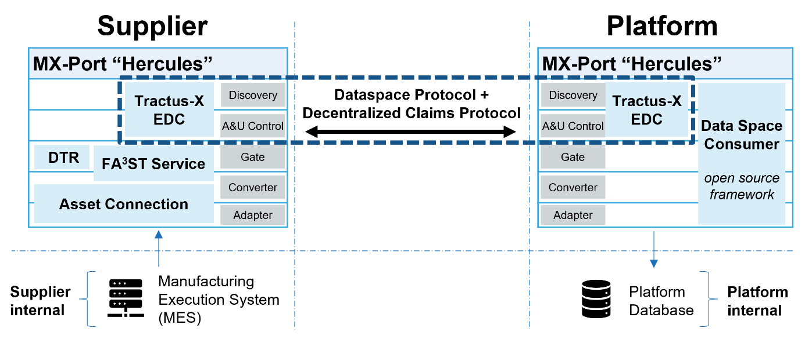
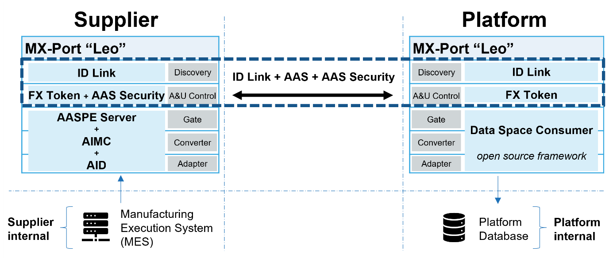

import Kit3DLogo from '@site/src/components/2.0/Kit3DLogo';

<Kit3DLogo kitId="maas" />

### Architecture example for data exchange via MX-Port Hercules

As part of Factory-X MaaS, data exchange between a data consumer and a data provider was implemented and successfully tested via the MX-Port Hercules. The following architecture example illustrates the process.

Figure 11:  MaaS MX-Port Hercules Overview

Data exchange is standardized, secure, interoperable, and data sovereignty is guaranteed. The standards used by MX-Port Hercules are listed in the standards section (Chapter [Standards](../adoption-view.md#standards)).

Semantic models (Chapter [Semantic Model](../adoption-view.md#semantic-model)) are used for data exchange.  Figure 12 shows an example of an AAS for a machine with submodels such as *Capability Description*, which is used to describe specific manufacturing capabilities.

Figure 12:  TruLaser Cell 5030 machine modelled as AAS

Figure 13 depicts a generic configuration of the MX-Port Hercules for a given provider and consumer. For the two MX-Ports, the individual layers of the [MX-Port Concept](https://factory-x.org/wp-content/uploads/MX-Port-Concept-V1.10.pdf) are illustrated. The figure also lists the Architecture Decision Records (ADRs) that are being fulfilled when using this configuration (Chapter [Standards](../adoption-view.md#standards)).

Figure 13:  MX-Port Hercules: conceptual view of a provider and consumer configuration

Figure 14 shows a concrete implementation of the MX-Port given an exemplary set of software components that fulfil the necessary ADRs.

Figure 14:  MX-Port Hercules: implementation view of a provider and consumer configuration

From the provider's perspective, the objective is to automatically integrate Manufacturing Execution System (MES) data into AAS submodels using an asset connection (realized by the Asset Connection feature of the FA³ST Service). The AAS repository (FA³ST Service) provides the Asset Administration Shells via the standardized REST API. Concrete access control rules for specific AAS resources (AAS Security) can also be defined in the AAS repository. The FA³ST Service automatically registers the Asset Administration Shells in the Digital Twin Registry (DTR, realized by the FA³ST Registry). The DTR is a directory service that provides information about which data is available in which AAS repositories, as well as the data space endpoints that need to be addressed for a consumer to acquire said AAS data. The Tractus-X EDC offers the DTR and the AAS repository as datasets within the data space, so these two services do not need to be exposed directly. Data is exchanged via the EDC after successful negotiation of the provided contract and a subsequent authorized data request by the consumer. The consumer also needs a Tractus-X EDC to negotiate a contract with the provider EDC.

To increase the ease-of-use and adoptability for a consumer in this use case, an open-source software component called “Data Space Consumer” was released as part of Factory-X MaaS. This component automates the sequence of requests to a provider that are necessary to retrieve AAS data. Moreover, the automated request mechanism of the “Data Space Consumer” is independent of the use case and complies with the ADRs from *section “Used Factory-X Architecture Decision Records”*. The “Data Space Consumer” provides functionality for the discovery, access and usage control, gate, converter and adapter layers out of the box with components like the [FA³ST Gate Extension](https://github.com/FraunhoferIOSB/DataSpaceConsumer/tree/main/extensions/faaast-gate-extension).

#### Used open-source technologies

The technologies listed are examples; other technologies not listed here may also be used.

| **MX-Port Layer** | **Open-Source Technology** | **Description** | **URL** |
| --- | --- | --- | --- |
| Discovery Access & Usage Control | Tractus-X EDC (Eclipse Dataspace Connector) | Container images and deployments of the Eclipse Dataspace Components for the Tractus-X project. | https://github.com/eclipse-tractusx/tractusx-edc |
| Gate | FA³ST Registry / Digital Twin Registry | The FA³ST Registry implements the Registry for the [Asset Administration Shell (AAS) specification by IDTA](https://industrialdigitaltwin.org/content-hub/downloads) and provides an easy-to-use Registry for AAS. | https://github.com/FraunhoferIOSB/FAAAST-Registry |
| Access Control Gate | FA³ST Service / AAS Repository | The FA³ST Service enables you to create digital twins based on the [Asset Administration Shell (AAS) specification](https://industrialdigitaltwin.org/en/content-hub/aasspecifications) with ease and also supports [AAS Security](https://industrialdigitaltwin.io/aas-specifications/IDTA-01004/v3.0.1/index.html) for fine grained access control. | [https://github.com/FraunhoferIOSB/FAAAST-Service](https://github.com/FraunhoferIOSB/FAAAST-Service) [*https://github.com/factory-x-contributions/fa3st-service*](https://github.com/factory-x-contributions/fa3st-service)* (Factory-X fork for AAS security)* |
| Converter Adapter | FA³ST Service / Asset Connection | The Asset Connection interface is responsible for synchronizing values of the model with assets. | https://faaast-service.readthedocs.io/en/latest/interfaces/asset-connection.html |
| Discovery Access & Usage Control Gate Converter Adapter | Data Space Consumer | The Data Space Consumer automates the retrieval of authorised data via [MX-Ports](https://factory-x.org/wp-content/uploads/MX-Port-Concept-V1.10.pdf) within data spaces. | https://github.com/FraunhoferIOSB/DataSpaceConsumer |

Table 7:  Used open-source technologies for the Hercules example

### Architecture example for data exchange via MX-Port Leo

In addition to the MX-Port configuration Hercules, data exchange between a data consumer and a data provider has also been implemented and successfully tested via the MX-Port Leo. The following architecture example illustrates the process for the MX-Port configuration Leo.

Figure 15:  MaaS MX-Port Leo Overview.

As with Hercules, data exchange is also standardized, secure, interoperable, and data sovereignty is also guaranteed when using the MX-Port configuration Leo. The standards used by MX-Port Leo are listed in the standards section (Chapter [Standards](../adoption-view.md#standards)).

Figure 16 shows a generic configuration of the MX-Port Leo for a given provider and consumer. For the two MX-Ports, the individual layers of the [MX-Port Concept](https://factory-x.org/wp-content/uploads/MX-Port-Concept-V1.10.pdf) are shown.

Figure 16:  MX-Port Leo: conceptual view of a provider and consumer configuration.

Figure 17 depicts a concrete example implementation of the MX-Port configuration Leo using an exemplary set of software components such as the AASPE Server and the “Data Space Consumer”.

Figure 17:  MX-Port Leo: implementation view of a provider and consumer configuration.

In this implementation, the AASPE Server is used on the supplier side together with the Asset Interface Description (AID) and Asset Interfaces Mapping Configuration (AIMC) submodel templates to implement the adapter, converter, and gate layers of the MX-Port. The access & usage control layer is implemented using the FX Token for authentication as well as access rules defined using AAS Security for authorization – as described in the chapter “Data exchange steps via MX-Port Leo” above. The discovery layer is implemented using ID Link.

On the platform side, the “Data Space Consumer” is used, but this time with extensions implementing the access & usage control layer and the discovery layer of the MX-Port Leo using the FX Token and ID Link, respectively.

#### Used open-source technologies

The technologies listed are examples; other technologies not listed here may also be used.

| **MX-Port Layer** | **Open-Source Technology** | **Description** | **URL** |
| --- | --- | --- | --- |
| Access & Usage Control | FX Token + *AAS Security* | Authentication uses the FX Token as defined by the Factory-X project. Authorization uses access rules as defined in [AAS Security](https://industrialdigitaltwin.io/aas-specifications/IDTA-01004/v3.0.1/index.html) and implemented as part of the [AASPE Server](https://github.com/eclipse-aaspe/server). | [https://github.com/eclipse-aaspe/server](https://github.com/eclipse-aaspe/server) [https://industrialdigitaltwin.io/aas-specifications/IDTA-01004/v3.0.1/index.html](https://industrialdigitaltwin.io/aas-specifications/IDTA-01004/v3.0.1/index.html) |
| Gate Converter Adapter | AASPE Server | The [AASPE Server](https://github.com/eclipse-aaspe/server) provides a local service to host and serve Industrie 4.0 AASX packages. We use the [Asset Interfaces Description (AID)](https://industrialdigitaltwin.org/wp-content/uploads/2024/01/IDTA-02017-1-0_Submodel_Asset-Interfaces-Description.pdf) and the [Asset Interfaces Mapping Configuration (AIMC)](https://industrialdigitaltwin.org/wp-content/uploads/2024/06/IDTA-02027-1-0_Submodel_AssetInterfacesMappingConfiguration.pdf) submodel templates to implement the Adapter and Converter, respectively. | [https://github.com/eclipse-aaspe/server](https://github.com/eclipse-aaspe/server) [*https://industrialdigitaltwin.org/wp-content/uploads/2024/01/IDTA-02017-1-0_Submodel_Asset-Interfaces-Description.pdf*](https://industrialdigitaltwin.org/wp-content/uploads/2024/01/IDTA-02017-1-0_Submodel_Asset-Interfaces-Description.pdf) [*https://industrialdigitaltwin.org/wp-content/uploads/2024/06/IDTA-02027-1-0_Submodel_AssetInterfacesMappingConfiguration.pdf*](https://industrialdigitaltwin.org/wp-content/uploads/2024/06/IDTA-02027-1-0_Submodel_AssetInterfacesMappingConfiguration.pdf) |
| Gate Converter Adapter | Data Space Consumer | The Data Space Consumer automates the retrieval of authorised data via [MX-Ports](https://factory-x.org/wp-content/uploads/MX-Port-Concept-V1.10.pdf) within data spaces. | [https://github.com/FraunhoferIOSB/DataSpaceConsumer](https://github.com/FraunhoferIOSB/DataSpaceConsumer) |

Table 8:  Used open-source technologies for the Leo example.

## NOTICE

This work is licensed under the [CC-BY-4.0](https://creativecommons.org/licenses/by/4.0/legalcode).

- SPDX-License-Identifier: CC-BY-4.0
- SPDX-FileCopyrightText: 2026 SIEMENS AG
- SPDX-FileCopyrightText: 2026 Fraunhofer-Gesellschaft zur Foerderung der angewandten Forschung e.V. (represented by Fraunhofer IOSB)
- SPDX-FileCopyrightText: 2026 TRUMPF SE + Co. KG
- SPDX-FileCopyrightText: 2026 Technologie-Initiative SmartFactory KL e. V. (SmartFactory-KL)
- SPDX-FileCopyrightText: 2026 DMG MORI Bielefeld GmbH
- SPDX-FileCopyrightText: 2026 Instawerk GmbH
- SPDX-FileCopyrightText: 2026 Matchory GmbH
- SPDX-FileCopyrightText: 2026 soffico GmbH
- SPDX-FileCopyrightText: 2026 Institut für Fertigungstechnik und Werkzeugmaschinen (IFW), Gottfried Wilhelm Leibniz Universität Hannover
- SPDX-FileCopyrightText: 2026 MT Analytics GmbH
- SPDX-FileCopyrightText: 2026 Werkzeugmaschininenlabor (WZL) der Fakultaet Maschinenwesen, Rheinisch-Westfaehlische Technische Hochschule (RWTH) Aachen
- SPDX-FileCopyrightText: 2026 Contributors to the Eclipse Foundation
- Source URL: https://github.com/eclipse-tractusx/eclipse-tractusx.github.io

### Footnotes

M. Simon, F. Schoeppenthau, R. Kuntschke, C. Czech, B. Obst, B. Fuchs, T. Lepper, T. Schurek,  
S. Currle, K. Wernet, J. Pralle, and P. Ruebel, “Building a Dataspace for Manufacturing as a Service in Factory-X” arXiv [online]. Available: [https://doi.org/10.48550/arXiv.2604.03678](https://doi.org/10.48550/arXiv.2604.03678 "https://doi.org/10.48550/arxiv.2604.03678")