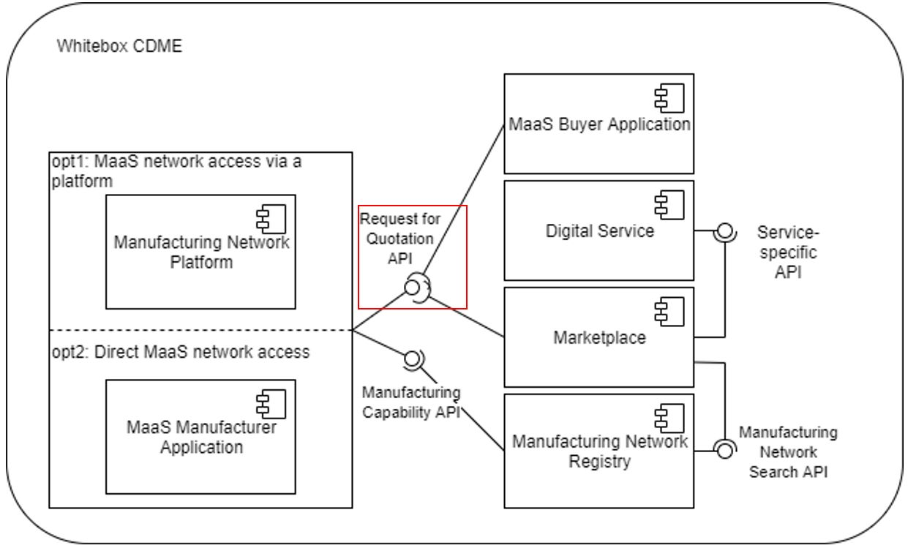

The Request for Quotation API description below shows how the Request for Quotation Aspect Model could be used. A Request for Quotation defines detailed requirements, deadlines and evaluation criteria for obtaining quotations from potential manufacturers for specific products or services.



Depending on the use case different request paths can be implemented, based on the specific MaaS implementations. Below is a sample request option:

1. POST:/{api-endpoint}/request-for-quotation
   - Description: The API endpoint to send a request for quotation to a manufacturer.

## Sample Data

```json
{
  "rfqConfiguration" : {
    "firstDeliveryDate" : "2023-10-24",
    "additionalFiles" : {
      "fileName" : "fraesteil",
      "fileObject" : { },
      "fileType" : "STEP, stl, jt",
      "filePath" : "https://anypath/..."
    },
    "cadFile" : {
      "fileName" : "fraesteil",
      "fileObject" : { },
      "fileType" : "STEP, stl, jt",
      "filePath" : "https://anypath/..."
    },
    "additionalComments" : "this is a prototype, recommendations towards design for manufacturing are highly welcome",
    "parts" : {
      "generalTolerance" : "ISO 2768-1 (m), Rough DIN ISO 2768 cL, Medium DIN ISO 2768 mK, Fine DIN ISO 2768 fH",
      "manufacturingDomain" : "additive manufacturing",
      "material" : {
        "materialFamily" : "aluminum, steel, ...",
        "materialProperties" : {
          "value" : "2.7 or black",
          "propertyName" : "density or color",
          "valueType" : "g/cm3 or string"
        }
      },
      "partId" : "Drehteil",
      "additionalRequirements" : "premium quality check, standard quality check",
      "partQuantity" : {
        "quantityNumber" : 2.5,
        "measurementUnit" : "unit:litre"
      },
      "billOfProcess" : {
        "process" : [ {
          "capabilityId" : "urn:manufacturing-capability:capability:42",
          "childProcessSteps" : [ "pick" ],
          "precedenceRelation" : [ {
            "precedenceElements" : [ {
              "successor" : [ "TransportStepId" ]
            } ]
          } ],
          "processStepIdentifier" : [ "1234-transport" ],
          "inputParameters" : [ {
            "name" : "dimensionality",
            "parameterKey" : "HasValue",
            "valueRangeList" : [ {
              "name" : "dimensionality",
              "lowerValue" : "5",
              "upperValue" : "10"
            } ],
            "semanticReference" : [ "0173-1#02-BAD875#008" ],
            "tolerances" : [ {
              "name" : "dimensionality",
              "upperLimit" : "5.1",
              "lowerLimit" : "4.9"
            } ],
            "value" : "{\\\"height\\\" : \\\"5\\\", \\\"length\\\" : \\\"3\\\", \\\"width\\\" : \\\"7\\\"}"
          } ],
          "processStepType" : "IsFirstElement",
          "outputParameters" : [ {
            "name" : "dimensionality",
            "parameterKey" : "HasValue",
            "valueRangeList" : [ {
              "name" : "dimensionality",
              "lowerValue" : "5",
              "upperValue" : "10"
            } ],
            "semanticReference" : [ "0173-1#02-BAD875#008" ],
            "tolerances" : [ {
              "name" : "dimensionality",
              "upperLimit" : "5.1",
              "lowerLimit" : "4.9"
            } ],
            "value" : "{\\\"height\\\" : \\\"5\\\", \\\"length\\\" : \\\"3\\\", \\\"width\\\" : \\\"7\\\"}"
          } ]
        } ],
        "productVersion" : "bar_chair_1.0.0",
        "billOfProcessIdentification" : "www.1234-bar-chair-billOfProcess.de",
        "version" : "2.0.0",
        "productName" : "Bar Chair"
      },
      "partName" : "Drehteil"
    },
    "orderQuantity" : {
      "quantityNumber" : 2.5,
      "measurementUnit" : "unit:litre"
    },
    "lastDeliveryDate" : "2023-12-24"
  },
  "rfqIdentification" : {
    "rfqVersion" : "1.0.0",
    "rfqName" : "Drehteil",
    "rfqDateTime" : "2023-10-24T14:48:54.709Z",
    "rfqSource" : "https://maasportal.mendixcloud.com/",
    "rfqId" : "Drehteil_02_0815"
  },
  "cxHeader" : {
    "senderBpn" : "BPNL7588787849VQ",
    "relatedMessageId" : "d9452f24-3bf3-4134-b3eb-68858f1b2362",
    "expectedResponseBy" : "2023-06-19T21:24:00+07:00",
    "context" : "urn:samm:io.catenax.<ASPECT-MODEL-NAME>:1.x.x",
    "messageId" : "3b4edc05-e214-47a1-b0c2-1d831cdd9ba9",
    "receiverBpn" : "BPNL6666787765VQ",
    "sentDateTime" : "2023-06-19T21:24:00+07:00",
    "version" : "2.0.0"
  },
  "rfqSender" : {
    "deliveryRequirements" : "no plastic for packaging",
    "senderName" : "John Doe",
    "senderPhoneNumber" : "555 123456",
    "senderEMail" : "johndoe@sunny.com",
    "senderDeliveryAddress" : "Mystreet 1, 1234 Mystate",
    "senderAdress" : "Sunstreet 1, 5555 Sunstate",
    "senderAccountAddress" : "Accountstreet 1, 1234 Accountstate",
    "senderCompanyName" : "ManufactureEnterprise"
  }
}
```
