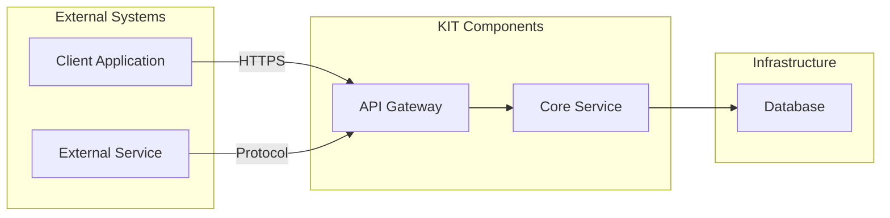

<!--
Copyright(c) 2026 Contributors to the Eclipse Foundation

See the NOTICE file(s) distributed with this work for additional
information regarding copyright ownership.

This work is made available under the terms of the
Creative Commons Attribution 4.0 International (CC-BY-4.0) license,
which is available at
https://creativecommons.org/licenses/by/4.0/legalcode.

SPDX-License-Identifier: CC-BY-4.0
-->

<!-- 
KIT LOGO START - Generated automatically from the configuration done in Kit Master Data
Replace <kit-id> with the id from your kit referenced in `data/kitsData.js`.
Do not remove!
This logo is only visible when compiled with Docusarus (final version of the hosted KIT)
-->

import Kit3DLogo from '@site/src/components/2.0/Kit3DLogo';
<Kit3DLogo kitId="<kit-id>" />

<!--
KIT LOGO END
-->

## Architecture Overview

<!-- High-level diagram of the technical approach. -->

> TODO: Describe the technical architecture and key design decisions.
> We recommend diagrams in drawio (need to be stored in SVG), or you can use mermaid or plant uml
> As described in TRG 1.04: https://eclipse-tractusx.github.io/docs/release/trg-1/trg-1-04.
> Explain which components are involved in the KIT data exchange or use case.
> Keep the source code so it can be included in the final KIT version in Markdown.
> Example:



> TODO: Text description of the diagram.

## Application Programming Interfaces (API)

> TODO: If applicable API specifications.
> Detailed APIs can be included as swagger / open api specs
> As described in TRG 1.08: https://eclipse-tractusx.github.io/docs/release/trg-1/trg-1-08
> Will be hosted in API HUB: https://eclipse-tractusx.github.io/api-hub/

## Semantic Models / Data Model

Material Accounting is based on a set of standardized semantic aspect
models that define how vehicles, components, materials and recycling
processes are described and exchanged within the Catena-X ecosystem.
These models establish a common business semantics across all
participants in the reverse value chain. By structuring data in a
consistent and machine-readable way, they enable traceability of
material flows, verification of recycled content, and interoperability
across companies. Each aspect model represents a specific perspective
on the asset and is implemented as a digital twin submodel. The models
are exchanged and updated along transaction events triggered by
physical processes such as dismantling, transport, recycling, and
manufacturing.

The following figure provides an overview of the six semantic aspect
models defined for Material Accounting and their integration into the
existing Catena-X data model landscape. At the center of the
architecture, the PartInstance (SerialPart) and SingleLevelBomAsBuilt
models from the Industry Core establish the structural foundation by
linking vehicles, components, and parts. Building on this, the six
Material Accounting aspect models extend the digital twin with
circularity-relevant information: VehicleInformation describes the
vehicle at end-of-life, Composition links assets to their material
breakdown, Material defines the characteristics of materials,
RecyclingInformation captures recycled content shares, WasteCode
ensures regulatory classification, and RecyclingBatch represents
process and batch-level transformations. Together, these models form a
coherent semantic structure that enables the traceability of materials
across the reverse value chain and ensures that all participants
operate on a consistent interoperable data basis.


<!-- Reference the relevant semantic models, APIs, or standards. -->

> TODO: Link or describe the data model, when using big payloads or json-schemas use expandable sections like below:

<details>
  <summary>Semantic Model Example - click to expand</summary>

Place here the description of your semantic model.

```json
{
  "key": "value",
  "object": {...},
  "array": [...]
}
```

</details>

## Protocols

<!-- Provide a minimal code snippet or step-by-step guide. -->

> TODO: Add the protocols which you are using for the data exchange.

| Name | Description | Link to Documentation |
| ---- | ----------- | ----------------------|
| `Protocol Name` | This protocol is important when doing the data exchange | [example-link](https://example.com) |

## NOTICE

This work is licensed under the [CC-BY-4.0](https://creativecommons.org/licenses/by/4.0/legalcode).

- SPDX-License-Identifier: CC-BY-4.0
- SPDX-FileCopyrightText: [YYYY] [YOUR_COMPANY]
- SPDX-FileCopyrightText: [YYYY] [ANOTHER_COMPANY]
- SPDX-FileCopyrightText: [YYYY] Contributors to the Eclipse Foundation
- Source URL: [https://github.com/eclipse-tractusx/eclipse-tractusx.github.io](https://github.com/eclipse-tractusx/eclipse-tractusx.github.io)