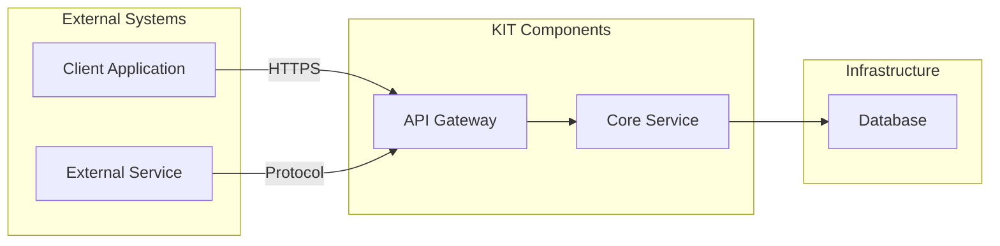

<!--
Copyright(c) 2026 Contributors to the Eclipse Foundation

See the NOTICE file(s) distributed with this work for additional
information regarding copyright ownership.

This work is made available under the terms of the
Creative Commons Attribution 4.0 International (CC-BY-4.0) license,
which is available at
https://creativecommons.org/licenses/by/4.0/legalcode.

SPDX-License-Identifier: CC-BY-4.0
-->

<!-- 
KIT LOGO START - Generated automatically from the configuration done in Kit Master Data
Replace <kit-id> with the id from your kit referenced in `data/kitsData.js`.
Do not remove!
This logo is only visible when compiled with Docusarus (final version of the hosted KIT)
-->

import Kit3DLogo from '@site/src/components/2.0/Kit3DLogo';
<Kit3DLogo kitId="<kit-id>" />

<!--
KIT LOGO END
-->

## Architecture Overview

<!-- High-level diagram of the technical approach. -->

> TODO: Describe the technical architecture and key design decisions.
> We recommend diagrams in drawio (need to be stored in SVG), or you can use mermaid or plant uml
> As described in TRG 1.04: https://eclipse-tractusx.github.io/docs/release/trg-1/trg-1-04.
> Explain which components are involved in the KIT data exchange or use case.
> Keep the source code so it can be included in the final KIT version in Markdown.
> Example:



> TODO: Text description of the diagram.

## Application Programming Interfaces (API)

> TODO: If applicable API specifications.
> Detailed APIs can be included as swagger / open api specs
> As described in TRG 1.08: https://eclipse-tractusx.github.io/docs/release/trg-1/trg-1-08
> Will be hosted in API HUB: https://eclipse-tractusx.github.io/api-hub/

## Semantic Models / Data Model

Material Accounting is based on a set of standardized semantic aspect
models that define how vehicles, components, materials and recycling
processes are described and exchanged within the Catena-X ecosystem.
These models establish a common business semantics across all
participants in the reverse value chain. By structuring data in a
consistent and machine-readable way, they enable traceability of
material flows, verification of recycled content, and interoperability
across companies. Each aspect model represents a specific perspective
on the asset and is implemented as a digital twin submodel. The models
are exchanged and updated along transaction events triggered by
physical processes such as dismantling, transport, recycling, and
manufacturing.

The following figure provides an overview of the six semantic aspect
models defined for Material Accounting and their integration into the
existing Catena-X data model landscape. At the center of the
architecture, the **PartInstance (SerialPart)** and **SingleLevelBomAsBuilt**
models from the Industry Core establish the structural foundation by
linking vehicles, components, and parts. Building on this, the six
Material Accounting aspect models extend the digital twin with
circularity-relevant information: **VehicleInformation** describes the
vehicle at end-of-life, **Composition** links assets to their material
breakdown, **Material** defines the characteristics of materials,
**RecyclingInformation** captures recycled content shares, **WasteCode**
ensures regulatory classification, and **RecyclingBatch** represents
process and batch-level transformations. Together, these models form a
coherent semantic structure that enables the traceability of materials
across the reverse value chain and ensures that all participants
operate on a consistent interoperable data basis.

Material Accounting builds on existing Catena-X standards, as seen above, particularly:

- PartInstance (SerialPart) for identifying physical assets
- SingleLevelBomAsBuilt for linking vehicles, components, and materials

The Material Accounting aspect models extend this foundation by adding
circularity-relevant data such as material composition, recycling processes, waste classification, and material origin.

## 1.	VehicleInformation

The VehicleInformation model describes the vehicle at the point it enters the
reverse value chain. It provides the contextual data required to identify,
classify, and assess the vehicle before dismantling and recycling processes.

| Attribute | Definition |
|---|---|
| `globalAssetId` | The ID serves as a global and unique identifier assigned to the vehicle in Catena-X; it acts as a reference key for all associated data across actors |
| `anonymizedVin` | OEM-specific hashed VIN |
| `vehicleType` | A vehicle type is a classification of a vehicle based on its design, construction, and purpose |
| `productionDate` | Production date of the vehicle |
| `emptyWeight` | The empty weight of the vehicle in kg as specified |
| `oem` | Original equipment manufacturer |
| `vehicleSeries` | Series information of the vehicle model that needs to be processed |
| `modelIdentifier` | OEM-specific model identifier or OEM-specific project name |
| `driveType` | Drive type of a vehicle according enumeration |
| `vehicleCondition` | Condition of the actual vehicle |
| `wasteCodeVehicle` | The waste code for vehicle is used to identify the type of waste on a vehicle level |

## 2. WasteCode

The WasteCode model standardizes the classification of vehicles, compositions,
components, and materials according to waste categories. It ensures regulatory
alignment and consistent classification across actors.

| Attribute | Definition |
|---|---|
| `wasteCodeVehicle` | The waste code for vehicle is used to identify the type of waste on a vehicle level |
| `wasteCodeComponentSet` | The waste code for composition is used to identify the type of waste on a composition level |
| `wasteCodeComponent` | The waste code for component is used to identify the type of waste on a component level |
| `wasteCodeMaterial` | The waste code for material is used to identify the type of waste on a material level |

## 3.	RecyclingBatch

The RecyclingBatch model captures process-related and transactional data
describing how materials, components, and compositions are handled, transferred,
and processed across the reverse value chain. It reflects real-world operations
such as transport, weighing, and treatment steps.

| Attribute | Definition |
|---|---|
| `senderBpn` | The Catena-X Business Partner Number of the sending party |
| `receiverBpn` | The Catena-X Business Partner Number of the receiving party |
| `senderCompanyNumber` | Operating number of the sending party |
| `receiverCompanyNumber` | Operating number of the receiving party |
| `senderName` | Operating name of the sending party |
| `receiverName` | Operating name of the receiving party |
| `senderRole` | Type of the sending party in the recycling process |
| `receiverRole` | Type of the receiving party in the recycling process |
| `treatmentProcedure` | Process that is used to handle waste according to the chosen strategy |
| `process` | The process reflects the current processing phase in the reverse chain |
| `childProcessSteps` | The child process steps detail further capabilities required for recycling |
| `startTimestamp` | Start of the specific child process step |
| `endTimestamp` | End of the specific child process step |
| `inputNetMass` | Incoming net weight in the specific process step |
| `outputNetMass` | Outgoing net weight of the specific process step |
| `measurementType` | Measuring instrument for material share or weight determination |
| `measurementTimestamp` | Time of measurement |
| `processLoss` | Weight of loss within the process step |
| `lossType` | Specification of loss within the process step |
| `weighingSlip` | Official document that records the result of weighing |
| `transferId` | Identifier for the transport between actors |
| `shipOperator` | Information about the operator of the transport process |
| `containerId` | Standardized number for the container type |
| `containerDescription` | Standardized description of the container type |
| `containerVolume` | Volume of the container type |
| `containerWeight` | Empty weight of the container |
| `batchId` | Identifier for the specific container batch |


## 4.  Material

The Material model provides a standardized description of materials, including their classification, physical and chemical characteristics, and processing status.  
It enables consistent identification and comparison of materials across actors and processes.

| Attribute | Definition |
|---|---|
| `globalAssetId` | The ID serves as a global and unique identifier assigned to the material in Catena-X |
| `mainGroupId` | Number of material main group |
| `mainGroupName` | Name of material main group |
| `subGroupId` | Number of material sub group |
| `subGroupName` | Name of material sub group |
| `materialAbbreviation` | Short designation of the main material |
| `materialNameStandardizedValue` | Name of the material according to the norming authority |
| `referencedStandard` | Norm authority which governs the norm |
| `referencedStandardID` | ID of standard used by the norming authority |
| `materialStatus` | Status of the material in the process step |
| `materialFormat` | Format of the material in the process step |
| `physicalState` | The physical state of the material |
| `chemicalCharacterization` | Description of the chemical composition and properties |
| `thermalCharacterization` | Information about thermal behaviour |
| `rangeOfUncertainty` | Tolerance specification in material composition |

## 5. RecyclingInformation

The RecyclingInformation model captures the origin and quantitative distribution of material shares. It enables the calculation and verification of recycled content across the lifecycle.

| Attribute | Definition |
|---|---|
| `percentageOfMaterialWeightPrimary` | Material share from primary substances used for the first time |
| `percentageOfMaterialWeightSecondary` | Material share from materials obtained from waste and by-products |
| `percentageOfMaterialWeightPreConsumerAutomotive` | Material share from automotive pre-consumer waste streams |
| `percentageOfMaterialWeightPreConsumerNonAutomotive` | Material share from non-automotive pre-consumer waste streams |
| `percentageOfMaterialWeightPostConsumerAutomotive` | Material share from automotive post-consumer waste |
| `percentageOfMaterialWeightPostConsumerNonAutomotive` | Material share from non-automotive post-consumer waste |
| `percentageOfMaterialWeightReutilizationMaterial` | Material share from reutilization within the same process |
| `origin` | Information on material origin |
| `otherDocuments` | Document verifying origin, quality, or compliance |

---

## 6. Composition

The Composition model describes how components and materials are grouped and structured within vehicles or batches. It enables the creation of material balances and the traceability of material allocations.

| Attribute | Definition |
|---|---|
| `componentSetId` | Identifier for a grouping of multiple components |
| `componentSetName` | Name representing the composition |
| `componentId` | Identifier for a component |
| `componentName` | Name of the component |
| `manufacturerPartId` | Part ID assigned by the manufacturer |
| `manufacturerSerialNumber` | Serial number of the specific part instance |


<!-- Reference the relevant semantic models, APIs, or standards. -->

> TODO: Link or describe the data model, when using big payloads or json-schemas use expandable sections like below:

<details>
  <summary>Semantic Model Example - click to expand</summary>

Place here the description of your semantic model.

```json
{
  "key": "value",
  "object": {...},
  "array": [...]
}
```

</details>

## Protocols

<!-- Provide a minimal code snippet or step-by-step guide. -->

> TODO: Add the protocols which you are using for the data exchange.

| Name | Description | Link to Documentation |
| ---- | ----------- | ----------------------|
| `Protocol Name` | This protocol is important when doing the data exchange | [example-link](https://example.com) |

## NOTICE

This work is licensed under the [CC-BY-4.0](https://creativecommons.org/licenses/by/4.0/legalcode).

- SPDX-License-Identifier: CC-BY-4.0
- SPDX-FileCopyrightText: [YYYY] [YOUR_COMPANY]
- SPDX-FileCopyrightText: [YYYY] [ANOTHER_COMPANY]
- SPDX-FileCopyrightText: [YYYY] Contributors to the Eclipse Foundation
- Source URL: [https://github.com/eclipse-tractusx/eclipse-tractusx.github.io](https://github.com/eclipse-tractusx/eclipse-tractusx.github.io)