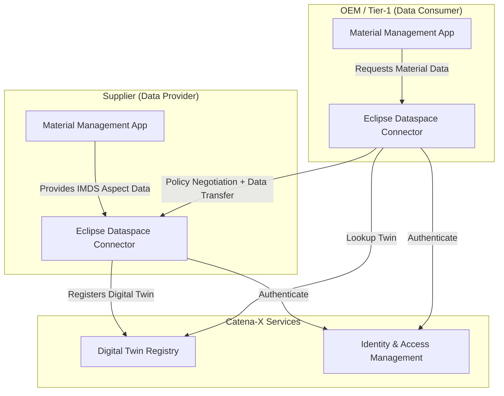

<!--
Copyright(c) 2026 Contributors to the Eclipse Foundation

See the NOTICE file(s) distributed with this work for additional
information regarding copyright ownership.

This work is made available under the terms of the
Creative Commons Attribution 4.0 International (CC-BY-4.0) license,
which is available at
https://creativecommons.org/licenses/by/4.0/legalcode.

SPDX-License-Identifier: CC-BY-4.0
-->

import Kit3DLogo from '@site/src/components/2.0/Kit3DLogo';

<Kit3DLogo kitId="material-management" />

## Introduction

The **Material Management KIT** enables standardized, sovereign exchange of material composition and
substance data across automotive and manufacturing supply chains using the Catena-X decentralized
connector architecture. It builds on the **International Material Data System (IMDS)** — the global
industry standard for material declarations — and brings IMDS data exchange into the Catena-X
data space via standardized aspect models.

Suppliers, OEMs, and recyclers can request and share detailed material bills-of-materials (mBOM),
substance information, and regulatory compliance data (e.g., REACH, RoHS, ELV) without exposing
confidential formulations, enabling circular economy use cases and regulatory reporting at scale.

## Vision and Mission

### Vision

A globally interoperable material data network where every component's material composition and
substance profile can be securely exchanged between authorized partners — enabling circular design,
regulatory compliance, and sustainable material selection across the entire automotive value chain.

### Mission

The Material Management KIT delivers:

- A standardized Catena-X data model for IMDS-compatible material and substance information.
- A connector-based exchange protocol that ensures data sovereignty while satisfying regulatory
  disclosure obligations (REACH, RoHS, ELV Directive).
- Reference implementations and semantic models that reduce integration effort for application
  providers building material data management solutions.

## Business Context

The automotive industry exchanges billions of material data records per year via IMDS to satisfy
legal obligations (EU End-of-Life Vehicle Directive, REACH, RoHS) and OEM sourcing requirements.
Today this exchange is largely bilateral, proprietary, and locked to the IMDS portal — limiting
re-use, automation, and integration with downstream circular economy or product passport workflows.

The Material Management KIT unlocks IMDS data from the portal silo and makes it available as a
first-class Catena-X asset, shareable through Eclipse Dataspace Connectors with full policy control.

Figure 1: High-level material data exchange flow in Catena-X

## Business Value

| Stakeholder | Value |
| --- | --- |
| **Supplier** | One-time data provisioning via Catena-X connector satisfies multiple OEM requests; full data sovereignty via access policies |
| **OEM / Tier-1** | Automated pull of material declarations reduces manual IMDS portal work; seamless integration with Product Compliance and EoL workflows |
| **Recycler** | Access to material composition data for disassembly planning and secondary material identification |
| **Regulator / Auditor** | Verifiable, immutable material declarations linked to physical parts via Digital Twin |
| **Platform Provider** | Reusable KIT reduces integration effort; standardized models enable ecosystem tooling |

## Use Case Description

### Actors and Personas

| Persona | Role |
| --- | --- |
| **Material Data Manager (Supplier)** | Creates and maintains material declarations in compliance with IMDS and OEM requirements; provisions data as Catena-X assets |
| **Product Compliance Engineer (OEM/Tier-1)** | Requests and validates material data for regulatory reporting (REACH, RoHS, ELV); triggers data pull via Catena-X |
| **Substance Specialist** | Reviews substance-level declarations and tracks restricted substance lists (RSL/GADSL) |
| **Circular Economy Analyst** | Uses material data to design for recyclability and secondary material recovery |
| **Application Provider** | Integrates the Material Management KIT into material lifecycle management (MLM) or PLM software |

### Key Use Cases

#### 1. IMDS Material Declaration Exchange

A supplier creates a material data module (MDM) for a purchased part and provisions it as a
`MaterialInformation` aspect on the Catena-X Digital Twin of that part. The OEM's Material
Management App requests the material data via the EDC, validates it against GADSL/RSL, and imports
it into the compliance workflow — eliminating manual IMDS portal submissions.

#### 2. Substance Compliance Reporting (REACH / RoHS / ELV)

Substance-level data (CAS numbers, weight fractions, homogeneous materials) is exchanged via the
`SubstanceInformation` aspect model. This allows automated screening against regulated substance
lists and supports the generation of REACH SVHC declarations, RoHS compliance statements, and ELV
material recycling/recovery fractions.

#### 3. End-of-Life Material Identification

At vehicle end-of-life, recyclers request the `MaterialInformation` aspect for components to
identify high-value secondary materials (e.g., rare earth elements, platinum group metals) and
plan disassembly accordingly.

#### 4. Circular Design Feedback Loop

Product designers access aggregated material data to evaluate material substitution options,
increase recyclable content, and track progress toward circular economy targets — all without
requiring direct access to supplier IP.

## Standards

| Name | Description | Link |
| --- | --- | --- |
| `CX-0127` | Industry Core — Part Type Twin | [CX Standard](https://catenax-ev.github.io/docs/next/standards/CX-0127-IndustryCore-PartTypeTwin) |
| `CX-0002` | Digital Twins in Catena-X | [CX Standard](https://catenax-ev.github.io/docs/next/standards/CX-0002-DigitalTwinsInCatenaX) |
| `CX-0018` | Eclipse Dataspace Connector (EDC) | [CX Standard](https://catenax-ev.github.io/docs/next/standards/CX-0018-EclipseDataspaceConnectorEDC) |
| IMDS Recommendation 001 | IMDS Data Content and Representation | [IMDS](https://www.mdsystem.com/imdsnt/startpage/index.jsp) |
| GADSL | Global Automotive Declarable Substance List | [GADSL](https://www.gadsl.org/) |
| EU REACH Regulation (EC) No 1907/2006 | Registration, Evaluation, Authorisation and Restriction of Chemicals | [EUR-Lex](https://eur-lex.europa.eu/legal-content/EN/TXT/?uri=CELEX:02006R1907-20140410) |
| EU RoHS Directive 2011/65/EU | Restriction of Hazardous Substances in Electrical and Electronic Equipment | [EUR-Lex](https://eur-lex.europa.eu/legal-content/EN/TXT/?uri=CELEX:32011L0065) |
| EU ELV Directive 2000/53/EC | End-of-Life Vehicles | [EUR-Lex](https://eur-lex.europa.eu/legal-content/EN/TXT/?uri=CELEX:32000L0053) |

## NOTICE

This work is licensed under the [CC-BY-4.0](https://creativecommons.org/licenses/by/4.0/legalcode).

- SPDX-License-Identifier: CC-BY-4.0
- SPDX-FileCopyrightText: 2026 Contributors to the Eclipse Foundation
- SPDX-FileCopyrightText: 2026 Catena-X Automotive Network e.V.
- Source URL: [https://github.com/eclipse-tractusx/eclipse-tractusx.github.io](https://github.com/eclipse-tractusx/eclipse-tractusx.github.io)
