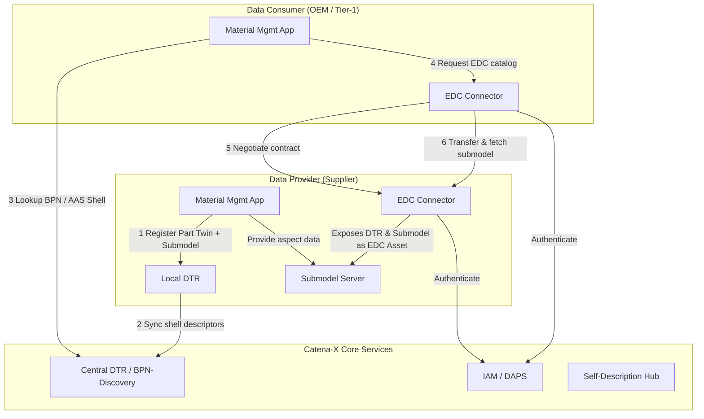
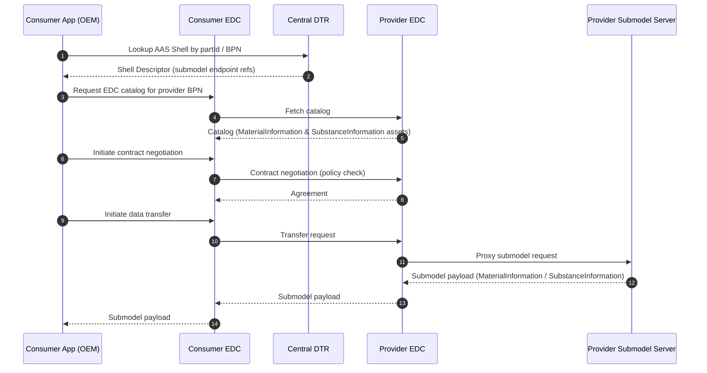

<!--
Copyright(c) 2026 Contributors to the Eclipse Foundation

See the NOTICE file(s) distributed with this work for additional
information regarding copyright ownership.

This work is made available under the terms of the
Creative Commons Attribution 4.0 International (CC-BY-4.0) license,
which is available at
https://creativecommons.org/licenses/by/4.0/legalcode.

SPDX-License-Identifier: CC-BY-4.0
-->

import Kit3DLogo from '@site/src/components/2.0/Kit3DLogo';

<Kit3DLogo kitId="material-management" />

This document provides the technical specification for the Material Management KIT, covering the
Catena-X decentralized connector architecture, IMDS-compatible aspect models, and data exchange
protocols for material and substance information.

:::info Target Audience
Software Developers, Solution Architects, Integration Engineers, Technical Leads.
:::

---

## Architecture Overview

The Material Management KIT follows the Catena-X **pull-based** data exchange pattern using the
**Eclipse Dataspace Connector (EDC)**. Material and substance data is registered as Digital Twin
assets in the **Digital Twin Registry (DTR)** and exposed as submodel endpoints backed by the
`MaterialInformation` and `SubstanceInformation` aspect models.



Figure 1: Material Management KIT — Catena-X decentralized connector architecture

### Key Architectural Decisions

| Decision | Rationale |
| --- | --- |
| **Pull-based exchange** | Data consumer drives the request; data stays at the provider until explicitly shared |
| **Digital Twin (AAS) as anchor** | Each physical part is represented by an AAS shell; material submodels are attached to it |
| **EDC policy enforcement** | Access to material data is governed by business partner policies (e.g., BPN-restricted access) |
| **SAMM aspect models** | Semantic Aspect Meta Model (SAMM) ensures schema interoperability and machine-readable contracts |

---

## Data Exchange Flow



---

## Semantic Models / Aspect Models

The Material Management KIT defines two SAMM-based aspect models to represent IMDS material
declaration data in the Catena-X data space. The SAMM 2.1.0 Turtle (TTL) source files are
attached to this KIT and available in the `resources/semantic-models/` folder:

| Aspect Model | Version | TTL File |
| --- | --- | --- |
| MaterialInformation | 1.0.0 | [MaterialInformation.ttl](../resources/semantic-models/io.catenax.material_management.material_information/1.0.0/MaterialInformation.ttl) |
| SubstanceInformation | 1.0.0 | [SubstanceInformation.ttl](../resources/semantic-models/io.catenax.material_management.substance_information/1.0.0/SubstanceInformation.ttl) |

The models are authored using the [Semantic Aspect Meta Model (SAMM) 2.1.0](https://eclipse-esmf.github.io/samm-specification/snapshot/index.html)
specification and follow the namespace convention `io.catenax.material_management.*` consistent
with the [eclipse-tractusx/sldt-semantic-models](https://github.com/eclipse-tractusx/sldt-semantic-models) repository.
The models reference the following shared aspect models:

| Shared Model | Version | Purpose |
| --- | --- | --- |
| `io.catenax.shared.uuid` | 1.0.0 | Catena-X Digital Twin UUID format (`UuidV4Trait`) |
| `io.catenax.shared.material_classification` | 1.0.0 | IMDS / VDA 231-106 material classification entity |

### Aspect Model: MaterialInformation

**Version**: 1.0.0
**Namespace**: `urn:samm:io.catenax.material_management.material_information:1.0.0`
**AAS Submodel Template ID**: `urn:samm:io.catenax.material_management.material_information:1.0.0#MaterialInformation`
**TTL Source**: [MaterialInformation.ttl](../resources/semantic-models/io.catenax.material_management.material_information/1.0.0/MaterialInformation.ttl)

**Description**: Represents the material bill-of-materials (mBOM) of a component in IMDS format.
Captures the material composition hierarchy (material data module → material → substance) including
weight fractions, material classifications, and recycled content information.

<details>
  <summary>MaterialInformation — Object Structure Overview | click to expand</summary>

```bash
MaterialInformation
├── catenaXId                          # DID/UUID of the part twin
├── materialDataModuleId               # IMDS MDM identifier
├── materialDataModuleVersion          # MDM version string
├── validFrom                          # ISO 8601 date
├── validTo                            # ISO 8601 date (optional)
├── applicationCategory                # e.g. "VehicleBody", "Powertrain"
├── materials[]
│   ├── materialId                     # Internal or IMDS material ID
│   ├── materialName                   # Human-readable name
│   ├── classification                 # IMDS material classification code
│   ├── weightFraction                 # Weight percentage (0-100)
│   ├── recycledContentFraction        # Post-consumer recycled content (0-100)
│   ├── mass                           # Mass in grams
│   └── substances[]
│       ├── casNumber                  # CAS registry number
│       ├── substanceName              # IUPAC or trade name
│       ├── weightFraction             # Weight percentage within material
│       ├── mass                       # Mass in grams
│       ├── isGadslDeclared            # Boolean — GADSL declarable
│       ├── isReachSvhc                # Boolean — REACH SVHC listed
│       └── regulatoryLists[]          # e.g. ["GADSL", "REACH-SVHC", "RoHS"]
└── complianceDeclarations[]
    ├── regulation                     # e.g. "REACH", "RoHS", "ELV"
    ├── complianceStatus               # "Compliant" | "NonCompliant" | "Exempted"
    ├── declarationDate                # ISO 8601 date
    └── declaringCompany               # BPNL of declaring company
```

</details>

<details>
  <summary>MaterialInformation — Example Payload | click to expand</summary>

```json
{
  "catenaXId": "urn:uuid:550e8400-e29b-41d4-a716-446655440000",
  "materialDataModuleId": "MDM-2024-00123",
  "materialDataModuleVersion": "2.1",
  "validFrom": "2024-01-01",
  "applicationCategory": "VehicleBody",
  "materials": [
    {
      "materialId": "MAT-001",
      "materialName": "High-Strength Steel DP600",
      "classification": "1.1.1",
      "weightFraction": 72.5,
      "recycledContentFraction": 35.0,
      "mass": 1450.0,
      "substances": [
        {
          "casNumber": "7439-89-6",
          "substanceName": "Iron",
          "weightFraction": 97.2,
          "mass": 1409.4,
          "isGadslDeclared": false,
          "isReachSvhc": false,
          "regulatoryLists": []
        },
        {
          "casNumber": "7440-47-3",
          "substanceName": "Chromium",
          "weightFraction": 0.8,
          "mass": 11.6,
          "isGadslDeclared": true,
          "isReachSvhc": false,
          "regulatoryLists": ["GADSL"]
        }
      ]
    },
    {
      "materialId": "MAT-002",
      "materialName": "Polypropylene PP-TD20",
      "classification": "5.2.1",
      "weightFraction": 27.5,
      "recycledContentFraction": 0.0,
      "mass": 550.0,
      "substances": [
        {
          "casNumber": "9003-07-0",
          "substanceName": "Polypropylene",
          "weightFraction": 80.0,
          "mass": 440.0,
          "isGadslDeclared": false,
          "isReachSvhc": false,
          "regulatoryLists": []
        }
      ]
    }
  ],
  "complianceDeclarations": [
    {
      "regulation": "RoHS",
      "complianceStatus": "Compliant",
      "declarationDate": "2024-03-15",
      "declaringCompany": "BPNL00000003AYRE"
    },
    {
      "regulation": "ELV",
      "complianceStatus": "Compliant",
      "declarationDate": "2024-03-15",
      "declaringCompany": "BPNL00000003AYRE"
    }
  ]
}
```

</details>

---

### Aspect Model: SubstanceInformation

**Version**: 1.0.0
**Namespace**: `urn:samm:io.catenax.material_management.substance_information:1.0.0`
**AAS Submodel Template ID**: `urn:samm:io.catenax.material_management.substance_information:1.0.0#SubstanceInformation`
**TTL Source**: [SubstanceInformation.ttl](../resources/semantic-models/io.catenax.material_management.substance_information/1.0.0/SubstanceInformation.ttl)

**Description**: Provides substance-level detail for a specific homogeneous material within a
component. Designed for targeted REACH SVHC disclosure, GADSL reporting, and restricted substance
compliance workflows — separate from the full material bill-of-materials.

<details>
  <summary>SubstanceInformation — Object Structure Overview | click to expand</summary>

```bash
SubstanceInformation
├── catenaXId                          # DID/UUID of the part twin
├── reportingDate                      # ISO 8601 date of declaration
├── declaringCompany                   # BPNL of the declaring company
├── reportingThresholdPpm              # Reporting threshold in parts-per-million
├── substances[]
│   ├── casNumber                      # CAS registry number
│   ├── ecNumber                       # EC number (optional)
│   ├── substanceName                  # Substance name
│   ├── concentration                  # Concentration in mg/kg (ppm)
│   ├── homogeneousMaterial            # Name of the homogeneous material
│   ├── applicationLocation            # Part/component where substance is used
│   ├── isIntentionallyAdded           # Boolean
│   ├── exemptions[]                   # Applicable RoHS / ELV exemptions
│   └── regulatoryStatus[]
│       ├── list                       # e.g. "REACH-SVHC", "GADSL", "RoHS"
│       ├── status                     # "Declared" | "Exempted" | "NotApplicable"
│       └── referenceDocument          # URL or document ID
└── declarationConfidence              # "Measured" | "Calculated" | "Conservative"
```

</details>

<details>
  <summary>SubstanceInformation — Example Payload | click to expand</summary>

```json
{
  "catenaXId": "urn:uuid:550e8400-e29b-41d4-a716-446655440000",
  "reportingDate": "2024-03-15",
  "declaringCompany": "BPNL00000003AYRE",
  "reportingThresholdPpm": 1000,
  "substances": [
    {
      "casNumber": "7440-43-9",
      "ecNumber": "231-152-8",
      "substanceName": "Cadmium",
      "concentration": 0.5,
      "homogeneousMaterial": "Protective Coating Layer",
      "applicationLocation": "Outer Shell",
      "isIntentionallyAdded": false,
      "exemptions": [],
      "regulatoryStatus": [
        {
          "list": "RoHS",
          "status": "Compliant",
          "referenceDocument": "https://example.com/rohs-declaration-2024.pdf"
        },
        {
          "list": "GADSL",
          "status": "Declared",
          "referenceDocument": ""
        }
      ]
    },
    {
      "casNumber": "1333-86-4",
      "ecNumber": "215-609-9",
      "substanceName": "Carbon black",
      "concentration": 15000,
      "homogeneousMaterial": "Rubber Seal",
      "applicationLocation": "Sealing Ring",
      "isIntentionallyAdded": true,
      "exemptions": [],
      "regulatoryStatus": [
        {
          "list": "REACH-SVHC",
          "status": "NotApplicable",
          "referenceDocument": ""
        }
      ]
    }
  ],
  "declarationConfidence": "Measured"
}
```

</details>

---

## Digital Twin Registration

Material aspect models are registered as submodels on the **Asset Administration Shell (AAS)** of
the corresponding part twin. The AAS shell must be registered in the **Digital Twin Registry (DTR)**
before the submodel can be accessed by consumers.

### AAS Shell Descriptor Example

```json
{
  "id": "urn:uuid:550e8400-e29b-41d4-a716-446655440000",
  "specificAssetIds": [
    {
      "name": "manufacturerPartId",
      "value": "MNR-7307-AU340474.002"
    },
    {
      "name": "manufacturerId",
      "value": "BPNL00000003AYRE"
    }
  ],
  "submodelDescriptors": [
    {
      "id": "urn:uuid:a7bc4e62-d1d3-4b23-8d8e-10f78e5c3f29",
      "semanticId": {
        "type": "ExternalReference",
        "keys": [
          {
            "type": "GlobalReference",
            "value": "urn:samm:io.catenax.material_management.material_information:1.0.0#MaterialInformation"
          }
        ]
      },
      "endpoints": [
        {
          "interface": "SUBMODEL-3.0",
          "protocolInformation": {
            "href": "https://edc.supplier.example.com/api/submodel/material-information",
            "endpointProtocol": "HTTP",
            "endpointProtocolVersion": ["1.1"]
          }
        }
      ]
    },
    {
      "id": "urn:uuid:b8cd5f73-e2e4-4c34-9e9f-21g89f6d4g30",
      "semanticId": {
        "type": "ExternalReference",
        "keys": [
          {
            "type": "GlobalReference",
            "value": "urn:samm:io.catenax.material_management.substance_information:1.0.0#SubstanceInformation"
          }
        ]
      },
      "endpoints": [
        {
          "interface": "SUBMODEL-3.0",
          "protocolInformation": {
            "href": "https://edc.supplier.example.com/api/submodel/substance-information",
            "endpointProtocol": "HTTP",
            "endpointProtocolVersion": ["1.1"]
          }
        }
      ]
    }
  ]
}
```

---

## EDC Asset Configuration

Material data submodels must be registered as EDC assets with appropriate access policies.

### EDC Asset Example

```json
{
  "@context": {
    "edc": "https://w3id.org/edc/v0.0.1/ns/"
  },
  "@id": "material-information-asset-550e8400",
  "edc:properties": {
    "edc:name": "MaterialInformation for Part 550e8400",
    "edc:description": "IMDS Material Bill-of-Materials for manufactured part",
    "edc:contenttype": "application/json",
    "cx-common:version": "1.0",
    "aas-semantics:semanticId": "urn:samm:io.catenax.material_management.material_information:1.0.0#MaterialInformation"
  },
  "edc:dataAddress": {
    "edc:type": "HttpData",
    "edc:baseUrl": "https://submodel-server.supplier.example.com/api/submodel/material-information/550e8400"
  }
}
```

### Access Policy Example (BPN-restricted)

```json
{
  "@context": {
    "odrl": "http://www.w3.org/ns/odrl/2/",
    "cx-policy": "https://w3id.org/catenax/policy/"
  },
  "@type": "odrl:Set",
  "odrl:permission": [
    {
      "odrl:action": "odrl:use",
      "odrl:constraint": {
        "odrl:leftOperand": "cx-policy:BusinessPartnerNumber",
        "odrl:operator": "odrl:eq",
        "odrl:rightOperand": "BPNL00000007OR16"
      }
    }
  ]
}
```

---

## Protocols

| Name | Description | Link to Documentation |
| --- | --- | --- |
| AAS Submodel API (IDTA-01002-3-0) | Asset Administration Shell Submodel API for registering and reading submodels | [IDTA Specification](https://industrialdigitaltwin.org/content-hub/aasspecifications) |
| EDC Dataspace Protocol (DSP) | HTTPS-based contract negotiation and data transfer protocol for Catena-X | [Connector KIT](https://eclipse-tractusx.github.io/docs-kits/kits/connector-kit/adoption-view) |
| SAMM (Semantic Aspect Meta Model) | Meta-model for defining interoperable aspect model schemas | [SAMM Spec](https://eclipse-esmf.github.io/samm-specification/snapshot/index.html) |
| Catena-X Digital Twin KIT | AAS-based Digital Twin registration and lookup protocol | [Digital Twin KIT](https://eclipse-tractusx.github.io/docs-kits/kits/digital-twin-kit/adoption-view) |

---

## NOTICE

This work is licensed under the [CC-BY-4.0](https://creativecommons.org/licenses/by/4.0/legalcode).

- SPDX-License-Identifier: CC-BY-4.0
- SPDX-FileCopyrightText: 2026 Contributors to the Eclipse Foundation
- SPDX-FileCopyrightText: 2026 Catena-X Automotive Network e.V.
- Source URL: [https://github.com/eclipse-tractusx/eclipse-tractusx.github.io](https://github.com/eclipse-tractusx/eclipse-tractusx.github.io)
