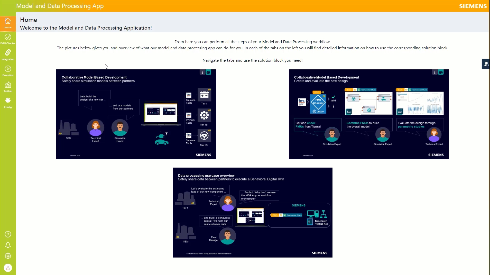
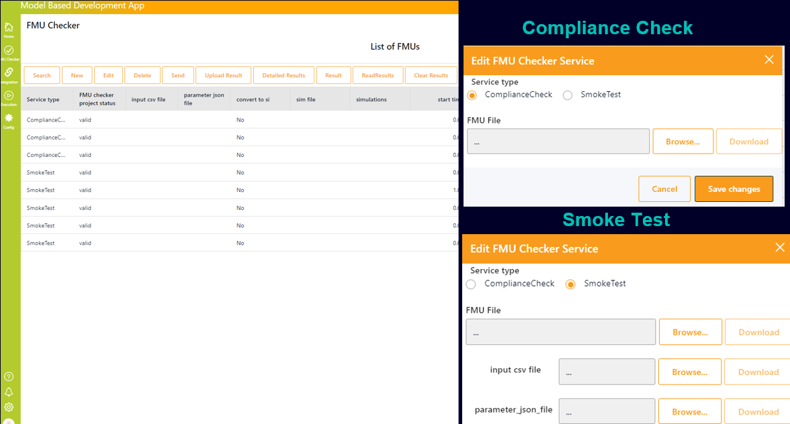
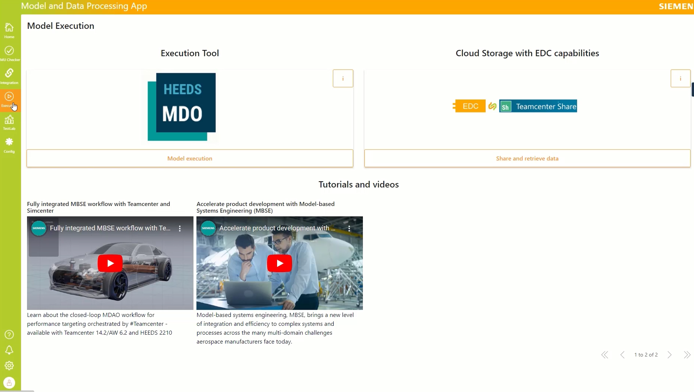
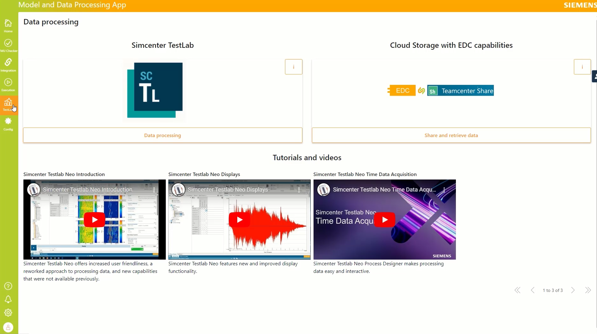

### Model Based Development and Data Processing Kit

## Introduction to the Use Case

The Behaviour Twin MDP (Model based development and Data Processing) Application was developed as proof-of-concept within the framework of the Catena-X initiative, to demonstrate collaborative utilization of behavioural digital twins in the automotive industry. This innovative application is poised to define the workflow and the tool chain for the model-based system development and data processing, leveraging Catena-X technology and collaborative principles. The mission of the Behaviour Twin MDP Application is to provide a comprehensive framework for the selection, integration, and utilization of behavioural digital twins. Through adherence to Catena-X standards and principles, we strive to ensure secure data exchange, interoperability, and compatibility, laying the foundation for seamless collaboration and efficiency in innovation.

The objective is to enhance model-based design and data processing using models coming from component suppliers (for example: the OEM gets the models of the gear box, the brakes and the battery from the respective Tier1s), by facilitating model exchange between Tier1s and OEM or between Tier2s and Tier1. This is done using the industry standard FMU ([Catena-X standard CX - 0102 Functional Mock-Up](https://catena-x.net/de/standard-library)) and performing the exchange over EDC. The MDP KIT defines the functionality of the software applications needed for the MDP use cases, that is to combine the models into a simulation architecture and perform parametric studies, but also to do field data processing based on evaluation models of the component suppliers.

## General Information Display: Behaviour Twin MDP Application

The General Information Display of the Behaviour Twin MDP (Model and Data Processing) Application offers users a user-friendly interface to visualize essential information about behavioural digital twins and their components. Whether users are analyzing the behaviour of a component within a vehicle or maintaining a system, this feature provides easy access to valuable insights.

A technical expert from the OEM has the task to build a design of a new car. The simulation expert will collect the necessary models from the Tier1 and combine them in a vehicle model to evaluate different designs. The models are exchanged between Catena-X partners using EDC and using the FMU format (black box model).

Once the models are available the workflow proceeds in three steps: Verify that the FMUs are valid (conform to the industry standard). Get information about the model inputs/outputs to make sure that you got the right models. Get the model in Simcenter System Architect over Teamcenter Share (which is being connected to EDC). The models are composed in a larger model (called Architecture) Get the architecture in Simcenter HEEDs and run parametric studies and compare results to evaluate the design.

## FMU Checker

FMU checker: to check the model and gain insights (for example what are the inputs and outputs).

### FMU Checker - Projects overview

The Projects Overview page serves as a hub for managing and monitoring all projects involving FMUs. It offers a centralized view of project statuses, progress, and key metrics, empowering users to stay organized and informed throughout the project lifecycle.

### FMU Checker - Results of Compliance Check

The FMU Checker - Results of Compliance Check page is a vital component of the application, providing users with detailed insights into the compliance status of Functional Mock-up Units (FMUs). This page serves as a comprehensive tool for ensuring adherence to standards and regulations, enabling users to verify the compliance of FMUs with ease and efficiency.

### FMU Checker - Results of Smoke Test

This page serves as a crucial tool for ensuring the functionality and reliability of FMUs, providing users with valuable information to assess their performance. It provides the detailed test results: Access detailed reports on the outcomes of smoke tests conducted on FMUs, including information on test cases executed, pass/fail statuses, and the results of the FMU calculation based on the users input.

## Integration: Simcenter Architect

Model Integration (using Simcenter System Architect): to combine several FMU models (connecting inputs and output) in an architecture.
The Model Integration and Qualification page is a pivotal component of the application, offering seamless integration with the Simcenter System Architect software. This integration empowers users to leverage the advanced capabilities of Simcenter System Architect within the application environment, enhancing their modeling and simulation workflows and driving innovation in system design and development.

## Execution: HEEDS

Model Execution (using Simcenter HEEDs): to perform parametric studies and compare different designs.
The Model Execution page stands as a cornerstone within the application, facilitating seamless execution of optimization tasks using the Simcenter HEEDS software. This integration empowers users to harness the advanced optimization capabilities of Simcenter HEEDS directly within the application environment, enhancing their design exploration and decision-making processes.

## Data Processing: Simcenter TestLab

Data Analysis (utilizing Simcenter TestLab Neo): Conduct comprehensive data analysis including statistical calculations.
The Data Processing section seamlessly integrates with Simcenter TestLab Neo software, empowering users to leverage its advanced capabilities directly within the application environment. This integration enhances data processing and automation processes, streamlining analytical workflows for sophisticated data analysis tasks, offering users intuitive access to Simcenter TestLab Neo's powerful features.

## Behaviour Twin MDP Application - Configuration

The Behaviour Twin MDP (Model and Data Processing) Application - Configuration page serves as a central hub for users to configure and customize various aspects of the application according to their specific needs and preferences. This page offers a range of tools and settings that empower users to tailor the application to suit their unique requirements, ensuring optimal functionality and performance.

## MDP Development Video

This video demonstrates the necessary software application functionality for implementing the MDP Use Cases:

- A guidance app, such as the MDP App shown in the video, should be provided to assist users in collaborative model-based development or model-based data processing workflows.
- In the video the two use cases are showcased with software applications from the Siemens Simcenter portfolio. Namely with Simcenter System Architect for the Model Integration step, Simcenter HEEDS for the Model Execution step and in the 2nd use case with Simcenter Testlab Neo for the Data Processing step. These Apps have been chosen for illustrative purposes.

  <iframe style={{width:'100%', height:'100%', aspectRatio:'1280/720'}} width="1280" height="720" src="https://www.youtube.com/embed/QHgl45IM6uc" title="" frameborder="0" allow="accelerometer; autoplay; clipboard-write; encrypted-media; gyroscope; picture-in-picture; web-share" referrerpolicy="strict-origin-when-cross-origin" allowfullscreen>
  </iframe>

