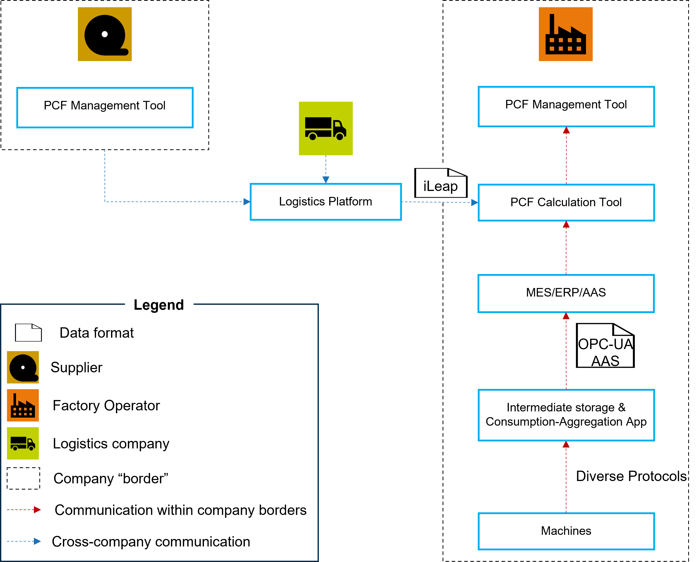

---
id: data-acquisition-for-product-carbon-footprint-calculation-kit
title: Adaption view - data acquisition for Product Carbon Footprint calculation
description: 'Adoption view - Data acquisition for Product Carbon Footprint calculation KIT'
sidebar_position: 1
---

<!--
Copyright(c) 2026 Contributors to the Eclipse Foundation

See the NOTICE file(s) distributed with this work for additional
information regarding copyright ownership.

This work is made available under the terms of the
Creative Commons Attribution 4.0 International (CC-BY-4.0) license,
which is available at
https://creativecommons.org/licenses/by/4.0/legalcode.

SPDX-License-Identifier: CC-BY-4.0
-->

<!--
KIT LOGO START - Generated automatically from the configuration done in Kit Master Data
Replace <kit-id> with the id from your kit referenced in data/kitsData.js.
Do not remove!
This logo is only visible when compiled with Docusaurus (final version of the hosted KIT)
-->

import Kit3DLogo from '@site/src/components/2.0/Kit3DLogo';

<Kit3DLogo kitId="pcf-data-acquisition"/>

<!--
KIT LOGO END
-->
# Data Acquisition for Product Carbon Footprint Calculation KIT (Adoption View)

## Introduction

Accurate Product Carbon Footprint (PCF) calculation depends on the quality and completeness of the underlying data. Before any emission value can be calculated or exchanged across a supply chain, the relevant data must be systematically collected — from machines on the shopfloor, through manufacturing execution and planning systems, and across logistics operations connecting suppliers and customers.

This KIT addresses exactly this upstream challenge: how to acquire, structure, and provide the data inputs necessary for PCF calculation. It serves as a practical, reusable blueprint for software providers, solution developers, and factory operators who need to implement reliable data acquisition pipelines in real industrial environments.

**Please note that the KIT only gives examples on how the data can be obtained - other methods can be as valid as the solutions described here.** 

Specifically this KIT describes, how PCF data can be collected on Instance or Batch level. This is only sensible if the IT Architecture in a given environment is already set up to collect data with this granularity or if the results are used for further purposes like PCF optimization. Methods that use averaged consumption data can be as valid as the approaches described here.

For guidance on how the acquired data is subsequently exchanged and reported, refer to the **[PCF Exchange KIT](../../product-carbon-footprint-exchange-kit/)** . An overarching description of the end-to-end PCF process and methodology can be found in the **[Catena-X Rulebook](https://catenax-ev.github.io/assets/files/CX-NFR-PCF-Rulebook_v.3.0-04874a80a6d27511df06e07ae3049278.pdf)** and in the _Manufacturing-X Guidelines_. Additional guidance on PCF calculations can be found in the _Factory-X PCF Guidance Document_.

## Vision and Mission
## Vision

Our vision is to empower manufacturers and supply chain actors to:

- Leverage primary data: Utilize actual energy consumption and transport emission data measured at the source, replacing generic emission factors with verifiable values
- Enable digital integration: Facilitate seamless data exchange between shopfloor systems, production planning, logistics platforms, and PCF management tools
## Mission

Our mission is to provide standardized, implementable blueprints for the accurate acquisition of Product Carbon Footprint (PCF)-relevant data. for this we provide blueprints, described along the following three examplary environments:
- Collection of Manufacturing data for PCF calculation
  - Using Manufacturing Execution Systems
  - Using Asset Administration Shells
- Collection of Logistics data for PCF calculation

## Business Context

Calculating a product's carbon footprint requires data from multiple domains within and across company boundaries. The reference architecture below illustrates how suppliers, factory operators, and logistics companies interact to provide the data inputs for PCF calculation (PCF Exchange cross company is excluded here, as it is handled in the PCF Exchange KIT).

## KIT Structure

This KIT is structured into three sub-sections, each addressing one data acquisition scenario. Each sub-section provides an Adoption View (business and architectural guidance) and a Development View (technical implementation details, APIs, and data models).

- Adoption view
  - Collection of Manufacturing data for PCF calculation
    - Using Manufacturing Execution System
    - Using Asset Administration Shell
  - Collection of Logistics data for PCF calculation
- Development view
  - Collection of Manufacturing data for PCF calculation
    - Using Manufacturing Execution System
    - Using Asset Administration Shell
  - Collection of Logistics data for PCF calculation

## NOTICE

This work is licensed under the [CC-BY-4.0].

- SPDX-License-Identifier: CC-BY-4.0
- SPDX-FileCopyrightText: [2026] [ESTAINIUM]
- SPDX-FileCopyrightText:[2026] Contributors to the Eclipse Foundation
- Source URL: [https://github.com/eclipse-tractusx/eclipse-tractusx.github.io](https://github.com/eclipse-tractusx/eclipse-tractusx.github.io)

