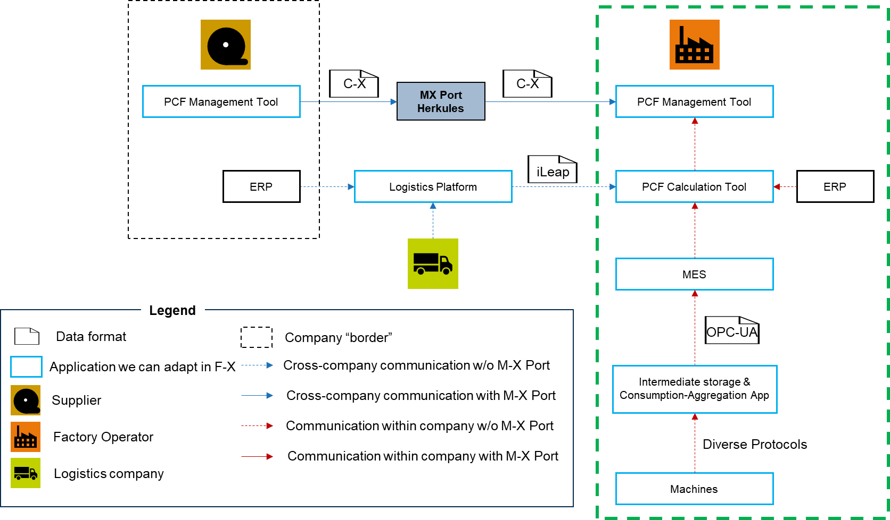

---
id: adoption-view-pcf-data-acquisition-using-mes-data
title: Adoption View - PCF data aquistion using MES Data
description: 'Adoption View - PCF data aquistion using MES Data KIT'
sidebar_position: 4
---

<!--
Copyright(c) 2026 Contributors to the Eclipse Foundation

See the NOTICE file(s) distributed with this work for additional
information regarding copyright ownership.

This work is made available under the terms of the
Creative Commons Attribution 4.0 International (CC-BY-4.0) license,
which is available at
https://creativecommons.org/licenses/by/4.0/legalcode.

SPDX-License-Identifier: CC-BY-4.0
-->

<!-- 
KIT LOGO START - Generated automatically from the configuration done in Kit Master Data
Replace <kit-id> with the id from your kit referenced in `data/kitsData.js`.
Do not remove!
This logo is only visible when compiled with Docusarus (final version of the hosted KIT)
-->

import Kit3DLogo from '@site/src/components/2.0/Kit3DLogo';
<Kit3DLogo kitId="pcfdataacquisition"/>

<!--
KIT LOGO END
-->
# Adoption View - PCF data acquistion using MES Data

## Introduction

<!-- Describe what problem this KIT solves and who benefits from it. -->

The KIT provides a standardized and reusable blueprint for implementing instance-based Product Carbon Footprint (PCF) calculation in manufacturing environments. It captures the key architectural patterns, data models, and integration principles that were validated in the Factory‑X use case.
Its scope covers the end-to-end integration of shopfloor data, MES-based process context, and PCF calculation services, enabling batch- and serial-number-specific emission tracking. The KIT is designed for software providers and solution developers, supporting them in implementing interoperable, scalable solutions that move from aggregated estimations to granular, data-driven PCF calculation and subsequent aggregation for reporting and data exchange.

## Vision and Mission

## Vision

Enable a standardized and reusable blueprint for instance-based Product Carbon Footprint calculation across manufacturing ecosystems.

## Mission

To operationalize instance-based PCF calculation by combining MES-driven process context with real-time shopfloor data, enabling batch- and serial-number-specific emissions transparency and scalable aggregation across the supply chain.

## Business Context

The green box in the referenzarchitecture on the right represents the internal processes and systems of a company, typically a factory or a production site. This system focuses on the calculation and management of the Product Carbon Footprint (PCF) for the manufacturing share. Its purpose is to automatically capture, collect, and process product-specific consumption data, especially energy data. The goal is to determine CO2 emissions at the individual product instance level. By utilizing various business applications and integration layers, it supports the optimization of production processes to both improve internal efficiency and meet sustainability requirements, as well as to transparently provide PCF data.

To achieve this, the system works with several specialized business applications:

- Manufacturing Execution System (MES): This system collects data from the shop floor and breaks it down to the product level.
- PCF Calculation Tool: It calculates the PCF by considering consumption data from the shop floor over MES, logistics carbon footprints, and PCFs of components or resources.
- PCF Management Tool: This application assists in managing, sharing, and requesting PCFs – both for proprietary products and those from suppliers along the supply chain.
- Data Provisioning by Automation: An application for automated data provision, built upon a Shopfloor Integration Layer (SIL), such as Siemens' Industrial Information Hub.
- Consumption Aggregation: This application collects and summarizes consumption data at the level of individual automation operations.

## Business Value

This PCF management system offers significant opportunities for service providers to engage and create value. It enables them to develop and offer specialized services in PCF calculation, reporting, and optimization. They can help businesses meet growing regulatory and customer demands for sustainable products and carbon footprint management. By offering advanced analytics, service providers can derive actionable insights from consumption and emissions data, supporting continuous improvement for clients.

## NOTICE

This work is licensed under the [CC-BY-4.0].

- SPDX-License-Identifier: CC-BY-4.0
- SPDX-FileCopyrightText: [2026] [Siemens]
- SPDX-FileCopyrightText:[2026] Contributors to the Eclipse Foundation
- Source URL: [https://github.com/eclipse-tractusx/eclipse-tractusx.github.io](https://github.com/eclipse-tractusx/eclipse-tractusx.github.io)

