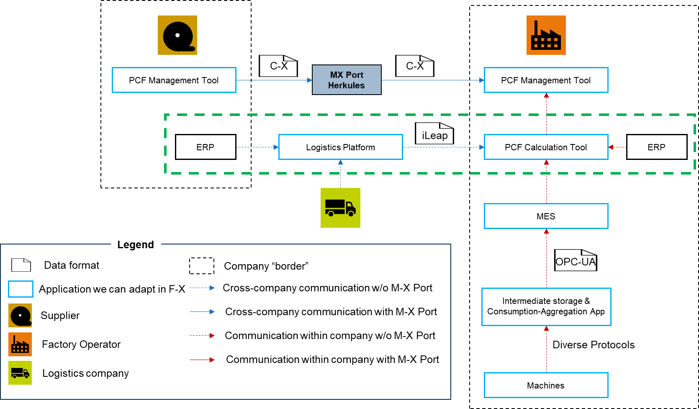

import Kit3DLogo from '@site/src/components/2.0/Kit3DLogo';

<Kit3DLogo kitId='pcf-data-acquisition'/>

## Introduction

Product carbon footprint (PCF) accounting requires comprehensive transparency across the entire supply chain, including the logistics operations that connect suppliers and customers. The logistics carbon footprint (LCF) is a critical component of the overall PCF, capturing the emissions generated during transport and handling of goods.

However, a fundamental challenge exists in the supply chain ecosystem: **each party has incomplete visibility** into the complete picture. Suppliers and customers know about their purchase orders and dispatch notes but lack knowledge of actual transport execution. Conversely, logistics service providers execute the transport and can measure actual emissions but do not know which specific customer dispatch notes were consolidated on each shipment.

This information asymmetry makes it impossible for any single party to accurately calculate and report the logistics carbon footprint without collaboration. A dedicated platform is essential to bridge this gap and enable all three actors—supplier, customer, and logistics service provider—to securely exchange the relevant data needed for precise, standardized emission calculation.

## Vision and Mission

## Vision

To establish a transparent, collaborative ecosystem where logistics carbon footprints are accurately calculated, tracked, and reported as an integral part of product carbon footprint accounting. This vision enables organizations to:

- **Leverage primary data**: Utilize actual emissions data measured by logistics providers rather than relying solely on estimates
- **Enable collaboration**: Facilitate seamless data exchange between suppliers, customers, and logistics service providers
- **Achieve standardization**: Apply consistent, internationally recognized emission calculation methodologies across the entire supply chain
- **Support compliance**: Meet regulatory requirements for carbon accounting and reporting with verifiable, auditable data
- **Drive sustainability**: Empower organizations to identify and optimize high-emission logistics pathways

## Mission

To develop and operate a logistics platform that enables the secure, standardized exchange of logistics data and emissions information among all supply chain actors. The platform achieves this by:

- **Capturing primary data**: Accepting actual, measured emission data from logistics service providers, which represents the most accurate source of logistics carbon footprint information
- **Facilitating multi-party exchange**: Providing a neutral, trusted intermediary where suppliers, customers, and logistics providers can exchange dispatch notes, shipment information, and corresponding emissions data
- **Automating data transformation**: Automatically allocating shipment-level emissions back to individual dispatch notes and purchase orders, enabling each party to account for the logistics carbon footprint in their scope 3 (or other relevant) emissions
- **Ensuring standardization**: Implementing industry-standard frameworks (GLEC, iLEAP, ISO 14083) for emission calculation and data exchange to ensure comparability and compliance
- **Enabling integration**: Providing standardized APIs that allow customers to query logistics carbon footprints directly from the platform and incorporate them into their PCF Management Systems

## Business Context

### Business Process

The logistics carbon footprint management process involves three primary actors:

**1. Suppliers** — Manufacture and package goods, create dispatch notes (DNs) with product information and POs, and upload shipment data to the logistics platform.

**2. Logistics Service Providers** — Execute the physical transport using various modes (truck, rail, air, sea), measure or calculate actual fuel consumption and other primary emissions data, and report emission values to the logistics platform based on shipment-level consolidation (Unique Consignment References - UCRs).

**3. Customers** — Receive goods with dispatch notes, integrate logistics carbon footprint data into their PCF Management Systems, and use this data for regulatory compliance and sustainability reporting.

### Data Flow Architecture

The logistics platform acts as a neutral intermediary that enables secure, standardized data exchange:

The green box in the above reference architecture on the right, specifically encompassing the Logistics Platform, represents the core processes and systems for managing and calculating the Logistics Product Carbon Footprint (PCF). This system focuses on enabling transparent and efficient data exchange between companies to accurately determine the environmental impact of product transportation. Its primary purpose is to capture, process, and allocate logistics-related emission data to individual shipments and and ultimately to the products themselves.

To achieve this, the system interacts with several specialized business applications and **data exchange points**:

- **Logistics Platform:** This central platform is crucial for the entire logistics PCF process. It serves as the hub where Suppliers/Customers upload Purchase Order (PO) and Dispatch Note (DN) information, including weight and routing details. It also receives confirmations of shipments (UCRs) and tracking data from logistics service providers regarding actual transport execution. Furthermore, logistics service providers submit actual, measured emissions data, calculated at the UCR level using primary data (fuel consumption, distance, mode of transport, load weight) or standardized emission factors. The platform then automatically allocates UCR-level emissions back to individual DNs based on weight distribution.
- **ERP (Enterprise Resource Planning):** Integrated with the Logistics Platform, the ERP systems (both on the supplier and factory operator side) provide essential business data, such as purchase orders and dispatch notes, which are foundational for defining shipment scopes and initiating logistics processes.
- **PCF Calculation Tool:** This tool receives the allocated logistics carbon footprints from the Logistics Platform. It then integrates these transport emissions with other relevant PCF data (e.g., from manufacturing, if applicable) to perform the final PCF calculation for the manufactured products.

<!--
**Key Data Exchange Points:**

- **Dispatch Note & Shipment Info** → Suppliers/Customers upload PO and DN information with weight and routing details to the platform
- **Transport Execution & Tracking** → Logistics service providers confirm shipments (UCRs) and track actual transport execution
- **Emission Data** → Logistics service providers submit actual, measured emissions data calculated at the UCR level using primary data (fuel consumption, distance, mode of transport, load weight) or standardized emission factors
- **Allocation & Distribution** → The platform automatically allocates UCR-level emissions back to individual DNs based on weight distribution
- **Query & Integration** → Customers query logistics carbon footprints via API based on DN identifiers and integrate results into their PCF Management Systems
-->

## Business Value

### Strategic Context

The logistics carbon footprint is a critical component of product carbon footprint (PCF) accounting, particularly as regulatory requirements and corporate sustainability commitments intensify globally. Organizations across supply chains—from manufacturers to retailers—face increasing pressure to measure, report, and reduce their carbon emissions, including Scope 3 emissions from logistics operations.

### Key Stakeholders & Benefits

| Stakeholder | Role | Benefit |
|---|---|---|
| **Suppliers** | Provide dispatch and shipment data; upstream reporting | Transparent view of logistics emissions in their supply chain; data for Scope 3 reporting |
| **Logistics Service Providers** | Execute transport; measure/report emissions | Standardized data format; ability to demonstrate environmental performance and compliance |
| **Customers** | Integrate LCF into PCF; downstream reporting | Accurate, auditable logistics carbon footprint data directly from transport operators; compliance-ready data |
| **Regulators & Auditors** | Validate compliance and reporting accuracy | Transparent, standardized, auditable emission data across supply chains |

### Business Value Drivers

1. **Regulatory Compliance** — Meet emerging carbon accounting and reporting regulations (EU Taxonomy, Corporate Sustainability Reporting Directive, Scope 3 disclosure requirements)
2. **Supply Chain Transparency** — Enable all parties to understand and optimize the environmental impact of logistics operations
3. **Data Accuracy** — Replace estimates with primary data from logistics operators, improving PCF quality and credibility
4. **Cost Optimization** — Identify high-emission logistics routes and consolidation opportunities to reduce both carbon and transportation costs
5. **Competitive Advantage** — Demonstrate environmental commitment and differentiate through transparent, science-based carbon accounting

## Standards

The logistics platform implementation relies on the following industry standards and frameworks to ensure interoperability, accuracy, and comparability:

| Standard | Description | Link |
|---|---|---|
| **GLEC Framework** | Global Logistics Emissions Council Framework defines the comprehensive methodology and rules for calculating emissions in logistics processes. | [GLEC Framework](https://www.smartfreightcentre.org/en/our-programs/emissions-accounting/global-logistics-emissions-council/calculate-report-glec-framework/) |
| **iLeap Specifications** | Interoperable Logistics Emissions Accounting and Protocols (iLEAP) provide technical specifications for secure, standardized data exchange between supply chain actors. iLEAP follows ISO 14083:2023 and is compatible with the PACT Data Exchange Protocol. | [iLeap Specifications](https://specs.ileap.global/) |
| **ISO 14083:2023** | International Standard for quantification and reporting of greenhouse gas emissions arising from transport chain operations. | [ISO 14083:2023](https://www.iso.org/standard/70969.html) |
| **Transport Carbon Calculator** | Siemens tool for calculating emissions based on standardized emission factors when primary transport data is unavailable. Implements GLEC framework methodology. | [Transport Carbon Calculator](https://developer.siemens.com/sdl/home.html) |
| **PACT Data Exchange Protocol** | Pathfinder Accountability and Transparency Framework for exchanging carbon footprint data across the supply chain. | [PACT Framework](https://www.carbon-trust.org/our-work-and-impact/emerging-opportunities/pathfinder-framework/) |

## NOTICE

This work is licensed under the [CC-BY-4.0].

- SPDX-License-Identifier: CC-BY-4.0
- SPDX-FileCopyrightText: 2026 Siemens AG
- SPDX-FileCopyrightText: 2026 Contributors to the Eclipse Foundation
- Source URL: [https://github.com/eclipse-tractusx/eclipse-tractusx.github.io](https://github.com/eclipse-tractusx/eclipse-tractusx.github.io)
