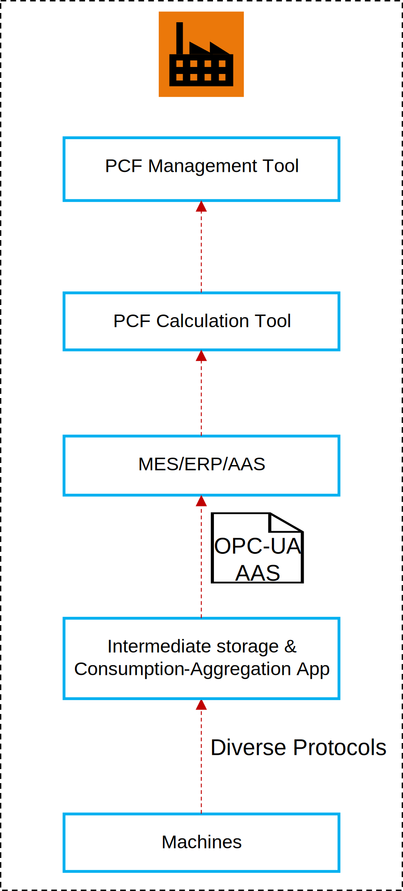
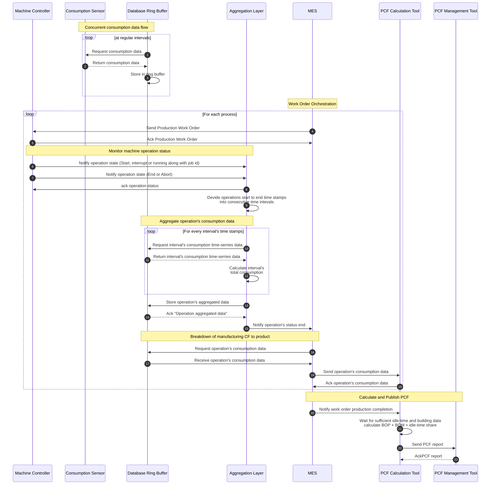
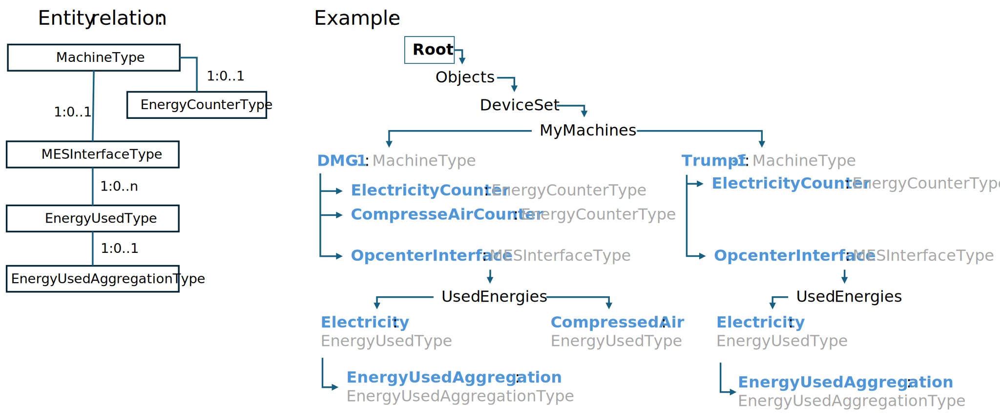

<!--
Copyright(c) 2026 Contributors to the Eclipse Foundation

See the NOTICE file(s) distributed with this work for additional
information regarding copyright ownership.

This work is made available under the terms of the
Creative Commons Attribution 4.0 International (CC-BY-4.0) license,
which is available at
https://creativecommons.org/licenses/by/4.0/legalcode.

SPDX-License-Identifier: CC-BY-4.0
-->

<!-- 
KIT LOGO START - Generated automatically from the configuration done in Kit Master Data
Replace <kit-id> with the id from your kit referenced in `data/kitsData.js`.
Do not remove!
This logo is only visible when compiled with Docusarus (final version of the hosted KIT)
-->
import Kit3DLogo from '@site/src/components/2.0/Kit3DLogo';
<Kit3DLogo kitId="pcfdataacquisition"/>

<!--
KIT LOGO END
-->

# Development view - PCF data aquistion using MES data

## Architecture Overview

<!-- High-level diagram of the technical approach. 

> TODO: Describe the technical architecture and key design decisions.
> We recommend diagrams in drawio (need to be stored in SVG), or you can use mermaid or plant uml
> As described in TRG 1.04: https://eclipse-tractusx.github.io/docs/release/trg-1/trg-1-04.
> Explain which components are involved in the KIT data exchange or use case.
> Keep the source code so it can be included in the final KIT version in Markdown.
> Example:
-->

The technical architecture for the Manufacturing Product Carbon Footprint (PCF) solution, as depicted in the accompanying architecture diagram below, is specifically designed to enable fully automated, instance-based PCF calculation directly within the manufacturing environment. This solution focuses on integrating operational technology (OT) with information technology (IT) to provide real-time, granular insights into the carbon footprint of manufactured products.

## Core components

1. **Shopfloor Integration Layer (SIL):** This foundational layer, represented at the bottom of the diagram, acts as the primary interface to the physical production environment. It is responsible for collecting raw, real-time data from various shopfloor assets, sensors, and control systems. At this level, an **OPC UA model** is employed to enable standardized communication with higher-level applications. This specific model is further detailed in the "Data Model" chapter below. The SIL normalizes and contextualizes this data, making it accessible for subsequent processing.
2. **Manufacturing Execution System (MES):** Positioned above the SIL, the MES is a critical component that manages and monitors production processes on the shop floor. It receives data from the SIL and provides essential context such as production orders, material consumption, energy usage per process step, and machine states. The MES is instrumental in linking raw operational data to specific product instances and manufacturing steps.
3. **PCF Calculation Tool:** This dedicated tool, situated higher in the architecture, is responsible for performing the actual instance-based PCF calculations. It consumes data from the MES (and potentially other relevant sources like ERP for master data) to determine the carbon footprint of individual products or batches. The tool applies predefined calculation methodologies and emission factors to derive accurate PCF values.
4. **PCF Management Tool:** At the top of this manufacturing-focused stack, the PCF Management Tool provides the overarching control and analytical capabilities. It orchestrates the PCF calculation process, manages calculation rules, stores calculated PCF data, and enables reporting and visualization. This tool offers a comprehensive view of the manufacturing PCF, allowing for analysis and optimization.

## General data Exchange between components

Source: [`1_MES_General_woMX_segmented.mmd`](1_MES_General_woMX_segmented.mmd)

This diagram provides a concise visual representation of the data exchange within our Manufacturing Product Carbon Footprint (PCF) solution. Essentially, this diagram is key to understanding how our solution achieves automated, instance-based PCF calculation, providing transparent and actionable insights into the environmental impact of manufacturing.

**Purpose of this Diagram:**

This diagram illustrates the sequential flow of data and the interactions between different system components, from the shop floor to the final PCF report. It highlights:

- **Data Origin:** How raw consumption data is collected from machine controllers and sensors.
- **Data Processing:** The steps involved in aggregating and contextualizing this data.
- **System Interactions:** The crucial roles of the Manufacturing Execution System (MES) and the PCF Calculation and Management tools.
- **Outcome:** The generation of an instance-based Product Carbon Footprint.

This visual blueprint aims to contribute significantly by clarifying complexity, enhancing accuracy, and facilitating integration within the PCF calculation process.

## Key design decisions

1. Fully Automated, Instance-Based PCF Calculation: The central design decision is to achieve a fully automated, instance-based calculation of the PCF. This means that for every product manufactured, its specific carbon footprint can be determined without manual intervention. This is enabled by:
Direct Data Acquisition from the Shopfloor: Through the SIL and MES, real-time operational data (e.g., energy consumption, material usage, process times) is captured directly at the source, ensuring accuracy and timeliness.
2. Granular Data Contextualization: The MES plays a crucial role in contextualizing this raw data, linking it to specific product instances, production steps, and resources used.
Seamless IT/OT Integration with Standardized Communication: The architecture is built upon a robust integration between Operational Technology (OT) and Information Technology (IT). The Shopfloor Integration Layer (SIL) serves as the bridge, abstracting the complexities of OT systems and providing standardized interfaces for IT applications like the MES and PCF tools. The use of the OPC UA model at the SIL level is crucial here, as it ensures standardized and interoperable communication, which is essential for connecting to higher-level applications. This integration is fundamental for leveraging real-time production data for PCF calculations.
3. Modularity and Scalability: Each component is designed to be modular, allowing for flexible deployment, independent updates, and scalability. This ensures that the solution can adapt to varying production complexities and growing data volumes within different manufacturing environments.
Data-Driven Optimization: By providing precise, instance-based PCF data, the solution empowers manufacturers to identify carbon hotspots within their production processes. This data-driven approach supports continuous improvement efforts, enabling targeted measures for reducing the environmental impact of manufacturing operations.

<!--
## Application Programming Interfaces (API)

> TODO: If applicable API specifications.
> Detailed APIs can be included as swagger / open api specs
> As described in TRG 1.08: https://eclipse-tractusx.github.io/docs/release/trg-1/trg-1-08
> Will be hosted in API HUB: https://eclipse-tractusx.github.io/api-hub/
-->

## Semantic Models / Data Model

The Factory-X OPC-UA data model for data exchange between MES and automation systems was developed in alignment with the OPC-UA Foundation specifications. Our primary goal was to define an extension specifically tailored to the energy consumption information required by PCF management systems for calculating Product Carbon Footprints.

The following illustration describes the logical structure of the OPC-UA Extention:

  
Data Model Overview - click to expand

The table below shows the details of each data field in the Factory-X OPC-UA data model:

  
PCF Data Model details - click to expand

---
#### MachineType

| Attributes | Type | Values / Examples | Comment |
|---|---|---|---|
| MachineArea | String | “Production” | |
| MachineID | String | “DMG-1” | |
| MachineState | Enumeration | Initializing, Running, Ended, Aborted, Interrupted | State changes are relevant for calculating energy consumption in relation to machine operation. |
| Other asses related properties | | | Not relevant to the energy-data exchange for PCF calculation |
| **Objects** | | | |
| EnergyCounters | FolderType | | |
| EnergyCounter-1 | EnergyCounterType | „Electricity“ | Optional |
| EnergyCounter-2 | EnergyCounterType | „CompressedAir“ | Optional |
| … | | | |
| **Interfaces** | | | |
| MESInterface | MESInterfaceType | “OpcenterInterface” | Optional |

---
#### EnergyCounterType

| Attributes | Type | Values / Examples | Comment |
|:---|:---:|---:|:---|
| EnergyType | Enumeration | „Electricity“, „CompressedAir“, „Gas“ „Water“, „Steam“, „Termal Energy“, „Fuel“ | Enumeration values are only an example |
| EnergyUnit | Enumeration | “kWh”, “m³”, “l”, “kWh” | Enumeration values are only an example |
| EnergyCounterCurrent | Float | | Machine operation independent counter |
| EnergyCounterHistory | Array [1,1] | | Historical value collection. Includes array of value/timestamp pairs e.g. 30sec. This values will be taken for aggregation of consumptions per operation. |

---
#### MESInterfaceType

| Attributes | Type | Values / Examples | Comment |
|:---|:---:|---:|:---|
| OperationID | String | “OP-Mil-19854” | |
| OperationName | String | “Milling” | |
| OperationState | Enumeration | Initializing, Running, Ended, Aborted, Interrupted | Equivalent to machine state. The switch to Ended, Aborted states triggers the calculation of operation related energy consumptions as well as the data transfer to MES |
| WorkOrderID | String | | |
| ProcessContainer | String | | Is the machine program name |
| QuantityPlanned | Float | | |
| QuantityProduced | Float | | |
| QuantityGood | Float | | |
| QuantityUnit | Enumeration | | |
| ActualStartTime | Datetime | | |
| ActualEndTime | Datetime | | |
| **Objects** | | | |
| UsedEnergies | FolderType | | This folder includes all measurable energies |
| Energy-1 | EnergyUsedType | „Electricity“ | |
| Energy 2 | EnergyUsedType | „Gas“ | |
| … | | | |

---
### EnergyUsedType
| Attributes | Type | Values / Examples | Comment |
|:---|:---:|---:|:---|
| EnergyType | Enumeration | „Electricity“, „CompressedAir“, „Gas“ „Water“, „Steam“, „Termal Energy“, „Fuel“ | Enumeration values are only an example |
| EnergyUnit | Enumeration | “kWh”, “m³”, “l”, “kWh” | Enumeration values are only an example |
| EnergyUsedTotal | Float | | Energy spent while running the operation |
| **Objects** | | | |
| EnergyUsedAggregation | EnergyUsedAggregationType | | Optional object foreseen for provision of aggregated energy values: e.g. Electricity spent each 15 min |

---
### EnergyUsedAggregationType

| Attributes | Type | Values / Examples | Comment |
|:---|:---:|:---|:---|
| LastAggregationrunTimepoint | Datetime | | Helpful to persist the last aggregation timepoint |
| EnergyUsedArray | Float [1] | | Array of aggregated energy spent values |
| Cycle | Float | | Specifies the cycle in which the values in EnergyUsedArray are aggregated |

---

<!--
## Protocols

<!-- Provide a minimal code snippet or step-by-step guide. -->

<!--
> TODO: Add the protocols which you are using for the data exchange.

| Name | Description | Link to Documentation |
| ---- | ----------- | ----------------------|
| `Protocol Na!` | This protocol is important when doing the data exchange | [example-link](https://example.com) |

-->
## NOTICE

This work is licensed under the [CC-BY-4.0].

- SPDX-License-Identifier: CC-BY-4.0
- SPDX-FileCopyrightText: [2026] [Siemens AG]
- SPDX-FileCopyrightText:[2026] Contributors to the Eclipse Foundation
- Source URL: [https://github.com/eclipse-tractusx/eclipse-tractusx.github.io](https://github.com/eclipse-tractusx/eclipse-tractusx.github.io)
