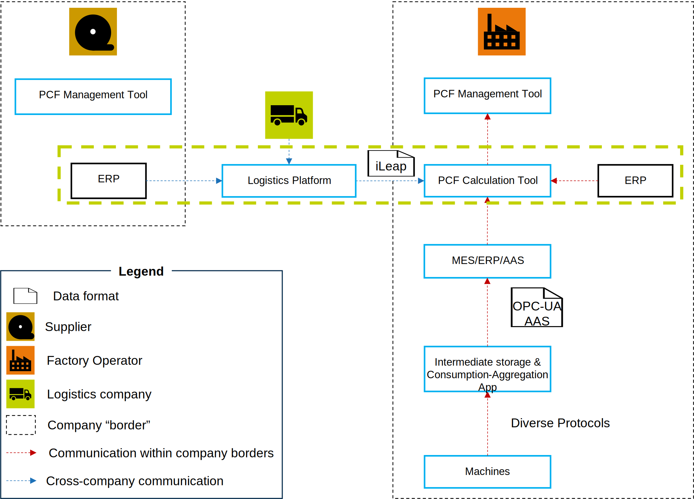

<!--
Copyright(c) 2026 Contributors to the Eclipse Foundation

See the NOTICE file(s) distributed with this work for additional
information regarding copyright ownership.

This work is made available under the terms of the
Creative Commons Attribution 4.0 International (CC-BY-4.0) license,
which is available at
https://creativecommons.org/licenses/by/4.0/legalcode.

SPDX-License-Identifier: CC-BY-4.0
-->

<!-- 
KIT LOGO START - Generated automatically from the configuration done in Kit Master Data
Replace <kit-id> with the id from your kit referenced in `data/kitsData.js`.
Do not remove!
This logo is only visible when compiled with Docusarus (final version of the hosted KIT)
-->
import Kit3DLogo from '@site/src/components/2.0/Kit3DLogo';

<Kit3DLogo kitId='pcf-data-acquisition'/>
<!--
KIT LOGO END
-->

## PCF Data Acquisition - Via Logistics

## Architecture Overview

The diagram illustrates an architecture that depicts the data flow and interactions between various systems and stakeholders for the calculation of the Logistics Product Carbon Footprint (PCF)



### Core components

1. **ERP/BA (Enterprise Resource Planning / Business Administration):** This central system, used by both the Supplier and the Factory Operator, defines the scope of shipments. It serves as the source for planning and managing the business processes related to shipping.
2. **Logistics Platform:** This platform manages shipments and receives confirmations from transport service providers. It can be operated by either the supplier or the recipient of the goods. Its role is crucial for coordinating and monitoring logistical processes.
3. **MES (Manufacturing Execution System):** An application that controls and monitors production processes within the factory. In this specific use case, the MES serves as the basis for recording outgoing goods, which is relevant for subsequent PCF calculation.
4. **PCF Calculation Tool and PCF Management Tool:** These two closely integrated tools receive information from the Logistics Platform regarding transport emissions and perform the final PCF calculation for manufactured products. The Calculation Tool handles the actual computation, while the Management Tool is responsible for managing, storing, and reporting the calculated PCF values.

### Data flow between the Logistics Platform and the PCF Management System

A fundamental challenge in supply chain carbon accounting is the **information asymmetry** between supply chain actors:

- **Suppliers and Customers** know about purchase orders (POs) and dispatch notes (DNs) but lack knowledge of how goods were actually transported and the resulting emissions
- **Logistics Service Providers** execute the transport and can measure actual emissions from primary data (fuel consumption, distance, transport mode) but do not know which customer dispatch notes were consolidated on each shipment

This information gap makes it impossible for any single party to accurately calculate the logistics carbon footprint independently. A logistics platform acts as a neutral intermediary that bridges this gap, enabling all three actors to exchange the relevant data needed for accurate, standardized emission calculation and reporting.

### Key relationships between data entities

| Relationship | Cardinality | Description |
|---|---|---|
| UCR (Unique Consignment Reference) → HU (Handling Unit) | 1 : n | Multiple handling units can be assigned to one UCR |
| HU → DN (Dispatch Note) | n : n | Multiple dispatch notes can be packed into one HU and vice versa |
| DN → PO (Purchase Order) | 1 : n | Multiple purchase orders can be consolidated into one dispatch note |

While both the customer and the supplier have knowledge of the PO and DN, neither party knows how the transport was actually carried out or how the UCR is composed. As a consequence, **only the logistics service provider** can provide the emissions — the logistics carbon footprint — from primary data (as defined by the [GLEC framework](https://www.smartfreightcentre.org/en/our-programs/emissions-accounting/global-logistics-emissions-council/calculate-report-glec-framework/)), such as fuel consumption.

### Data ownership and emission calculation

As a consequence of their operational roles, **only the logistics service provider** can provide the logistics carbon footprint based on primary data (as defined by the [GLEC framework](https://www.smartfreightcentre.org/en/our-programs/emissions-accounting/global-logistics-emissions-council/calculate-report-glec-framework/)), such as fuel consumption, actual distance traveled, transport mode, and load weight.

Conversely, the logistics service provider has no knowledge of which dispatch notes were aggregated and transported under a given UCR. This makes it impossible to calculate a footprint at the DN level directly; it can only be calculated at the UCR level. The logistics service provider publishes this value to the logistics platform, which then automatically distributes the emission values back to the individual DNs on that UCR. The customer can subsequently query the footprint for a specific DN directly from the logistics platform via an interface within their PCF Management System.
Conversely, the logistics service provider cannot calculate a footprint at the DN level directly because it has no knowledge of which dispatch notes were consolidated on any given shipment (UCR). Emission calculation is only possible at the UCR level. To resolve this, the logistics service provider publishes the UCR-level footprint to the logistics platform, which then automatically allocates and distributes the emission values back to each individual DN on that UCR based on weight distribution. This enables customers to query the footprint for specific dispatch notes directly from the logistics platform via an interface within their PCF Management System.

### Step-by-step information flow


1. The customer orders goods from the supplier — a Purchase Order (PO) is created.
2. The supplier produces and packages the goods. A Dispatch Note (DN) is created, potentially consolidating multiple POs.
3. The DN and Handling Unit (HU) data are uploaded to the logistics platform (by either the supplier or the customer). A Unique Consignment Reference (UCR) is created in the process.
4. The logistics service provider confirms the transport assignment (the UCR) and executes the shipment.
5. After delivery, the logistics service provider enters the emission data for the completed transport into the logistics platform at the UCR level. If the logistics service provider does not measure emissions using primary data, the [Transport Carbon Calculator API](https://developer.siemens.com/sdl/home.html) can be used to calculate emissions based on standardized emission factors, as described by the GLEC framework.
6. The logistics platform automatically distributes the UCR-level footprint back to each individual DN covered by that UCR based on the weight distribution.
7. The customer receives the goods along with the DN.
8. Using the DN, the customer can query the corresponding logistics carbon footprint directly from the logistics platform via an API call within their PCF Management System, based on the [iLeap specifications](https://specs.ileap.global/).

## Application Programming Interfaces (API)

As described above, there are two API calls used:

- The [Transport Carbon Calculator](https://developer.siemens.com/sdl/home.html).
- The API call from the PCF Management System based on the  [iLeap specifications](https://specs.ileap.global/).

### Transport Carbon Calculator API

The [Transport Carbon Calculator](https://developer.siemens.com/sdl/home.html) provides emissions calculation based on standardized emission factors when logistics service providers cannot measure or provide primary data (actual fuel consumption or actual produced emissions). The API implements the [GLEC framework](https://www.smartfreightcentre.org/en/our-programs/emissions-accounting/global-logistics-emissions-council/calculate-report-glec-framework/) methodology and accepts transport parameters such as:

- Origin and destination locations
- Transport mode (truck, rail, air, sea, etc.)
- Load weight
- Distance traveled

The API returns the calculated emission value that can be entered into the logistics platform when primary measurements are unavailable.

### iLeap Specification API

The [iLeap Specifications](https://specs.ileap.global/) define the technical interface for querying logistics carbon footprints from the platform. Customers use this API to:

- Query the logistics carbon footprint for a specific dispatch note (DN)
- Retrieve detailed emission allocation data
- Integrate results into their PCF Management Systems

The iLeap API ensures data consistency, traceability, and compliance with international standards (ISO 14083:2023, GLEC framework).

## Semantic Models / Data Model

<!-- Reference the relevant semantic models, APIs, or standards. -->
### Data Model of the Logistics Platform

The logistics platform's data model is flexible to accommodate different supply chain configurations but must always contain the following information to enable GLEC-compliant emission calculation and allocation:

**Core Identifiers:**

- **UCR IDs** — Unique Consignment References for shipments consolidated by the logistics provider
- **HU IDs** — Handling Unit identifiers for physical units of goods
- **DN IDs** — Dispatch Note identifiers from suppliers
- **PO IDs** — Purchase Order identifiers from customers

**Routing & Weight Information:**

- **Sender and recipient information** — Complete addresses and identifiers needed for routing and traceability
- **Weight for total UCR** — Total weight of goods on each shipment (needed for emission calculation)
- **Weight for each DN** — Individual dispatch note weights (needed to redistribute UCR-level emissions back to DNs based on weight proportions)

**Transport Information:**

- **Transport mode** — Truck, rail, air, or sea (required for GLEC calculation)
- **Distance** — Actual or planned distance (required for emission calculation)
- **Fuel type/Energy source** — For primary data measurement or calculator selection

### Data Model of the Transport Carbon Calculator

When logistics service providers do not have primary measurement data, the Transport Carbon Calculator implements the GLEC framework's emission factors and calculation rules. Its data model includes:

- **Transport parameters** — Origin, destination, mode, weight, distance
- **Emission factors** — Regional, mode-specific, and seasonal factors aligned with GLEC guidelines
- **Results** — CO₂-equivalent emissions in kg or tonnes

Detailed specifications are available [here](https://developer.siemens.com/sdl/getting-started.html).

### Data Model of the iLeap Specification

The iLeap specification defines standardized data structures for exchanging logistics and emissions data across supply chains. Its data model ensures:

- **Interoperability** — All parties use the same data format for querying and receiving emissions data
- **Traceability** — Complete audit trail from customer dispatch notes to actual emissions
- **Compliance** — Alignment with ISO 14083:2023 and PACT framework requirements

The complete iLeap data model and implementation guidelines are available [here](https://specs.ileap.global/#data-model).

### Standards

The logistics platform implementation relies on the following industry standards and frameworks to ensure interoperability, accuracy, and comparability:

| Standard | Description | Link |
|---|---|---|
| **GLEC Framework** | Global Logistics Emissions Council Framework defines the comprehensive methodology and rules for calculating emissions in logistics processes. | [GLEC Framework](https://www.smartfreightcentre.org/en/our-programs/emissions-accounting/global-logistics-emissions-council/calculate-report-glec-framework/) |
| **iLeap Specifications** | Interoperable Logistics Emissions Accounting and Protocols (iLEAP) provide technical specifications for secure, standardized data exchange between supply chain actors. iLEAP follows ISO 14083:2023 and is compatible with the PACT Data Exchange Protocol. | [iLeap Specifications](https://specs.ileap.global/) |
| **ISO 14083:2023** | International Standard for quantification and reporting of greenhouse gas emissions arising from transport chain operations. | [ISO 14083:2023](https://www.iso.org/standard/70969.html) |
| **Transport Carbon Calculator** | Siemens tool for calculating emissions based on standardized emission factors when primary transport data is unavailable. Implements GLEC framework methodology. | [Transport Carbon Calculator](https://developer.siemens.com/sdl/home.html) |
| **PACT Data Exchange Protocol** | Pathfinder Accountability and Transparency Framework for exchanging carbon footprint data across the supply chain. | [PACT Framework](https://www.carbon-trust.org/our-work-and-impact/emerging-opportunities/pathfinder-framework/) |

<!--
<details>
  <summary>Semantic Model Example - click to expand</summary>

Place here the description of your semantic model.

```json
{
  "key": "value",
  "object": {...},
  "array": [...]
}
```

</details>
-->

## NOTICE

This work is licensed under the [CC-BY-4.0].

- SPDX-License-Identifier: CC-BY-4.0
- SPDX-FileCopyrightText: 2026 Siemens AG
- SPDX-FileCopyrightText: 2026 Contributors to the Eclipse Foundation
- Source URL: [https://github.com/eclipse-tractusx/eclipse-tractusx.github.io](https://github.com/eclipse-tractusx/eclipse-tractusx.github.io)
