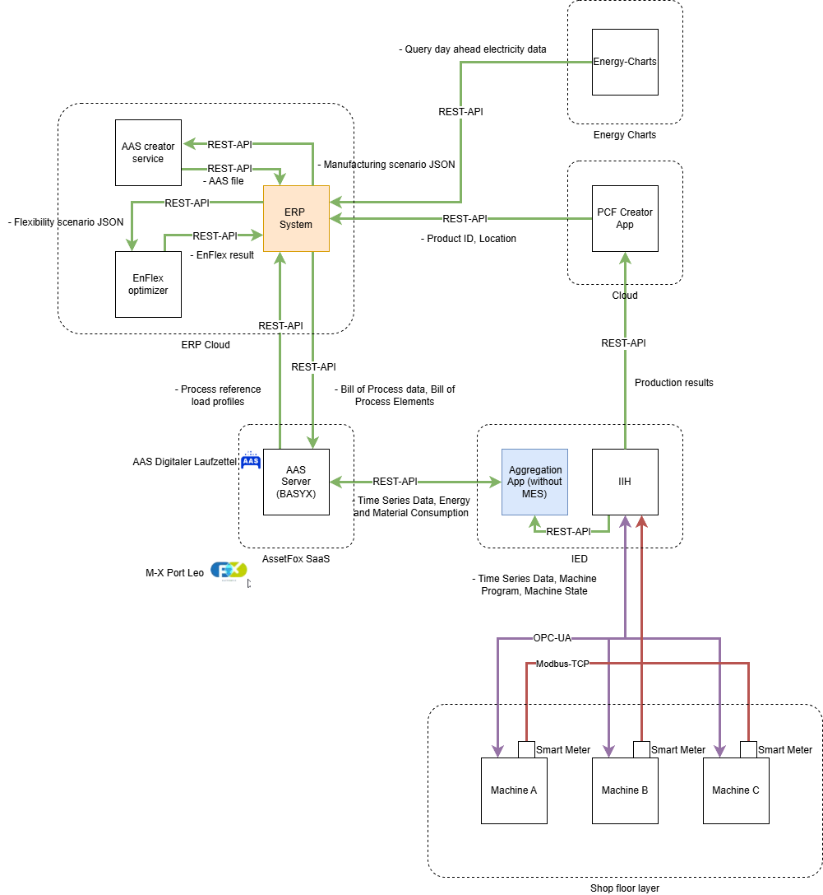

<!--
Copyright(c) 2026 Contributors to the Eclipse Foundation

See the NOTICE file(s) distributed with this work for additional
information regarding copyright ownership.

This work is made available under the terms of the
Creative Commons Attribution 4.0 International (CC-BY-4.0) license,
which is available at
https://creativecommons.org/licenses/by/4.0/legalcode.

SPDX-License-Identifier: CC-BY-4.0
-->

<!-- 
KIT LOGO START - Generated automatically from the configuration done in Kit Master Data
Replace <kit-id> with the id from your kit referenced in `data/kitsData.js`.
Do not remove!
> This logo is only visible when compiled with Docusaurus (final version of the hosted KIT)
-->
import Kit3DLogo from '@site/src/components/2.0/Kit3DLogo';

<Kit3DLogo kitId='pcf-data-acquisition'/>
<!--
KIT LOGO END
-->

## PCF Data Acquisition - Using AAS

## Architecture Overview



This architecture addresses the challenge of collecting all necessary data from both shop floor systems and IT systems in order to calculate a PCF value in compliance with the Catena-X PCF Rule Book. The architecture overview also illustrates the components from TP 2.9 used to optimize electricity costs based on the given bill of process and the specified flexibility parameters. In addition, the overview includes all required external data sources needed for PCF calculation and process optimization.

### Shop Floor Layer

- Machines (A, B, C) and smart meters provide machine data as well as energy and material consumption
- Data transmission is handled via OPC-UA and Modbus-TCP to the higher-level system

### Industry Information Hub (IIH) & Aggregation App

- Run on a Siemens Edge Device and is connected to IT and IOT environment
- IIH collects machine data and status information
- The Aggregation App receives this data (without MES integration) and forwards it via REST-API

### AAS Server (AssetFox)

- Central component for managing Asset Administration Shells (AAS)
- Receives and processes time series data, energy, and material consumption
- Serves as an interface to AssetFox SaaS and M-X Port Leo

### ERP System

- Central hub of the architecture
- Exchanges data with the AAS Server (such as bills of materials and process data)
- Communicates with the EnFlex Optimizer for flexibility scenarios and with the AAS Creator Service
- Utilizes cloud components (ERP Cloud) for load profiles and process tables
- Combines production and energy data for further analysis

### AAS Creator Service

- Creates new AAS files in the defined format using the previously specified submodels for the use case

### EnFlex Optimizer

- Optimizes electricity procurement costs based on the stored Bill Of Process (BOP) and the specified process flexibility
- For this purpose, machine- and program-specific reference load profiles are required, which must be provided by the ERP system

### External Interfaces

- SiGreen Cloud: Receives production results via REST-API
- Energy-Charts: Provides current electricity price data for the following day

### Key Features

- Energy optimization through EnFlex optimizer based on electricity prices
- Real-time monitoring of machine states and production data
- Automated PCF calculation and integration with SiGreen
- Centralized data management via AAS Server
- KPI tracking for energy efficiency and production performance

### Sequnece Diagram

### Phase 1: Initial Setup & Optimization (Steps 1-5)

1. Aggregation App reads ERP data to retrieve production information
2. ERP data sends BOP to EnFlex optimizer for energy cost optimization
3. EnFlex optimizer returns the energy price-optimized BOP back to ERP
4. Aggregation App creates an AAS on the AAS Server and adds the optimized BOP plus metadata <br/>
    `Note: Complete BOM is managed in SiGreen (referenced by Component ID, e.g. UUID: 019cbd44-0e76-721a-96c6-8d7ef8118762)`

### Phase 2: Aggregate active power values of (Steps 6-11)

1. Aggregation App checks machine state via IIH
2. If machine status changes from "processing" to "finished":
   - Aggregation App queries ERP for scrapped parts (requires user input)
   - ERP adds scrapped parts data to AAS <br/>
`Note: User must manually enter the amount of scrapped parts`
   - Aggregation App retrieves time series data from IIH
   - Aggregation App adds process time series and consumption data to AAS

### Phase 3: PCF Calculation (Steps 12-16)

1. If SiGreen production process is finished:
    - PCF Creator App retrieves PCF-relevant data from AAS Server
    - PCF Creator App calculates PCF values internally <br/>
    `Note: Can calculate either own emissions or complete PCF for the entire product`
    - PCF Creator App pushes PCF data back to AAS Server
    - PCF Creator App transfers PCF data to SiGreen platform

### Phase 4: KPI Calculation & Reporting (Steps 17-21)

1. ERP initiates KPI calculation by triggering EnFlex KPI calculator
2. EnFlex KPI calculator queries BOP AAS data from AAS Server
3. AAS Server returns BOP AAS data
4. EnFlex KPI calculator processes and calculates KPIs internally
5. EnFlex KPI calculator returns EnFlex KPIs to ERP data

<br/><br/>

```Mermaid
sequenceDiagram
autonumber
  participant ERP data as ERP data
  box blue EnFlex extension
    participant EnFlex optimizer as EnFlex optimizer
    %% Not implemented in use case
    %% participant EnFlex KPI calculator as EnFlex KPI calculator
    end
  participant Aggregation App as Aggregation App
  participant IIH as IIH
  participant AAS Server as AAS Server
  participant PCF Creator App as PCF Creator App
  participant SiGreen as SiGreen

  ERP data ->> Aggregation App: read ERP data
  ERP data ->> EnFlex optimizer: Send BOP for optimization
  EnFlex optimizer ->> ERP data: Return energy price optimized BOP 
  Aggregation App ->> AAS Server: create AAS and add BOP and some meta data
    loop every minute
    Aggregation App ->> IIH: Checking machine state
    alt is status changes from processing to finished
      Aggregation App ->> ERP data: Query for Scrapped parts (User input)
      ERP data ->> AAS Server: add scrapped parts to AAS
      note over ERP data: User have to enter the amount if scrapped parts
      Aggregation App ->> IIH: get time series data
      Aggregation App ->> AAS Server: add process time series and consumption data to AAS
    end
  end
  loop every day
    alt is SiGreen Production process finished
      PCF Creator App ->> AAS Server: Get PCF relevant data from AAS
      PCF Creator App ->> PCF Creator App: Calculate PCF values
      note over PCF Creator App: Own emissions or complete PCF value for the complete product
      PCF Creator App ->> AAS Server: Push PCF data to AAS
      PCF Creator App ->> SiGreen: transfer PCF data
    end
  end
  
  %% Not implemented in use case
  %% ERP data ->> EnFlex KPI calculator: Start KPI calculation
  %% EnFlex KPI calculator ->> AAS Server: Query BOP AAS data
  %% AAS Server ->> EnFlex KPI calculator: Get BOP AAS data
  %% EnFlex KPI calculator ->> EnFlex KPI calculator: Calculate KPIs
  %% EnFlex KPI calculator ->> ERP data: Return EnFlex KPIs

```

## Application Programming Interfaces (API)

## Semantic Models / Data Model

### AAS Data Model – Description

#### Overview

The **Asset Administration Shell (AAS) Data Model** for the Factory-X Use Case "without MES" is based on two custom submod: **CommonParameter** and **Bill_of_Process (ManufacturingProcess)**.

Since no official AAS submodel templates were available at the time the concept was developed that met the specific requirements of this use case, custom submodel templates were modeled and implemented.

#### Submodels Overview

##### CommonParameter Submodel

| Category | Data Field | Description |
|----------|------------|-------------|
| **Identification** | WorkOrder | Unique work order identifier |
| **Location** | LocationName | Production location name |
| | FactoryId | Unique factory/plant ID |
| **Time Planning** | ScheduledProduction | Planned production times (start & end) |
| | TakenPlaceProduction | Actual production times (start & end) |
| **Product Information** | ProductID | Unique product ID |
| | ProductFamily | Product family/product group |
| | PCFComponentName | PCF component name |
| | PCFComponentID | PCF component ID |
| **Sustainability** | WorkOrderCarbonFootprint | Total CO₂ footprint of the work order (in kg CO₂) |

##### Bill_of_Process (ManufacturingProcess) Submodel

| Category | Data Field | Description |
|----------|------------|-------------|
| **Machine Assignment** | MachineName | Name of the assigned machine |
| | MachineProgram | Machine program/recipe used |
| | ProcessUUID | Unique process identifier |
| | ProcessOperationStatus | Current operation status of the process |
| **Order Details** | TotalAmount | Total planned quantity |
| | ProducedQuantity | Actually produced quantity |
| | ScrappedQuantity | Scrapped/rejected quantity |
| | UnitOfMeasurement | Unit of measurement (e.g., pieces, kg) |
| **Time Planning** | PlannedProductionStart | Planned process start time |
| | PlannedProductionEnd | Planned process end time |
| | ProductionStart | Actual process start time |
| | ProductionEnd | Actual process end time |
| **Resource Consumption** | EnergyConsumption | Energy consumption per type (with time series) |
| | MaterialConsumption | Material consumption per type (with time series) |
| **Sustainability** | ProcessCarbonFootprint | Process-specific CO₂ footprint (in kg CO₂) |

<!--
##### 1. **CommonParameter**
This submodel contains **general production data at the work order level**:
- **WorkOrder** (unique order identifier)
- **Location and Factory ID** (LocationName, FactoryId)
- **Planned and actual production times** (ScheduledProduction, TakenPlaceProduction)
- **Product and PCF information** (ProductID, ProductFamily, PCFComponentName)
- **CO₂ footprint of the entire work order** (WorkOrderCarbonFootprint)

##### 2. **BillofProcess (ManufacturingProcess)**
This submodel represents the **detailed manufacturing processes**:
- **Machine assignment** (MachineName, MachineProgram, ProcessUUID)
- **Order details** (TotalAmount, ProducedQuantity, ScrappedQuantity)
- **Time scheduling per process** (PlannedProductionStart/End, ProductionStart/End)
- **Energy and material consumption** (EnergyConsumption, MaterialConsumption)
- **Process-specific CO₂ footprint** (ProcessCarbonFootprint)

-->
#### Documentation

**[AAS Documentation Use Case without MES](../documentation/AAS_Documentation_Use_Case_without_MES.md)**

This documentation describes:

- The complete structure of both submodels
- All attributes with data types and required fields
- ID generation logic for AAS and submodels
- Example API requests and responses
- Integration with ERP systems

## Protocols

<!-- Provide a minimal code snippet or step-by-step guide. -->

| Name | Description | Link to Documentation |
| ---- | ----------- | ----------------------|
| `REST-API` | This protocol is the main communication method between cloud services and enterprise systems. It enables data exchange between ERP System, AAS Server, Energy-Charts, SiGreen, and other components for transferring manufacturing scenarios, flexibility scenarios, product IDs, production results, and energy data. | - |
| `AAS (Asset Administration Shell)` | This is a standardized digital representation format for assets in Industry 4.0. The AAS Server stores and manages digital twins containing BOP data, process time series, energy consumption data, PCF values, and metadata. It serves as the central data repository accessible via REST-API. | - |
| `OPC-UA` | This protocol is essential for industrial machine communication on the shop floor layer. It enables the IIH to collect time series data, machine programs, and machine states from smart meters connected to machines A, B, and C. | - |
| `Modbus-TCP` | This protocol is used for energy measurement data communication. It transmits energy consumption data from smart meters attached to the production machines to the IIH for monitoring and analysis. | - |

## NOTICE

This work is licensed under the [CC-BY-4.0].

- SPDX-License-Identifier: CC-BY-4.0
- SPDX-FileCopyrightText: 2026 Siemens AG
- SPDX-FileCopyrightText: 2026 Contributors to the Eclipse Foundation
- Source URL: [https://github.com/eclipse-tractusx/eclipse-tractusx.github.io](https://github.com/eclipse-tractusx/eclipse-tractusx.github.io)
