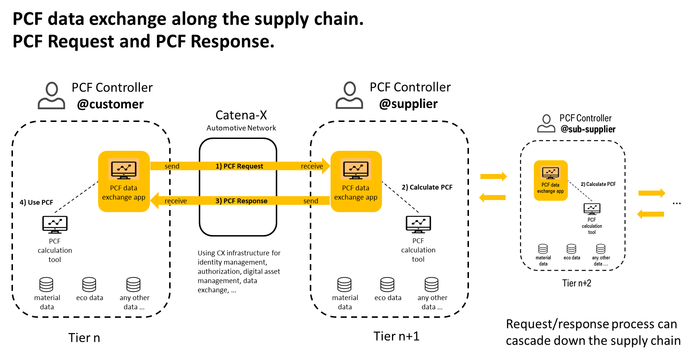
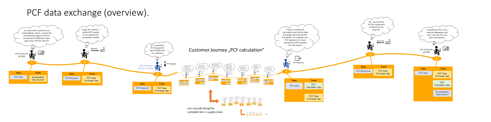
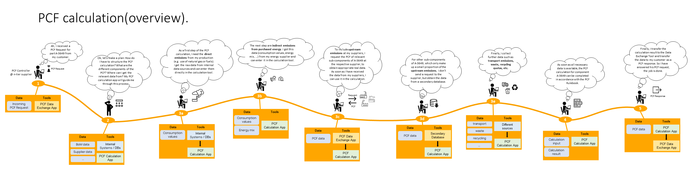
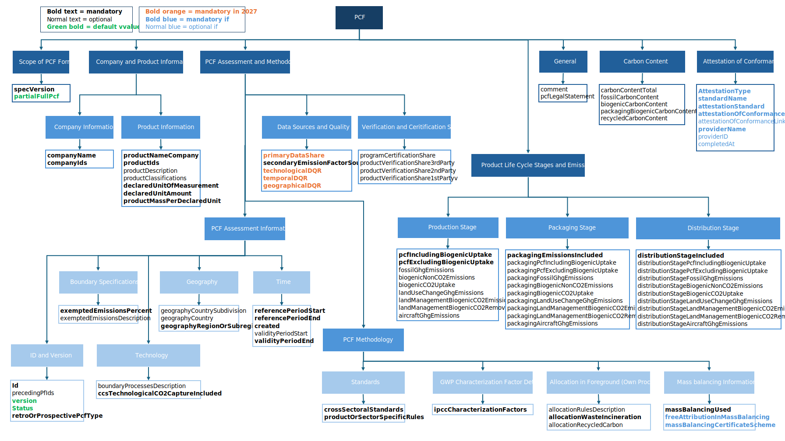

## Introduction

Sustainability has become increasingly important in the automotive industry in recent years. In particular, the topic of CO2 emissions is the focus of interest, and the product-specific CO2 footprint (PCF: product carbon footprint) has developed into a key indicator for sustainable product design and supply chains. Accordingly, there is a need to determine this data as precisely as possible across the automotive supply chain and to exchange it among partners in the network. This requires appropriate standards for calculation and exchange of data.

In this context, Catena-X offers a decentralized ecosystem supported by standards and principles like data sovereignty, which can effectively implement such a PCF data exchange. The PCF KIT will be the key enabler for various stakeholders to calculate and exchange PCF data in a standardized format. The objective of the PCF KIT is therefore to:

- Provide a comprehensive overview about the methods and tools for a PCF data exchange in the Catena-X dataspace.
- Offer various standards and guidelines for industry stakeholders.
- Provide a detailed description of the essential components required.

## Vision & Mission

### Vision

Report and steer the de-carbonization of our value chain with dedicated measures based on real PCF values, without compromising upstream data sovereignty.

### Mission

Addressing supply chain carbon emissions today is missing reliable data about baseline emissions, effect of reductions and best practices. This is due to three reasons:

- Complexity of supply chains leading to huge amount of data: complex supply chains spanning different countries and actors from many industries lead to huge amounts of data.

- Lack of trust: unwillingness to share data due to the risk of losing competitive advantage (data is shared with competitors).

- Missing standards for measuring carbon emissions in a comparable way.

At the core of our project is the recognition of a current challenge - the lack of transparency and accessibility to real PCF information in supply chains. Through our project, we strive to bridge this information gap by establishing a trusted and collaborative and interoperable environment. Suppliers will have the opportunity to share their PCF data with confidence, knowing that it remains sovereign and under their control.

We will address this by working on a trustworthy ecosystem that prioritizes data sovereignty, security and collaboration on standards. Therefore, our mission is to revolutionize the supply chain industry by providing a platform where suppliers can securely share their primary PCF data throughout the supply chain.

We are guided by the following principles:

- **Building trust** by making clear rules for data exchange and by pre-agreed data contracts between partners in the value chain.
- Building trust through **data sovereignty and data security**. We will build an ecosystem to share minimal data on a need-to-know basis, incorporating 3rd party verification by trusted partners. Decentralized architectures ensure that data remains within companies and is only shared with authorized persons as needed.
- **Governance** on the principles of mutual collaboration in the automotive industry and across with all relevant actors of the value chain on the principle of equality between partners, involving relevant outside stakeholders and the scientific community.
- **Flexibility and interoperability** by building an ecosystem of interoperable apps based on open standards. Collaborative standards for collecting, calculating and sharing emission and product data make these processes more efficient and comparable.
- **Scalability** and manageability of large amounts of data. Decentralized data ecosystems can handle and scale large amounts of data, as decentralized structures are created as required by participating companies.

## Business Process

### Premises and assumptions

We assume that the calculation and exchange of PCF data is “new territory” for many companies. In large or larger enterprises (e.g., OEM or Tier-1 suppliers) the topic of sustainability with its various facets has been on the agenda for several years now. Appropriate structures and organizations were set up there. In this respect, it can be assumed that they have the expertise and resources for a PCF calculation. Corresponding, self-developed IT tools can also be found there. We cannot expect this for small and medium-sized enterprises (SMEs). In particular small companies often lack the knowledge and resources to calculate a PCF.

These premises are therefore relevant for the following customer journeys:

- A PCF calculation requires expert or at least in-depth knowledge.
- A PCF calculation is currently mostly created manually; automation is not common or possible in most cases.
- Automation is also not yet feasible because verifying PCF data will be implemented in a later release based on [Data Trust & Security KIT](https://eclipse-tractusx.github.io/docs-kits/next/category/data-trust--security-kit).
- Due to the (manual) effort, PCF calculation and data exchange will initially only be carried out for selected products.

Accordingly, the presented customer journeys are characterized by manual process steps. However, as the topic becomes more widely known in the automotive supply chain (especially among SMEs), greater automation should be sought. This is the only way to represent a larger (ideally the entire) range of products.

### Overview

The scope of our business process is the calculation and the exchange of PCF data across the supply chain for parts/components that are already in series production (→ "after start of production (SOP)"). One can therefore assume that a real supply chain already exists for this part/component.

To describe the process, we defined two customer journeys:

1. The customer journey “PCF data exchange” describes an asynchronous communication process: a customer requests the PCF from their supplier for a component (“PCF Request”), and the supplier provides the requested data (“PCF Response”).
2. If necessary, the requested PCF data must first be determined; this leads to the second customer journey “PCF calculation”.

The exchange-process is initiated top-down (e.g., at the OEM; but it can also start at any level of the supply chain), starting with a request of a customer to the supplier. It could then be continued step by step throughout the entire tier-n supply chain. Ideally, the entire supply chain (or actually: the entire supply tree) would be covered via this cascading request/response process. The result would be a PCF that is 100% based on requested and reported data.

As stated in the Development View the Standard will be extended with synchronous data exchange and AAS-Submodel 3.0. Therefore, the business logic will be enhanced to also make proactive PCF data offers in addition to asynchronous PCF requests. We recommend all solution and data providers to adapt, test and certify their solution accordingly to enable a smooth transition.
The second change to the standard will add customerPartId as an optional field in the PCF request thus enabling creation of a PCF requests with the customerPartId instead of manufacturerPartId.

[To the Industry Core KIT](https://eclipse-tractusx.github.io/docs-kits/kits/industry-core-kit/adoption-view#todays-challenge)



In the real world, this will not be implemented this way, at least in the short and medium term. It can be assumed that this process and information chain will break down at certain points in the supply chain. There, data is not requested, but calculated using secondary data, as is standard procedure these days. There can be various reasons for this:

- The affected part of the supply chain is only of minor relevance to the PCF; the effort required to determine the real data would therefore not be worthwhile.
- The supplier cannot or does not want to provide corresponding data.

However, it is important that a PCF value reported from a supplier to its customer always represents the entire supply chain behind it. Therefore, the following data is recorded in a PCF calculation and aggregated to form the resulting PCF:

- direct emissions that are generated in the supplier's own production system ("Scope 1")
- indirect emissions from purchased energy ("Scope 2")
- upstream emissions caused by purchased products from the upstream supply chain ("Scope 3")


The data for direct and indirect emissions will usually come from internal data sources, as these emission-shares are generated in the supplier's own production system. The upstream emissions ("Scope 3") can either be requested from the respective sub-supplier or could be calculated, e.g. by using information from eco-databases. Putting all together, the transparency on the PCF for a given part or component is created through a cascade of top-to-bottom PCF requests, and a cascade of aggregated PCF data from bottom to top.

### Customer Journey "PCF Data Exchange"

This customer journey describes the exchange of PCF data in an asynchronous request/response process.



PCF data is exchanged between a data consumer (e.g., supplier on tier n) and a data provider (e.g., supplier on tier n+1). It is basically an asynchronous request/response process that is started by the data consumer:

- The data consumer realizes that he needs the PCF for a specific component and that this data is not available in his local data (or is not of sufficient quality).
- With his PCF data exchange tool, the data consumer checks whether the required PCF data is available via Catena-X (from a technical perspective, this means that there is already a digital twin for the component and that the PCF submodel is available for this twin). If so, the tool would “fetch up” this data. If not, the user can request this data from the supplier as described in the next steps.
- The data consumer submits a “PCF request” (according to the standardized API [CX-0136](https://catenax-ev.github.io/docs/next/standards/CX-0136-UseCasePCF)) to his supplier. In doing so, he asks the supplier to provide PCF data for the specific component, which was determined in accordance with the requirements of the [Catena-X PCF Rulebook](https://catenax-ev.github.io/docs/non-functional/overview#product-carbon-footprint).

With this request, the process temporarily ends for the data consumer. The ball is now in the data provider's playing field:

- The data provider receives the PCF request (message/display in his PCF data exchange tool).
- The data provider checks whether the requested data is already available (i.e., whether the PCF has already calculated in the past but has not yet been provided to the customer yet).
- If the data is not yet available, the data provider must create it first. At this point, he starts the “PCF Calculation” subjourney (see [below](#customer-journey-pcf-calculation)). At the end of this subjourney, the PCF data is available, and the provider can answer the original request with the next steps.
- The data provider sends a PCF response (according to the standardized API see [CX-0136](https://catenax-ev.github.io/docs/next/standards/CX-0136-UseCasePCF)) to the data consumer. At the same time, the data is made available in Catena-X (which means from a technical perspective, that a PCF submodel is attached to the corresponding digital twin of the component).

For the data provider, the process is now over, and the consumer's request has been answered with the response. On the consumer side, a few more steps follow:

- The data consumer, who sent the initial PCF request, receives the PCF response (message/display in his PCF data exchange tool).
- With the data exchange tool, the consumer can access and “pick up” the PCF data, according to the standardized PCF data model (see [Semantic Model](#semantic-models)).

>**Remark:**
>There are currently no options for acceptance/rejection of transmitted data at this stage in the process. This topic still needs to be discussed on Catena-X association level and are therefore not yet covered in the processes and tools. This might happen with later releases.

- The data consumer can now transfer this data to his internal systems/databases (e.g., a PCF calculation tool), and use it for the internal business processes (e.g., PCF calculation or reporting).
This ends this customer journey.

### Customer Journey “PCF Calculation”

This customer journey describes the calculation of a PCF in compliance with the [Catena-X PCF Rulebook](https://catenax-ev.github.io/docs/non-functional/overview#product-carbon-footprint) with some of the required data obtained via the Catena-X network.



The calculation process will often be triggered by an incoming PCF request (see subjourney "[PCF data exchange](#customer-journey-pcf-data-exchange)"). But of course, a PCF calculation can also be carried out proactively without a corresponding request via PCF Request.
To determine a PCF, an appropriate calculation tool is usually used, which guides the user through the process and ensures that all relevant data is taken into account. We will limit ourselves here to a generic, tool-independent presentation of the most important steps.

1. Make a plan: What are the different components of the PCF? Where can I get the relevant data from?
→ This structuring should be supported by an appropriate process in the calculation tool.
2. Put the direct emissions from the production site (e.g., use of natural gas or fuels) into the calculation.
→ Get the raw data from internal data sources and enter them in the calculation tool.
3. Put the indirect emissions from purchased energy into the calculation.
→ Get the raw data (consumption values, energy mix, …) from internal data sources and from the energy supplier, and enter it in the calculation tool.
4. Upstream emissions:
   - For sub-components with a (expected) relevant share on the PCF, the aim is to use real data (or primary data) for the calculation. Therefore, a PCF request is sent to the suppliers of these sub-components, to obtain appropriate real data (see subjourney ["PCF data exchange"](#customer-journey-pcf-data-exchange)). As soon as the data is available (via PCF Response), it can be used as input for the calculation.
   - For other sub-components, which only make up a small proportion of the upstream emissions, there will be no request of data to the supplier. Instead, the data will be obtained from a database for secondary data.
5. If necessary, put other emissions and further data into the calculation (e.g., transport emissions, waste, recycling quotas, ...).
6. Put it all together and get the overall PCF.
7. Transfer PCF to the exchange tool (or in general: make the PCF data available following the Catena-X Standard [CX-0007-MinimalDataProviderServicesOffering](https://catenax-ev.github.io/docs/standards/CX-0007-MinimalDataProviderServicesOffering)).

### PCF Personas

<details>
  <summary>Roles included in PCF calculation and exchange process</summary>

| Persona                            | Role and Task (in larger companies)                                                                                                                                                                                                                                                                                                                                                                                                                                                                                                                                                                                                                                                                                                                                                                                                                                                                                                                                                             | Specifics for SME                                                                                                                                                                                                                                                                                                                                                                                                                                                                                                                                                                                                                                                                                                                                                                                                                     | Challenges                                                                                                                                                                                                                                                                                                                                                                                                                                                                                                                                                                                        | Catena-X Contribution                                                                                                                                                                                                                                                                                                                                  |
|------------------------------------|-------------------------------------------------------------------------------------------------------------------------------------------------------------------------------------------------------------------------------------------------------------------------------------------------------------------------------------------------------------------------------------------------------------------------------------------------------------------------------------------------------------------------------------------------------------------------------------------------------------------------------------------------------------------------------------------------------------------------------------------------------------------------------------------------------------------------------------------------------------------------------------------------------------------------------------------------------------------------------------------------|---------------------------------------------------------------------------------------------------------------------------------------------------------------------------------------------------------------------------------------------------------------------------------------------------------------------------------------------------------------------------------------------------------------------------------------------------------------------------------------------------------------------------------------------------------------------------------------------------------------------------------------------------------------------------------------------------------------------------------------------------------------------------------------------------------------------------------------|---------------------------------------------------------------------------------------------------------------------------------------------------------------------------------------------------------------------------------------------------------------------------------------------------------------------------------------------------------------------------------------------------------------------------------------------------------------------------------------------------------------------------------------------------------------------------------------------------|--------------------------------------------------------------------------------------------------------------------------------------------------------------------------------------------------------------------------------------------------------------------------------------------------------------------------------------------------------|
| Purchaser                          | In general, the purchaser will not be a sustainability expert!<br /> For him, sustainability is just an additional dimension (as cost, quality, ...).<br/><br/>- He requests sustainability data for purchased (sub)products from his suppliers.<br/>- In the sourcing process he evaluates the incoming offers (which will include more and more sustainability data).<br/>- He negotiates PCF targets with his suppliers.<br/>- He checks compliance with agreements and targets and evaluates the supplier's performance.<br/>- He will be often the one, who detects incidents (e.g., non-fulfillment of targets, missing certificates, ...).<br/><br/>Different responsibilities and views possible:<br/><br/>- A part/component/material-oriented view <br/>- A supplier/commodity-oriented view<br/><br/>                                                                                                                                                                                | <br/> We assume, that a SME will have a weaker negotiating position and assertiveness (as a large company), so it may be more difficult to …<br/><br/>- request PCF data from (sub)suppliers.<br/>- forward customers' CO2 targets to (sub)suppliers.<br/>- negotiate own objectives/targets.<br/><br/>                                                                                                                                                                                                                                                                                                                                                                                                                                                                                                                               | <br/>He requires sustainability data of parts/materials (e.g., PCF) for various purposes.<br/>He requires standardized data.<br/>He also requires product-unspecific sustainability data of suppliers (e.g., production site-specific certificates).<br/>                He needs data in different phases (e.g., product development, procurement, industrialization, series production).<br/>                                                                                                                                                                                                   | <br/>Catena-X defines standards for sustainability data.<br/>Catena-X provides up-to-date and reliable sustainability data<br/><br/>- of parts / materials<br/>- of suppliers<br/><br/>Catena-X provides phase-specific data.<br/>Catena-X provides (standard) reports.<br/>Catena-X provides apps and services for data exchange.<br/>                |
| PCF Calculator                     | <br/>He is an expert for PCF calculation. He could be described as a “PCF Engineer,” analogous to the role of a “Cost Engineer” established in many companies.<br/><br/>- He has in-depth knowledge of PCF-, CCF- and LCA-methods.<br/>- He is responsible for the calculation of the own scope 1 and 2 values of a PCF<br/>- From this data and with the scope 3 data reported by suppliers (or obtained from databases), he calculates the PCF of his own products.<br/>- He hands the result over to the PCF Controller<br/>- He is a consultant in "costs vs. PCF" discussions (with internal, but also with external partners)<br/>- He analyzes customer incident requests (on behalf of the PCF controller).<br/>- If there are any discrepancies in reported PCF data, he initiates incident requests at the respective supplier (via the PCF controller).<br/><br/>                                                                                                                    | <br/>We assume, that at a SME there will be often a combined role: (Sustainability) Manager Product<br/><br/>- He is no sustainability expert! So, he must draw on external expertise if necessary<br/>- He must handle internal and external topics<br/><br/>Customer view:<br/><br/>- He is a key account for sustainability data (PCF and ESS) and an “interface” in both directions: customers and suppliers.<br/>- He releases sustainability data (esp. PCF) to customers<br/>- He receives PCF data from suppliers.<br/>- He is the addressee for (PCF) incidents<br/><br/>Internal View:<br/><br/>- He knows the product BoM (Bill of Material)<br/>- He steers “PCF vs. cost" objectives at product levels.<br/>- He collaborates with external auditors.<br/>- He analyzes incoming incident request of customers<br/><br/> | Requires standardized PCF calculation method.<br/>Needs scope 3 values from suppliers, to calculate own PCF with this data.<br/>May need a calculation tool for scope 1 and 2 values.<br/>Requires access to eco-data (secondary data).<br/>Needs BoM data for calculation and analysis.<br/>                                                                                                                                                                                                                                                                                                     | <br/>Catena-X defines standards for PCF calculation.<br/>Catena-X provides up-to-date and reliable sustainability data of parts/materials.<br/>Catena-X provides apps and services for data exchange.<br/>Catena-X provides calculation tools.<br/>Catena-X provides access to eco-data(bases) for secondary data.<br/>                                |
| PCF Controller (product)           | <br/>He has an operational role (as opposed to the Sustainability Manager). As a PCF expert who works with many internal and external partners.<br/>He is the first point of contact for the purchaser on PCF topics.<br/>External/customer view:<br/><br/>- He is a key account for PCF data and, in this regard, the central interface to customers/suppliers.<br/>- He releases calculated PCF data to customers.<br/>- He receives PCF data from the suppliers.<br/>- He triggers incident management.<br/>- He initiates collaborative PCF optimization.<br/><br/>Internal View:<br/><br/>He is the PCF data owner in the company.<br/>- He acts as a PCF data collector.<br/>- He receives PCF targets from the Sustainability Manager, evaluates them, and is consulted as a CO2 expert in negotiations.<br/>- He tracks PCF targets for purchased parts, and detects incidents in terms of non-fulfillment of targets.<br/>- He makes supplier performance reviews about PCF.<br/><br/> | <br/>                                                                                                                                                                                                                                                                                                                                                                                                                                                                                                                                                                                                                                                                                                                                                                                                                                 | <br/>He requires up-to-date and reliable PCF data of parts/materials.<br/>He needs data in different phases of the product lifecycle (e.g., in product development, sourcing, industrialization, series production).<br/>He requires standardized data.<br/>He needs a tool to exchange PCF data with internal and external partners.<br/>He needs reports for tracking and monitoring of PCF data and targets.<br/>                                                                                                                                                                              | <br/>Catena-X defines standards for PCF data.<br/>Catena-X provides apps and services for PCF data exchange.<br/>Catena-X provides up-to-date and reliable PCF data of parts / materials.<br/>Catena-X provides phase-specific data.<br/>                                                                                                              |
| Sustainability Manager (product)   | <br/>His role is more strategic than operational.<br/>He is responsible for the coordination and steering of PCF and cost objectives at product level.<br/>He ensures the consistency of product objectives with corporate objectives.<br/>He defines PCF targets for products and breaks them down on part/component/material level.<br/>He receives sustainability targets from customers.<br/>He takes care of how sustainability targets (especially PCF) can be implemented and achieved.<br/>He performs analyses in the context of sustainability.<br/>He collaborates with external auditors.<br/>                                                                                                                                                                                                                                                                                                                                                                                      | <br/>                                                                                                                                                                                                                                                                                                                                                                                                                                                                                                                                                                                                                                                                                                                                                                                                                                 | <br/>He collaborates with external auditors.<br/>He requires standardized data.<br/>He needs data in different phases of the product lifecycle (e.g., in product development, sourcing, industrialization, series production).<br/>He needs reports for tracking and monitoring of sustainability data.<br/>He needs a tool to exchange sustainability data with internal and external partners.<br/>He needs tools for:<br/><br/>PCF target breakdown.<br/>PCF optimization (e.g., “what if analysis”).<br/>Controlling of competing targets (sustainability vs. costs vs. quality …).<br/><br/> | <br/>Catena-X defines standards for sustainability data (esp. PCF).<br/>Catena-X provides apps and services for data exchange.<br/>Catena-X provides up-to-date and reliable sustainability data of parts / materials.<br/>Catena-X provides phase-specific data.<br/>Catena-X provides (standard) reports.<br/>Catena-X provides analysis tools.<br/> |
| Sustainability Manager (corporate) | <br/>He has no active role in Catena-X (e.g.: getting reports is a passive, not an active role in this sense).<br/>He sets corporate goals and breaks them down for different sectors and functions in the company.<br/>He gets input from the Sustainability Manager (product).<br/>                                                                                                                                                                                                                                                                                                                                                                                                                                                                                                                                                                                                                                                                                                           | <br/>The role exists in principle; it is rather the question of who will take it over (e.g., personal union with management, or possibly Sustainability Manager).<br/>Thesis: an SME does CCF rather than PCF.<br/>                                                                                                                                                                                                                                                                                                                                                                                                                                                                                                                                                                                                                   | <br/>He requires (aggregated) sustainability data.<br/>He requires “high level” (standard) reports.<br/>                                                                                                                                                                                                                                                                                                                                                                                                                                                                                          | Catena-X provides up-to-date and reliable sustainability data.                                                                                                                                                                                                                                                                                         |
| Salespeople                        | <br/>He is the central interface to the customer.<br/>He is the owner of the customer quotation process.<br/>He negotiates PCF targets with customers (→purchaser).<br/>He presents sustainability data (esp. PCF) to customers.<br/>He is accountable for incident management with customers.<br/>                                                                                                                                                                                                                                                                                                                                                                                                                                                                                                                                                                                                                                                                                             | <br/>                                                                                                                                                                                                                                                                                                                                                                                                                                                                                                                                                                                                                                                                                                                                                                                                                                 | <br/>He needs sustainability data (e.g., PCF) of own products (or parts/materials)<br/>He requires tools for information or data exchange (with both internal partners and external customers).<br/>                                                                                                                                                                                                                                                                                                                                                                                              | <br/>Catena-X provides sustainability data of own products.<br/>Catena-X provides apps and services for data exchange.<br/>                                                                                                                                                                                                                            |
| Auditor (external)                 | <br/>He does a yearly audit of conformity with Catena-X methodology.<br/>At the beginning (before go-live) there is a one-time audit of the use of the Catena-X network and methods in the company to be audited.<br/>The onboarding of suppliers requires a self-declaration of applying Catena-X methodology.<br/>The auditor has a clearing role in case of escalated incidents.<br/>                                                                                                                                                                                                                                                                                                                                                                                                                                                                                                                                                                                                        | He needs additional information and data to be able to verify the reported PCF data.                                                                                                                                                                                                                                                                                                                                                                                                                                                                                                                                                                                                                                                                                                                                                  | <br/>Catena-X provides up-to-date and verifiable sustainability data.<br/>Catena-X provides access to metadata that allows the reported PCF data to be verified.<br/>                                                                                                                                                                                                                                                                                                                                                                                                                             |                                                                                                                                                                                                                                                                                                                                                        |

</details>

## Semantic Models

Depending on the use case and related KIT, Catena-X provides different semantic models that help to structure and make use of data via semantic information. These models help to provide a basic meaning to the data and their relationship, thereby enabling interoperability between data sets. Catena-X data models rely on principles as understandability, standardization, accuracy, differentiation, audibility, comprehensiveness, and provision of insights to drive improvement actions.

### PCF

#### Introduction PCF Data Model

In an era defined by growing environmental consciousness and sustainability imperatives, the concept of measuring and reducing carbon footprints has become paramount across industries. A pivotal key in this pursuit is an aligned and standardized PCF data model. This data model not only facilitates the systematic calculation and comparison of carbon footprints but also offers a structured approach to managing environmental impact data.

As the global community grapples with the impacts of climate change, consumers, businesses, and governments are seeking actionable ways to mitigate their carbon emissions. The need for a consistent and universally accepted method of quantifying these emissions from diverse products has given rise to the significance of a standardized PCF data model. This model acts as a lingua franca, enabling stakeholders to communicate and analyze carbon footprint information transparently and comprehensively.

For this KIT only the PCF data model is used. The PCF data model follows the [CX-0136](https://catenax-ev.github.io/docs/next/standards/CX-0136-UseCasePCF) Use Case PCF standard and is implemented in compliance with the [CX-0003](https://catenax-ev.github.io/docs/next/standards/CX-0003-SAMMSemanticAspectMetaModel) SAMM Aspect Meta Model standard.

#### Data Model Overview

The Catena-X PCF data model has been developed in accordance with the "Technical Specifications for PCF Data Exchange" from the WBCSD (World Business Council for Sustainable Development)/ PACT initiative. The basis for the specification of the Catena-X PCF data model is the [PCF Rulebook](https://catenax-ev.github.io/docs/non-functional/overview#product-carbon-footprint).

The following illustration describes the logical structure of the Catena-X PCF data model:

<details>
  <summary>PCF Data Model structure</summary>



</details>

The table below shows the details of each data field in the Catena-X PCF data model:

<details>
  <summary>PCF Data Model details</summary>

M - Mandatory, D - Defaultet, O - Optional, Mif - Mandatory under conditions, Oif - Optional under conditions

| Nr  | Label                                                                                       | Technical field names                               | M/O/..If | Condition                                                          | Type                                                         | Functional description                                                                                                                                                                                                                                                                                                                                                                                                                                                                                                                                                                                                                                                                   | Default / Examples                                                                                                                                                                                                                                                    |
|-----|---------------------------------------------------------------------------------------------|-----------------------------------------------------|----------|--------------------------------------------------------------------|--------------------------------------------------------------|------------------------------------------------------------------------------------------------------------------------------------------------------------------------------------------------------------------------------------------------------------------------------------------------------------------------------------------------------------------------------------------------------------------------------------------------------------------------------------------------------------------------------------------------------------------------------------------------------------------------------------------------------------------------------------------|-----------------------------------------------------------------------------------------------------------------------------------------------------------------------------------------------------------------------------------------------------------------------|
| 1   | **(Scope of PCF Form)**                                                                     |                                                     |          |                                                                    |                                                              |                                                                                                                                                                                                                                                                                                                                                                                                                                                                                                                                                                                                                                                                                          |                                                                                                                                                                                                                                                                       |
| 2   | Data model and version                                                                      | specVersion                                         | M        |                                                                    | string array (According URN:name and version of data model)  | Specification of the PCF format/data model (name and version number), which is used. The required data input fields will be tailored accordingly. Multiple entries are possible. The data model and version can be selected independently of the standard or guidance document, you followed during the assessment of the PCF. Always select latest data model, if your data supports it.                                                                                                                                                                                                                                                                                                | urn:io.catenax.pcf:datamodel:version:8.0.0                                                                                                                                                                                                                            |
| 3   | Partial or a full PCF declaration                                                           | partialFullPcf                                      | D        |                                                                    | string (value list)                                          | This attribute is an indicator for partial or full PCF (Product Carbon Footprint) declaration.<br/>A partial PCF (cradle-to-gate) is covering the emissions from resource extraction until the product leaves the gate of your organization (optionally including the distribution stage).<br/>This is defaulted for PACT, Catena-X or TFS. A full PCF (cradle-to-grave) is covering the complete life cycle of the product from resource extraction all the way to end-of-life stage.                                                                                                                                                                                                   | cradle-to-gate                                                                                                                                                                                                                                                        |
| 4   | **(Company and Product Information)**                                                       |                                                     |          |                                                                    |                                                              |                                                                                                                                                                                                                                                                                                                                                                                                                                                                                                                                                                                                                                                                                          |                                                                                                                                                                                                                                                                       |
| 5   | ***(Company Information)***                                                                 |                                                     |          |                                                                    |                                                              |                                                                                                                                                                                                                                                                                                                                                                                                                                                                                                                                                                                                                                                                                          |                                                                                                                                                                                                                                                                       |
| 6   | Company name                                                                                | companyName                                         | M        |                                                                    | string (free text)                                           | State the (legal) name of the company supplying the product and reporting the PCF (data owner). The name under which the company signed up with Catena-X (via Business Partner Management service).                                                                                                                                                                                                                                                                                                                                                                                                                                                                                      | My Corp                                                                                                                                                                                                                                                               |
| 7   | Company Ids                                                                                 | companyIds                                          | M        |                                                                    | string array (According URN: as defined by TfS and WBCSD)    | Company identifier according to the sharing scheme you are reporting in. It is mandatory to provide the BPNL (Business Partner Number Legal; corresponding to the company name) according to Catena-X. Each value of this set is supposed to uniquely identify the PCF Data Owner and should be in the following format: E.g. urn:BPNL000000000DWF. Additionally it is recommended to enter the name of the main domain (e.g. company.com) as a second value.                                                                                                                                                                                                                            | urn:BPNL000000000DWF, urn:fpi: ww.myCompany.com: org-id:401765^{1} , urn:fpi: ww.myCompany.com: suborg-id:401765-DE, urn:fpi: ww.BusinessPartner-Company.com:org-id:ABCD1234, urn:fpi:duns.dnb.com:duns-number:12-345-6789, urn:fpi: ww.bzst.de:VAT-number:DE99999999 |
| 8   | ***(Product Information)***                                                                 |                                                     |          |                                                                    |                                                              |                                                                                                                                                                                                                                                                                                                                                                                                                                                                                                                                                                                                                                                                                          |                                                                                                                                                                                                                                                                       |
| 9   | Product name                                                                                | productNameCompany                                  | M        |                                                                    | string (free text)                                           | Trade name of the product to make it recognizable by the receiver of the PCF information. For prospective PCFs, this may be a preliminary name.                                                                                                                                                                                                                                                                                                                                                                                                                                                                                                                                          | EthanolX                                                                                                                                                                                                                                                              |
| 10  | Product identifiers                                                                         | productIds                                          | M        |                                                                    | string array (According URN:as defined by TfS and WBCSD)     | A set of several relevant product identifiers can be provided including e.g. manufacturerPartID, customerPartID, GTIN, ISPN-number or any product specific identifier. For prospective PCFs, this may be a preliminary product id.                                                                                                                                                                                                                                                                                                                                                                                                                                                       | urn:mycompany.com: product-id:401765, urn:mysupplier.com: SupplierComponent-id:ABCD1234, urn:registry.cas.org:cas-number:71-43-2                                                                                                                                      |
| 11  | Product description                                                                         | productDescription                                  | O        |                                                                    | string (free text)                                           | A brief description of the product (for example functions and technical parameters) to help identifying the correct product. Product IDs are not always unique accross organizations or at times insufficient to identify the correct product. This information can provide additional context to secure a correct match between the purches product and its PCF declaration.                                                                                                                                                                                                                                                                                                            | Ethanol, 95% solution                                                                                                                                                                                                                                                 |
| 12  | Product classification                                                                      | productClassifications                              | O        |                                                                    | array: urn (string)                                          | A list of classification or category identifiers in URN format. Use well known urn's here, or adhere to recommended urn:pact: format. For example UN CPC, CAS Number, CN-Code etc. <br/>For communication us URN fromat (e.g. urn:gtin:4712345060507)                                                                                                                                                                                                                                                                                                                                                                                                                                    | urn:gtin:4712345060507                                                                                                                                                                                                                                                |
| 13  | Declared unit                                                                               | declaredUnitOfMeasurement                           | M        |                                                                    | string (value list; Unit ISOCODE + "piece")                  | "The declared unit serves as reference to which the inputs and outputs in the PCF calculation are related (e.g. kg of product, piece of component, MJ electrical energy).  In Catena-X, possible values are: piece; kg (see Catena-X PCF Rulebook v4, chapter 4.4). The PCF is declared per declared unit amount of the product.<br/>Example BEV (same product as Example1):<br/>-Declared unit amount: 1<br/>Declared unit: Piece<br/>Total PCF including bio uptake: 15000kg CO2e<br/><br/>Example BEV (same product as Example2):<br/>Declared unit amount: 2300<br/>Declared unit: kilogram<br/>Total PCF including bio uptake: 15000kg CO2e<br/>"                                   | piece                                                                                                                                                                                                                                                                 |
| 14  | Quantity (of declared unit)                                                                 | declaredUnitAmount                                  | M        |                                                                    | decimal                                                      | The quantity (amount) of the declared unit as numerical value. The PCF refers to this declared unit amount, not to one unit by default.<br/><br/>The PCF is declared per declared unit amount of the product:<br/>Example BEV (same product as Example2):<br/>Declare unit amount: 1<br/>Declared unit: Piece<br/>Total PCF including bio uptake: 15000kg CO2e<br/><br/>Example BEV (same product as Example1):<br/>Declare unit amount: 2300<br/>Declared unit: kg<br/>Total PCF including bio uptake: 15000kg CO2e                                                                                                                                                                     | 1                                                                                                                                                                                                                                                                     |
| 15  | Product mass [kg] per declared unit amount                                                  | productMassPerDeclaredUnit                          | M        |                                                                    | decimal                                                      | The mass of the product per declared unit amount in kilogram, (e.g., the declared unit of a circuitboard is one piece; one piece represents 0.123 kg). Product mass excluding packaging.                                                                                                                                                                                                                                                                                                                                                                                                                                                                                                 | 0.123 kg                                                                                                                                                                                                                                                              |
| 16  | **(PCF Assessment and Methodology)**                                                        |                                                     |          |                                                                    |                                                              |                                                                                                                                                                                                                                                                                                                                                                                                                                                                                                                                                                                                                                                                                          |                                                                                                                                                                                                                                                                       |
| 17  | ***(PCF Assessment Information)***                                                          |                                                     |          |                                                                    |                                                              |                                                                                                                                                                                                                                                                                                                                                                                                                                                                                                                                                                                                                                                                                          |                                                                                                                                                                                                                                                                       |
| 18  | *(ID and Version)*                                                                          |                                                     |          |                                                                    |                                                              |                                                                                                                                                                                                                                                                                                                                                                                                                                                                                                                                                                                                                                                                                          |                                                                                                                                                                                                                                                                       |
| 19  | PCF ID                                                                                      | Id                                                  | M        |                                                                    | string (According UUID v4)                                   | This ID is used to identify a specifc PCF. Therefore it has to be a gloabally unique value, following the UUID V4 specification, and should be defined at the time of declaration of the PCF. This is usually done automatically by the calculation- or sharing tool. Example generator, in case your tool does not automatically generate the PCF ID: [https://www.uuidgenerator.net/version4](https://www.uuidgenerator.net/version4)  In case of update a new PCF ID is required.                                                                                                                                                                                                     | 3893bb5d-da16-4dc1-9185-11d97476c254                                                                                                                                                                                                                                  |
| 20  | Previous PCF IDs                                                                            | precedingPfIds                                      | O        |                                                                    | string array (According UUID v4)                             | This is a list of previously submitted product footprint identifiers in submitted order, starting with the latest submitted PCF. This chain therefore reflects the history of a PCF.                                                                                                                                                                                                                                                                                                                                                                                                                                                                                                     | 9c5b94b1-35ad-49bb-b118-8e8fc24abf8                                                                                                                                                                                                                                   |
| 21  | PCF version                                                                                 | version                                             | D        |                                                                    | value (integer; 0..2^31-1)                                   | This is only a technical parameter that ensures comparability with PACT 3.0.0, but is not used in Catena-X. For PCF data exchange via Catena-X, it must therefore be set to the default value “0".                                                                                                                                                                                                                                                                                                                                                                                                                                                                                       | 0                                                                                                                                                                                                                                                                     |
| 22  | PCF status                                                                                  | status                                              | D        |                                                                    | string (value list)                                          | This is another technical parameter that ensures comparability ("deprecated" only used in PACT; and it may also be used in internal systems), but is not used in Catena-X. Therefore it must be set to the default value “active".                                                                                                                                                                                                                                                                                                                                                                                                                                                       | Active                                                                                                                                                                                                                                                                |
| 23  | Retrospective or prospective PCF types                                                      | retroOrProspectivePcfType                           | M        |                                                                    | string (value list)                                          | Four types of PCFs (see 5.2.1) shall be indicated in the data model: This is to identify if the PCF refers to a product that is already in series (retrospective) or a PCF for a product before SOP (prospective PCF), both based on the rules defined in the CatenaX rulebook. For the type "progressive PCF", these rules do not necessarily apply anymore, as here also more ambitious assumptions can be used that might be part of a bilateral agreement between supplier and customer.                                                                                                                                                                                             | Retrospective PCF                                                                                                                                                                                                                                                     |
| 24  | *(Boundary Specifications)*                                                                 |                                                     |          |                                                                    |                                                              |                                                                                                                                                                                                                                                                                                                                                                                                                                                                                                                                                                                                                                                                                          |                                                                                                                                                                                                                                                                       |
| 25  | Cut-off rule                                                                                | exemptedEmissionsPercent                            | M        |                                                                    | decimal (Range 0-10)                                         | Applied cut-off criteria in percent of total emissions. This specifies which percentage of emissions were excluded from the PCF in total, in order to reduce efforts in data collection of irrelevant processes. E.g. the Catena-X PCF Rulebook requires that the cut-off shall not exceed 3% (97% impacts to be considered). Do determine this, supplier data are assumed as 0% cut-off.                                                                                                                                                                                                                                                                                                | 3                                                                                                                                                                                                                                                                     |
| 26  | Exemption rules: explanation                                                                | exemptedEmissionsDescription                        | O        |                                                                    | string (free text)                                           | If cut-off criteria are applied, this text field should be used to document the rationale behind the exclusion of specific PCF emissions. Potential cut-offs are defined in the Catena-X Rulebook.                                                                                                                                                                                                                                                                                                                                                                                                                                                                                       | No exemption                                                                                                                                                                                                                                                          |
| 27  | *(Technology)*                                                                              |                                                     |          |                                                                    |                                                              |                                                                                                                                                                                                                                                                                                                                                                                                                                                                                                                                                                                                                                                                                          |                                                                                                                                                                                                                                                                       |
| 28  | Important unit processes and used technologies                                              | boundaryProcessesDescription                        | O        |                                                                    | string (free text)                                           | Brief description of the significantly contributing manufacturing steps of the product (including general description of used technologies). This attribute is only included for compatibility reasons with TfS/PACT in the Catena-X data model. No filling is required as part of a data exchange via Catena-X. Instead, the general comment field "Comment" (see section 1.1) should be used as needed.                                                                                                                                                                                                                                                                                | e.g. EAF route for steel production                                                                                                                                                                                                                                   |
| 29  | CCS/BECCS applied                                                                           | ccsTechnologicalCO2CaptureIncluded                  | M        |                                                                    | boolean                                                      | Declare if CCS/BECCS (incl. geological storage) technology has been employed. BECCS stands for bioenergy with carbon capture and storage.                                                                                                                                                                                                                                                                                                                                                                                                                                                                                                                                                | False                                                                                                                                                                                                                                                                 |
| 30  | *(Geography)*                                                                               |                                                     |          |                                                                    |                                                              |                                                                                                                                                                                                                                                                                                                                                                                                                                                                                                                                                                                                                                                                                          |                                                                                                                                                                                                                                                                       |
| 31  | City/state as country subdivision                                                           | geographyCountrySubdivision                         | O        |                                                                    | string (ISO 3166-2 Subdivision Code)                         | The location of factory gate(s) refers to the last manufacturing step. It is the location where the product is produced. State the country subdivision as subdivision code according to ISO 3166-2 (example: Germany, Bavaria = DE-BY); [https://www.iso.org/](https://www.iso.org/) glossary-for-iso-3166.html                                                                                                                                                                                                                                                                                                                                                                          | DE-BY                                                                                                                                                                                                                                                                 |
| 32  | Geography country                                                                           | geographyCountry                                    | O        |                                                                    | string (ISO 3166-2 alpha-2 country code)                     | The location of factory gate(s) refers to the last manufacturing step. It is the location where the product is produced. State the country as country code according to ISO 3166-1 alpha-2 (example: US:=United States, FR:=-France); [https://www.iso.org/glossa-ry-for-iso-3166.html](https://www.iso.org/glossa-ry-for-iso-3166.html)                                                                                                                                                                                                                                                                                                                                                 | DE                                                                                                                                                                                                                                                                    |
| 33  | Geography with region or subregion                                                          | geographyRegionOrSubregion                          | M        |                                                                    | string (value list)                                          | Region of the supplier production site according to ISO 3166 (Example: “Global”, “Europe”, “Eastern Europe”)                                                                                                                                                                                                                                                                                                                                                                                                                                                                                                                                                                             | Europe                                                                                                                                                                                                                                                                |
| 34  | *(Time)*                                                                                    |                                                     |          |                                                                    |                                                              |                                                                                                                                                                                                                                                                                                                                                                                                                                                                                                                                                                                                                                                                                          |                                                                                                                                                                                                                                                                       |
| 35  | Reference period start                                                                      | referencePeriodStart                                | M        |                                                                    | date time (ISO 8601; UTC Timezone)                           | Start of time period of data collection for primary data sources (this does not refer to publication dates of secondary data). For prospective PCFs the reference period should be equal to start of production.                                                                                                                                                                                                                                                                                                                                                                                                                                                                         | 2021-11-20T08:30:00.000Z                                                                                                                                                                                                                                              |
| 36  | Reference period end                                                                        | referencePeriodEnd                                  | M        |                                                                    | date time (ISO 8601; UTC Timezone)                           | End of time period of data collection for primary data sources. For prospective PCFs the reference period end should be one year after reference period start.                                                                                                                                                                                                                                                                                                                                                                                                                                                                                                                           | 2022-11-20T08:30:00.000Z                                                                                                                                                                                                                                              |
| 37  | Date of issue                                                                               | created                                             | M        |                                                                    | date time (ISO 8601; UTC Timezone)                           | The time stamp at which the PCF has been declared, independently of when or if it has been shared. This represents the validity period start unless specified separately.                                                                                                                                                                                                                                                                                                                                                                                                                                                                                                                | 2023-11-20T08:30:00.000Z                                                                                                                                                                                                                                              |
| 38  | Validity period start                                                                       | validityPeriodStart                                 | O        |                                                                    | date time (ISO 8601; UTC Timezone)                           | The validity period is the interval during which the product (carbon) footprint is declared as valid by the data provider. The "start" and "end" attributes define this interval.<br/>For retrospective PCFs the validity period start must be equal to or greater than the reference period end.                                                                                                                                                                                                                                                                                                                                                                                        | 2022-11-20T08:30:00.000Z                                                                                                                                                                                                                                              |
| 39  | Validity period end                                                                         | validityPeriodEnd                                   | M        |                                                                    | date time (ISO 8601; UTC Timezone)                           | Time stamp declaring the expected end of the use period for this declaration or date of expected update (i.e. when does the data validity period end?).  In Catena-X there is no standard for the length of the validity period, but it should be a year or more.<br/>The Catena-X PCF Rulebook requires an annual review of the PCF value (and an update if there are relevant changes). For prospective PCFs, the validity period end should be equal to the reference period end.                                                                                                                                                                                                     | 2025-11-20T08:30:00.000Z                                                                                                                                                                                                                                              |
| 40  | ***(PCF Methodology)***                                                                     |                                                     |          |                                                                    |                                                              |                                                                                                                                                                                                                                                                                                                                                                                                                                                                                                                                                                                                                                                                                          |                                                                                                                                                                                                                                                                       |
| 41  | *(Standards)*                                                                               |                                                     |          |                                                                    |                                                              |                                                                                                                                                                                                                                                                                                                                                                                                                                                                                                                                                                                                                                                                                          |                                                                                                                                                                                                                                                                       |
| 42  | Cross-sectoral standards applied                                                            | crossSectoralStandards                              | M        |                                                                    | string array (value list)                                    | Cross-sectoral standards the PCF calculation is based on (multiple entries are possible). Please note: the PCF can be calculated according to another standard than the standards which defines the communication format.                                                                                                                                                                                                                                                                                                                                                                                                                                                                | ISO 14067                                                                                                                                                                                                                                                             |
| 43  | Product or sector rules                                                                     | productOrSectorSpecificRules                        | M        |                                                                    | string array (value list & free text)                        | Name the most specific rule (sector specific guidance frameworks, such as product category rules (PCR), are sets of rules how to calculate and document life cycle assessments. They provide product category specific guidance and enhance comparabiltiy between assessments of the different suppliers for the same category (sector). The same applies to Product Environmental Footprint Category Rules (PEFCR)).                                                                                                                                                                                                                                                                    | Catena-X Rulebook V4                                                                                                                                                                                                                                                  |
| 44  | *(GWP Characterization Factor Details)*                                                     |                                                     |          |                                                                    |                                                              |                                                                                                                                                                                                                                                                                                                                                                                                                                                                                                                                                                                                                                                                                          |                                                                                                                                                                                                                                                                       |
| 45  | IPCC report version of GWP values                                                           | ipccCharacterizationFactors                         | M        |                                                                    | string (value list)                                          | The IPCC (Intergovernmental Panel of Climate Change) frequently releases (GWP) global warming potential values for climate gases related to CO_{2} . These GWP values are released in Assessment Reports (AR), which are numbered. The AR number can be used to track the age and accuracy of the GWP values used in reporting. The reports can be found here: [https://www.ipcc.ch/assessment-report/ar6/](https://www.ipcc.ch/assessment-report/ar6/)                                                                                                                                                                                                                                  | AR6                                                                                                                                                                                                                                                                   |
| 46  | *(Allocation in Foreground (Own Processes))*                                                |                                                     |          |                                                                    |                                                              |                                                                                                                                                                                                                                                                                                                                                                                                                                                                                                                                                                                                                                                                                          |                                                                                                                                                                                                                                                                       |
| 47  | Allocation rules used                                                                       | allocationRulesDescription                          | O        |                                                                    | string (free text)                                           | Describe the allocation rules applied to your foreground data (e.g., physical, economic allocation).                                                                                                                                                                                                                                                                                                                                                                                                                                                                                                                                                                                     | mass allocation                                                                                                                                                                                                                                                       |
| 48  | Allocation approach used for waste incineration with energy recovery                        | allocationWasteIncineration                         | M        |                                                                    | string (value list)                                          | Material recycling and waste treatment with energy recovery are considered separate and not equal. Catena-X follows the Polluter Pays Principle which is equivalent to the reverse cut-off approach.                                                                                                                                                                                                                                                                                                                                                                                                                                                                                     | polluter pays principle                                                                                                                                                                                                                                               |
| 49  | Calculation approach for material recycling                                                 | allocationRecycledCarbon                            | O        |                                                                    | string (value list)                                          | Declare which approach for material recycling has been applied.<br/>Possible options: not-applicable/empty, cut-off, cut-off plus, upstream system expansion (USE). Refer to Pages 74-75 of TfS PCF Guideline v3.                                                                                                                                                                                                                                                                                                                                                                                                                                                                        | cut-off                                                                                                                                                                                                                                                               |
| 50  | *(Mass balancing Information)*                                                              |                                                     |          |                                                                    |                                                              |                                                                                                                                                                                                                                                                                                                                                                                                                                                                                                                                                                                                                                                                                          |                                                                                                                                                                                                                                                                       |
| 51  | Mass Balancing used                                                                         | massBalancingUsed                                   | M        |                                                                    | boolean                                                      | If mass balancing (credit method) is used, select "true". If rolling average (equal distribution of different inputs among outputs) is used, select "false". If both is used, select "true"                                                                                                                                                                                                                                                                                                                                                                                                                                                                                              | true                                                                                                                                                                                                                                                                  |
| 52  | Free attribution in mass balancing                                                          | freeAttributionInMassBalancing                      | Mif      | M if "Mass Balancing used" = "true"                                | boolean                                                      | True/False; Apply mandatorily only if in "Mass Balancing used" the option "True" has been selected.                                                                                                                                                                                                                                                                                                                                                                                                                                                                                                                                                                                      | false                                                                                                                                                                                                                                                                 |
| 53  | Mass Balancing Certificate Scheme                                                           | massBalancingCertificateScheme                      | Mif      | M if "Mass Balancing used" = "true"                                | string (value list & free text)                              | Declare which cerification scheme has been used for mass balancing. Apply mandatorily only if in "mass balancing used" the option "true" has been selected.                                                                                                                                                                                                                                                                                                                                                                                                                                                                                                                              | ISCC+                                                                                                                                                                                                                                                                 |
| 54  | ***(Data Sources and Quality)***                                                            |                                                     |          |                                                                    |                                                              |                                                                                                                                                                                                                                                                                                                                                                                                                                                                                                                                                                                                                                                                                          |                                                                                                                                                                                                                                                                       |
| 55  | Primary Data Share (PDS)                                                                    | primaryDataShare                                    | M 2027   |                                                                    | decimal (Range 0-100)                                        | Share of primary data in the final PCF. For prospective PCF this shall not be communicated or set "0"                                                                                                                                                                                                                                                                                                                                                                                                                                                                                                                                                                                    | 7,2                                                                                                                                                                                                                                                                   |
| 56  | Secondary data source and version                                                           | secondaryEmissionFactorSources                      | M        |                                                                    | string array (free text)                                     | Which secondary data sources and versions have been used by you or by suppliers (e.g. data bases such as ecoinvent)?                                                                                                                                                                                                                                                                                                                                                                                                                                                                                                                                                                     | ecoinvent 3.8                                                                                                                                                                                                                                                         |
| 57  | Technological representativeness                                                            | technologicalDQR                                    | M 2027   |                                                                    | decimal (Range 1-5)                                          | The degree to which the data reflects the actual technology(ies) used. Refer to Table 5.14 in chapter 5.2.11.2 of v3.0 of TFS Guideline for the rating (1-5). For prospective PCF this shall not be provided.                                                                                                                                                                                                                                                                                                                                                                                                                                                                            | 2.0                                                                                                                                                                                                                                                                   |
| 58  | Temporal representativeness                                                                 | temporalDQR                                         | M 2027   |                                                                    | decimal (Range 1-5)                                          | The degree to which the reference period is for the data set is close to the issue date.  Refer to Table 5.16 in chapter 5.2.11.2 of v3.0 of TFS Guideline for the rating (1-5). For prospective PCF this shall not be provided.                                                                                                                                                                                                                                                                                                                                                                                                                                                         | 2.0                                                                                                                                                                                                                                                                   |
| 59  | Geographical representativeness                                                             | geographicalDQR                                     | M 2027   |                                                                    | decimal (Range 1-5)                                          | Geographical representativeness. The degree to which the data reflects the actual geographic location of the manufacturing process.<br/>processes within the inventory boundary (e.g., country or region). Refer to Table 5.15 in chapter 5.2.11.2 of v3.0 of TFS Guideline for the rating (1-5). For prospective PCF this shall not be provided.                                                                                                                                                                                                                                                                                                                                        | 2.0                                                                                                                                                                                                                                                                   |
| 60  | ***(Verification and Ceritification Shares)***                                              |                                                     |          |                                                                    |                                                              |                                                                                                                                                                                                                                                                                                                                                                                                                                                                                                                                                                                                                                                                                          |                                                                                                                                                                                                                                                                       |
| 61  | PCS                                                                                         | programCertificationShare                           | O        |                                                                    | decimal (Range 0-100)                                        | PCF Program Certification Share (PCS) indicates the share of the PCF result which was calculated by PCF program certified suppliers.                                                                                                                                                                                                                                                                                                                                                                                                                                                                                                                                                     | 50,50                                                                                                                                                                                                                                                                 |
| 62  | 3PVS                                                                                        | productVerificationShare3rdParty                    | O        |                                                                    | decimal (Range 0-100)                                        | Third-party Product Verification Share (3PVS) represents the share of the PCF result which is based on verified data from an independent third party verifier.                                                                                                                                                                                                                                                                                                                                                                                                                                                                                                                           | 0,00                                                                                                                                                                                                                                                                  |
| 63  | 2PVS                                                                                        | productVerificationShare2ndParty                    | O        |                                                                    | decimal (Range 0-100)                                        | Second-party Product Verification Share (2PVS) represents the share of the PCF result which is based on verified data from a second party verifier.                                                                                                                                                                                                                                                                                                                                                                                                                                                                                                                                      | 0,00                                                                                                                                                                                                                                                                  |
| 64  | 1PVS                                                                                        | productVerificationShare1stParty                    | O        |                                                                    | decimal (Range 0-100)                                        | First-party Product Verification Share (1PVS) represents the share of the PCF result which is based on verified data from a first party verifier.                                                                                                                                                                                                                                                                                                                                                                                                                                                                                                                                        | 0,00                                                                                                                                                                                                                                                                  |
| 65  | **(General)**                                                                               |                                                     |          |                                                                    |                                                              |                                                                                                                                                                                                                                                                                                                                                                                                                                                                                                                                                                                                                                                                                          |                                                                                                                                                                                                                                                                       |
| 66  | Comment                                                                                     | comment                                             | O        |                                                                    | string (free text)                                           | This text field can be used to provide the recipient of the data with additional information or instructions on the calculation that is not represented by the existing attributes of the data model.                                                                                                                                                                                                                                                                                                                                                                                                                                                                                    | Lorem ipsum dolor sit amet, consectetur, adipisci velit.                                                                                                                                                                                                              |
| 67  | Legal Statement                                                                             | pcfLegalStatement                                   | O        |                                                                    | string (free text)                                           | In case your organization defined certain legal conditions which apply to the publication of this PCF, you can state the legal disclaimer in here. The text might include an URL link to the legal disclaimer of the PCF provider. For Catena-X this only refers to legal requirements, not negociated automatically among the EDCs.                                                                                                                                                                                                                                                                                                                                                     | The provided PCF data does not imply any warranties.                                                                                                                                                                                                                  |
| 68  | **(Product Life Cycle Stages and Emissions)**                                               |                                                     |          |                                                                    |                                                              |                                                                                                                                                                                                                                                                                                                                                                                                                                                                                                                                                                                                                                                                                          |                                                                                                                                                                                                                                                                       |
| 69  | ***(Production Stage )***                                                                   | productionStage                                     |          |                                                                    |                                                              |                                                                                                                                                                                                                                                                                                                                                                                                                                                                                                                                                                                                                                                                                          |                                                                                                                                                                                                                                                                       |
| 70  | GWP total incl. bio. Uptake                                                                 | pcfIncludingBiogenicUptake                          | M        |                                                                    | decimal (Unit kg CO2e)                                       | Position T1=<br/>= A+C+D(negative contribution)+E+F+G(negative contribution)+H. Letters refer to individual emission categories below.<br/>This also refers to the  -1/+1 approach.<br/>"GWP total inc. bio. uptake" may be set equal to "GWP total excl. bio. uptake" if the product has no or a neglectable biogenic carbon content. General cut-off criteria applies as criteria for neglectability.                                                                                                                                                                                                                                                                                  | 1,90                                                                                                                                                                                                                                                                  |
| 71  | GWP total excl. bio. uptake                                                                 | pcfExcludingBiogenicUptake                          | M        |                                                                    | decimal (≥0; Unit kg CO2e)                                   | Position T2=<br/>= A+C+E+F+G(negative contribution)+H. Letters refer to individual emission categories below.<br/>This is also refers to the  0/0 approach.                                                                                                                                                                                                                                                                                                                                                                                                                                                                                                                              | 2,90                                                                                                                                                                                                                                                                  |
| 72  | GWP fossil                                                                                  | fossilGhgEmissions                                  | O        |                                                                    | decimal (≥0; Unit kg CO2e)                                   | Position A: includes all fossil emissions, including industrial processes, stationary/mobile combustion and fugitive emissions. This position inlcudes the fossil emissions associated to land management (A1: "GWP fossil land management") which can not be documented as a separate emission category in the Catena-X data set, but is part of PACT and TFS                                                                                                                                                                                                                                                                                                                           | 0.5                                                                                                                                                                                                                                                                   |
| 73  | GWP biogenic emissions other than CO2                                                       | biogenicNonCO2Emissions                             | O        |                                                                    | decimal (≥0; Unit kg CO2e)                                   | Position C: non-CO2 biogenic emissions related to agricultural activities. It encompasses emissions as described in PACT v3.0: CH4 emissions from livestock and manure; CH4 emissions from biomass burning and fires; <br/>CH4 emissions from rice production; CH4 emissions from transformation and degradation (e.g., combustion, digestion, composting, landfilling). It must be noted that N2O from land management activities are not included in this position and are reported in position A.                                                                                                                                                                                     | 1.0                                                                                                                                                                                                                                                                   |
| 74  | GWP biogenic CO2-uptake (biogenic CO2 contained in the product)                             | biogenicCO2Uptake                                   | O        |                                                                    | decimal (≤0; Unit kg CO2e)                                   | Position D (negative contribution): Biogenic CO2 uptake. The CO2 which was absorbed from the atmosphere during the growth period of the biomass and of which the C is now bound in the product as biogenic carbon content.                                                                                                                                                                                                                                                                                                                                                                                                                                                               | -1,00                                                                                                                                                                                                                                                                 |
| 75  | GWP land use change (LUC, excluding iLUC)                                                   | landUseChangeGhgEmissions                           | O        |                                                                    | decimal (≥0; Unit kg CO2e)                                   | Position E: Emissions from LUC constitute a release of GHG emissions due to a change in land use from one land use category or subcategory to another, such as primary forest to agricultural land, or peat land (type of wetland) to cropland. This position encompasses dLUC (direct land use change) emissions. If that data is not available, companies should account for LUC using statistical land-use change (sLUC) emissions. iLUC emissions are excluded. Refer to PACT v3.0 for details.                                                                                                                                                                                      | 1,40                                                                                                                                                                                                                                                                  |
| 76  | GWP land Management CO2 Emissions                                                           | landManagementBiogenicCO2Emissions                  | O        |                                                                    | decimal (≥0; Unit kg CO2e)                                   | Position F: Carbon stock losses occurring within the same land use category or subcategory due to agricultural practices such as tillage, field preparations, pruning and harvest. Land Management CO2 emissions measures biogenic CO2 emissions from a net loss in carbon stock within one land use category or subcategory. This includes impact on the land-carbon pools,including above- and below-ground biomass, dead organic matter, and soil carbon pools. If the carbon stock increases within the same land use category and the conditions to report removals are met, this may be calculated as a Land management CO2 removal (position G). Refer to PACT v3.0 for details.  | 0,00                                                                                                                                                                                                                                                                  |
| 77  | GWP land Management CO2 Removals                                                            | landManagementBiogenicCO2Removals                   | O        |                                                                    | decimal (≤0; Unit kg CO2e)                                   | Position G (negative contribution): Land management removals are net CO2 removals resulting from net increases to carbon stored in land-based carbon pools (biomass, dead organic matter and soil carbon pools) due to ongoing land management practices. This extra net carbon stock is gained over the crop rotation or crop cultivation cycle (e.g., multiple years for perennial crops and multiple years in a rotation that includes annual crops). Refer to PACT v3.0 for details.                                                                                                                                                                                                 | 0,00                                                                                                                                                                                                                                                                  |
| 78  | GWP aviation emissions (upstream)                                                           | aircraftGhgEmissions                                | O        |                                                                    | decimal (≥0; Unit kg CO2e)                                   | Position H: Aviation emissions which have occurred in distribution stages upstream.                                                                                                                                                                                                                                                                                                                                                                                                                                                                                                                                                                                                      | 0.0                                                                                                                                                                                                                                                                   |
| 79  | ***(Packaging Stage)***                                                                     | packaging                                           |          |                                                                    |                                                              |                                                                                                                                                                                                                                                                                                                                                                                                                                                                                                                                                                                                                                                                                          |                                                                                                                                                                                                                                                                       |
| 80  | Packaging emissions included                                                                | packagingEmissionsIncluded                          | M        |                                                                    | boolean                                                      | Packaging emissions (covering all emissions related to the preparation and packaging of your products) are included in the system boundary. According to the Catena-X Rulebook this attribute shall always be included. Therefore this attribute is "TRUE" per default. Packaging stage emissions are included in the production stage emissions (avoid double accounting!)                                                                                                                                                                                                                                                                                                              | true                                                                                                                                                                                                                                                                  |
| 81  | Packaging GWP total incl. bio. uptake                                                       | packagingPcfIncludingBiogenicUptake                 | O        |                                                                    | decimal (Unit kg CO2e)                                       | Position T1=<br/>= A+C+D(negative contribution)+E+F+G(negative contribution)+H. Letters refer to individual emission categories below.<br/>This is also referred to as the  -1/+1 approach.<br/>"GWP total inc. bio. uptake" may be set equal ot "GWP total excl. bio. uptake" if the product has no or a neglectable biogenic carbon content. General cut-off criteria applies as criteria for neglectability.                                                                                                                                                                                                                                                                          | 0,20                                                                                                                                                                                                                                                                  |
| 82  | Packaging  GWP total excl. bio. uptake                                                      | packagingPcfExcludingBiogenicUptake                 | O        |                                                                    | decimal (≥0; Unit kg CO2e)                                   | Position T2=<br/>= A+C+E+F+G(negative contribution)+H. Letters refer to individual emission categories below.<br/>This is also referred to as the  0/0 approach.                                                                                                                                                                                                                                                                                                                                                                                                                                                                                                                         | 0,20                                                                                                                                                                                                                                                                  |
| 83  | Packaging  GWP fossil                                                                       | packagingFossilGhgEmissions                         | O        |                                                                    | decimal (≥0; Unit kg CO2e)                                   | Position A: Includes all fossil emissions, including industrial processes, stationary/mobile combustion and fugitive emissions. This position inlcudes the fossil emissions associated to land management (A1: "GWP fossil land management") which can not be documented as a separate emission category in the Catena-X data set, but is part of PACT and TfS.                                                                                                                                                                                                                                                                                                                          | 0,20                                                                                                                                                                                                                                                                  |
| 84  | Packaging  GWP biogenic emissions other than CO2                                            | packagingBiogenicNonCO2Emissions                    | O        |                                                                    | decimal (≥0; Unit kg CO2e)                                   | Position C: Non-CO2 biogenic emissions related to agricultural activities. It encompasses emissions as described in PACT v3.0: CH4 emissions from livestock and manure; CH4 emissions from biomass burning and fires;<br/>CH4 emissions from rice production; CH4 emissions from transformation and degradation (e.g., combustion, digestion, composting, landfilling). It must be noted that N2O from land management activities are not included in this position and are reported in position A.                                                                                                                                                                                      | 0,00                                                                                                                                                                                                                                                                  |
| 85  | Packaging  GWP biogenic CO2-uptake (biogenic CO2 contained in the product)                  | packagingBiogenicCO2Uptake                          | O        |                                                                    | decimal (≤0; Unit kg CO2e)                                   | Position D (negative contribution): Biogenic CO2 uptake. The CO2 which was absorbed from the atmosphere during the growth period of the biomass and of which the C is now bound in the product as biogenic carbon content.                                                                                                                                                                                                                                                                                                                                                                                                                                                               | 0,00                                                                                                                                                                                                                                                                  |
| 86  | Packaging  GWP land use change (LUC, excluding iLUC)                                        | packagingLandUseChangeGhgEmissions                  | O        |                                                                    | decimal (≥0; Unit kg CO2e)                                   | Position E: Emissions from LUC constitute a release of GHG emissions due to a change in land use from one land use category or subcategory to another, such as primary forest to agricultural land, or peat land (type of wetland) to cropland. This position encompasses dLUC (direct land use change) emissions. If that data is not available, companies should account for LUC using statistical land-use change (sLUC) emissions. iLUC emissions are excluded. Refer to PACT v3.0 for details.                                                                                                                                                                                      | 0,00                                                                                                                                                                                                                                                                  |
| 87  | Packaging  GWP land Management CO2 Emissions                                                | packagingLandManagementBiogenicCO2Emissions         | O        |                                                                    | decimal (≥0; Unit kg CO2e)                                   | Position F: Carbon stock losses occurring within the same land use category or subcategory due to agricultural practices such as tillage, field preparations, pruning and harvest. Land management CO2 emissions measures biogenic CO2 emissions from a net loss in carbon stock within one land use category or subcategory. This includes impact on the land-carbon pools, including above- and below-ground biomass, dead organic matter, and soil carbon pools. If the carbon stock increases within the same land use category and the conditions to report removals are met, this may be calculated as a Land management CO2 removal (position G). Refer to PACT v3.0 for details. | 0,00                                                                                                                                                                                                                                                                  |
| 88  | Packaging  GWP land Management CO2 Removals                                                 | packagingLandManagementBiogenicCO2Removals          | O        |                                                                    | decimal (≤0; Unit kg CO2e)                                   | Position G (negative contribution): Land management removals are net CO2 removals resulting from net increases to carbon stored in land-based carbon pools (biomass, dead organic matter and soil carbon pools) due to ongoing land management practices. This extra net carbon stock is gained over the crop rotation or crop cultivation cycle (e.g., multiple years for perennial crops and multiple years in a rotation that includes annual crops). Refer to PACT v3.0 for details.                                                                                                                                                                                                 | 0,00                                                                                                                                                                                                                                                                  |
| 89  | Packaging GWP aviation emissions (upstream)                                                 | packagingAircraftGhgEmissions                       | O        |                                                                    | decimal (≥0; Unit kg CO2e)                                   | Position H: Aviation emissions which have occurred in distribution stages upstream.                                                                                                                                                                                                                                                                                                                                                                                                                                                                                                                                                                                                      | 0,00                                                                                                                                                                                                                                                                  |
| 90  | ***(Distribution Stage)***                                                                  | distributionStage                                   |          |                                                                    |                                                              |                                                                                                                                                                                                                                                                                                                                                                                                                                                                                                                                                                                                                                                                                          |                                                                                                                                                                                                                                                                       |
| 91  | Distribution Stage                                                                          | distributionStageIncluded                           | M        |                                                                    | boolean                                                      | The value ‘true’ shall be selected, if emissions related to the outbound transport of your products are included in the system boundary. Mandatory, if transport is paid by reporting company. Distribution stage emissions (outbound) are to be reported separately from the production stage emissions.                                                                                                                                                                                                                                                                                                                                                                                | True                                                                                                                                                                                                                                                                  |
| 92  | Distribution stage GWP total incl. bio. uptake                                              | distributionStagePcfIncludingBiogenicUptake         | O        |                                                                    | decimal (Unit kg CO2e)                                       | "Position T1=<br/>= A+C+D(negative contribution)+E+F+G(negative contribution)+H. Letters refer to individual emission categories below.<br/>This also refers to the  -1/+1 Approach.<br/>""GWP total inc. bio. uptake"" may be set equal to ""GWP total excl. bio. uptake"" if the product has no or a neglectable biogenic carbon content. General Cut-off criteria applies as criteria for neglectability."                                                                                                                                                                                                                                                                            | 0,15                                                                                                                                                                                                                                                                  |
| 93  | Distribution stage  GWP total excl. bio. uptake                                             | distributionStagePcfExcludingBiogenicUptake         | O        |                                                                    | decimal (≥0; Unit kg CO2e)                                   | Position T2=<br/>= A+C+E+F+G(negative contribution)+H. Letters refer to individual emission categories below.<br/>This also refers to the  0/0 approach.                                                                                                                                                                                                                                                                                                                                                                                                                                                                                                                                 | 0,15                                                                                                                                                                                                                                                                  |
| 94  | Distribution stage  GWP fossil                                                              | distributionStageFossilGhgEmissions                 | O        |                                                                    | decimal (≥0; Unit kg CO2e)                                   | Position A: Includes all fossil emissions, including industrial processes, stationary/mobile combustion and fugitive emissions. This position inlcudes the fossil emissions associated to land management (A1: "GWP fossil land management") which can not be documented as a separate emission category in the Catena-X data set, but is part of PACT and TfS.                                                                                                                                                                                                                                                                                                                          | 0,15                                                                                                                                                                                                                                                                  |
| 95  | Distribution stage  GWP biogenic emissions other than CO2                                   | distributionStageBiogenicNonCO2Emissions            | O        |                                                                    | decimal (≥0; Unit kg CO2e)                                   | Position C: Non-CO2 biogenic emissions related to agricultural activities. It encompasses emissions as described in PACT v3.0: CH4 emissions from livestock and manure; CH4 emissions from biomass burning and fires; <br/>CH4 emissions from rice production; CH4 emissions from transformation and degradation (e.g., combustion, digestion, composting, landfilling). It must be noted that N2O from land management activities are not included in this position and are reported in position A.                                                                                                                                                                                     | 0,00                                                                                                                                                                                                                                                                  |
| 96  | Distribution stage  GWP biogenic CO2-uptake (biogenic CO2 contained in the product)         | distributionStageBiogenicCO2Uptake                  | O        |                                                                    | decimal (≤0; Unit kg CO2e)                                   | Position D (negative contributuion): Biogenic CO2 uptake. The CO2 which was absorbed from the atmosphere during the growth period of the biomass and of which the C is now bound in the product as biogenic carbon content.                                                                                                                                                                                                                                                                                                                                                                                                                                                              | 0,00                                                                                                                                                                                                                                                                  |
| 97  | Distribution stage  GWP land use change (LUC, excluding iLUC)                               | distributionStageLandUseChangeGhgEmissions          | O        |                                                                    | decimal (≥0; Unit kg CO2e)                                   | Position E: Emissions from LUC constitute a release of GHG emissions due to a change in land use from one land use category or subcategory to another, such as primary forest to agricultural land, or peat land (type of wetland) to cropland. This position encompasses dLUC (direct land use change) emissions. If that data is not available, companies should account for LUC using statistical land-use change (sLUC) emissions. iLUC emissions are excluded. Refer to PACT v3.0 for details.                                                                                                                                                                                      | 0,00                                                                                                                                                                                                                                                                  |
| 98  | Distribution stage  GWP land Management CO2 Emissions                                       | distributionStageLandManagementBiogenicCO2Emissions | O        |                                                                    | decimal (≥0; Unit kg CO2e)                                   | Position F: Carbon stock losses occurring within the same land use category or subcategory due to agricultural practices such as tillage, field preparations, pruning and harvest. Land Management CO2 emissions measures biogenic CO2 emissions from a net loss in carbon stock within one land use category or subcategory. This includes impact on the land-carbon pools, including above- and below-ground biomass, dead organic matter, and soil carbon pools. If the carbon stock increases within the same land use category and the conditions to report removals are met, this may be calculated as a Land management CO2 removal (position G). Refer to PACT v3.0 for details. | 0,00                                                                                                                                                                                                                                                                  |
| 99  | Distribution stage  GWP land Management CO2 Removals                                        | distributionStageLandManagementBiogenicCO2Removals  | O        |                                                                    | decimal (≤0; Unit kg CO2e)                                   | Position G (negative contribution): Land management removals are net CO2 removals resulting from net increases to carbon stored in land-based carbon pools (biomass, dead organic matter and soil carbon pools) due to ongoing land management practices. This extra net carbon stock is gained over the crop rotation or crop cultivation cycle (e.g., multiple years for perennial crops and multiple years in a rotation that includes annual crops). Refer to PACT v3.0 for details.                                                                                                                                                                                                 | 0,00                                                                                                                                                                                                                                                                  |
| 100 | Distribution stage  GWP aviation emissions (production gate to customer gate if applicable) | distributionStageAircraftGhgEmissions               | O        |                                                                    | decimal (Unit kg CO2e)                                       | Position H: Aviation emissions occurring in the reported distribution stage after the production gate until customer gate.                                                                                                                                                                                                                                                                                                                                                                                                                                                                                                                                                               | 0,00                                                                                                                                                                                                                                                                  |
| 101 | **(Carbon Content)**                                                                        |                                                     |          |                                                                    |                                                              |                                                                                                                                                                                                                                                                                                                                                                                                                                                                                                                                                                                                                                                                                          |                                                                                                                                                                                                                                                                       |
| 102 | Total carbon content                                                                        | carbonContentTotal                                  | O        |                                                                    | decimal (Unit kg C)                                          | Total carbon content                                                                                                                                                                                                                                                                                                                                                                                                                                                                                                                                                                                                                                                                     | 0,52                                                                                                                                                                                                                                                                  |
| 103 | Fossil carbon content                                                                       | fossilCarbonContent                                 | O        |                                                                    | decimal (Unit kg C)                                          | Carbon content defined as "fossil".                                                                                                                                                                                                                                                                                                                                                                                                                                                                                                                                                                                                                                                      | 0,25                                                                                                                                                                                                                                                                  |
| 104 | Biogenic carbon content                                                                     | biogenicCarbonContent                               | O        | M if "Mass Balancing used" = "true"                                | decimal (Unit kg C)                                          | Carbon content defined as "biogenic". It can be attributed by means of mass balancing.                                                                                                                                                                                                                                                                                                                                                                                                                                                                                                                                                                                                   | 0,27                                                                                                                                                                                                                                                                  |
| 105 | Packaging biogenic carbon content                                                           | packagingBiogenicCarbonContent                      | O        |                                                                    | decimal (Unit kg C)                                          | Detail (if packaging included) and only optional. The biogenic carbon in the packaging should always be inlcuded in the "biogenic carbon content per DU".                                                                                                                                                                                                                                                                                                                                                                                                                                                                                                                                | 0,00                                                                                                                                                                                                                                                                  |
| 106 | Recycled carbon content                                                                     | recycledCarbonContent                               | O        |                                                                    | decimal (Unit kg C)                                          | Carbon content defined as recycled. It can be attributed by means of mass balancing: in such a case the "mass balancing used" must be set to "True".                                                                                                                                                                                                                                                                                                                                                                                                                                                                                                                                     | 0,00                                                                                                                                                                                                                                                                  |
| 107 | **(Attestation of Conformance)**                                                            |                                                     |          |                                                                    |                                                              |                                                                                                                                                                                                                                                                                                                                                                                                                                                                                                                                                                                                                                                                                          |                                                                                                                                                                                                                                                                       |
| 108 | Attestation type                                                                            | AttestationType                                     | Mif      | M if declaration of conformance provided, otherwise not applicable | string (value list & free text)                              | Attestation type, which defines the type and level of trust conveyed by this attestation of conformance (PCF Program certification; PCF 3rd party verification ; PCF 2nd party verification; PCF 1st party verification; ...)                                                                                                                                                                                                                                                                                                                                                                                                                                                            | PCF Program Certification                                                                                                                                                                                                                                             |
| 109 | Conformant with cross-sectoral standards or product or sector rules                         | standardName                                        | Mif      | M if declaration of conformance provided, otherwise not applicable | string array (value list & free text)                        | The specific cross-sectoral standards or product or sector rules (PCRs) on which the attestation of conformance is based                                                                                                                                                                                                                                                                                                                                                                                                                                                                                                                                                                 | Catena-X Product Carbon Footprint Rulebook v4                                                                                                                                                                                                                         |
| 110 | Attestation scheme standard                                                                 | attestationStandard                                 | Mif      | M if declaration of conformance provided, otherwise not applicable | string array (value list & free text)                        | e.g. PCF Verification and PCF Program Certification Framework                                                                                                                                                                                                                                                                                                                                                                                                                                                                                                                                                                                                                            | PCF Verification and PCF Program Certification Framework V2                                                                                                                                                                                                           |
| 111 | Attestation ID                                                                              | attestationOfConformanceId                          | Mif      | M if declaration of conformance provided, otherwise not applicable | string array (free text)                                     | e.g. unique number of the certificate or verification statement used for tracking and referencing, use UUID v4 if ID is newly generated.                                                                                                                                                                                                                                                                                                                                                                                                                                                                                                                                                 | 4a7c4482-8431-4c31-a895-70341d2a1376                                                                                                                                                                                                                                  |
| 112 | Link to attestation                                                                         | attestationOfConformanceLink                        | Oif      | O if declaration of conformance provided, otherwise not applicable | string (free text)                                           | A link leading to the declaration of conformance, allowing for a manual option to verify the validity and authenticity of the declaration.                                                                                                                                                                                                                                                                                                                                                                                                                                                                                                                                               | [www.Certifierrepository_example.com/Certificate](www.Certifierrepository_example.com/Certificate) 123456                                                                                                                                                             |
| 113 | Issuer of attestation                                                                       | providerName                                        | Mif      | M if declaration of conformance provided                           | string (free text)                                           | Name of the issuing certifier’s or verifier’s legal entity                                                                                                                                                                                                                                                                                                                                                                                                                                                                                                                                                                                                                               | TÜV-X                                                                                                                                                                                                                                                                 |
| 114 | Issuer of attestation ID                                                                    | providerID                                          | Oif      | O if declaration of conformance provided, otherwise not applicable | string array (According URN:FPI as defined by TfS and WBCSD) | A unique identifier for the entity issuing the declaration, such as a Business Partner Number (BPN) or other official registration number, issued by the appointing organization or accreditation institute.                                                                                                                                                                                                                                                                                                                                                                                                                                                                             | urn:cofinity-x.com:bpn:BPNL0000000AXXXX"                                                                                                                                                                                                                              |
| 115 | Date of attestation                                                                         | completedAt                                         | Oif      | O if declaration of conformance provided, otherwise not applicable | date time (ISO 8601; UTC Timezone)                           | Time stamp for when the attestation of conformity was issued                                                                                                                                                                                                                                                                                                                                                                                                                                                                                                                                                                                                                             | 2022-01-01T00:00:01Z                                                                                                                                                                                                                                                  |

</details>

>**Note**
>Optional fields for emission values must not be interpreted as 0 when not available in the payload because this would lead to wrong assumptions about the Product Carbon Footprint.

The complete description of the Catena-X PCF Data Model can be downloaded [here](resources/adoption-view/CX%20PCF%20Data%20Model%20V3.0.0.xlsx).

#### Example Payload

The following json shows an exemplary payload for a requested PCF value.

<details>
  <summary>Payload</summary>

```json
{
  "specVersion" : "urn:io.catenax.pcf:datamodel:version:8.0.0",
  "companyIds" : [ "urn:bpn:id:BPNL000000000DWF", "urn:vat:id:DE123456789"],
  "extWBCSD_productCodeCpc" : "011-99000",
  "created" : "2022-05-22T21:47:32Z",
  "companyName" : "My Corp",
  "extWBCSD_pfStatus" : "Active",
  "version" : 0,
  "productName" : "My Product Name",
  "pcf" : {
    "biogenicCarbonEmissionsOtherThanCO2" : 1.0,
    "distributionStagePcfExcludingBiogenic" : 1.5,
    "biogenicCarbonWithdrawal" : 0.0,
    "distributionStageBiogenicCarbonEmissionsOtherThanCO2" : 1.0,
    "extWBCSD_allocationRulesDescription" : "In accordance with Catena-X PCF Rulebook",
    "exemptedEmissionsDescription" : "No exemption",
    "distributionStageFossilGhgEmissions" : 0.5,
    "exemptedEmissionsPercent" : 0.0,
    "geographyCountrySubdivision" : "US-NY",
    "extTFS_luGhgEmissions" : 0.3,
    "distributionStageBiogenicCarbonWithdrawal" : 0.0,
    "pcfIncludingBiogenic" : 1.0,
    "aircraftGhgEmissions" : 0.0,
    "productMassPerDeclaredUnit" : 0.456,
    "productOrSectorSpecificRules" : [ {
      "extWBCSD_operator" : "PEF",
      "productOrSectorSpecificRules" : [ {
        "ruleName" : "urn:tfs-initiative.com:PCR:The Product Carbon Footprint Guideline for the Chemical Industry:version:v2.0"
      } ],
      "extWBCSD_otherOperatorName" : "NSF"
    } ],
    "extTFS_allocationWasteIncineration" : "cut-off",
    "pcfExcludingBiogenic" : 2.0,
    "referencePeriodEnd" : "2022-12-31T23:59:59Z",
    "extWBCSD_characterizationFactors" : "AR5",
    "secondaryEmissionFactorSources" : [ {
      "secondaryEmissionFactorSource" : "ecoinvent 3.8"
    } ],
    "unitaryProductAmount" : 1000.0,
    "declaredUnit" : "liter",
    "referencePeriodStart" : "2022-01-01T00:00:01Z",
    "geographyRegionOrSubregion" : "Africa",
    "fossilGhgEmissions" : 0.5,
    "distributionStageAircraftGhgEmissions" : 0.0,
    "boundaryProcessesDescription" : "Electricity consumption included as an input in the production phase",
    "geographyCountry" : "DE",
    "extWBCSD_packagingGhgEmissions" : 0,
    "dlucGhgEmissions" : 0.4,
    "carbonContentTotal" : 2.5,
    "extTFS_distributionStageLuGhgEmissions" : 1.1,
    "primaryDataShare" : 56.12,
    "dataQualityRating" : {
      "completenessDQR" : 2.0,
      "technologicalDQR" : 2.0,
      "geographicalDQR" : 2.0,
      "temporalDQR" : 2.0,
      "reliabilityDQR" : 2.0,
      "coveragePercent" : 100
    },
    "extWBCSD_packagingEmissionsIncluded" : true,
    "extWBCSD_fossilCarbonContent" : 0.1,
    "crossSectoralStandardsUsed" : [ {
      "crossSectoralStandard" : "ISO Standard 14067"
    } ],
    "extTFS_distributionStageDlucGhgEmissions" : 1.0,
    "distributionStagePcfIncludingBiogenic" : 0.0,
    "carbonContentBiogenic" : 0.0
  },
  "partialFullPcf" : "Cradle-to-gate",
  "productIds" : [ "urn:gtin:4712345060507", "urn:id:9587654", "urn:uuid4:id:9885a472-2cbf-4f89-9650-e83a44e7bdf1" ],
  "validityPeriodStart" : "2022-01-01T00:00:01Z",
  "comment" : "Additional explanatory information not reflected by other attributes",
  "id" : "3893bb5d-da16-4dc1-9185-11d97476c254",
  "validityPeriodEnd" : "2022-12-31T23:59:59Z",
  "pcfLegalStatement" : "This PCF (Product Carbon Footprint) is for information purposes only. It is based upon the standards mentioned above.",
  "productDescription" : "Ethanol, 95% solution",
  "precedingPfIds" : [ {
    "id" : "3893bb5d-da16-4dc1-9185-11d97476c254"
  } ]
}
```

</details>

The entire PCF data model is available as open source through the following link:
[Catena-X PCF Datamodel](https://github.com/eclipse-tractusx/sldt-semantic-models/tree/main/io.catenax.pcf/8.0.0)

## Business Architecture

The PCF Exchange KIT can be used to exchange PCF data within the Catena-X ecosystem in a decentralized and interoperable manner, while maintaining a high level of data sovereignty. To achieve this, the PCF Exchange KIT leverages other KITs (particularly the platform-related ones), standardized data models, and an Identity and Access Management (IAM) system based on OAuth and Self-Sovereign Identity (SSI) technology.

In order to ensure **interoperability**, as described in the section on [Semantic Models](#semantic-models), a standardized data model is essential. However, it's not only the data model but also the standardized interfaces (both the PCF Exchange API and the standardized API provided by the Connector KIT) that contribute to interoperability.

To enable **data sovereignty**, Catena-X relies on **Self-Sovereign-Identity** (SSI). This allows data providers to precisely specify the conditions that must be met before requested data is transmitted. In the context of the PCF KIT it is mandatory to follow the Catena-X Data Exchange Governance. Details can be found [here](https://catenax-ev.github.io/docs/regulatory-framework/20000ft/data-exchange-governance#2-contractual-parameters-for-data-exchanges). The Membership Credential additionally ensures that the requester is an active member of Catena-X.

The diagram shown here illustrates the interaction between the PCF KIT and the other Catena-X components.


## STANDARDS

The relevant standards can be downloaded from the official [Catena-X Standard Library](https://catenax-ev.github.io/docs/next/standards/overview):

- [CX-0136 Use Case PCF](https://catenax-ev.github.io/docs/next/standards/CX-0136-UseCasePCF)

### Non-technical requirement

- [Catena-X PCF Rulebook](https://catenax-ev.github.io/docs/non-functional/overview#product-carbon-footprint)

## REFERENCE IMPLEMENTATIONS

Currently there is no reference FOSS (Free and Open-Source Software) implementation. Several COTS (Commercial Of-The-Shelf) solutions are available, e.g. offered by the following providers:

- [SiGREEN (Siemens)](https://www.siemens.com/de/de/unternehmen/themenfelder/product-carbon-footprint.html)
- [SDX (SAP)](https://www.sap.com/sustainability/climate-action.html)
- [SDE (T-Systems)](https://dih.telekom.com/de/catena-x)
- [PACIFIC (BASF)](https://basf.com/pacific)

## NOTICE

This work is licensed under the [CC-BY-4.0](https://creativecommons.org/licenses/by/4.0/legalcode).

- SPDX-License-Identifier: CC-BY-4.0
- SPDX-FileCopyrightText: 2023,2024 ZF Friedrichshafen AG
- SPDX-FileCopyrightText: 2023,2024 Bayerische Motoren Werke Aktiengesellschaft (BMW AG)
- SPDX-FileCopyrightText: 2023,2024 T-Systems International GmbH
- SPDX-FileCopyrightText: 2023,2024 SAP SE
- SPDX-FileCopyrightText: 2023,2024 SIEMENS AG
- SPDX-FileCopyrightText: 2023,2024 SUPPLY ON AG
- SPDX-FileCopyrightText: 2023,2024 Volkswagen AG
- SPDX-FileCopyrightText: 2023,2024 Robert Bosch GmbH
- SPDX-FileCopyrightText: 2023,2024 Mercedes Benz Group
- SPDX-FileCopyrightText: 2023,2024 BASF SE
- SPDX-FileCopyrightText: 2023,2024 CCT
- SPDX-FileCopyrightText: 2023,2024 Gris Group
- SPDX-FileCopyrightText: 2023,2024 Contributors to the Eclipse Foundation
- [Source URL](https://github.com/eclipse-tractusx/eclipse-tractusx.github.io/tree/main/docs-kits/kits/PCF%20Exchange%20Kit)
