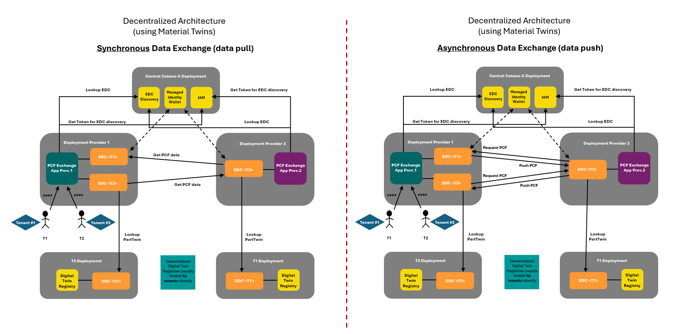
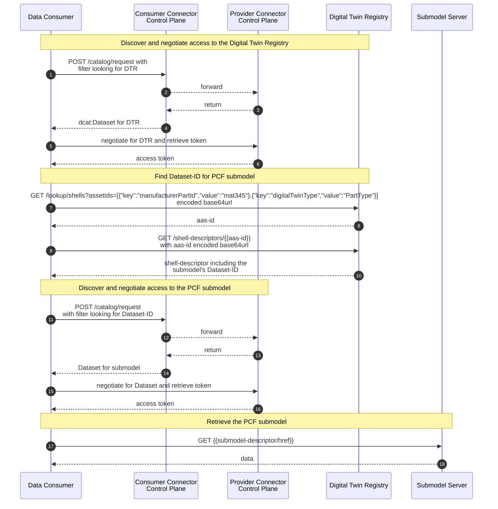
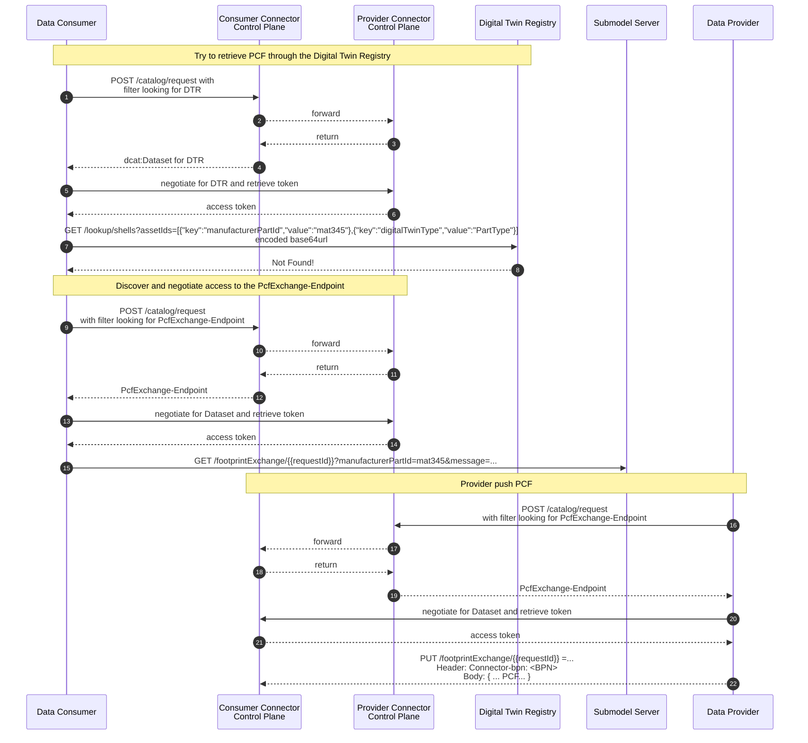
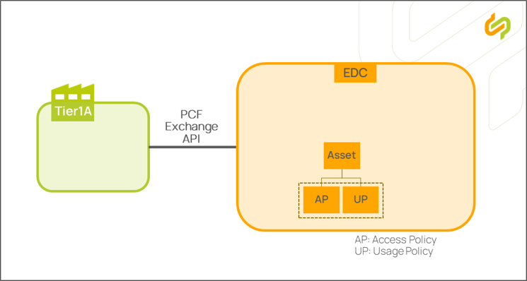

## CX-0136 v3.0.0

This view implements the exchange patterns defined by [CX-0136 Use Case PCF v3.0.0](https://catenax-ev.github.io/docs/next/standards/CX-0136-UseCasePCF). It uses the PCF aspect model `urn:samm:io.catenax.pcf:10.0.0`, the synchronous Digital Twin access pattern from CX-0002, and PCF Exchange API v1.3.0 for asynchronous exchange.

## Introduction

The developer view provides a detailed guide on how to utilize the PCF exchange KIT effectively. Developers will learn how to integrate the KIT into their applications and make use of the feature of exchanging PCF values via the Catena-X network.
IT-administrators will learn how they need to provide PCF data and which components are required.

This KIT covers various aspects, starting from how to utilize the available API endpoints, the used data models and how to make them available to the Catena-X network.

## Building Block View

The following figure shows the high-level architecture of the PCF Exchange use case. It supports synchronous data pull and asynchronous data push.

For synchronous exchange, the PCF value is exposed through a PCF submodel on a Material Twin. In CX-0136, "Material Twin" has the same meaning as "Part Type" as defined in CX-0126. For asynchronous exchange, the PCF Exchange API is offered as a connector data asset.

## Sequence View

The following chapter illustrates how PCF values are requested and transmitted.

### Synchronous PCF Data Exchange

For **synchronous data exchange (data pull)**, the Data Consumer resolves the Data Provider's Material Twin in the decentralized Digital Twin Registry (DTR) according to [CX-0002](https://catenax-ev.github.io/docs/next/standards/CX-0002-DigitalTwinsInCatenaX). The Data Provider must register the Material Twin according to [CX-0126](https://catenax-ev.github.io/docs/next/standards/CX-0126-IndustryCorePartType). It can be resolved using `manufacturerPartId`, `customerPartId`, or both, together with `digitalTwinType=PartType`.

For Synchronous PCF Data Exchange, the Data Provider must register a PCF submodel with semantic ID `urn:samm:io.catenax.pcf:10.0.0` in the Material Twin. The Data Consumer discovers and negotiates access to the submodel dataset, then retrieves the submodel as defined in [CX-0002](https://catenax-ev.github.io/docs/next/standards/CX-0002-DigitalTwinsInCatenaX). The response body is value-only JSON conforming to `urn:samm:io.catenax.pcf:10.0.0#Pcf`, with `Content-Type: application/json`.

### Asynchronous PCF Data Exchange (Request and Response)

If a matching material twin or PCF submodel is not available, the consumer discovers and negotiates access to the provider's PCF Exchange API data asset. The consumer then requests the PCF with `GET /footprintExchange/{requestId}`. The `requestId` and at least one of `manufacturerPartId` or `customerPartId` are required. The optional `dataModelVersion` parameter lets the consumer request a v10 PCF model explicitly.

### PCF Update

An update uses the same `PUT /footprintExchange/{requestId}` endpoint and sets the optional `update=true` query parameter. Updates refer to a previously requested PCF by its `requestId`; a new request is not required.

#### API Calls

The OpenAPI definition for the asynchronous PCF Exchange API v1.3.0 is part of [CX-0136](https://catenax-ev.github.io/docs/next/standards/CX-0136-UseCasePCF).

##### PCF Submodel Registration

For Synchronous PCF Data Exchange, the Data Provider must register a PCF submodel with semantic ID `urn:samm:io.catenax.pcf:10.0.0` in the Material Twin according to [CX-0002](https://catenax-ev.github.io/docs/next/standards/CX-0002-DigitalTwinsInCatenaX). The descriptor's `href` must be the complete, resolvable Data Plane URL used to retrieve the PCF value. The Data Provider may choose the URL format.

The Material Twin can be resolved using `manufacturerPartId` or `customerPartId` and `digitalTwinType=PartType`.

#### Payloads for EDC Asset

##### PCF Exchange API Data Asset

The asynchronous PCF Exchange API v1.3.0 must be offered as a connector data asset with an associated contract offer according to CX-0018. Its asset properties must include `cx-common:version` set to `"1.3.0"` and `dct:type` set to `{"@id":"cx-taxo:PcfExchange"}`.

#### Connector Policy and Contract Definition

Connector policies and contract definitions for both asynchronous PCF Exchange API offers and synchronous PCF submodel offers must follow [CX-0152 Policy Constraints for Data Exchange](https://catenax-ev.github.io/docs/next/standards/CX-0152-PolicyConstrainsForDataExchange) and [CX-0018 Dataspace Connectivity](https://catenax-ev.github.io/docs/next/standards/CX-0018-DataspaceConnectivity). The usage policy must use the usage purpose `cx.pcf.base:1`. The usage policy for the PCF Exchange API v1.3.0 must contain the `MembershipConstraint`. A bilateral contract reference may be added where required by the business relationship.

Inside the contract definition, an access policy and a usage policy must be referenced. Their constraints must conform to CX-0152.

The data provider must ensure that only one offer (per version) for a PCF Exchange asset is visible to a client when querying the catalog.

If a *bilateral contract* reference criteria is used *in a usage policy*, an access policy restricting access to the contract partners BPNL *MUST* be used for every usage policy holding a contract reference.

## Error Handling and Compatibility

For synchronous retrieval, refer to CX-0002 for error handling.
The error codes of the asynchronous PCF API v1.3.0 are defined in the OpenAPI document.

CX-0136 v3.0.0 requires backward compatibility. Applications must be able to retrieve and publish PCF submodels for both v10 and v9 data model versions, identify a counterparty's PCF Exchange API version, and communicate with API versions v1.3.0 and v1.2.0. When communicating with systems based on CX-0136 v2.2.1, applications must gracefully fall back to `urn:samm:io.catenax.pcf:9.0.0`. For asynchronous requests, an omitted `dataModelVersion` is treated as a legacy request and the response must conform to `urn:samm:io.catenax.pcf:9.0.0`.

## Standards

### Used CX Standards

- [CX-0002 Digital Twins in Catena-X](https://catenax-ev.github.io/docs/standards/CX-0002-DigitalTwinsInCatenaX)
- [CX-0018 Dataspace Connectivity](https://catenax-ev.github.io/docs/standards/CX-0018-DataspaceConnectivity)
- [CX-0126 Industry Core: Part Type](https://catenax-ev.github.io/docs/standards/CX-0126-IndustryCorePartType)
- [CX-0152 Policy Constraints For Data Exchange](https://catenax-ev.github.io/docs/next/standards/CX-0152-PolicyConstrainsForDataExchange)

## NOTICE

This work is licensed under the [CC-BY-4.0](https://creativecommons.org/licenses/by/4.0/legalcode).

- SPDX-License-Identifier: CC-BY-4.0
- SPDX-FileCopyrightText: 2023, 2024 ZF Friedrichshafen AG
- SPDX-FileCopyrightText: 2023, 2024 Bayerische Motoren Werke Aktiengesellschaft (BMW AG)
- SPDX-FileCopyrightText: 2023, 2024, 2025, 2026 T-Systems International GmbH
- SPDX-FileCopyrightText: 2023, 2024 SAP SE
- SPDX-FileCopyrightText: 2023, 2024 SIEMENS AG
- SPDX-FileCopyrightText: 2023, 2024 SUPPLY ON AG
- SPDX-FileCopyrightText: 2023, 2024 Volkswagen AG
- SPDX-FileCopyrightText: 2023, 2024 Robert Bosch GmbH
- SPDX-FileCopyrightText: 2023, 2024 Mercedes Benz Group
- SPDX-FileCopyrightText: 2023, 2024 BASF SE
- SPDX-FileCopyrightText: 2023, 2024 CCT
- SPDX-FileCopyrightText: 2023, 2024 Gris Group
- SPDX-FileCopyrightText: 2023, 2024 Contributors to the Eclipse Foundation
- [Source URL](https://github.com/eclipse-tractusx/eclipse-tractusx.github.io/tree/main/docs-kits/kits/product-carbon-footprint-exchange-kit)
