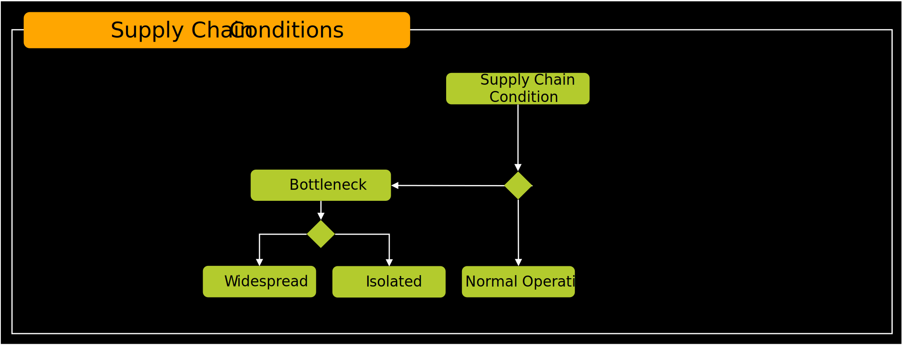
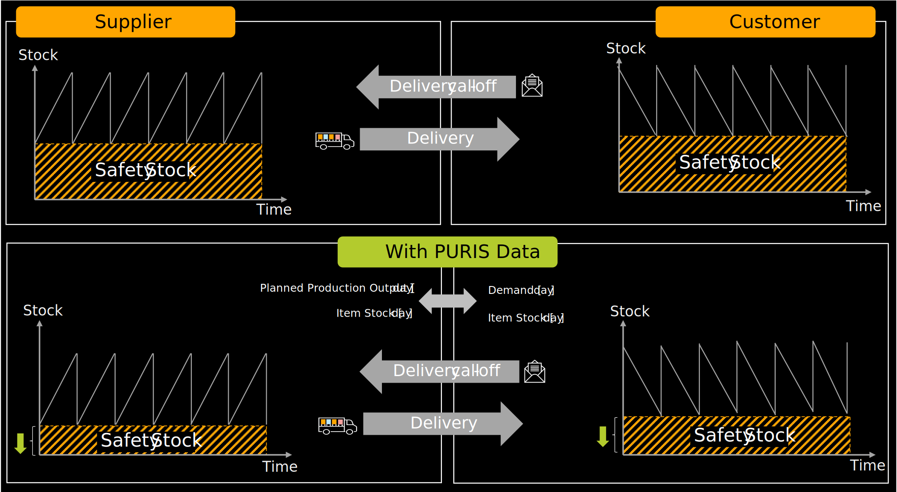
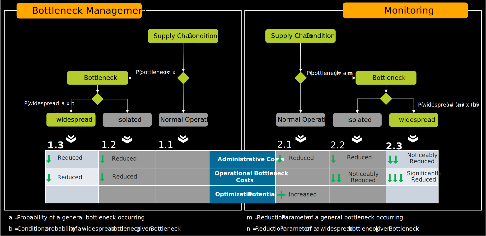
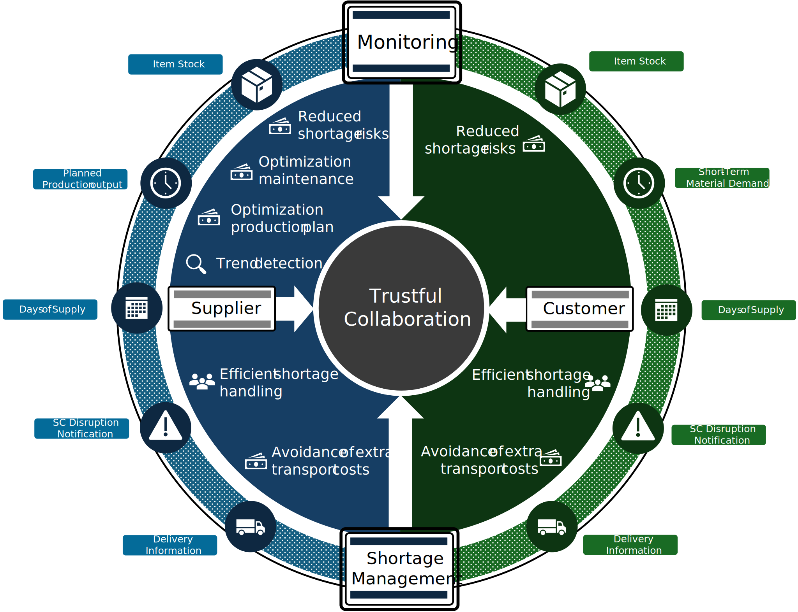

To assess the business value of implementing PURIS, several factors must be taken into account. A structured evaluation involves analyzing different supply chain conditions in relation to PURIS usage scenarios and identifying the associated potential improvements. Once the potential benefits are identified, they must be weighed against the internal efforts and costs required for implementation.

Figure 1: *Structured approach to deriving business value*

This structured flow — from analyzing supply chain and usage conditions to evaluating potential, benefits, and internal efforts — provides a consistent framework for assessing the business value of PURIS. It ensures that decisions are based on a holistic understanding of both the operational context and the expected impact, enabling targeted and value-driven implementation.

## Supply Chain Conditions

To fully realize the potential of PURIS, a holistic view of the supply chain is essential. Disruptions between a single supplier and customer can have cascading effects on other supplier relationships. Even if these secondary suppliers are not the root cause of a bottleneck, adjustments to the customer’s production program may lead to changes in material demand across the entire supply network.

Based on this, the following supply chain states can be distinguished:

Figure 2: *Typical supply chain conditions – normal operation, isolated bottleneck, and widespread bottleneck.*  

Figure 3: *Potential for cost reduction and the opportunities for improving operational efficiency with PURIS.*

### Normal Operation

In this state, there is no acute supply bottleneck, and operations are running under normal conditions. To reduce the risk of undetected shortages and to optimize internal production processes, PURIS data can be used for mutual monitoring between partners. This requires regular and reliable data exchange.

### Isolated Bottleneck Situation

An isolated bottleneck occurs when the supply of parts between a specific supplier and customer is disrupted, without affecting other supply relationships. With access to PURIS data, such situations can be identified and assessed early, allowing for timely countermeasures. This helps prevent the issue from spreading to other parts of the supply chain.

### Widespread Bottleneck Situation

A widespread bottleneck arises when an isolated issue impacts additional supply relationships. This can happen, for example, when the customer must adjust their production program, leading to shifts in demand for specific product variants. These shifts can trigger further shortages along the supply chain. Through collaborative monitoring, the potential impact of production plan changes can be evaluated in advance, enabling the selection of mitigation strategies that minimize overall negative effects.

## PURIS Usage Scenarios

PURIS can be applied in different ways depending on the specific needs and agreements between supply chain partners. The two core usage scenarios - shortage management and monitoring - represent the fundamental forms of application. However, companies have the flexibility to define a hybrid approach that combines elements of both. The chosen setup depends on factors such as the criticality of supplied parts, the maturity of collaboration, and the level of data exchange. This adaptability allows PURIS to support a wide range of operational contexts.

### Shortage Management (Reactive Risk Handling)

In this scenario, PURIS is used to respond to acute supply disruptions. When a bottleneck occurs, data is exchanged between partners to quickly understand the scope of the issue, and coordinate appropriate countermeasures. The process involves real-time communication, structured data interpretation, and rapid decision-making to stabilize the supply chain.

### Monitoring (Proactive Risk Prevention)

This scenario is based on continuous data exchange between supply chain partners. The goal is to maintain transparency over short-term supply and demand developments. By regularly monitoring material flows and order patterns, companies can detect irregularities early and initiate preventive actions. This process supports stable operations and enables early coordination in case of emerging risks. In case a risk occurs, PURIS can be used for detailing handling of the bottleneck as stated [before](#shortage-management-reactive-risk-handling).

## Potentials

To evaluate the business value of PURIS, it is relevant to consider both the potential for cost reduction and the opportunities for improving operational efficiency. The analysis should take into account the potential reduction of administrative costs, the reduction of direct operative bottleneck costs, and the optimization potential in production and logistics.

These areas represent typical fields of impact where PURIS can contribute to more efficient processes, improved coordination, and reduced operational risks.

### Administrative Costs

Managing the supply chain requires companies to allocate resources across procurement, logistics, and production. The level of effort and internal responsibilities vary from company to company. A portion of these resources is dedicated to monitoring the supply chain and handling bottleneck situations.

### Direct Operational Bottleneck Costs

In the event of a supply bottleneck, a wide range of costs can arise. These costs depend on various factors such as the type of product, the severity of the disruption, and the measures taken in response. For a meaningful evaluation, the following potential reduction of exceptional costs should be considered, among others:

### Operational Bottleneck Costs

In the event of a supply bottleneck, a wide range of costs can arise. These costs depend on various factors such as the type of product, the severity of the disruption, and the measures taken in response. For a meaningful evaluation, the following potential reduction of exceptional costs should be considered, among others:

| Cost Category            | Description                                                                  |
| :----------------------- | :--------------------------------------------------------------------------- |
| **Alternative sourcing** | Procurement of substitute  materials at higher prices                    |
| **Production costs**     | Special processes Overtime Production delays Production downtime |
| **Inventory costs**      | Increased storage capacity Capital tie-up                                |
| **Penalty payments**     | Contractual penalties                                                        |
| **Logistics costs**      | Expedited shipments Additional deliveries                                |
| **Reputational damage**  | Loss of customers Brand/image damage                                     |

Table 1: *Operational bottleneck costs*

### Optimization Potential in Production and Logistics

Optimizations in production and logistics can significantly reduce operational costs. While internal processes are often well-analyzed and aligned, the interfaces with customers and suppliers are frequently excluded from optimization efforts due to a lack of detailed information. By gaining access to relevant production data from both customers and suppliers, companies can better align their internal production schedules, manage inventory levels more efficiently, and plan maintenance activities more effectively. This transparency across the supply chain unlocks additional potential for efficiency gains and cost savings.

To illustrate the optimization potential from a supplier’s perspective, we consider a simple example: Inventory levels typically include so-called safety stocks, which are intended to buffer against unforeseen events such as sudden increases in customer demand. The lower the availability of relevant information, the higher these safety stocks tend to be—since uncertainty increases risk.

By using PURIS data, both the customer’s current inventory levels and the daily demand per material number become transparent. This level of supply chain visibility enables a dynamic adjustment of safety stocks - typically with the goal of reducing them in line with the actual risk.

From the supplier’s point of view, this transparency allows for more accurate planning and a reduction in the need to hold high safety stocks. In a trusted and transparent supply relationship, it is even conceivable to jointly optimize safety stocks between supplier and customer - potentially reducing inventory levels while maintaining supply reliability.

Figure 4: *Reduction of safety stock through supply chain transparency*

This scenario is intended as an example only; any contractual agreements between partners regarding safety stock remain unaffected.

## Deriving Benefits and Individual Assessment of Business Value

The application of PURIS may vary from transparent continuous monitoring of parts within a customer-supplier relationship to on-demand monitoring of short parts. Both poles contribute to the business value, but at different stages and in different ways. Thus, adopters should align with their partners on the usage to optimize their business value from using PURIS.

In bottleneck situations, PURIS enables faster and more informed decision-making, which helps reduce direct operational bottleneck costs. In contrast, continuous monitoring lowers the likelihood of bottlenecks occurring in the first place - especially widespread disruptions - by enabling early detection and proactive intervention.

It is important to note that the monitoring approach inherently includes the benefits of reactive bottleneck management. Therefore, a continuous use of PURIS not only supports operational efficiency in critical situations but also strengthens the overall resilience of the supply chain.

A comprehensive evaluation of the business benefits - considering the PURIS usage scenario, supply chain condition and potentials - is illustrated in the following figure.

Ultimately, the early prevention of bottlenecks should be a key focus when assessing business value, as every bottleneck situation leads to avoidable exceptional costs.

Figure 5: *Evaluation of the benefits*

### Normal Operation (1.1 and 2.1)

Figure 6: *Supply chain condition during normal operation*

The monitoring approach involves regular (recommended: daily) data exchange between supplier and customer. This allows companies to detect potential shortages earlier. As a result, less invasive measures can be taken to prevent shortages or reduce the disruption’s severity. As a result, resources allocated for bottleneck management can be reduced (lower administrative costs).

Additionally, visibility into the customer’s short-term demand allows suppliers to plan maintenance activities and production schedules more efficiently, unlocking further optimization potential. Short-term demand trends can also be identified early and incorporated into supplier-side planning. Further, suppliers can assess the reliability of customer orders and call-offs. This information may be used for planning and budgeting.

With a monitoring approach, the likelihood of bottlenecks across all supply relationships is reduced, further lowering total bottleneck-related costs in addition to the benefits of efficient response.

### Isolated Bottleneck (1.2 and 2.2)

Figure 7: *Supply chain condition during isolated bottleneck*

In isolated bottleneck situations, PURIS provides value regardless of the integration level. Using standardized information with bilateral transparency allows to improve collaboration. Further, it allows deeper integration and automation resulting in shorter time-to-action. This reduces administrative effort and significantly accelerates response times.

Fast access to data in time-critical situations expands the decision-making window, allowing for more effective measures and reducing operational bottleneck costs. For example, companies can minimize expedited shipments and adjust production schedules earlier to avoided overtime.

### Widespread Bottleneck (1.3 and 2.3)

Figure 8: *Supply chain condition during widespread bottleneck*

In widespread bottleneck scenarios, all benefits of efficient bottleneck management from isolated cases apply. However, without a monitoring approach, it is difficult to quickly assess whether a disruption affects other supply relationships.

If PURIS data is exchanged regularly across the entire supply chain, the monitoring approach enables fast and efficient evaluation of the situation. This significantly reduces administrative costs compared to a purely reactive bottleneck management approach.

Moreover, all supply situations can be considered in the decision-making process, allowing for coordinated and holistic mitigation strategies. This further reduces operational bottleneck costs.

The monitoring approach also lowers the risk of an isolated bottleneck escalating into a widespread one, as the impact of potential countermeasures on the broader supply chain can be assessed early. This minimizes the risk of unintended disruptions in other supplier relationships and reduces overall operational bottleneck costs.

To fully leverage the potential of PURIS, the monitoring approach should be adopted, and regular data exchange with the majority of partners should be established.

## Internal Efforts

When evaluating the business value of PURIS, it is essential to also consider the potential internal efforts required for implementation. These efforts largely depend on company-specific processes and the existing IT landscape. A distinction can be made between two typical scenarios:

### Single Customer / Single Sourcing Scenario

In cases where a product or material is planned and produced specifically for a single customer - or sourced from a single supplier - all relevant data is typically available in a customer- or supplier-specific format within the system. Here, the main internal effort under the monitoring approach lies in the automated provisioning and processing of PURIS data, which may require IT adjustments or integrations.

### Multi Customer / Multi Sourcing Scenario

If products or materials are managed across multiple customers or suppliers within the same production program or inventory system, data must be separated for each customer due to legal and confidentiality requirements. This ensures that no conclusions can be drawn about other business relationships. Specific requirements for data separation are outlined in the respective PURIS standards. In this context, internal costs may arise from the manual or automated preparation of data for each partner.

Across both scenarios, internal efforts can be categorized into two main cost levels:

1. **Implementation Costs:** These include the integration of source systems, development of interfaces, and provisioning of platform capabilities for data exchange and visualization. Depending on the technical solution, certification efforts may also be required.  
2. **Running Costs:** These cover ongoing expenses such as hosting, software licenses, system maintenance, and support for data provisioning and visualization tools.  

The complexity of the production and sourcing strategy directly affects both cost levels. For example, a highly integrated multi-sourcing setup with shared inventories across customers will typically require more sophisticated data handling and higher implementation and operational efforts.

## Trustful Collaboration as a Central Element

The implementation of PURIS supports, both reactive and proactive supply chain processes. At the core of its value contribution lies the establishment of trustful collaboration between suppliers and customers. This collaboration is enabled through structured data exchange and transparency regarding key supply chain parameters such as inventory levels, planned production output, and delivery information.

From a monitoring perspective, this transparency allows for early trend detection, improved planning of maintenance and production activities, and a general reduction in shortage risks. From a bottleneck management perspective, it enables faster and more coordinated responses to disruptions, helping to avoid additional costs such as expedited transport or unplanned production adjustments.

Both perspectives - monitoring and bottleneck management - contribute to operational stability and efficiency. Their effectiveness depends on the willingness and ability of partners to share relevant data and align on common processes. In this context, trustful collaboration is not only a prerequisite but also a result of successful PURIS integration.

Figure 9: *Monitoring and bottleneck management contribution to operational stability and efficiency*

## Early Industry Feedback

As part of the early development phase of PURIS, a qualitative interview study was conducted involving ten companies from various industries and of different sizes. The aim was to gather insights into the practical relevance and which information improves or harms short term supply chain management in the scenarios including bottleneck management and monitoring.

### Company and Participant Overview

The study included a diverse set of ten companies from various industrial sectors. The automotive manufacturing sector was most strongly represented (4 companies), followed by OEMs and the metal industry (2 each), and chemicals and electronics (1 each). In terms of company size, the sample contained was polarized: seven companies had more than 5,000 employees, while three were small and medium sized enterprises (SME) with fewer than 250 employees. There have been no companies with an employe count between 250 and 5,000 employees.

> 10 Companies participated within the interviews.

A total of 37 individuals participated in the interviews, which were conducted either in group settings or individually. The participants represented a broad range of functions, reflecting the cross-functional relevance of supply chain visiblity. The most common departments were logistics (15 participants), purchasing and production (7 each), followed by IT (5), sales (4), and risk management (3). For three participants, no departmental information was available.

In terms of experience, the majority of participants had extensive professional backgrounds: 29 out of 37 had more than ten years of experience, while a smaller group had between three and ten years.

#### Responsibility Areas of Interviewees

<pre> 

 </pre>

### Evaluation of PURIS Usage Potential

As part of the qualitative interviews conducted during the development of the PURIS framework, participants were asked how they would apply PURIS in their organizations. Responses were categorized along a five-point scale ranging from "not at all" to "proactive exchange for all parts". The scale can be further elaborated in the pie chart below.

The results show that 50% of respondents (6 out of 12) indicated a proactive use of PURIS, either for specific parts, most parts, or all parts. This suggests a strong interest in using PURIS not only for reactive shortage management but also as a tool for forward-looking supply chain monitoring.

The remaining participants expressed either a more cautious, case-based approach or stated that they were not yet in a position to assess its applicability. Their feedback highlighted the need for further internal alignment, improved data quality, and broader adoption across the supply chain ecosystem.

These findings underline the potential of PURIS as a framework for enhancing transparency and collaboration, while also pointing to areas where further development and communication are needed to support broader implementation.

**How would you use the PURIS framework?**

<blockquote style={{color: '#DDE29B'}}>
<strong>Over 50% of the companies indicated they would use PURIS in a proactive way,</strong> underscoring the strong interest and confidence in its capabilities. With PURIS, the overall efficiency will be significantly improved. For addressing shortages, applying PURIS is seen as a quick win since it can be seamlessly integrated with existing processes.
</blockquote>

## Notice

This work is licensed under the [CC-BY-4.0](https://creativecommons.org/licenses/by/4.0/legalcode)

- SPDX-License-Identifier: CC-BY-4.0  
- SPDX-FileCopyrightText: 2024 Contributors of the Eclipse Foundation  
- SPDX-FileCopyrightText: 2024 Fraunhofer-Gesellschaft zur Foerderung der angewandten Forschung e.V. (represented by Fraunhofer ISST)  
- SPDX-FileCopyrightText: 2024 Volkswagen AG  
- SPDX-FileCopyrightText: 2025 WITTE Automotive GmbH  
- SPDX-FileCopyrightText: 2025 Ford Werke GmbH  
- SPDX-FileCopyrightText: 2025 Robert Bosch Manufacturing Solutions GmbH  
- SPDX-FileCopyrightText: 2025 IBM Deutschland GmbH
