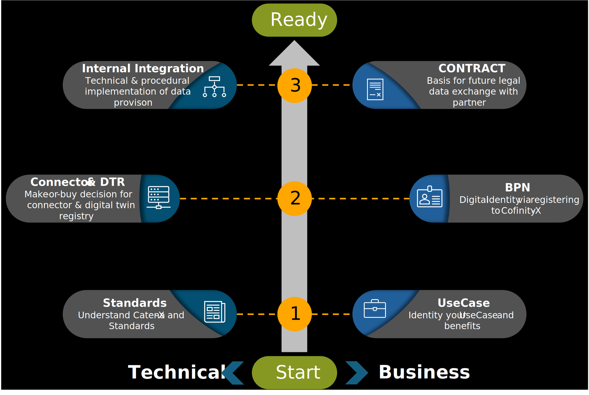

## Getting Started with PURIS

To ensure a productive implementation of PURIS, several preparatory and execution steps must be taken. A successful onboarding process requires the consideration of both business and technical aspects.

Figure 1: *Puris integration path*

### Step 1: Standards and Use Case

#### Standards and Interoperability (Technical Side)

The successful technical implementation of the PURIS use case relies heavily on adherence to defined Catena-X standards. These standards ensure interoperability between participating partners and systems, enabling consistent, secure, and scalable data exchange within the Catena-X ecosystem.

The relevant standards for PURIS can be grouped into two main categories:

##### Communication Standards

These standards define how systems communicate and exchange data in a harmonized way:

| Standard ID | Name                                | Description                                                                                                                                                                                                                                                           |
| :---------- | :---------------------------------- | :-------------------------------------------------------------------------------------------------------------------------------------------------------------------------------------------------------------------------------------------------------------------- |
| **CX-0002** | Digital Twins in Catena-X           | Specifies the requirements and characteristics of digital twins within the Catena-X ecosystem. It outlines how digital representations of physical objects are modeled, managed, and exchanged.                                                                       |
| **CX-0006** | Registration and Initial Onboarding | Defines the process for registering and verifying participants in the Catena-X network. It ensures that all organizations receive a unique digital identity (BPN) and meet the technical and organizational prerequisites for secure and interoperable data exchange. |
| **CX-0018** | Dataspace Connectivity              | Defines the technical framework for secure and interoperable data exchange within the Catena-X network. It specifies how participants connect to the dataspace using standardized interfaces and the Eclipse Dataspace Connector (EDC).                               |
| **CX-0126** | Industry Core Part Type             | Defines the basic structure and identification of parts and components. It ensures that all partners use a common semantic foundation for describing parts.                                                                                                           |

Table 1: *These standards define how systems communicate and exchange data in a harmonized way.*

##### Information Object Standards

These standards define the structure, semantics, and quality of the information exchanged. PURIS uses several specialized semantic models, each aligned with a specific information need along the supply chain:

| Standard                       | Version | Link                                                                                             |
| :----------------------------- | :------ | :----------------------------------------------------------------------------------------------- |
| **Item Stock**                 | `2.0.0` | [CX-0122](https://catenax-ev.github.io/docs/standards/CX-0122-ItemStockExchange)                 |
| **Short-Term Material Demand** | `2.0.0` | [CX-0120](https://catenax-ev.github.io/docs/standards/CX-0120-ShortTermMaterialDemandExchange)   |
| **Planned Production Output**  | `1.0.0` | [CX-0121](https://catenax-ev.github.io/docs/standards/CX-0121-PlannedProductionOutputExchange)   |
| **Delivery Information**       | `2.0.0` | [CX-0118](https://catenax-ev.github.io/docs/standards/CX-0118-ActualDeliveryInformationExchange) |
| **Days of Supply**             | `1.0.0` | [CX-0145](https://catenax-ev.github.io/docs/next/standards/CX-0145-DaysofsupplyExchange)         |

Table 2: *Standards that are recommended to be used for PURIS implementation. Please refer to the standard links for the most up to date version.*

For implementation, it is recommended to align these standards with the existing IT architecture and business processes. Special attention should be given to multi-sourcing and multi-customer scenarios, which are common in complex supply chains.

Further technical guidance and documentation can be found [here](/docs-kits/kits/puris-kit/software-development-view/).

#### Use Case Definition (Business Side)

The onboarding process should begin with the clear definition of a business use case. This step lays the foundation for all subsequent technical and organizational activities. In addition to identifying the expected business value, it is recommended to consider the following questions early on and involve the relevant departments:

- Are there critical parts, components, or materials to focus on? Do they involve further complexities , or strategic relevance?
- Which internal and external processes such as procurement, production planning, IT, or logistics are impacted and thus stakeholders?
- Which data sources provide the information necessary for the PURIS information exchange standards?
- Who are future partners, such as direct suppliers, customers, or logistics providers, to consider to enable a scalable and end-to-end implementation across the value chain?

### Step 2: Connector, DTR and BPN (Technical Side)

#### Connector & DTR (Technical Side)

The Connector is component that enables sovereign, intercompany information exchange. It allows applications to enforce data sovereignty, purpose limitation, and interoperability within data spaces.

The Digital Twin Registry (DTR) is a central component for managing and discovering digital representations of physical assets within the Catena-X ecosystem. It stores metadata about digital twins and their submodels, enabling participants to register, locate, and access asset-related data in a standardized and interoperable manner. The DTR ensures that digital twins can be reliably identified and referenced across company boundaries, forming the basis for scalable and consistent data exchange.

Further technical documentation is available [here](/docs-kits/category/connector-kit) and [here](/docs-kits/category/digital-twin-kit).

#### Business Partner Number (BPN) & Wallet (Business Side)

To participate in the Catena-X ecosystem, companies must register and obtain a Business Partner Number (BPN). This unique digital identifier is a prerequisite for secure and standardized interaction with other network participants. They may be differentiated into identifiers for legal entities (BPNL), sites (BPNS) and addresses (BPNA). Refer to the [Business Partner KIT](/docs-kits/category/digital-twin-kit) for further information.

In addition to the BPN, companies must also set up an Identity Wallet. This digital wallet is used to manage organizational identities and credentials within the Catena-X network. It enables secure authentication, authorization, and trust-based data exchange between partners.

The Wallet is a core component of the Catena-X infrastructure that manages access rights to data and services, enabling secure and controlled participation in data spaces.

Depending on the use case, additional partner-specific requirements may apply. For example, integrating the Catena-X Use Case Business Partner Data Management (BPDM) can be a valuable addition.

Further technical documentation is available [here](/docs-kits/category/business-partner-kit).

### Step 3: Internal Integration and Contract

#### Internal Integration (Technical Side)

The internal integration of PURIS is highly individual and depends on company-specific conditions as well as the defined use case. In general, two approaches to data provisioning can be distinguished: manual and automated.

- In the manual approach, data is collected, prepared, and entered manually.
- In the automated approach, data is provided via interfaces integrated into the existing IT architecture.

Since PURIS defines the standard for information (data and semantics) exchange, it does not prescribe how data should be visualized or processed on the partner side. Companies are free to choose between internal solutions, third-party software, or the open-source PURIS-FOSS Application.

Figure 2: *Puris participation options*

##### Self-Hosting PURIS FOSS

The PURIS-FOSS application is the most cost-effective option and can be adapted to individual needs. However, it offers only limited support via the community. In its basic version, data must be entered manually or can be provided in form of `.xlsx` spreadsheets (also possible via automation). As an open-source solution, it also allows for the development of customized, automated extensions.

Further documentation is available [here](/docs-kits/kits/puris-kit/operations-view)

##### Software as a Service

Commercial third-party solutions offer extended functionality and professional support. These tools often provide a smoother implementation experience, as the required PURIS expertise is already embedded in the product and service offering.

##### Individual Enterprise Solutions

Custom-developed solutions or the integration of PURIS into existing enterprise systems are particularly beneficial for larger organizations. This approach allows for full automation and alignment with internal policies, processes, and IT standards.

#### BPN (Business Side)

For internal integration and communication - especially in complex supply chain scenarios - companies may need to manage multiple types of Business Partner Numbers (BPNs). As part of access and data management within the Catena-X network, it is important to define how legal entities, production sites, and delivery locations are structured using BPN types (BPN**L**, BPN**S**, BPN**A**). A consistent BPN structure ensures that data access and responsibilities can be clearly assigned and that internal systems are correctly aligned. This is particularly relevant when implementing solutions like PURIS, where data flows and responsibilities are often site-specific.

Further documentation is available [here](/docs-kits/category/business-partner-kit).

### Notice

This work is licensed under the [CC-BY-4.0](https://creativecommons.org/licenses/by/4.0/legalcode)

- SPDX-License-Identifier: CC-BY-4.0  
- SPDX-FileCopyrightText: 2024 Contributors of the Eclipse Foundation  
- SPDX-FileCopyrightText: 2024 Fraunhofer-Gesellschaft zur Foerderung der angewandten Forschung e.V. (represented by Fraunhofer ISST)  
- SPDX-FileCopyrightText: 2024 Volkswagen AG  
- SPDX-FileCopyrightText: 2025 WITTE Automotive GmbH  
- SPDX-FileCopyrightText: 2025 Ford Werke GmbH  
- SPDX-FileCopyrightText: 2025 Robert Bosch Manufacturing Solutions GmbH  
- SPDX-FileCopyrightText: 2025 IBM Deutschland GmbH
