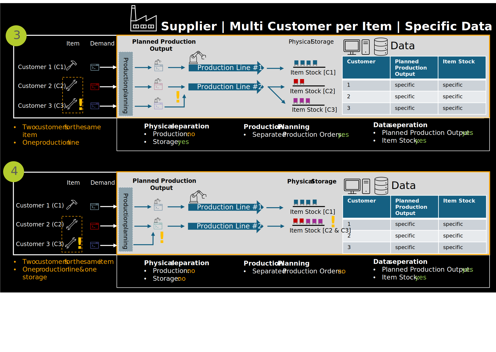
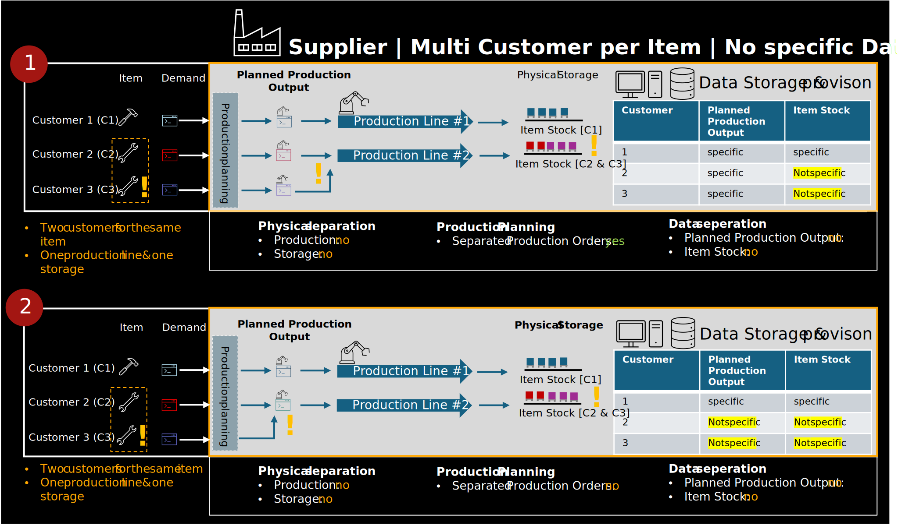
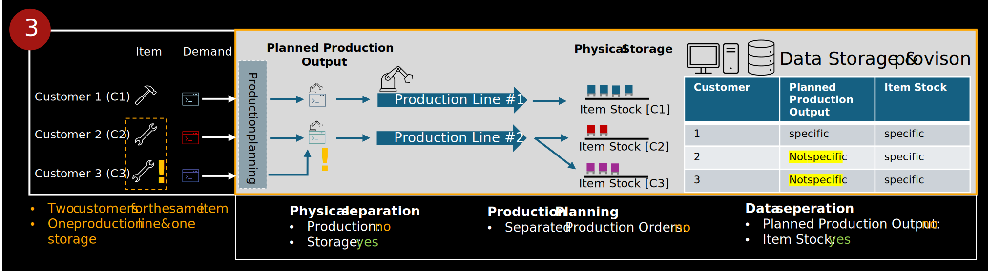

In a multi-customer scenario, the same material or product is delivered to multiple customers. While the physical production process is often shared, companies may still organize their operations in a way that allows for a logical separation of data—for example, by assigning production volumes or inventory to specific customers.

In these cases, data provisioning is as straightforward as in a Single Customer scenario, since customer-specific information can be clearly identified and shared without additional transformation.

Figure 1 and 2: *Supplier multi customer scenarios with physical or data-level separation*

However, in many cases, there is no physical or data-level separation. Materials are produced and stored collectively, and customer-specific differentiation only occurs at a later stage, such as during dispatch or invoicing. This can lead to challenges in:

- Assigning data to the correct customer context
- Ensuring transparency and traceability
- Maintaining data sovereignty and confidentiality

Figure 3 and 4: *Supplier multi customer scenarios without physical or data-level separation*

The primary focus in such scenarios is the reliable and context-specific provisioning of data. Independent of whether a physical or logical separation between customers exists, companies must ensure that relevant information can be systematically identified, structured, and made available in a way that reflects the specific customer context while ensuring compliance with legal, regulatory, and contractual obligations. The complexity arises not from the production process itself, but from the need to provide accurate and secure data allocation - particularly in environments where operational resources are shared.

## Possible Solutions

Due to the diversity of IT architectures and production processes, solution approaches for data allocation can only be described in general terms. The following methods offer guidance for assigning Planned Production Output and Item Stock to specific customer contexts:

### 1. Allocation Based on Orders or Call-Offs

Planned production output and item stock can be allocated using customer-specific orders or call-offs. This involves retrieving order data, calculating expected quantities per day or week, and applying these to production orders or stock levels. This method is effective when reliable order data is available and clearly attributable to individual customers.

### 2. Allocation Based on Short-Term Material Demand (CX-0120)

Short-term demand data can be used to derive production and stock allocations. This includes requesting the latest demand per customer and site, determining required production completion dates, and calculating daily or weekly allocations. While dynamic, this method may involve complex computations and dependencies on external systems.

### 3. Allocation Based on Scheduled Deliveries (CX-0118)

Scheduled deliveries can serve as a basis for allocation by retrieving estimated times of departure (ETD) per customer and site and calculating required production or stock levels accordingly. However, care must be taken to avoid circular dependencies if delivery data is derived from production.

### 4. Allocation of Item Stock Using Ratios or Quotations

For item stock, the use of ratios or quotations based on call-offs is recommended. This allows for proportional allocation of available stock to individual customers without disclosing total inventory levels. Only current/actual item stock quantities are transmitted in the standard.

In many companies, the allocation and preparation of customer-specific data is already supported by manual processes. These procedures have often been established as a response to past bottlenecks in communication or coordination with customers. In such cases, data is typically collected, structured, and shared manually—often using spreadsheets or internal reporting tools. While these approaches are not scalable in the long term, they demonstrate that the necessary information is already available within the organization. As such, existing manual workflows can serve as a practical foundation for identifying automation potential and designing future system-based solutions.
It is recommended that companies consider and evaluate automating their workflows to enhance scalability, data accuracy, and legal compliance.
Since the exchange of data across multiple customer relationships involves legal sensitivities, each participant is responsible for ensuring that any shared information complies with applicable laws and does not allow conclusions about other customers. The standard does not validate legal compliance at the semantic or technical level.

Accordingly, the following information must not be shared or made inferable:

- Capacities or deliveries of other customers
- Total call-offs or deliveries across all customers
- Total supplier stock or stock allocated to other customers

## Notice

This work is licensed under the [CC-BY-4.0](https://creativecommons.org/licenses/by/4.0/legalcode)

- SPDX-License-Identifier: CC-BY-4.0  
- SPDX-FileCopyrightText: 2024 Contributors of the Eclipse Foundation  
- SPDX-FileCopyrightText: 2024 Fraunhofer-Gesellschaft zur Foerderung der angewandten Forschung e.V. (represented by Fraunhofer ISST)  
- SPDX-FileCopyrightText: 2024 Volkswagen AG  
- SPDX-FileCopyrightText: 2025 WITTE Automotive GmbH  
- SPDX-FileCopyrightText: 2025 Ford Werke GmbH  
- SPDX-FileCopyrightText: 2025 Robert Bosch Manufacturing Solutions GmbH  
- SPDX-FileCopyrightText: 2025 IBM Deutschland GmbH  
