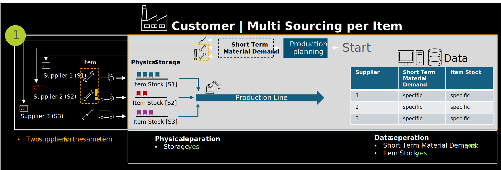
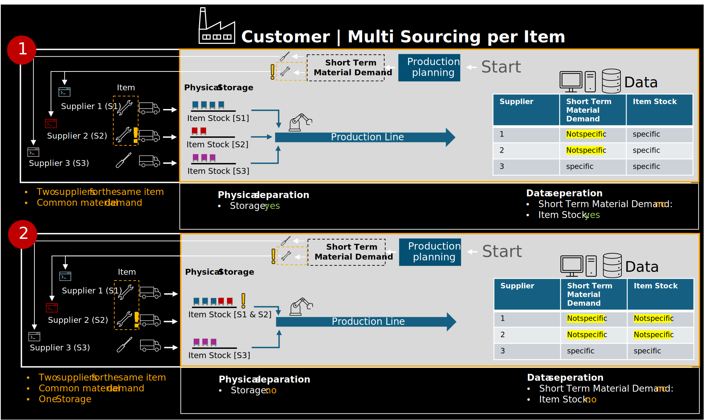

In a multi-sourcing scenario, the same material or product is procured from multiple suppliers. While the internal handling of the material — such as storage or production use — may be unified, companies must ensure that data related to demand and item stock can be clearly attributed to the respective supplier.

In cases where supplier-specific information is maintained separately (e.g., through batch tracking or source-specific labeling), data provisioning is relatively straightforward. The origin of materials can be identified and shared without major transformation.

Figure 1 and 2: *Customer multi sourcing scenarios*

In practice, this means that demand planning and inventory management are handled jointly, making it infeasible to assign data to a specific supplier context. Nevertheless, the data exchanged using this KIT must still be prepared and structured in a way that complies with applicable legal, regulatory, and contractual requirements — even if a clear technical separation is not possible.

## Notice

This work is licensed under the [CC-BY-4.0](https://creativecommons.org/licenses/by/4.0/legalcode)

- SPDX-License-Identifier: CC-BY-4.0  
- SPDX-FileCopyrightText: 2024 Contributors of the Eclipse Foundation  
- SPDX-FileCopyrightText: 2024 Fraunhofer-Gesellschaft zur Foerderung der angewandten Forschung e.V. (represented by Fraunhofer ISST)  
- SPDX-FileCopyrightText: 2024 Volkswagen AG  
- SPDX-FileCopyrightText: 2025 WITTE Automotive GmbH  
- SPDX-FileCopyrightText: 2025 Ford Werke GmbH  
- SPDX-FileCopyrightText: 2025 Robert Bosch Manufacturing Solutions GmbH  
- SPDX-FileCopyrightText: 2025 IBM Deutschland GmbH  
