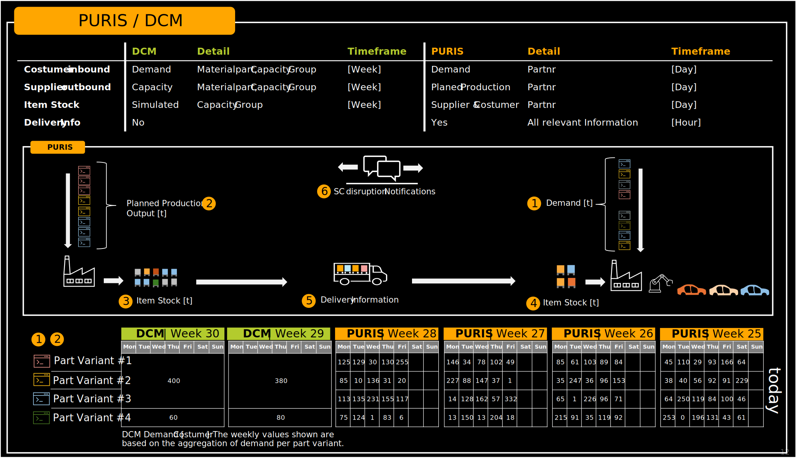

Catena-X enables comprehensive transparency across the entire supply network while maintaining sensitive data handling between partners by extending beyond the four-week planning horizon of PURIS.
In this context, DCM and PURIS complement each other with the shared goal of avoiding capacity bottlenecks or supply shortages. 
However, due to their respective time focuses, both standards emphasize different types of information. While DCM primarily considers capacities at the material group level with weekly demand and capacity buckets, PURIS focuses on daily production and supply and demand data at the single material number level.

|                   | PURIS                                                                                                                                                                                                                                                                                  | DCM                                                                                                                                                                                                                                                                                                   |
| :---------------- | :------------------------------------------------------------------------------------------------------------------------------------------------------------------------------------------------------------------------------------------------------------------------------------- | :---------------------------------------------------------------------------------------------------------------------------------------------------------------------------------------------------------------------------------------------------------------------------------------------------- |
| **DISTINCTION**   |                                                                                                                                                                                                                                                                                        |                                                                                                                                                                                                                                                                                                       |
| **PURIS & DCM**   | PURIS visualizes the supply situation in the short-term horizon with actual data, without aggregation and completely in real time, enabling the user to derive measures for the corresponding demand on this basis and to be able to make more reliable decisions. | DCM improves long-term planning reliability by monitoring demand and capacity data. The aim is to reduce costs by identifying capacity bottlenecks at an early stage. The focus is on information sharing, problem solving for greater resilience and flexibility in the process. |
| **BUSINESS VIEW** |                                                                                                                                                                                                                                                                                        |                                                                                                                                                                                                                                                                                                       |
| **Purpose**       | Enhance transparency & plausibility of the supply situation Detect, prevent & mitigate shortages                                                                                                                                                                               | Optimize capacity Ensure demand fulfillment                                                                                                                                                                                                                                               |
| **Focus on**      | Material supplies                                                                                                                                                                                                                                                                      | Production capacities                                                                                                                                                                                                                                                                                 |
| **Time Horizon**  | Today to 4 weeks (typical)                                                                                                                                                                                                                                                             | > 4 weeks                                                                                                                                                                                                                                                                                             |
| **Granularity**   | Daily                                                                                                                                                                                                                                                                                  | Weekly                                                                                                                                                                                                                                                                                                |
| **TECHNOLOGY**    |                                                                                                                                                                                                                                                                                        |                                                                                                                                                                                                                                                                                                       |
| **Direction**     | Pull                                                                                                                                                                                                                                                                                   | Push                                                                                                                                                                                                                                                                                                  |
| **Architecture**  | Mandatory: Digital Twins with Industry Core (Part Type)                                                                                                                                                                                                                    | Common: API Optional: Digital Twins with IC (Part Type)                                                                                                                                                                                                                                       |

Table 1: *Complementing Puris and DCM for Better Supply Chain Transparency*

By combining these two perspectives, companies can gain a holistic view of supply and demand dynamics—bridging strategic capacity planning with operational execution. This synergy supports proactive decision-making and strengthens the overall resilience of the supply chain.

Figure 1: *Combination of PURIS & DCM for a better supply chain transparency*

## Notice

This work is licensed under the [CC-BY-4.0](https://creativecommons.org/licenses/by/4.0/legalcode)

- SPDX-License-Identifier: CC-BY-4.0  
- SPDX-FileCopyrightText: 2024 Contributors of the Eclipse Foundation  
- SPDX-FileCopyrightText: 2024 Fraunhofer-Gesellschaft zur Foerderung der angewandten Forschung e.V. (represented by Fraunhofer ISST)  
- SPDX-FileCopyrightText: 2024 TRUMPF Werkzeugmaschinen SE + Co. KG  
- SPDX-FileCopyrightText: 2024 Volkswagen AG  
- SPDX-FileCopyrightText: 2025 WITTE Automotive GmbH  
- SPDX-FileCopyrightText: 2025 Ford Werke GmbH  
- SPDX-FileCopyrightText: 2025 Robert Bosch Manufacturing Solutions GmbH  
- SPDX-FileCopyrightText: 2025 IBM Deutschland GmbH  
