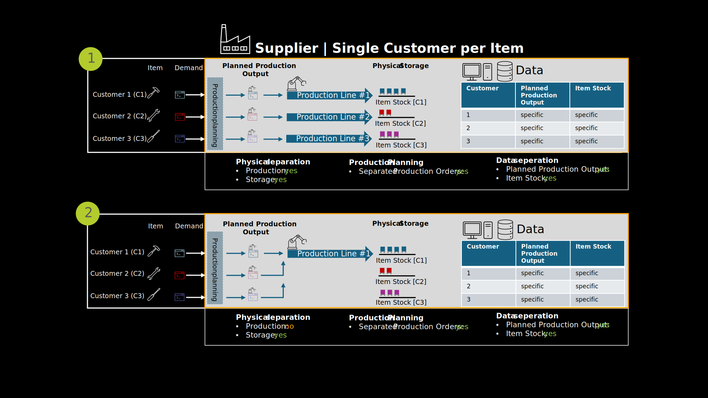

# Single Customer Scenario

In a Single Customer scenario, there is a one-to-one relationship between the supplier and the customer. A specific material or product is manufactured, stored, and shipped exclusively for a single customer.

This setup significantly simplifies the implementation of PURIS, as:

- The data ownership and responsibility are clearly assigned.
- There is no need for complex data filtering or aggregation, since the material flow is customer-specific.
- The relevant data (e.g. production plans, stock levels, delivery information) can be shared directly and without additional transformation.

Although there is no physical separation in production in the second scenario, separate production orders are generated during production planning, enabling distinct data processing.

As a result, PURIS can be implemented more quickly and with lower integration effort in such scenarios, making it an ideal starting point for pilot projects or initial rollouts.

## Notice

This work is licensed under the [CC-BY-4.0](https://creativecommons.org/licenses/by/4.0/legalcode)

- SPDX-License-Identifier: CC-BY-4.0
- SPDX-FileCopyrightText: 2024 ZF Friedrichshafen AG
- SPDX-FileCopyrightText: 2024 Bayerische Motoren Werke Aktiengesellschaft (BMW AG)
- SPDX-FileCopyrightText: 2024 SAP SE
- SPDX-FileCopyrightText: 2024 Mercedes Benz Group AG
- SPDX-FileCopyrightText: 2024 BASF SE
- SPDX-FileCopyrightText: 2024 SupplyOn AG
- SPDX-FileCopyrightText: 2024 Henkel AG & Co.KGaA
- SPDX-FileCopyrightText: 2024 Contributors of the Eclipse Foundation
- SPDX-FileCopyrightText: 2024 ISTOS GmbH (a member of the DMG Mori Group)
- SPDX-FileCopyrightText: 2024 Fraunhofer-Gesellschaft zur Foerderung der angewandten Forschung e.V. (represented by Fraunhofer ISST)
- SPDX-FileCopyrightText: 2024 TRUMPF Werkzeugmaschinen SE + Co. KG
- SPDX-FileCopyrightText: 2024 Volkswagen AG
- SPDX-FileCopyrightText: 2025 WITTE Automotive GmbH
- SPDX-FileCopyrightText: 2025 Ford Werke GmbH
- SPDX-FileCopyrightText: 2025 Robert Bosch Manufacturing Solutions GmbH
- SPDX-FileCopyrightText: 2025 IBM Deutschland GmbH
- SPDX-FileCopyrightText: 2024 Contributors to the Eclipse Foundation
