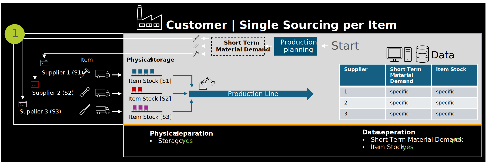

In a single sourcing scenario, a specific material or product is procured exclusively from one supplier. This one-to-one relationship simplifies both operational handling and data integration, as the origin of the material is clearly defined throughout the supply chain.

This setup offers several advantages for implementing PURIS:

- The data source is unambiguous
- Supplier-specific information (e.g. delivery schedules, quality data, inventory levels) can be directly linked to the material without additional filtering or attribution logic.
- Data ownership and responsibilities are clearly assigned, supporting straightforward integration into internal systems.

Even in cases where materials are processed together with others in production, the consistent sourcing origin allows for reliable data mapping. As a result, single sourcing scenarios are well-suited for initial PURIS implementations, offering a low-complexity environment for piloting data exchange and integration processes.

Figure 1: *Graphical representation of single sourcing scenario*

## Notice

This work is licensed under the [CC-BY-4.0](https://creativecommons.org/licenses/by/4.0/legalcode)

- SPDX-License-Identifier: CC-BY-4.0  
- SPDX-FileCopyrightText: 2024 Contributors of the Eclipse Foundation  
- SPDX-FileCopyrightText: 2024 Fraunhofer-Gesellschaft zur Foerderung der angewandten Forschung e.V. (represented by Fraunhofer ISST)  
- SPDX-FileCopyrightText: 2024 Volkswagen AG  
- SPDX-FileCopyrightText: 2025 WITTE Automotive GmbH  
- SPDX-FileCopyrightText: 2025 Ford Werke GmbH  
- SPDX-FileCopyrightText: 2025 Robert Bosch Manufacturing Solutions GmbH  
- SPDX-FileCopyrightText: 2025 IBM Deutschland GmbH  
