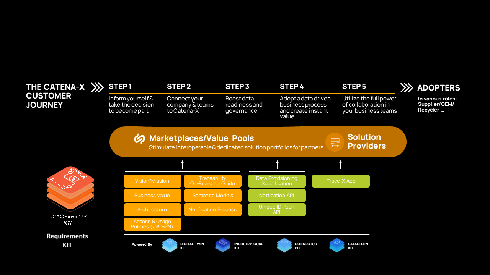
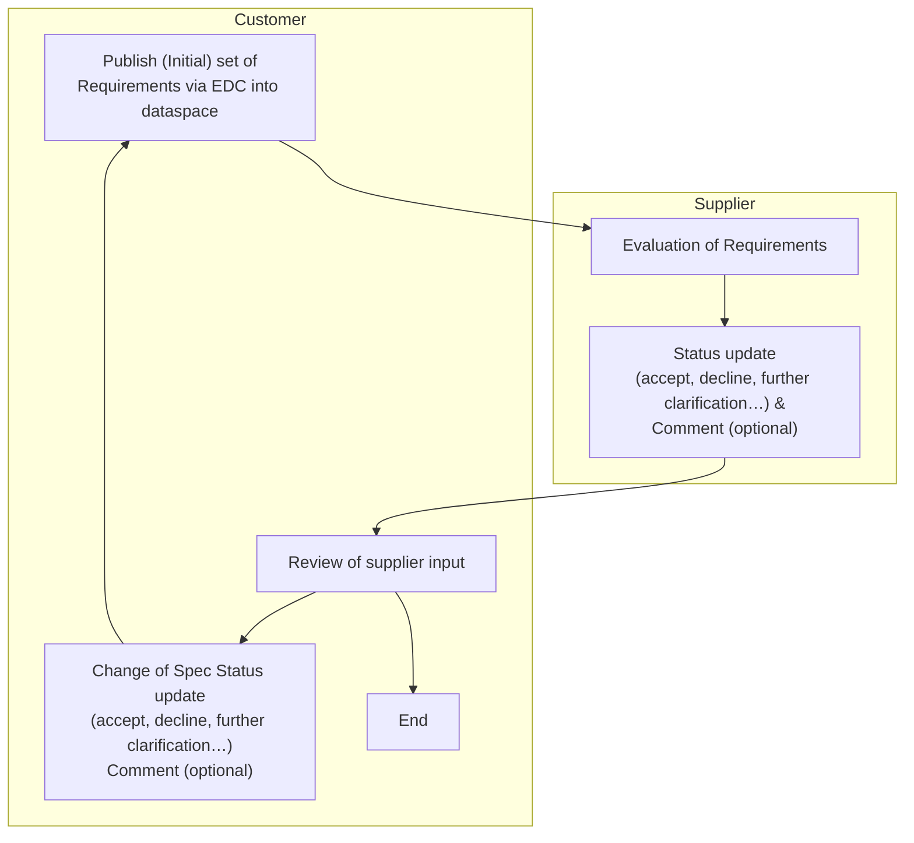

# Adoption View

## Vision & Mission

### Vision

Our vision is to establish a seamless, secure, and efficient engineering platform within the Catena-X ecosystem. In a first step a collaborative platform for cross company requirements management that enables quick information access and multiple company collaboration via a standardized solution in the Catena-X dataspace, inspired by ReqIF (Requirements Interchange Format). By leveraging ReqIF, we aim to optimize the information flow and collaboration between OEMs and their suppliers, fostering a deep understanding and clear communication of requirements across company boundaries, while reducing time for exchanging requirements from point to point using common data exchange tools.

At the heart of this commitment is the guarantee of data sovereignty any time. Each partner should be able to share their data securely while retaining full control over their own information. This enables transparent and trustworthy collaboration in product development by providing all stakeholders access to relevant requirement sets and documents without compromising proprietary or confidential information.

This vision opens the way for innovative and collaborative product development by providing a structured and standardized method for managing, exchanging, and validating requirements across supply chains. This new approach promises significant advantages such as:

1.	Enhanced Connectivity and Collaboration: We envision a digital landscape where all stakeholders can quickly access and share requirements data, fostering innovation and reducing time-to-market for new products.
2.	Standardization and Interoperability: Efficiently manage the diversity of requirements and specifications, ensuring that different systems can seamlessly communicate with each other.
3.	Data Sovereignty and Security: By employing the secure infrastructure of Catena-X, partners can maintain full control over their data while ensuring it is protected during exchanges, thereby building trust and transparency across the network.
4.	Real-time Integration and Agility: Through Catena-X, changes and updates to requirements can be synchronized in realtime, allowing teams to respond swiftly to evolving project needs and external challenges.
5.	Improved Quality and Compliance: This unified platform will not only enhance the accuracy and consistency of requirements data but also streamline compliance with industry standards and regulations, ultimately elevating product quality.

### Mission
The Requirements Kit aims to meticulously outline requirements by incorporating essential standards, aspect models and business logics. Its approach is designed to facilitate the exchange of requirements information between OEMs and Tier-N suppliers, ensuring that all relevant data is gathered and enabling authorized stakeholders to collaborate effectively. The data exchange process adheres to the Catena-X network's principles of data sovereignty, ensuring secure and compliant interactions. By following a standardized pipeline and utilizing data models within a data ecosystem, each partner is empowered to use their preferred applications, fostering a flexible and efficient collaboration environment.

## Business Value & Benefits

### Business Value
The "Requirements-KIT" provides guidelines and standards, such as semantic models and data exchange processes, which help companies create a reliable and sovereign data exchange system with their partners. 

This reduces cost and effort needed to integrate data-driven engineering processes into their operations and IT systems. 

Since this KIT is built on the Industry Core KIT and will be closely connected to upcoming other KITSs within the Engineering Domain, investment and implementation costs to integrate requirement services are reduced.

### Todays Challenge

As product development becomes more and more cross-company, the requirements that are necessary for the specification of the product to be developed must also be exchanged and harmonized across companies. This exchange for coordination between the customer and the development partner takes place in an iterative process that results in various documentation and changes to the specifications.

Nowadays, the exchange of requirements is largely file-based, with the files being provided or exchanged via company portals (B2B platforms), for example. In most cases, the requirements are first managed by the client in special requirements management software. As a starting point for collaboration in the product development process, one or more files for the product to be developed are extracted from the requirements management software with the requirements and possibly other information and made available to the development partner. In order for the development partner to view and evaluate the requirements, they must import the file into their requirements management tool (which may or may not be the same as the customer's). Once the requirements have been evaluated by the development partner, the partner exports another file from its requirements management tool and makes it available to the client. The client then imports this file back into its system and evaluates the development partner's scores, comments, etc.

This involves the circular processing of requests between partners, which can result in multiple file exports and imports to and from the respective systems. Each import/export results in a break in the data. Changes within each version of the files must be tracked and displayed by the requirements management tools. This method of working with requirements is very time consuming and requires a lot of manual effort that has nothing to do with the actual evaluation of the requirements.

In addition to the challenges mentioned above, there is also the issue that the files can be designed in a variety of content forms and the formats of the files can also vary. The formats can be divided into structured and unstructured files. Unstructured files are texts, tables etc. that are not organized into individual requirements without prior processing. These increase the effort required to organize the document into individual requirements. This also makes the exchange with the partner more difficult, as the partner does not know the newly created structure. With structured files, the aforementioned circumstances no longer exist, as the requirements are already organized. In the best case, a standardized form, such as the ReqIF format, is used. However, even when using standardized formats such as ReqIF, it is still necessary to agree on a common data model for exporting and importing in advance so that data exchange via the various requirements management tools works as smoothly as possible.

### Benefits for OEM, SME and Solution Provider
#### OEM and large automotive suppliers
- höhere Geschwindigkeit - Echtzeitpublikation möglich
- schnelle Ergebnisbewertungen/abstimmung
- Informations statt Dateienaustausch
- Keine Datenbrüche
- Transparenz und Traceability
- Vorteile der Standardisierung
- Data Sovreignity und Interoperability
- Höherer Automatisierungsgrad in der Engineering Toolchain möglich
- Verknüpfung zu anderen Eng Usecases möglich

Draft Abstract: Requirements KIT

Das Requirements KIT bietet OEMs und großen Automobilzulieferern eine innovative Lösung zur Optimierung des Anforderungsmanagements. Durch die Echtzeitpublikation ermöglicht es eine höhere Geschwindigkeit und schnelle Ergebnisbewertungen sowie Abstimmungen. Anstatt des traditionellen Dateienaustauschs wird ein Informationsaustausch gewährleistet, wodurch Datenbrüche vermieden werden. Die Lösung bietet Transparenz und Traceability, was die Nachverfolgbarkeit und Klarheit der Anforderungen verbessert.

Die Standardisierung des Requirements KIT bringt zahlreiche Vorteile mit sich, darunter eine erhöhte Data Sovereignty und Interoperability. Dies führt zu einem höheren Automatisierungsgrad in der Engineering Toolchain und ermöglicht die Verknüpfung zu anderen Engineering Usecases. Insgesamt unterstützt das Requirements KIT eine effizientere und sicherere Anforderungsverwaltung, die den Bedürfnissen der Automobilindustrie gerecht wird.
#### SME
- Vereinfachter Req Management Prozess
- Ersetzt proprietäre B2B interfaces - CX als einziges Interface für alle Kunden - spart Kosten und IT ressourcen und Zeit
- höhere Geschwindigkeit - Echtzeitpublikation möglich
- Reusability
#### Solution Provider

Catena-X offers solution providers a variety of strategic advantages to leverage their innovation capabilities and strengthen their market position beyond the automotive industry. Here are some examples of how solution providers can benefit from Catena-X technology:

1.	Expanded business and market opportunities: Catena-X brings together numerous participants from the automotive industry and now from other sectors like aviation, including manufacturers, suppliers, and service providers. Solution providers can showcase their solutions to a broad network and gain access to potential new customers.
2.	Long-term partnerships: Solution providers can establish long-term partnerships with leading companies in the automotive industry worldwide, providing strategic advantages and access to future projects.
3.	Increased visibility and reputation: By participating in the Catena-X network, solution providers can enhance their brand presence and reputation in a significant industrial area, which is particularly valuable for new or smaller providers.
4.	Compliance with regulatory requirements: Catena-X already offers a framework to better meet regulatory requirements in data management and exchange, which can be crucial for solution providers to ensure compliance with significantly less effort in development of the solutions provided.
5.	Standardized interfaces: Catena-X promotes the use of uniform and open standards for data and information ex-change as well as tool interoperability, facilitating product integration and accelerating market introduction for solution providers.
6.	Interoperability and integration: Especially for solution providers relying on interoperability, Catena-X provides a framework to seamlessly integrate their solutions across various platforms and systems, particularly important for providers offering cloud services or API-based products.
7.	Scalability of solutions: With a standardized approach, Catena-X enables solution providers to scale their solutions more easily and deploy them across different business areas of the automotive industry and beyond.
8.	Innovation platform: The network offers solution providers the opportunity to collaborate with other stakeholders and develop innovative technologies, especially in areas such as data analytics, artificial intelligence, IoT, and block-chain.
9.	Access to data and analysis: With access to valuable industrial data, solution providers can develop and enhance their analytics and optimization solutions to boost operational efficiency and decision-making processes for customers.
10.	Accelerated digital transformation: Catena-X allows solution providers to position their transformation strategies directly within the context of the automotive industry, a sector that is continually moving towards digital technologies.

  
## Customer Journey

## User Journey

## Notice

This work is licensed under the [CC-BY-4.0](https://creativecommons.org/licenses/by/4.0/legalcode).

- SPDX-License-Identifier: CC-BY-4.0
- SPDX-FileCopyrightText: 2025 Dräxlmaier GmbH & Co. KG
- SPDX-FileCopyrightText: 2025 Schaeffler AG
- SPDX-FileCopyrightText: 2025 Mercedes Benz Group AG
- SPDX-FileCopyrightText: 2025 ZF Friedrichshafen AG
- SPDX-FileCopyrightText: 2025 Contributors to the Eclipse Foundation
