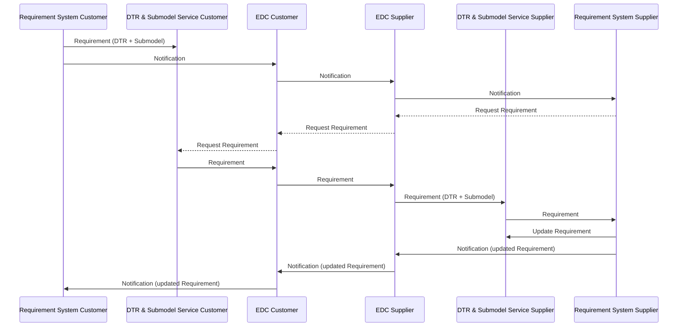

<!--
Copyright(c) 2026 Contributors to the Eclipse Foundation

See the NOTICE file(s) distributed with this work for additional
information regarding copyright ownership.

This work is made available under the terms of the
Creative Commons Attribution 4.0 International (CC-BY-4.0) license,
which is available at
https://creativecommons.org/licenses/by/4.0/legalcode.

SPDX-License-Identifier: CC-BY-4.0
-->

<!-- 
KIT LOGO START - Generated automatically from the configuration done in Kit Master Data
Replace <kit-id> with the id from your kit referenced in `data/kitsData.js`.
Do not remove!
This logo is only visible when compiled with Docusarus (final version of the hosted KIT)
-->

import Kit3DLogo from '@site/src/components/2.0/Kit3DLogo';

<Kit3DLogo kitId="requirements" />

<!--
KIT LOGO END
-->

Technical documentation for developers, architects, and implementers.

:::info Target Audience
Software Developers, Solution Architects, Technical Leads, API Developers, Integration Engineers.
:::

---

## Core Components

### Component 1: Requirement System

**Purpose**: Core component responsible for requirement management at the data consumer or provider

**Technology Stack**: Implementation depends on solution provider.

**Interfaces**: Typically ReqIF Export

### Component 2: Eclipse Dataspace Connector (EDC)

**Purpose**: Facilitates contract negotiation and data exchange between partners in the data space

**Technology Stack**: Java

**Interfaces**: Dataspace Protocol

### Component 3: Digital Twin Registry

**Purpose**: Stores and manages digital twin information

**Technology Stack**: Java, Go

**Interfaces**: AAS API

### Component 4: Submodel Server

**Purpose**: Handles submodel data and operations

**Technology Stack**: Java, Go

**Interfaces**: AAS API

---

## Sequence Diagrams

### Data Exchange Flow



The sequence diagram illustrates the requirement exchange flow between a Customer (e.g., an OEM) and a Supplier:

1. **Initial Requirement Creation**:

    - Customer creates a requirement in their requirements system and registers it in their DTR and creates a submodel.
    - Customer's system sends a notification through the EDC to the Supplier

2. **Requirement Request**:

    - Supplier's system requests the requirement details through the EDC
    - The requirement is transferred from Customer's DTR to Supplier's DTR and submodel service

3. **Requirement Update**:

    - After processing, Supplier updates the requirement in their requirements system
    - Supplier sends a notification about the update through the EDC back to the Customer
    - Customer is notified about the requirement update

4. **Next interactions**:

    - The process can be repeated for further updates or new requirements in an interactive manner between the Customer and Supplier.

---

## Standards Compliance

| Standard | Version | Compliance | Description |
| ---------- | --------- | ------------ | ------------- |
| CX-0154 | 1.0.1 | Optional | Standard describing how to handle Master Data in Engineering. This includes parameters that are fulfilling requirements but also versions of model |
| CX-0155 | 1.0.1 | Mandatory | Describes the required data models and API usage for the requirement use case |

### Standard Details

#### Requirements Engineering v.1.0.1

**Compliance Level**: Mandatory

**Implementation**: The Requirements Standard describes the data model and the API to use for requirements engineering in Catena-X. The data model defined is based on ReqIF and can be used in other domains then automotive as well.

**Reference**: [CX-0155 Requirements Engineering](https://catenax-ev.github.io/docs/next/standards/CX-0155-RequirementsEngineering)

#### Digital Engineering Master Data v1.0.1

**Compliance Level**: Recommended

**Implementation**: The Digital Engineering Master Data standard describes the main artifacts required in Collaborative Engineering use cases with a focus on Catena-X. It is designed industry-agnostic and can be used in other industries as well.

**Reference**: [CX-0154 Master Data](https://catenax-ev.github.io/docs/standards/CX-0154-MasterDataManagement)

---

## Logic & Schema

### Data Schema

#### Schema: Notification Schema

**Purpose**: The notification format used for the requirements exchange is based on the [Industry Core Kit's standardized notification format](../../industry-core-kit/software-development-view/notifications.mdx). The following example illustrates a notification sent from a Customer to a Supplier when a new requirement is created:

```json
{
  "$schema" : "http://json-schema.org/draft-04/schema",
  "x-samm-aspect-model-urn" : "urn:samm:io.catenax.shared.message_header:3.0.0#MessageHeaderAspect",
  "description" : "Aspect model describing the shared message header.",
  "type" : "object",
  "components" : {
    "schemas" : {
      "UuidV4Trait" : {
        "type" : "string",
        "x-samm-aspect-model-urn" : "urn:samm:io.catenax.shared.uuid:2.0.0#UuidV4Trait",
        "description" : "The provided regular expression ensures that the UUID is composed of five groups of characters separated by hyphens, in the form 8-4-4-4-12 for a total of 36 characters (32 hexadecimal characters and 4 hyphens), optionally prefixed by \"urn:uuid:\" to make it an IRI.",
        "pattern" : "(^[0-9a-fA-F]{8}-[0-9a-fA-F]{4}-[0-9a-fA-F]{4}-[0-9a-fA-F]{4}-[0-9a-fA-F]{12}$)|(^urn:uuid:[0-9a-fA-F]{8}-[0-9a-fA-F]{4}-[0-9a-fA-F]{4}-[0-9a-fA-F]{4}-[0-9a-fA-F]{12}$)"
      },
      "ContextCharacteristic" : {
        "type" : "string",
        "x-samm-aspect-model-urn" : "urn:samm:io.catenax.shared.message_header:3.0.0#ContextCharacteristic",
        "description" : "Defining a string value for the context"
      },
      "Timestamp" : {
        "type" : "string",
        "pattern" : "-?([1-9][0-9]{3,}|0[0-9]{3})-(0[1-9]|1[0-2])-(0[1-9]|[12][0-9]|3[01])T(([01][0-9]|2[0-3]):[0-5][0-9]:[0-5][0-9](\\.[0-9]+)?|(24:00:00(\\.0+)?))(Z|(\\+|-)((0[0-9]|1[0-3]):[0-5][0-9]|14:00))?",
        "x-samm-aspect-model-urn" : "urn:samm:org.eclipse.esmf.samm:characteristic:2.2.0#Timestamp",
        "description" : "Describes a Property which contains the date and time with an optional timezone."
      },
      "BpnlTrait" : {
        "type" : "string",
        "x-samm-aspect-model-urn" : "urn:samm:io.catenax.shared.business_partner_number:2.0.0#BpnlTrait",
        "description" : "The provided regular expression ensures that the BPNL is composed of prefix 'BPNL', 10 digits and two alphanumeric letters.",
        "pattern" : "^BPNL[a-zA-Z0-9]{12}$"
      },
      "SemanticVersioningTrait" : {
        "type" : "string",
        "x-samm-aspect-model-urn" : "urn:samm:io.catenax.shared.message_header:3.0.0#SemanticVersioningTrait",
        "description" : "Constraint for defining a SemVer version.",
        "pattern" : "^(0|[1-9][0-9]*).(0|[1-9][0-9]*).(0|[1-9][0-9]*)(-(0|[1-9A-Za-z-][0-9A-Za-z-]*)(.[0-9A-Za-z-]+)*)?([0-9A-Za-z-]+(.[0-9A-Za-z-]+)*)?$"
      },
      "HeaderCharacteristic" : {
        "description" : "Characteristic describing the common shared aspect Message Header",
        "x-samm-aspect-model-urn" : "urn:samm:io.catenax.shared.message_header:3.0.0#HeaderCharacteristic",
        "type" : "object",
        "properties" : {
          "messageId" : {
            "description" : "Unique ID identifying the message. The purpose of the ID is to uniquely identify a single message, therefore it MUST not be reused.",
            "x-samm-aspect-model-urn" : "urn:samm:io.catenax.shared.message_header:3.0.0#messageId",
            "$ref" : "#/components/schemas/UuidV4Trait"
          },
          "context" : {
            "description" : "Information about the context the message should be considered in.\nThe value MUST consist of two parts: an identifier of the context (e.g. business domain, etc.) followed by a version number.\nBoth the identifier and the version number MUST correspond to the content of the message.\nIf the content of a message is described by an aspect model available in the Catena-X Semantic Hub, then the unique identifier of this semantic model (e.g. urn:samm:io.catenax.<ASPECT-MODEL-NAME>:1.x.x) MUST be used as a value of the context field. This is considered the default case.\nIn all other cases the value of the context field MUST follow the pattern <domain>-<subdomain>-<object>:<[major] version> (e.g. TRACE-QM-Alert:1.x.x).\nVersioning only refers to major versions in both default and fallback cases.\nNote: The version of the message's header is specified in the version field.",
            "x-samm-aspect-model-urn" : "urn:samm:io.catenax.shared.message_header:3.0.0#context",
            "$ref" : "#/components/schemas/ContextCharacteristic"
          },
          "sentDateTime" : {
            "description" : "Time zone aware timestamp holding the date and the time the message was sent by the sending party. The value MUST be formatted according to the ISO 8601 standard",
            "x-samm-aspect-model-urn" : "urn:samm:io.catenax.shared.message_header:3.0.0#sentDateTime",
            "$ref" : "#/components/schemas/Timestamp"
          },
          "senderBpn" : {
            "description" : "The Business Partner Number of the sending party. The value MUST be a valid BPN. BPNA and BPNS are not allowed. Applicable constraints are defined in the corresponding standard",
            "x-samm-aspect-model-urn" : "urn:samm:io.catenax.shared.message_header:3.0.0#senderBpn",
            "$ref" : "#/components/schemas/BpnlTrait"
          },
          "receiverBpn" : {
            "description" : "The Business Partner Number of the receiving party. The value MUST be a valid BPN. BPNA and BPNS are not allowed. Applicable constraints are defined in the corresponding standard.",
            "x-samm-aspect-model-urn" : "urn:samm:io.catenax.shared.message_header:3.0.0#receiverBpn",
            "$ref" : "#/components/schemas/BpnlTrait"
          },
          "expectedResponseBy" : {
            "description" : "Time zone aware timestamp holding the date and time by which the sending party expects a certain type of response from the receiving party. The meaning and interpretation of the fields's value are context-bound and MUST therefore be defined by any business domain or platform capability making use of it. The value MUST be formatted according to the ISO 8601 standard",
            "x-samm-aspect-model-urn" : "urn:samm:io.catenax.shared.message_header:3.0.0#expectedResponseBy",
            "$ref" : "#/components/schemas/Timestamp"
          },
          "relatedMessageId" : {
            "description" : "Unique ID identifying a message somehow related to the current one",
            "x-samm-aspect-model-urn" : "urn:samm:io.catenax.shared.message_header:3.0.0#relatedMessageId",
            "$ref" : "#/components/schemas/UuidV4Trait"
          },
          "version" : {
            "description" : "The unique identifier of the aspect model defining the structure and the semantics of the message's header. The version number should reflect the versioning schema of aspect models in Catena-X.",
            "x-samm-aspect-model-urn" : "urn:samm:io.catenax.shared.message_header:3.0.0#version",
            "$ref" : "#/components/schemas/SemanticVersioningTrait"
          }
        },
        "required" : [ "messageId", "context", "sentDateTime", "senderBpn", "receiverBpn", "version" ]
      }
    }
  },
  "properties" : {
    "header" : {
      "description" : "Contains standardized attributes for message processing common across several use cases.",
      "x-samm-aspect-model-urn" : "urn:samm:io.catenax.shared.message_header:3.0.0#header",
      "$ref" : "#/components/schemas/HeaderCharacteristic"
    }
  },
  "required" : [ "header" ]
}
```

**Example**:

```json
{
  "header": {
    "messageId": "urn:uuid:48878d48-6f1d-47f5-8ded-a441d0d879df",
    "context": "Requirements-DigitalTwinEventAPI-[Create|Update|Delete]:1.0.0",
    "sentDateTime": "2024-07-05T08:13:33.20733Z",
    "senderBpn": "BPNL000000000AAA",
    "receiverBpn": "BPNL000000000ZZZ",
    "expectedResponseBy": "2024-07-08T08:13:33.20733Z",
    "version": "3.0.0"
  },
  "content": {
    "requirementId": "UfzQhdgLLfDTDGspDb",
    "description": "New requirement created for part type.",
  }
}
```

---

## Semantic Models

### Model: Requirements

**Version**: 1.0.0

**Namespace**: `urn:samm:io.catenax.requirement:1.0.0#`

**Description**: This model describes a Requirement. It is based on ReqIF.

**Key Properties**:

| Property | Type | Required | Description |
| ---------- | ------ | ---------- | ------------- |
| `requirementId` | string | Yes | UUID of the requirement |
| `requirementStatus` | string | Yes | Requirements Status based on [https://www.prostep.org/fileadmin/prod-pay-download-8c1d/Recommendation_ReqIF_V2.2.pdf](https://www.prostep.org/fileadmin/prod-pay-download-8c1d/Recommendation_ReqIF_V2.2.pdf) |
| `requirementInformation` | RequirementInformationEntity | Yes | Actual Requirement information with text, type meta data, author etc. |
| `requirementRelations` | RequirementRelationSet (List of RequirementIds and relationship type) | No | relationship of the requirement to other requirements |

**Example**:

```json
{
  "requirementRelations" : [ {
    "requirementRelationshipType" : "RequirementSpecialismOfRequirement",
    "relatedRequirementId" : "urn:uuid:e6b31BC2-8102-64AF-034D-C2DC35E37cEE"
  } ],
  "requirementId" : "urn:uuid:48878d48-6f1d-47f5-8ded-a441d0d879df",
  "requirementInformation" : {
    "foreignId" : "3.1.1",
    "longname" : "Plastic deformation of the bogie",
    "versionPredecessor" : {
      "versionPredecessorNumber" : "1.4.5",
      "versionPredecessorId" : "DaCfB4BD-15e7-edf0-77B6-Eb30De54aFbE"
    },
    "reqIfName" : "Plastic deformation of the bogie",
    "reqIfType" : "Functional",
    "metadata" : [ {
      "value" : "2025-11-30T00:00:00.000+02:00",
      "metadataDescription" : "Timestamp of the expected finalization of the requirement",
      "key" : "ExpectedFinalization"
    } ],
    "author" : "Lisa Dräxlmaier GmbH",
    "description" : "eOMtThyhVNLWUZNRcBaQKxI",
    "specification" : [ "https://www.prostep.org/fileadmin/prod-pay-download-8c1d/Recommendation_ReqIF_V2.2.pdf" ],
    "creationDate" : "2026-01-26T15:01:53.446Z",
    "version" : {
      "versionNumber" : "2.0.0",
      "versionId" : "fA8Df9A9-3399-89AB-32eB-e7e61Bce8cFF"
    }
  },
  "requirementStatus" : {
    "customerStatus" : [ {
      "customerStatusComment" : "Requirement needs to be evaluated",
      "customerStatusValue" : "<empty>",
      "customerStatusTimestamp" : "2026-01-26T15:01:53.449Z"
    } ],
    "supplierStatus" : [ {
      "supplierStatusTimestamp" : "2026-01-26T15:01:53.449Z",
      "supplierStatusValue" : "<empty>",
      "supplierStatusComment" : "More information needed from customer"
    } ],
    "statusValue" : "transition status",
    "statusTimestamp" : "2026-01-26T15:01:53.448Z"
  }
}
```

**Reference**: [https://github.com/eclipse-tractusx/sldt-semantic-models/tree/main/io.catenax.requirement/1.0.0](https://github.com/eclipse-tractusx/sldt-semantic-models/tree/main/io.catenax.requirement/1.0.0)

---

## Notice

This work is licensed under the [CC-BY-4.0](https://creativecommons.org/licenses/by/4.0/legalcode).

- SPDX-License-Identifier: CC-BY-4.0
- SPDX-FileCopyrightText: 2026 Fraunhofer-Gesellschaft zur Foerderung der angewandten Forschung e.V. (represented by Fraunhofer IPK)
- SPDX-FileCopyrightText: 2025 Dräxlmaier GmbH & Co. KG
- SPDX-FileCopyrightText: 2025 Schaeffler AG
- SPDX-FileCopyrightText: 2025 Mercedes Benz Group AG
- SPDX-FileCopyrightText: 2025 ZF Friedrichshafen AG
- SPDX-FileCopyrightText: 2025 Contributors to the Eclipse Foundation
- Source URL: [https://github.com/eclipse-tractusx/eclipse-tractusx.github.io](https://github.com/eclipse-tractusx/eclipse-tractusx.github.io)
