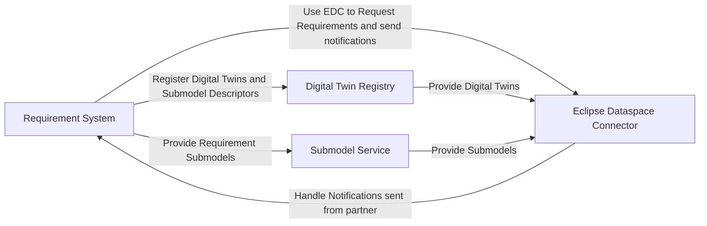
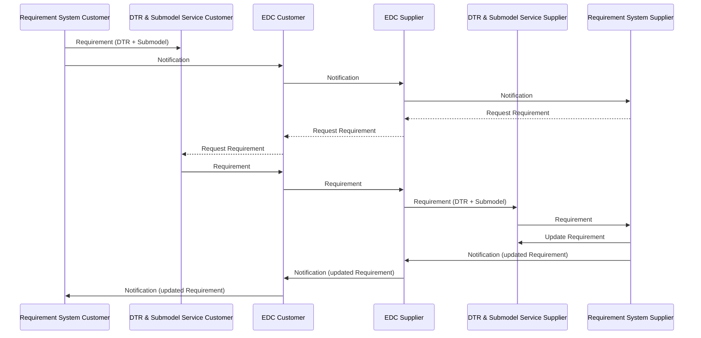

## Architecture

### Component Diagram

The flowchart illustrates the interactions between four main components in the system:

#### Components

The following components are necessary for the requirements exchange:

- Company Specific Components:
  - **Requirement System**: Core component responsible for requirement management
- Catena-X specific components:
  - **Eclipse Dataspace Connector (EDC)**: Facilitates data exchange between partners
  - **Digital Twin Registry**: Stores and manages digital twin information
  - **Submodel Service**: Handles submodel data and operations

#### Interactions

The system architecture demonstrates how components interact to facilitate requirement exchange:

- **Requirement System Operations**
  - Registers Digital Twins and Submodel Descriptors in the Digital Twin Registry
  - Provides Requirement Submodels to the Submodel Service
  - Uses the Eclipse Dataspace Connector to request requirements and send notifications
- **Eclipse Dataspace Connector (EDC)**
  - Handles notifications sent from partners back to the Requirement System
  - Acts as the communication bridge between partners
- **Digital Twin Registry**
  - Provides Digital Twins to the Eclipse Dataspace Connector
- **Submodel Service**
  - Provides Submodels to the Eclipse Dataspace Connector



### Requirement Exchange Sequence

The sequence diagram illustrates the requirement exchange flow between a Customer (e.g., an OEM) and a Supplier:

1. **Initial Requirement Creation**:

    - Customer creates a requirement in their requirements system and registers it in their DTR and creates a submodel.
    - Customer's system sends a notification through the EDC to the Supplier

2. **Requirement Request**:

    - Supplier's system requests the requirement details through the EDC
    - The requirement is transferred from Customer's DTR to Supplier's DTR and submodel service

3. **Requirement Update**:

    - After processing, Supplier updates the requirement in their requirements system
    - Supplier sends a notification about the update through the EDC back to the Customer
    - Customer is notified about the requirement update

4. **Next interactions**:

- The process can be repeated for further updates or new requirements in an interactive manner between the Customer and Supplier.

The diagram shows the core components involved in this exchange:

- Requirement Systems (on both Customer and Supplier sides)
- Digital Twin Registry (DTR) & Submodel Services
- Eclipse Dataspace Connector (EDC) for secure data exchange
- Solid lines indicate dataflow
- Dashed lines indicate initialization of a request



## Requirements Aspect Model

The following section gives an overview of the requirements aspect model. The requirements aspect model is a submodel that contains the requirements information and the status of the requirement.

| Digital Twin Type | Aspect Model | Mandatory Version | Optional Versions | KIT | Standard |
| :-- | :-- | :-- | :-- | :-- | :-- |
| PartType | Requirements | 1.0.0 | | Requirements | CX-0155 |

### Example of a Requirements Aspect Model

```json
{
  "requirementRelations": [
    {
      "relatedRequirementId": "urn:uuid:e6b31BC2-8102-64AF-034D-C2DC35E37cEE",
      "requiremementRelationshipType": "RequirementSpecialismOfRequirement"
    }
  ],
  "requirementId": "urn:uuid:48878d48-6f1d-47f5-8ded-a441d0d879df",
  "requirementInformation": {
    "foreignId": "3.1.1",
    "longname": "Plastic deformation of the bogie",
    "versionPredecessor": {
      "versionPredecessorNumber": "1.4.5",
      "versionPredecessorId": "AeEf3f22-Af51-EDF0-29D2-Ba086b386A5E"
    },
    "creationdate": "2025-06-05T09:35:16.166+02:00",
    "metadata": [
      {
        "value": "2025-11-30T00:00:00.000+02:00",
        "metadataDescription": "Timestamp of the expected finalization of the requirement",
        "key": "ExpectedFinalization"
      }
    ],
    "author": "Lisa Dräxlmaier GmbH",
    "reqifType": "Functional",
    "reqifName": "Plastic deformation of the bogie",
    "description": "eOMtThyhVNLWUZNRcBaQKxI",
    "specification": [
      "https://www.prostep.org/fileadmin/prod-pay-download-8c1d/Recommendation_ReqIF_V2.2.pdf"
    ],
    "version": {
      "versionNumber": "2.0.0",
      "versionId": "B50C5243-9590-Eaa5-dA9e-Adb383e2cFf6"
    }
  },
  "requirementStatus": {
    "customerStatus": [
      {
        "customerStatusComment": "Requirement needs to be evaluated",
        "customerStatusValue": "<empty>",
        "customerStatusTimestamp": "2025-06-05T09:35:16.166+02:00"
      }
    ],
    "supplierStatus": [
      {
        "supplierStatusTimestamp": "2025-06-05T09:35:16.166+02:00",
        "supplierStatusValue": "<empty>",
        "supplierStatusComment": "More information needed from customer"
      }
    ],
    "statusValue": "transition status",
    "statusTimestamp": "2025-06-05T09:35:16.166+02:00"
  }
}

```

## Notification Format

The notification format used for the requirements exchange is based on the [Industry Core Kit's standardized notification format](../industry-core-kit/software-development-view/notifications). The following example illustrates a notification sent from a Customer to a Supplier when a new requirement is created:

```json
{
  "header": {
    "messageId": "urn:uuid:48878d48-6f1d-47f5-8ded-a441d0d879df",
    "context": "Requirements-DigitalTwinEventAPI-[Create|Update|Delete]:1.0.0",
    "sentDateTime": "2024-07-05T08:13:33.20733Z",
    "senderBpn": "BPNL000000000AAA",
    "receiverBpn": "BPNL000000000ZZZ",
    "expectedResponseBy": "2024-07-08T08:13:33.20733Z",
    "version": "3.0.0"
  },
  "content": {
    "requirementId": "UfzQhdgLLfDTDGspDb",
    "description": "New requirement created for part type.",
  }
}
```

- ```requirementId```: ```requirementId``` in requirements datamodel

<!--
- ```description```:
- ToDo: Clarify if ```context``` is the right place for create/update/delete information or if this should be moved to ```content```
-->

Base idea of notifications: Only technical information about creation/change/deletion of requirement. Descriptive information about changes and comments are stored directly within the requirement submodels.

## EDC Setup

In order to set up the EDC for the requirements use-case, the following steps are necessary:

- [Setup for the DTR](../digital-twin-kit/software-development-view/) in order to provide access to the Digital Twins for the partners
- [Notifications](../industry-core-kit/software-development-view/notifications) to inform the partners about new requirements or updates. In the requirements use-case the standardized notifications from the Industry Core Kit are used.

## Notice

This work is licensed under the [CC-BY-4.0](https://creativecommons.org/licenses/by/4.0/legalcode).

- SPDX-License-Identifier: CC-BY-4.0
- SPDX-FileCopyrightText: 2025 Dräxlmaier GmbH & Co. KG
- SPDX-FileCopyrightText: 2025 Schaeffler AG
- SPDX-FileCopyrightText: 2025 Mercedes Benz Group AG
- SPDX-FileCopyrightText: 2025 ZF Friedrichshafen AG
- SPDX-FileCopyrightText: 2025 Contributors to the Eclipse Foundation
