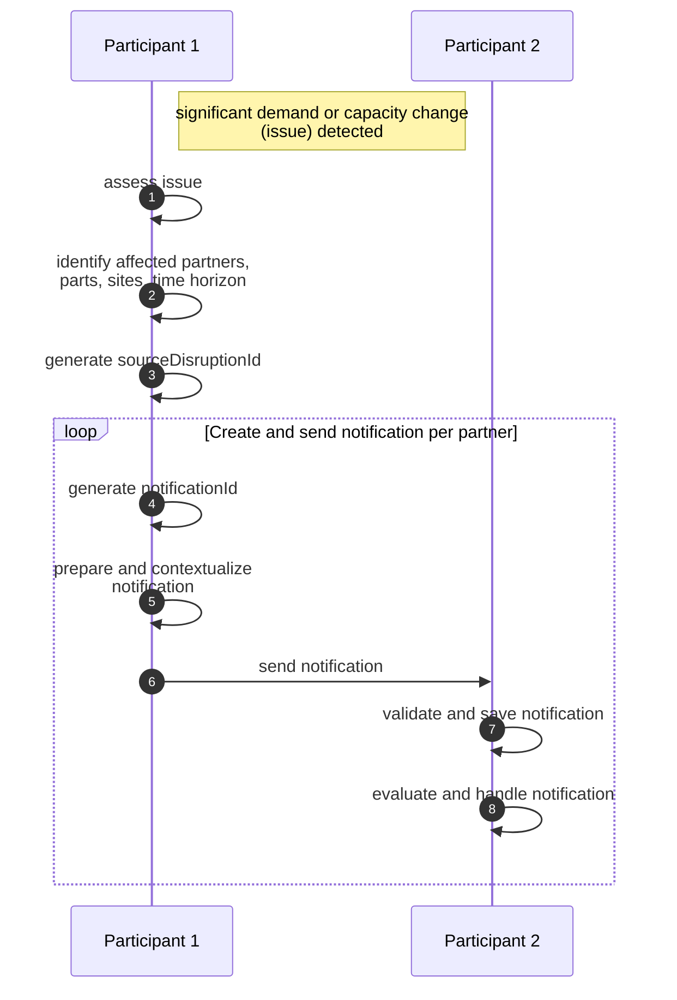
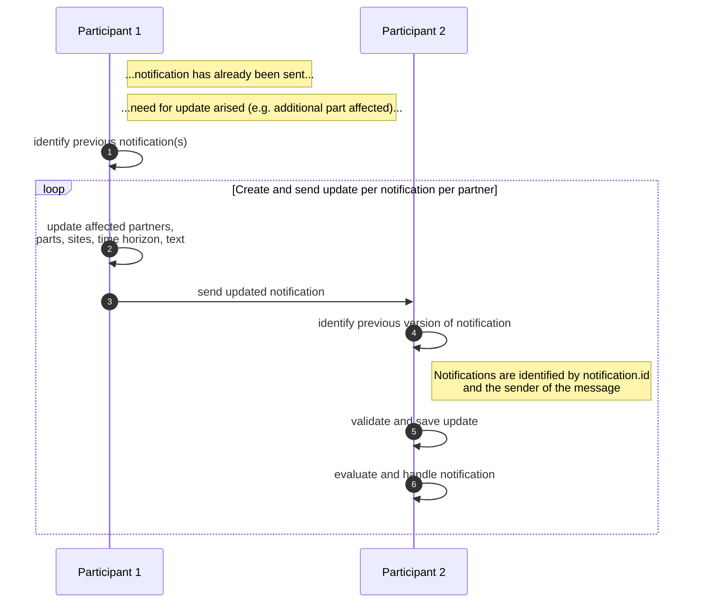
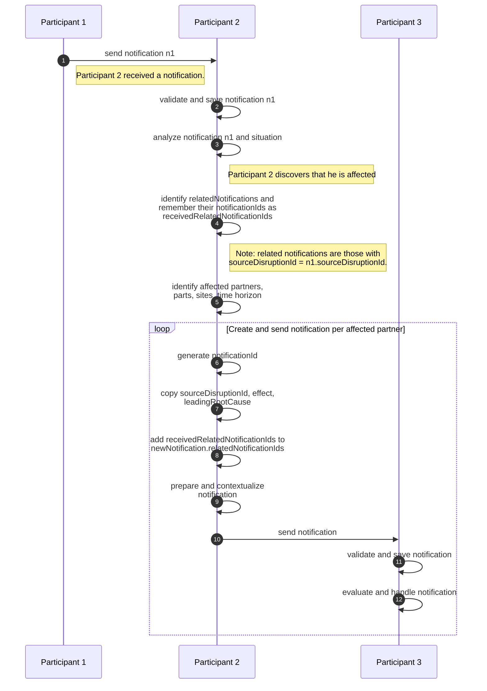

## Connector Data Asset Structure

To enable notifications, the recipient has to register its notification API as a data asset as follows:

```json
{
  "@context": {
    "@vocab": "https://w3id.org/edc/v0.0.1/ns/",
    "cx-taxo": "https://w3id.org/catenax/taxonomy#",
    "cx-common": "https://w3id.org/catenax/ontology/common#",
    "dct": "http://purl.org/dc/terms/"
  },
  "@id": "{{DEMAND_AND_CAPACITY_NOTIFICATIONS_REQUEST_API_ASSET_ID}}",
  "properties": {
    "dct:type": {
      "@id": "cx-taxo:DemandAndCapacityNotificationApi"
    },
    "cx-common:version": "2.0",
    "description": "Demand and Capacity Notification API Endpoint"
  },
  "dataAddress": {
    "@type": "DataAddress",
    "type": "HttpData",
    "proxyBody": "true",
    "proxyMethod": "true",
    "baseUrl": "{{DEMAND_AND_CAPACITY_NOTIFICATION_API_ENDPOINT}}",
    "contentType": "application/json"
  }
}
```

This asset can then be contracted by senders of notifications.

## Versioning

The Catena-X versioning applies. For version `2.0.0` of the Demand and Capacity API, a new asset and backend notification receiver MUST be created as shown in Figure 4 below.


Figure 1: *Versioning of the Demand and Capacity Notification based on CX-0151*

## Sample Data

The semantic models in the business context are defined in the Adoption View of this KIT. This chapter gives additional
information for each aspect model by providing the example data objects in JSON format, link to the RDF turtle file on
GitHub and unique semantic id of the aspect model. Currently the standard *Supply Chain Disruption Notifications*
provides one semantic model *Demand and Capacity Notification*.

The Demand and Capacity Notification consists of a header and a content, that are assbembled in the following format:

```json
{
    "header": <messageHeader>,
    "content": {
        <DemandAndCapacityNotification>
    }
}
```

The definition following aspect models are used for their respective properties following table 1.

| Property | Aspect Model with Link                                                                                                                                                                                                                             |
| -------- | -------------------------------------------------------------------------------------------------------------------------------------------------------------------------------------------------------------------------------------------------- |
| header   | [urn:samm:io.catenax.shared.message_header:3.0.0#MessageHeader](https://github.com/eclipse-tractusx/sldt-semantic-models/blob/main/io.catenax.shared.message_header/3.0.0/MessageHeaderAspect.ttl)                                                 |
| content  | [urn:samm.io.catenax.demand_and_capacity_notification:3.0.0#DemandAndCapacityNotification](https://github.com/eclipse-tractusx/sldt-semantic-models/blob/main/io.catenax.demand_and_capacity_notification/3.0.0/DemandAndCapacityNotification.ttl) |

> Table 1: *Aspect models used to assemble demand and capacity notification.*

In the following more detailed information will be provided on how to fill the respective properties.

#### Message Header

The following table lists all fields of the message header and how they are used.

| **Field**        | **REQUIRED** | **Purpose**                                                                                                                                                                                                                                                   | **Datatype**                                             | **Example value**                               |
| ---------------- | ------------ | ------------------------------------------------------------------------------------------------------------------------------------------------------------------------------------------------------------------------------------------------------------- | -------------------------------------------------------- | ----------------------------------------------- |
| messageId        | Yes          | Unique ID identifying the message. The purpose of the ID is to uniquely identify a single message, therefore it must not be reused. This ID must not be confused with the notification id within the payload and thus, should be different.                   | UUID v4 [RFC4122]                                        | `urn:uuid:375e75f0-913e-4b71-a96c-366fc8f6bf8f` |
| relatedMessageId | No           | For the "Demand and Capacity Notification" this information must not be set. Correlations of notifications is handled within the payload as described in [Chapter 5](#5-processes).                                                                           | UUID v4 [RFC4122]                                        |                                                 |
| context          | Yes          | This field  must contain the namespace of the Demand and Capacity Notification API that is sent within the content section of the message. The version is not specified according to the SAMM version of the DemandAndCapacityNotification SAMM model in use. | URI                                                      | `CX-DemandAndCapacityNotificationAPI-Receive:2.0.0`          |
| version          | Yes          | This field must specify the version of the header's aspect model that has been used to create the header.                                                                                                                                                     | Version of the shared aspect model MessageHeader         | `3.0.0`                                         |
| senderBpn        | Yes          | The business partner number (BPNL) of the responding party.                                                                                                                                                                                                   | BPNL according to [[CX-0010]](#61-normative-references)  | `BPNL7588787849VQ`                              |
| receiverBpn      | Yes          | The business partner number (BPNL) of the receiving party.                                                                                                                                                                                                    | BPNL according to [[CX-0010]](#61-normative-references)  | `BPNL6666787765VQ`                              |
| sentDateTime     | Yes          | The date and time including time zone offset on which the request has been created.                                                                                                                                                                           | [[ISO8601]](#62-non-normative-references) with time zone | `2023-06-19T21:24:00+07:00`                     |

Table 2: *Message header fields used in the Demand and Capacity Notification API*

The following listing shows a valid json serialization of such a header within the target format.

```json
{
  "header": {
    "messageId": "3b4edc05-e214-47a1-b0c2-1d831cdd9ba9",
    "context": "CX-DemandAndCapacityNotificationAPI-Receive:2.0.0",
    "receiverBpn": "BPNL4444444444XX",
    "senderBpn": "BPNL000000000ZH5",
    "version": "3.0.0"
  },
  "content": {
    # see next subchapter
  }
}
```

#### Content (Demand and Capacity Nofitication)

The following JSON provides an example of the value-only serialization of the *Supply Chain Disruption Notification*
aspect model for a sample notification. The notification informs the supplier about a strike at the customer's site
resulting in a demand reduction between 12.12.2023 and 17.12.2023.

```json
{
  "affectedSitesSender": ["BPNS7588787849VQ"],
  "affectedSitesRecipient": ["BPNS6666787765VQ"],
  "contentChangedAt": "2023-12-13T15:00:00+01:00",
  "startDateOfEffect": "2023-12-13T15:00:00+01:00",
  "leadingRootCause": "strike",
  "effect": "demand-reduction",
  "notificationId": "urn:uuid:3b4edc05-e214-47a1-b0c2-1d831cdd9ba9",
  "sourceDisruptionId": "urn:uuid:a494B2EA-b8DA-AD0d-9cBe-6cf192Df09ef",
  "text": "Demand reduction due to ongoing strike.",
  "expectedEndDateOfEffect": "2023-12-17T08:00:00+01:00",
  "status": "open",
  "materialsAffected": [
    {
      "customerMaterialNumber": "MNR-7307-AU340474.002",
      "supplierMaterialNumber": "MNR-8101-ID146955.001",
      "materialGlobalAssetId": "urn:uuid:b0ceacd8-78b0-391a-2B2D-aCB8cfAAA4AA"
    }
  ]
}
```

The following JSON provides an example with the same payload and additionally with a message header (see previous subchapter). For more information on the message header, see the [RDF turtle file of the message header](https://github.com/eclipse-tractusx/sldt-semantic-models/blob/main/io.catenax.shared.message_header/3.0.0/MessageHeaderAspect.ttl).

```json
{
  "header": {
    "senderBpn": "BPNL7588787849VQ",
    "context": "CX-DemandAndCapacityNotificationAPI-Receive:2.0.0",
    "messageId": "3b4edc05-e214-47a1-b0c2-1d831cdd9ba9",
    "receiverBpn": "BPNL6666787765VQ",
    "sentDateTime": "2023-12-01T21:24:00+07:00",
    "version": "3.0.0"
  },
  "content": {
    "demandAndCapacityNotification": {
      "affectedSitesSender": ["BPNS7588787849VQ"],
      "affectedSitesRecipient": ["BPNS6666787765VQ"],
      "contentChangedAt": "2023-12-13T15:00:00+01:00",
      "startDateOfEffect": "2023-12-13T15:00:00+01:00",
      "leadingRootCause": "strike",
      "effect": "demand-reduction",
      "notificationId": "urn:uuid:3b4edc05-e214-47a1-b0c2-1d831cdd9ba9",
      "sourceDisruptionId": "urn:uuid:a494B2EA-b8DA-AD0d-9cBe-6cf192Df09ef",
      "text": "Demand reduction due to ongoing strike.",
      "expectedEndDateOfEffect": "2023-12-17T08:00:00+01:00",
      "status": "open",
      "materialsAffected": [
        {
          "customerMaterialNumber": "MNR-7307-AU340474.002",
          "supplierMaterialNumber": "MNR-8101-ID146955.001",
          "materialGlobalAssetId": "urn:uuid:b0ceacd8-78b0-391a-2B2D-aCB8cfAAA4AA"
        }
      ]
  }
}
```

## Rules for Sending Notifications

Demand and Capacity Notifications allow to be send, updated, closed and forwarded to partners who are influences (see adoption view). In the following we'll cover how to process the different scenarios.

### Create the Initial Notification

Figure 1 illustrates the key activities when creating the initial notification as the originator of a disruption.



Figure 2: *Create initial notification.*

Common triggers for creating the initial disruptions are occurences affecting the demand or capacity within a customer-supplier relationship as stated by the `rootCause` in the [semantic model](../adoption-view.md#semantic-models) e.g., natural disarstars.

:::note
Partners should align on cases in which they want to use these notifications. E.g., they may align to only send notifications in case they can't cope with the issue, or always in case a disruption occurs even if it's handled.
:::

:::info
Refer to the [standard](../adoption-view.md#normative-references) and the [semantic model](../adoption-view.md#semantic-models) of supply chain disruption notifications for more explicit information on how to set the fields.
:::

### Updating and Closing a Notification

Figure 3 illustrates the key activities when updating a notification. Closing the notification is a specific version of updating a notification and explained in [a following section](#close-a-notification).



Figure 3: *Update previously sent notification.*

:::tip
When identifying the notification, one should assure that the sender and the notificationId belong together. Besides relying only on the header.senderBpn, one may additionally use the bpn received from the connector's data plane.
:::

Following fields are immutable and copied from the previous notification:

- `sourceDisruptionId`
- `notificationId`
- `effect`
- `leadingRootCause`

Following fields may or must be updated in case of an update without closure:

- `materialsAffected` may be added or removed
- `affectedSitesSender` may be added or removed
- `affectedSitesRecipient` may be added or removed
- `startDateOfEffect`
- `expectedEndDateOfEffect`
- `contentChangedAt`
- `relatedNotificationIds` may be added
- `text`

:::info
Refer to the [standard](../adoption-view.md#normative-references) and the [semantic model](../adoption-view.md#semantic-models) of supply chain disruption notifications for more explicit information on how to set the fields.
:::

#### Close a Notification

Closing a notification is a special case of an update. To close a notification, consider the following rules:

Update the following fields:

- `resolvingMeasureDescription`
- `status` should be set to `closed`
- `materialsAffected` should be empty
- `affectedSitesSender` should be empty
- `affectedSitesRecipient` should be empty

:::info
Refer to the [standard](../adoption-view.md#normative-references) and the [semantic model](../adoption-view.md#semantic-models) of supply chain disruption notifications for more explicit information on how to set the fields.
:::

### Forward a Notification

Figure 4 illustrates the key activities when forwarding a disruption represented by a notification.



Figure 4: *Forward disruption represented by a notification.*

Following fields are immutable and indirectly copied from the source disruption:

- `sourceDisruptionId`
- `effect`
- `leadingRootCause`

Following fields may or must be set and contextualized:

- `notificationId`
- `materialsAffected`
- `affectedSitesSender`
- `affectedSitesRecipient`
- `startDateOfEffect`
- `expectedEndDateOfEffect`
- `contentChangedAt`
- `relatedNotificationIds` may be added
- `text`

:::info
Refer to the [standard](../adoption-view.md#normative-references) and the [semantic model](../adoption-view.md#semantic-models) of supply chain disruption notifications for more explicit information on how to set the fields.
:::

## Notice

This work is licensed under the [CC-BY-4.0](https://creativecommons.org/licenses/by/4.0/legalcode)

- SPDX-License-Identifier: CC-BY-4.0
- SPDX-FileCopyrightText: 2024 ZF Friedrichshafen AG
- SPDX-FileCopyrightText: 2024 Bayerische Motoren Werke Aktiengesellschaft (BMW AG)
- SPDX-FileCopyrightText: 2024 SAP SE
- SPDX-FileCopyrightText: 2024 Mercedes-Benz Group AG
- SPDX-FileCopyrightText: 2024 BASF SE
- SPDX-FileCopyrightText: 2024 SupplyOn AG
- SPDX-FileCopyrightText: 2024 Henkel AG & Co.KGaA
- SPDX-FileCopyrightText: 2024 Contributors of the Eclipse Foundation
- SPDX-FileCopyrightText: 2024 ISTOS GmbH (a member of the DMG Mori Group)
- SPDX-FileCopyrightText: 2024 Fraunhofer-Gesellschaft zur Foerderung der angewandten Forschung e.V. (represented by Fraunhofer ISST)
- SPDX-FileCopyrightText: 2024 TRUMPF Werkzeugmaschinen SE + Co. KG
- SPDX-FileCopyrightText: 2024 Volkswagen AG
- SPDX-FileCopyrightText: 2025 WITTE Automotive GmbH
- SPDX-FileCopyrightText: 2025 Ford-Werke GmbH
- SPDX-FileCopyrightText: 2025 Robert Bosch Manufacturing Solutions GmbH
- SPDX-FileCopyrightText: 2025 IBM Deutschland GmbH
- SPDX-FileCopyrightText: 2024 Contributors to the Eclipse Foundation
