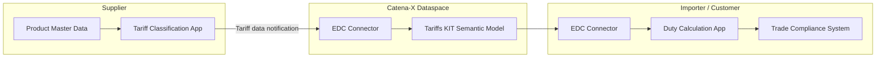

<!--
Copyright(c) 2026 Contributors to the Eclipse Foundation

See the NOTICE file(s) distributed with this work for additional
information regarding copyright ownership.

This work is made available under the terms of the
Creative Commons Attribution 4.0 International (CC-BY-4.0) license,
which is available at
https://creativecommons.org/licenses/by/4.0/legalcode.

SPDX-License-Identifier: CC-BY-4.0
-->

import Kit3DLogo from '@site/src/components/2.0/Kit3DLogo';

<Kit3DLogo kitId="tariffs" />

## Introduction

Global trade is increasingly shaped by tariffs, import duties, and trade-barrier regulations
that differ by product, origin, destination, and time period. Companies operating across
international supply chains face the challenge of accurately determining applicable tariff
classifications, calculating duty costs, and exchanging tariff-relevant product data with
their trading partners in a consistent and machine-readable format.

The **Tariffs KIT** provides a standardized, interoperable model for exchanging tariff-relevant
data within the Catena-X dataspace. It enables supply chain participants to classify goods,
share harmonized tariff codes (e.g., HS codes, CN codes), and communicate duty-relevant
product attributes in a sovereign and auditable way.

## Vision and Mission

### Vision

A world where every company in a global supply chain can instantly access, share, and act on
accurate tariff and duty data — eliminating manual lookups, reducing compliance risk, and
enabling data-driven trade decisions across organizational boundaries.

### Mission

The Tariffs KIT provides the semantic models, APIs, and integration patterns needed to
exchange tariff-relevant product data (such as HS codes, preferential origin, and tariff
classifications) through the Catena-X dataspace — enabling automated duty calculation and
regulatory compliance for all supply chain partners.

## Business Context

International trade requires precise classification of goods under tariff schedules such as
the **Harmonized System (HS)** maintained by the World Customs Organization (WCO), the EU's
**Combined Nomenclature (CN)**, or country-specific schedules. Incorrect or inconsistent
classification results in:

- **Overpayment of duties** due to wrong tariff codes
- **Compliance risk** from under-declaration of duties or incorrect origin claims
- **Manual rework** caused by inconsistent product classification across trading partners

Figure 1: High-level flow of tariff data exchange via Catena-X

The Tariffs KIT standardizes how product tariff data is structured and exchanged, reducing
manual effort and enabling automated duty calculation across the supply chain.

## Business Value

- **Automated tariff data exchange**: Replace manual Excel-based tariff lookups with
  machine-readable, Catena-X-native data flows.
- **Reduced compliance risk**: Standardized HS/CN code exchange means fewer misclassifications
  and lower exposure to customs audits and penalties.
- **Cost transparency**: Importers can accurately forecast duty costs based on supplier-provided
  tariff classifications.
- **Supplier onboarding efficiency**: New suppliers can transmit tariff-relevant product data
  in a structured, reusable format from day one.
- **Traceability**: Every tariff classification is linked to a specific product, origin, and
  version — enabling full audit trails.

## Use Cases

### 1. HS Code Sharing from Supplier to Importer

A supplier classifies their products under the relevant Harmonized System (HS) codes and
shares this data with their customer via a Catena-X notification. The customer's duty
calculation system consumes the HS code and computes the applicable import duty for the
shipment.

### 2. Preferential Origin Declaration

When goods qualify for a preferential tariff rate under a Free Trade Agreement (FTA), the
supplier attests the preferential origin and communicates it alongside the HS code. The
importer uses this to apply the reduced tariff rate and meet FTA documentation requirements.

### 3. Tariff Impact Analysis for Strategic Sourcing

Procurement teams use aggregated tariff data from multiple suppliers to model total landed
cost scenarios under different tariff regimes — supporting strategic sourcing decisions when
trade policies change (e.g., new tariffs imposed by a trading bloc).

## Key Personas

| Role | Description |
| ---- | ----------- |
| **Supplier / Exporter** | Responsible for classifying goods and providing tariff-relevant product data (HS code, preferential origin, product description). |
| **Importer / Customer** | Responsible for applying tariff classifications to calculate duties, submit customs declarations, and assess total landed cost. |
| **Trade Compliance Officer** | Validates tariff classifications, ensures FTA eligibility, and maintains audit records for customs authorities. |
| **Customs Broker** | Acts on behalf of the importer to lodge customs declarations; benefits from structured, pre-classified tariff data. |

## Standards

| Name | Description | Link |
| ---- | ----------- | ---- |
| `HS 2022` | Harmonized System — global tariff classification standard maintained by the WCO | [WCO HS](https://www.wcoomd.org/en/topics/nomenclature/overview/what-is-the-harmonized-system.aspx) |
| `CN 2026` | Combined Nomenclature — EU extension of the HS for import/export declarations | [EU CN](https://taxation-customs.ec.europa.eu/customs-4/calculation-customs-duties/customs-tariff/eu-customs-tariff-taric_en) |
| `CX-0001` | EDC Discovery API — used for partner discovery in the Catena-X dataspace | [CX-0001](https://catena-x.net/de/standard-library) |
| `CX-0018` | Dataspace Connectivity — Eclipse Data Space Connector (EDC) | [CX-0018](https://catena-x.net/de/standard-library) |

## NOTICE

This work is licensed under the [CC-BY-4.0](https://creativecommons.org/licenses/by/4.0/legalcode).

- SPDX-License-Identifier: CC-BY-4.0
- SPDX-FileCopyrightText: 2026 Contributors to the Eclipse Foundation
- Source URL: [https://github.com/eclipse-tractusx/eclipse-tractusx.github.io](https://github.com/eclipse-tractusx/eclipse-tractusx.github.io)
