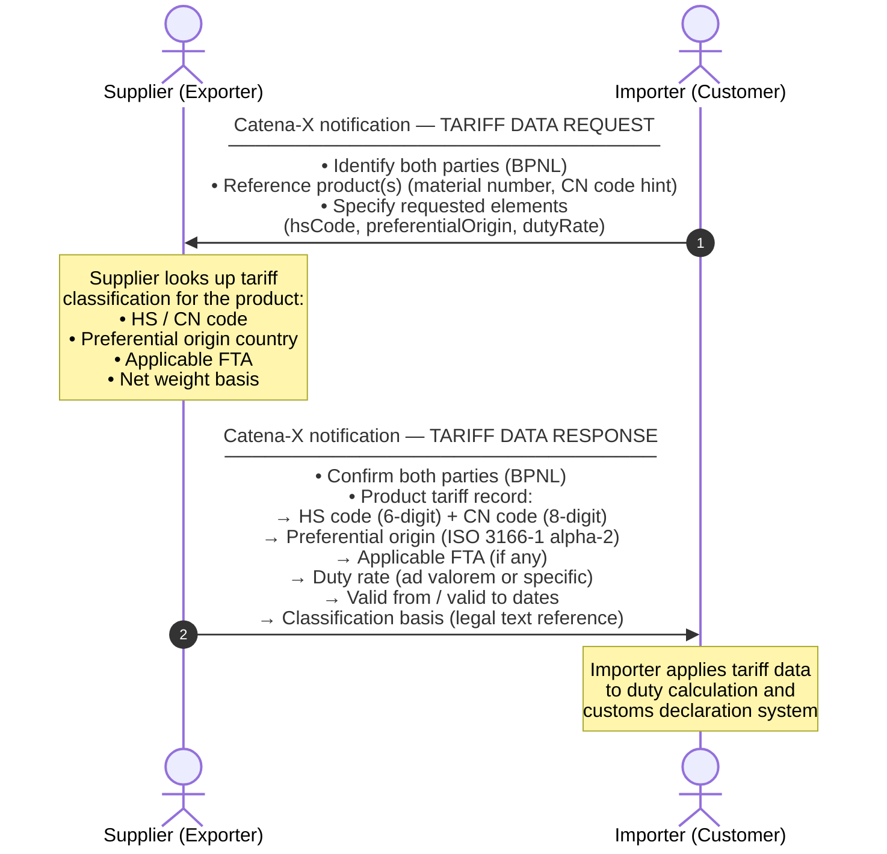

<!--
Copyright(c) 2026 Contributors to the Eclipse Foundation

See the NOTICE file(s) distributed with this work for additional
information regarding copyright ownership.

This work is made available under the terms of the
Creative Commons Attribution 4.0 International (CC-BY-4.0) license,
which is available at
https://creativecommons.org/licenses/by/4.0/legalcode.

SPDX-License-Identifier: CC-BY-4.0
-->

import Kit3DLogo from '@site/src/components/2.0/Kit3DLogo';

<Kit3DLogo kitId="tariffs" />

## Architecture Overview

The Tariffs KIT follows the standard Catena-X notification pattern. A **supplier** publishes
tariff-relevant product data via their EDC connector. An **importer** consumes this data
through their own EDC connector and processes it in their duty calculation or trade compliance
application.



## Semantic Models / Data Model

The Tariffs KIT defines two Semantic Aspect Meta Models (SAMM): one for the **tariff data
request** and one for the **tariff data response**.

### Tariff Data Request

<details>
  <summary>Tariff Data Request Model — click to expand</summary>

```json
{
  "companyIds": {
    "importerBpnl": "BPNL000000000001",
    "supplierBpnl": "BPNL000000000002"
  },
  "requestedElements": ["hsCode", "cnCode", "preferentialOrigin", "applicableFta", "dutyRate"],
  "products": [
    {
      "materialNumber": "MAT-12345",
      "productDescription": "Aluminium alloy sheet, 2mm, EN AW-5754",
      "countryOfImport": "DE",
      "referenceDate": "2026-01-01"
    }
  ]
}
```

</details>

### Tariff Data Response

<details>
  <summary>Tariff Data Response Model — click to expand</summary>

```json
{
  "companyIds": {
    "importerBpnl": "BPNL000000000001",
    "supplierBpnl": "BPNL000000000002"
  },
  "products": [
    {
      "materialNumber": "MAT-12345",
      "productDescription": "Aluminium alloy sheet, 2mm, EN AW-5754",
      "tariffClassification": {
        "hsCode": "760612",
        "cnCode": "76061210",
        "countryOfOrigin": "TR",
        "preferentialOrigin": true,
        "applicableFta": "EU-Turkey Customs Union",
        "dutyRate": {
          "type": "ad_valorem",
          "rate": 0.0,
          "currency": null,
          "basis": "CIF value"
        },
        "validFrom": "2026-01-01",
        "validTo": "2026-12-31",
        "classificationBasis": "EU Commission Regulation (EU) 2025/2551"
      }
    }
  ]
}
```

</details>

## Protocols

The Tariffs KIT uses the Catena-X **notification** exchange pattern over the **Eclipse Data
Space Connector (EDC)**. All data exchanges are:

- **Sovereign**: each party retains control over their data via usage policies
- **Auditable**: notification receipts create an immutable exchange record
- **Bilateral**: point-to-point exchanges between identified supply chain partners

| Protocol | Description | Documentation |
| -------- | ----------- | ------------- |
| EDC Notification API | Catena-X standard for asynchronous data exchange | [CX-0018](https://catena-x.net/de/standard-library) |
| DSP (Dataspace Protocol) | IDSA-based protocol for contract negotiation and data transfer | [IDSA DSP](https://docs.internationaldataspaces.org) |

## Application Programming Interfaces (API)

The Tariffs KIT notification API will be published in the Tractus-X API Hub once the SAMM
models reach a stable release. During the Sandbox phase, implementors should use the generic
EDC notification endpoint pattern described in CX-0018.

> TODO: Link to API Hub swagger once available.

## NOTICE

This work is licensed under the [CC-BY-4.0](https://creativecommons.org/licenses/by/4.0/legalcode).

- SPDX-License-Identifier: CC-BY-4.0
- SPDX-FileCopyrightText: 2026 Contributors to the Eclipse Foundation
- Source URL: [https://github.com/eclipse-tractusx/eclipse-tractusx.github.io](https://github.com/eclipse-tractusx/eclipse-tractusx.github.io)
