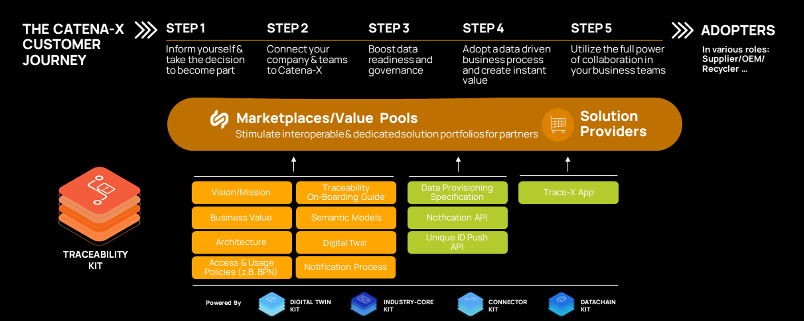

import BillOfMaterials from './../industry-core-kit/parts/bill-of-materials.mdx'

The following page offers a high level business view on the Traceability KIT with its vision, mission, benefits, business value, customer journey and examples in form of videos.

## Vision & Mission

### Vision

The aim of the Traceability KIT is to enable app- and data-providers to trace parts and materials across the entire value chain without compromising data sovereignty.

This enables the industry to narrow down quality issues faster and reduce recall costs due to fast and precise containment of defect parts.
Furthermore, it will enable solutions and services for tracking and tracing conformity relevant data to fulfill security and legal requirements.

### Mission

The Traceability KIT provides the necessary standards, aspect models, APIs, logics, and processes to develop traceability apps and provide the necessary data.
All described specifications in the KIT are based on Catena-X standards like the Industry Core KIT, Data Space Connector KIT and more to ensure interoperability and data sovereignty according to IDSA and Gaia-X principles.

This KIT is closely connected to the Industry Core KIT "Part Instance”, which provides the basis on how to built a data chain based on vehicles, parts and materials - a mandatory prerequisite.
The Traceability KIT supplements it with further tracking relevant aspects, business logic and APIs to e.g. send quality notifications or trace battery relevant aspects (e.g. GBT-Codes for China).

## Business Value & Benefits
### Business Value
Through the standardized specifications described in this Traceability KIT – for example the semantic models and APIs – application and service providers are able to develop interoperable Catena-X traceability solutions.
Since this KIT is built on the Industry Core KIT, investment and implementation costs to integrate traceability services are reduced.
Application and service providers can enter potential new markets within the PLM & Quality domain.

### Todays Challenge
From traceability's perspective, the main challenge within the automotive industry is to define and implement inter-organizational end-to-end data chains across the whole automotive supply chain to track and trace parts and materials. Details regarding the challenges are:

- Missing standards to trace serialized and non-serialized hardware and software components. This includes the datatype, data format and data description (semantics) as well as the data exchange. The existing regulatory requirements that every company within the industry faces today are being solved with individual, proprietary solutions.
These solutions are either costly due to expensive distributed ledgers or cannot guarantee trust and data sovereignty based on the GAIA-X and IDSA principles including the regulation of access and usage policies regarding data chains. Therefore, no end-to-end data exchange and cooperation has been achieved as of today.
This will be standardized in the Industry Core KIT.

- The digital maturity is diverging within the automotive industry. For bigger companies it is a challenge to receive overall structured data from multiple different suppliers on a broad scale. Smaller companies struggle to generate and provide those data in a fully digitized way.
Interoperable Catena-X traceability solutions will ensure easy onboarding and data sovereign data exchange.

- Missing standardized industry process for notifying suppliers to narrow down quality issues and sending alerts to customers in case of detected faulty components.

### Quality Notifications
Quality notifications are the best way to make customers or suppliers aware of a situation that requires timely action or attention. This could be a situation that has just arisen, or a task triggered by a workflow.
The Traceability KIT covers two different types of notifications: Quality Investigation and Quality Alert.

A quality investigation is used to try and technically narrow down the cause of a suspected problem with a serialized part or batch. To achieve this, a customer can request his supplier to investigate the affected serialized parts or batches regarding the suspected problem.

A quality alert is sent by a supplier to a customer and describes identified quality issue(s) in one or more serialized parts or batches delivered to that customer.
Thus, the quality alert - besides other information - contains a list of the affected serialized parts or batches and a description of the quality issue(s).
In the worst case, the quality alert can result in a recall of the affected serialized parts, batches or vehicles.

The following figure illustrates, how quality investigations and alerts throughout the supply chain enable quality problems to be contained quickly and precisely.

### Block Notifications

Equal to quality notifications, block notifications are a form of data exchange to transfer information about defective parts in a standardized way. Quality notifications in general and quality alerts in particular can be used for the (first) mainly **unstructured** contact between business partners to initiate e.g. a supplier self-disclosure. Block notifications, in contrast, are **structured** messages. They are used to report parts with critical defects, enriched with specific information, directly to business partners, as an immediate measure potentially following a preceding quality alert.

> :raised_hand: Detailed information of the specific data being exchanged are available in the [Development View](https://eclipse-tractusx.github.io/docs-kits/kits/traceability-kit/software-development-view/data-provider-development-view#aspect-models).

In this way, the customer can react quickly and precisely locate the parts based on the block information and sort them out at an early stage to prevent subsequent damage or major recalls and thus save costs and ensure a high quality of the vehicles, delivered to the customer. Block notifications should therefore significantly simplify the data exchange of block information in a standardized way and improve speed and quality.

The following figure gives an overview of how block notifications are exchanged between business partners:

### Special Characteristics
Special characteristics are product or process characteristics that may have an impact on safety or regulatory compliance, fit, function, performance or further processing of the product.

Special Characteristics are:

- suitable for communicating, product quality and securing in the supply chain.
- Characteristics that require increased care in order to avoid production issues and ensure the quality of the products.
- defined and recorded with the supplier during development.

Special Characteristics are divided into three categories:

- Legal / relevant to legislation / homologation,
- Safety
- Function

> :raised_hand: All products with safety or legal relevant properties, markings or functions are traceability and compliance relevant. Special Characteristics are also mentioned on VDA organization. More details can be found on [VDA home page](https://www.vda.de/de).

Data on the Special Characteristics are collected within the supply chain, but not systematically forwarded to the OEM. The aim is to improve data exchange and consistency for special characteristics.

- Data collection and provision for critical components
- Data collection for a limited period of time, when required, in the event of quality problems or as part of industrialization.

The exchange between supplier and OEM is currently done on single data exchange with special data format accepted by the partners. That means every data exchange has its single implementation. The more interfaces there are, the more difficult it becomes to manage and operate.

Catena-X is to be used for data exchange within the supply chain. Since traceability must be ensured for special characteristics, it is advisable to supplement the Catena-X Use Cases Industry Core and Traceability with an additional functionality (additional aspect model) for the special characteristics. The special characteristics will be directly linked to the digital twin.

#### Processual Approach
The target vision aims to enable an end-to-end (E2E) data exchange of special characteristics via Catena-X in three main steps:

- **Requesting Special Characteristics:** The customer should have the capability to request special characteristics from the supplier.
- **Exchanging Specification Data:** The exchange of specification data for special characteristics should be possible at the part type level.
- **Consuming Measured Data:** The customer should be able to consume the measured data (special characteristics) provided by the manufacturer.

In this development phase, both the consumer and the provider are responsible for defining a format for requesting and exchanging information on the specifications of the special characteristics. The consumption of the measurement results is based on the expansion of the digital twin to include the aspect of special characteristics as defined in the [Development View](https://eclipse-tractusx.github.io/docs-kits/kits/traceability-kit/software-development-view/data-provider-development-view#specialcharacteristics).

### Benefits for OEM, SME and Solution Provider
#### OEM
For OEM and large automotive suppliers, the traceability solution from Catena-X enables companies to identify products affected by a defect faster and more precisely and thus avoiding general and inaccurate recalls.
Through this targeted containment, companies can save both time and money with fewer actions for their customers.
Moreover, the traceability solution enables businesses to rapidly identify the affected part and the corresponding supplier after receiving an alert from the customer.
This leads to faster and, therefore, cheaper problem-solving for all parties and less complicated claim management.

Furthermore, OEMs and suppliers can prove compliance of production or products like china relevant battery traction codes or product related certificates.

#### SME
The developed and simple-to-use traceability solutions support SMEs in their mission to digitize the shop floor and communication with customers and suppliers. Today, in order to provide data to their customers and suppliers, SMEs are obligated to use several, proprietary B2B-interfaces from their customers. With Catena-X aiming to have only one digital interface for all customers and suppliers, it increases the ease of data exchange and saves IT resources.
Furthermore, due to the Catena-X data sovereignty principles, all participants know what happens with their data. This increases trust in the data exchange like quality relevant notifications.

#### Solution Provider
Solution providers have the potential to scale customer groups and access new market potentials via marketplace and shared service network.

## Customer Journey

With the Traceability KIT, we support the Catena-X customer journey for our adopters and solutions providers.

## Further Explanations

### Example - Industry Problem
Through the Industry Core KIT, companies can register digital twins for vehicles, products, components, and raw materials and uniquely identify and connect them one-up / one-down within the whole Catena-X ecosystem.
This creates a coherent end-to-end automotive data chain.
Traceability is built on top of this data chain and supplements it to e.g. start Quality Investigations and send Quality Alerts in a standardized way while already knowing which parts of your direct customer and suppliers are affected and which are not.

### Video
The following video gives an overview of the presented Traceability Use Case.

<video controls style={{width:'100%'}} controlsList="nodownload">
    <source src="https://github.com/eclipse-tractusx/eclipse-tractusx.github.io.largefiles/raw/main/traceability-kit/TRACEABILITY_VIDEO_v1.mp4"/>
</video>

## NOTICE

This work is licensed under the [CC-BY-4.0](https://creativecommons.org/licenses/by/4.0/legalcode).

- SPDX-License-Identifier: CC-BY-4.0
- SPDX-FileCopyrightText: 2023 BASF SE
- SPDX-FileCopyrightText: 2023 Bayerische Motoren Werke Aktiengesellschaft (BMW AG)
- SPDX-FileCopyrightText: 2023 Fraunhofer-Gesellschaft zur Foerderung der angewandten Forschung e.V. (represented by Fraunhofer ISST & Fraunhofer IML)
- SPDX-FileCopyrightText: 2023 German Edge Cloud GmbH & Co. KG
- SPDX-FileCopyrightText: 2023 Mercedes Benz AG
- SPDX-FileCopyrightText: 2023 Robert Bosch Manufacturing Solutions GmbH
- SPDX-FileCopyrightText: 2023 SAP SE
- SPDX-FileCopyrightText: 2023 Siemens AG
- SPDX-FileCopyrightText: 2023 T-Systems International GmbH
- SPDX-FileCopyrightText: 2023 ZF Friedrichshafen AG
- SPDX-FileCopyrightText: 2023 Contributors to the Eclipse Foundation
- Source URL: https://github.com/eclipse-tractusx/eclipse-tractusx.github.io/tree/main/docs-kits/kits/traceability-kit (latest version)
