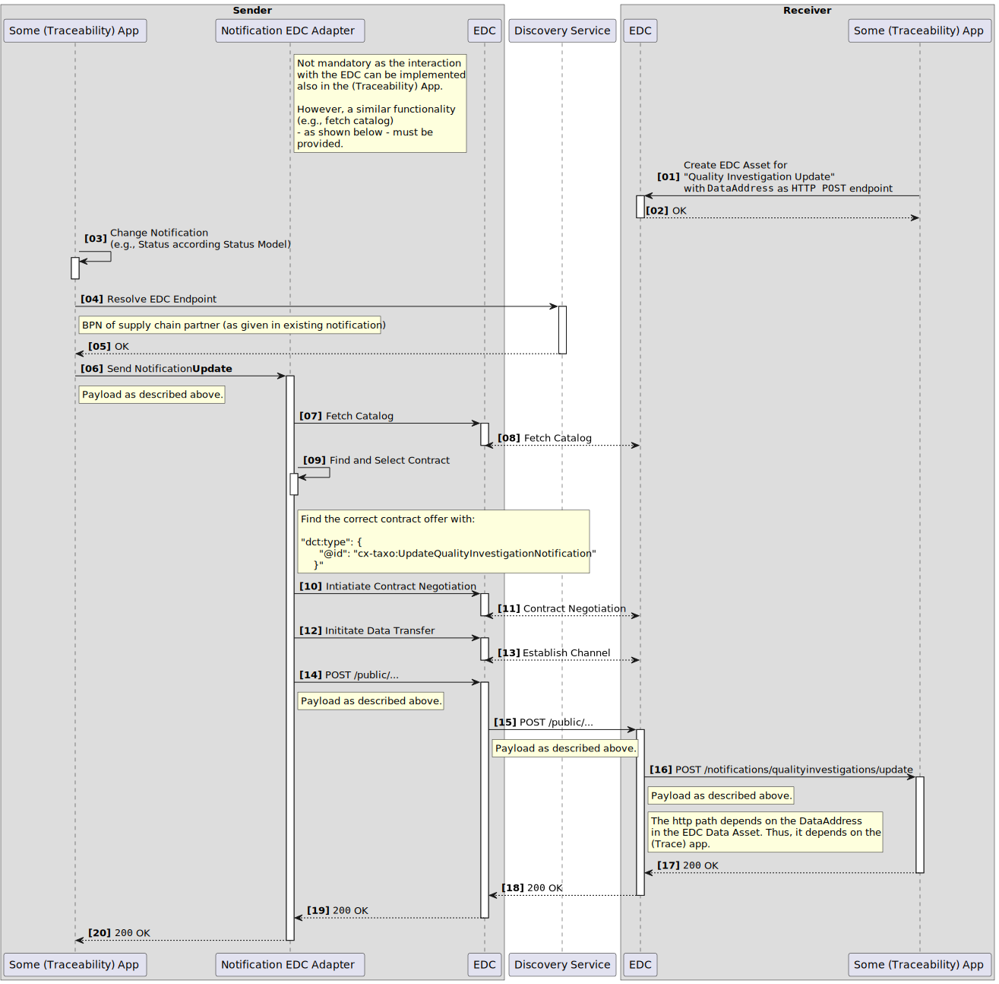

The following page offers an architecture perspective including the main building blocks and information regarding communication between different components, shown as sequence diagrams in a runtime view.

The architecture of Traceability is built upon several other components of Catena-X. You need to be familiar with these components to understand the Traceability architecture:
- Industry Core for a basic understanding of digital twins and aspect models,
- Asset Administration Shell (AAS) as the underlying standard for digital twins,
- Digital Twin Registry (DTR) as the main service to store, publish, and search digital twins, and
- A Connector as the central data sharing infrastructure of Catena-X.
    - One example is the Tractus-X EDC, based on the Connector of the Eclipse Dataspace Components (EDC)

Additionally you might make yourself familiar with
- Item Relationship Service for traversing digital twin data chains based on the Data Chain Template,
- EDC Discovery for finding the EDC of a Catena-X partner, and
- SAMM as the modelling standard for aspect models.

## Scope and Context

This KIT describes two core capabilities of Traceability:
- Data Provisioning: This capability focusses on how data providers must prepare and publish their data (from their internal systems) to participate in the Traceability use case (and other use cases that want to use Traceability data).
- Traceability App: This capability defines what mandatory features a Traceability app must provide and how to implement them to be interoperable with other Traceability apps. Additionally, optional features of Traceability apps are also included. This information is used by software vendors to develop Traceability-compliant apps for Catena-X.

## Building Block View

This overview shows the two core capabilities of Traceability and the Catena-X Core Services onto which Traceability is built and which are required by the Traceability architecture.

### Traceability Components

| Subsystem         | Description                                                                                                                                                                                                                                                                                                                                                                                                                                                                                                                                                                                                                                                                                                                                                                                                                            |
|:------------------|:---------------------------------------------------------------------------------------------------------------------------------------------------------------------------------------------------------------------------------------------------------------------------------------------------------------------------------------------------------------------------------------------------------------------------------------------------------------------------------------------------------------------------------------------------------------------------------------------------------------------------------------------------------------------------------------------------------------------------------------------------------------------------------------------------------------------------------------|
| Data Provisioning | This component extracts data from a company's internal systems,  transforms it into digital twins, and publishes these digital twins in the DTR and their data in the EDC (as submodels, based on aspect models). The published data is used by Traceability apps as well as other use cases that require Traceability data. |
| Traceability App  | A Traceability app has three core functionalities:<ul><li>providing an UI to show the parts manufactured by a company and published as digital twins</li><li>create and process quality alerts and quality investigations for quality actions</li><li>create and transfer block information in real time to separate or quarantine faulty parts in the supply chain to prevent them from being used in the production process (currently optional app feature)</li></ul>|
| Internal Systems  | These are existing internal systems of a Catena-X partner which provides data to Traceability components, e.g.,<ul><li>for data provisioning: The data provided to Catena-X is fetched from a partner's internal PLM and parts master data systems.</li><li>for Traceability apps: A Traceability app may show more data to a user than just the data that is provided to Catena-X. Generally, the business scope of COTS software is bigger than just Traceability and they have existing interfaces to fetch all data they need for their business functionality (and not only Traceability data).</li></ul>Both components can also send data back to internal systems. That's at the discretion of the Catena-X partner and neither required nor prohibited by the Traceability use case. |

### Catena-X Core Services

| Subsystem                          | Description                                                                                                                                                                                                                                                                                                                                                                                                                                                                                                                                                                     |
|:-----------------------------------|:--------------------------------------------------------------------------------------------------------------------------------------------------------------------------------------------------------------------------------------------------------------------------------------------------------------------------------------------------------------------------------------------------------------------------------------------------------------------------------------------------------------------------------------------------------------------------------|
| [Digital Twin Registry (DTR)](https://eclipse-tractusx.github.io/docs-kits/category/digital-twin-kit) | The Digital Twin Registry acts as an address book for digital twins. Data Providers register their digital twins in their own DTR. Data consumers query a DTR to find digital twins and interact with them further, i.e., fetch data for a digital twin. |
| [Item Relationship Service (IRS)](https://eclipse-tractusx.github.io/docs-kits/category/data-chain-kit/)    | The IRS builds a digital representation of a product (digital twin) and the relationships of items the product consists of in a hierarchical structure. The result is an item graph in which each node represents a digital item of the product - this graph is called "Item Graph".|
| [Eclipse Dataspace Components (EDC)](https://eclipse-tractusx.github.io/docs-kits/category/connector-kit) | The EDC as a connector implements a framework agreement for sovereign, cross-organizational data sharing. The International Data Spaces Standard (IDS) and relevant principles in connection with GAIA-X were implemented. The connector is designed to be extensible to support alternative protocols and to be integrated into different ecosystems.|
| [Discovery Service](https://eclipse-tractusx.github.io/docs-kits/kits/digital-twin-kit/software-development-view#discovery-sequence)| The EDC / dataspace discovery interface is a CX network public available endpoint which can get used to retrieve EDC endpoints and the related BPNs, as well as search for endpoints via the BPN.    |

## Data Provisioning

This capability focusses on how data providers must prepare and publish their data (from their internal systems) to participate in the Traceability use case (and other use cases that want to use Traceability data).

### Basic Data Processing Flow

The following diagram shows a basic data processing flow how a company's internal data can be transformed into a Traceability-compliant format. Implementations of data providers can deviate from this basic flow as it's just one way to do it. But it should give a basic idea what the essential steps are.

### Digital Twins and Aspect Models

Data provisioning of Traceability is built on the data provisioning of the [Industry Core KIT](../industry-core-kit/architecture-view), i.e., Traceability extends the digital twins PartType and PartInstance with additional aspect models:

- Digital Twin "PartType"
  - N/A
- Digital Twin "PartInstance"
  - Aspect model ["TractionBatteryCode"](https://eclipse-tractusx.github.io/docs-kits/kits/traceability-kit/software-development-view/data-provider-development-view#tractionbatterycode)
  - Aspect model ["SoftwareInformation"](https://eclipse-tractusx.github.io/docs-kits/kits/traceability-kit/software-development-view/data-provider-development-view#softwareinformation)
  - Aspect model ["CertificateSigningRequests"](https://eclipse-tractusx.github.io/docs-kits/kits/traceability-kit/software-development-view/data-provider-development-view#certificatesigningrequests)

Details about these aspect models, i.e., the SAMM data model as well as example data, can be found in the [Developer View](software-development-view/data-provider.mdx).

> :raised_hand: Beware that the aspect models **_SoftwareInformation_** and **_CertificateSigningRequests_** are not standardized yet, but MAY be released as standardized aspect models in future releases of the CX-0125 Traceability Use Case Standard.

### Policies

To enable data sovereignty, access and usage policies are important to protect the data assets of a data provider in the EDC, described in the following. Further details are described in the [CX - 0018 Sovereign Data Exchange](#standards) standard.

### Access Policies

To decide which company has access to the data assets, access policy should be used. Note that without protecting data assets with access policies, they become publicly available in the Catena-X network which is not recommended. Therefore, every asset should be protected and only be made available for specific companies, identified through their business partner number (BPN).

Implementation details and examples can be found [in the Industry Core KIT](../industry-core-kit/software-development-view/policies).

### Usage Policies
To decide which company can use the data asset under specific conditions, usage policies (or contract policies) are used. Therefore, they are more specific than access policies and only used just after access is granted. Currently, the usage policies aren't technically enforced but based on a legal framework (keep this in mind when publishing data assets).

Implementation details and examples can be found [in the Industry Core KIT](../industry-core-kit/software-development-view/policies.mdx).

## Traceability App

This capability defines what mandatory features a Traceability app must provide and how to implement them to be interoperable with other Traceability apps. Additionally, optional features of Traceability apps are also included. This information is used by software vendors to develop Traceability-compliant apps for Catena-X.

### Functional Requirements

| Requirement                                                | Mandatory | Description                                                                                                                                                                                                                                                                                                                                                                                                                                                                                                                                                                                                                                                                                                                                                                                                                                                                                              |
|:-----------------------------------------------------------|:---------:|:---------------------------------------------------------------------------------------------------------------------------------------------------------------------------------------------------------------------------------------------------------------------------------------------------------------------------------------------------------------------------------------------------------------------------------------------------------------------------------------------------------------------------------------------------------------------------------------------------------------------------------------------------------------------------------------------------------------------------------------------------------------------------------------------------------------------------------------------------------------------------------------------------------|
| Visualize Digital Twin Data	                               |    Yes    | A Traceability app must be able to visualize data from PartInstance digital twins. This data will also be used by quality investigations & alerts, so it's essential for a Traceability app. The data for the manufacturer's parts is retrieved from the manufacturer's internal systems; the data for built-in parts from suppliers must be retrieved from the supplier's EDC as this is a cross-company data transfer (if necessary). The data for the manufacturer's parts can be retrieved from a company's internal systems:<ul><li>via a dedicated interface for the Traceability app</li><li>via the EDC using the data also provided to other partner's in the Catena-X ecosystem</li></ul>It is not mandatory to use EDC to retrieve this data as this is not a cross-company data transfer, but a data transfer from one application of the company to another application of the company. |
| Data Sharing via [CX-0018](#standards) compliant connector |    Yes    | The data sharing with other Catena-X partners (for Traceability partners, these are their customers and suppliers mostly) must be done via via a [CX-0018](#standards) compliant connector (e.g. EDC).                                                                                                                                                                                                                                                                                                                                                                                                                                                                                                                                                                                                                                                                                                   |
| Data Sovereignty                                           |    Yes    | The usage of data in the Traceability app is compliant with the Access and Usage Policies as defined in this KIT.                                                                                                                                                                                                                                                                                                                                                                                                                                                                                                                                                                                                                                                                                                                                                                                        |
| Quality Alerts                                             |    Yes    | In the event of an incident the partner's value chain, the partner would like to be informed promptly and in a structured manner by the triggering partners (e.g., manufacturing problem, field problems) so that the partner can respond as quickly as possible (Supplier/Customer). In the same way, the partner wants to inform their value chain partners easily and specifically in the event of relevant incidents. The traceability apps are able to exchange the alerts in the same interoperable way.                                                                                                                                                                                                                                                                                                                                                                                           |
| Quality Investigations                                     |    Yes    | For a given incident in a partner's supply chain, the partner would like to be able to narrow down the affected products as sharply as possible in order to carry out suitable actions in a targeted manner. The partners in the value chain use interoperable Traceability apps for this purpose.                                                                                                                                                                                                                                                                                                                                                                                                                                                                                                                                                                                                       |
| Block Information                                          |    No     | The blocking process is a event  where faulty parts in the supply chain are separated or quarantined to prevent them from being used in the production process. Due to the criticality, this part-specific information must be forwarded to the affected manufacturers as quickly as possible so that they can react immediately to sorting out the corresponding components. To overcome this challenge, this information is provided and transmitted via a standardized API.                                                                                                                                                                                                                                                                                                                                                                                                                           |

### Non-Functional Requirements

There are no non-functional requirements defined for this release.

### Quality Investigations & Quality Alerts

Notifications are - in contrast to classical data offers - a way to push data from a sender to a receiver. In the below paragraphs, the implementation is described to realize quality notifications. In that sense, the below specification has not the scope and intention to be a general solution pattern for notifications across various use cases. For now, it is limited to the sending and receiving of quality notifications as well as the update of the notification status (following a predefined status model).

> :raised_hand: Detailed Open API specifications for Quality Alerts & Investigations are available in the Software Development View. For the current release, [version 1.2.1](https://eclipse-tractusx.github.io/api-hub/eclipse-tractusx.github.io/kit-traceability-notifications-openAPI-1.2.1/swagger-ui/) is mandatory and must be supported by every App provider. The newer [version 2.0.0](https://eclipse-tractusx.github.io/api-hub/eclipse-tractusx.github.io/kit-traceability-notifications-openAPI-2.0.0/swagger-ui/) can be supported optionally.

#### Notification State Model

The notification itself has various states. The states and their cycle are described in the following figure:

### Block Information

The blocking process is a process in the automotive industry to segregate or quarantine nonconforming parts in the supply chain to prevent using them in the production process. Therefore, the supplier must send all relevant information to the customer, so that he is able to identify the affected parts for example at the assembly line or in logistics.

Catena-X is to be used to transfer this information in a standardized manner and to trace the individual parts back to see whether they have been blocked and sorted out on the customer side in order to prevent subsequent damage or major product recalls. In addition, the notification is intended to improve the quality and speed of the block information provided.

#### Block Notification Interaction

The interaction of block notifications is based on events that can be triggered by both the sender and the recipient. These events are represented by a status model and are used to track the progress of the parts that need to be blocked or respectively sorted out by the customer. Details about these status model and the Open API specification for Block Notifications are available in the [Developer View](software-development-view/data-provider.mdx).

> :raised_hand: Note that (from the current 25.09 release on) the Block Notification has always to be referred to the initial problem/defect via a problem ID. The initial problem/defect is the problem the Block Notification, as delemitation, was requested for. The infomation has to be provided via the data field "problemID" in the relevant notification. In this way, the Block Notification for a part can always be assigned to the correct defect, in the event of multiple defects for one particular part. This assignment is particularly also important in the event of an update.

**Scenario 1:** In this case, it is assumed that the sender sends a list of parts with the associated block information to the recipient. The block status of each part is set to ACTIVE by default.

When all block information has been received by the recipient, checked internally, further processed and finally all affected parts were blocked or sorted out, this information is sent back to the sender through a status update (PART_BLOCKED).

> :raised_hand: Note that the update notification whether one or more parts have been blocked and therefore sorted out by the customer is **not mandatory**. The decision to provide suppliers with this information through a feedback notification **MUST** have been negotiated and accepted by both business partners before implemented.

**Scenario 2:**
In this case, the sender identified that the block information sent from Scenario 1 was sent incorrectly or unintentionally.

In order to inform the recipient of this error, the block status of the affected parts is set to CANCELED via an update notification, so that these parts cannot be sorted out and used to be installed by the recipient.

> :raised_hand: The CANCELED status can also be updated by the recipient if it has been determined that the part(s) are faultless and therefore does not need to be sorted out.

## Runtime View

In the sub-sections below the sequence for sending, updating and resolving of notifications between (traceability) applications is shown with UML sequence diagrams. In all cases, Http POST requests are used. Those Http endpoints are described in the corresponding sections:
- [(TRS) Quality Notification Endpoints](https://eclipse-tractusx.github.io/docs-kits/kits/traceability-kit/software-development-view/app-provider#quality-notifications)
- [Block Notification Endpoints](https://eclipse-tractusx.github.io/docs-kits/kits/traceability-kit/software-development-view/app-provider#block-notifications)
- [EDC Contract Offerings](https://eclipse-tractusx.github.io/docs-kits/kits/traceability-kit/software-development-view/app-provider#asset-registration-via-connector).

To read the UML sequence diagrams correctly, some remarks:

- The shown Notification EDC Adapter is not mandatory. It is just one option to send a notification via the EDC control and data plane. Important is that a similar functionality must be provided/implemented by the (traceability) application vendor. The Notification EDC Adapter or a similar component / functionality will not be provided as a central service from Catena-X.
- To know where a notification must be send to, the (traceability) application must resolve the BPN of the receiver. This can either be happen because the (traceability) application has this information in its data model or it could - alternatively - also be resolved e.g. via a lookup of the digital twin in the central asset administration shell (AAS) registry.

- The resolution of the EDC URL for a given BPN is done via the Discovery Service API. The entry for each EDC into this Discovery Service is done via the CX Portal.
- In each UML sequence diagram the step [01] describes the publishing of the notification endpoints as described in the above sections
- Similarly, the Http POST request and response bodies are described in the above sections

### Processes for Sending, Updating and Resolving Quality Notifications

#### Sending and Receiving of a Quality Investigation

Below, the UML sequence diagram to send and receive a quality investigation is depicted. In addition to the above mentioned general remarks, the following remark:

- The status transition from SENT to RECEIVED has to be done by the sender once it received the Http status code 201 from the receiver

#### Sending and Receiving of a Quality Alert
> :raised_hand: The (traceability) applications that fully rely on the AAS registry and the corresponding AAS submodels can only support quality investigations. With the release of the AAS submodel SingleLevelUsageAsBuilt or a similar AAS submodel that contains the information, which supply chain partner purchased/assembled a part / batch, it is possible to also support quality alerts for those (traceability) applications.

Below, the UML sequence diagram to send and receive a quality alert is depicted. In addition to the above mentioned general remarks, the following remark:

- The status transition from SENT to RECEIVED has to be done by the sender once it received the Http status code 201 from the receiver

#### Update of a Quality Investigation

Below, the UML sequence diagram to update a quality investigation is depicted.

#### Update of a Quality Alert
> :raised_hand: The (traceability) applications that fully rely on the AAS registry and the corresponding AAS submodels can only support quality investigations. With the release of the AAS submodel SingleLevelUsageAsBuilt or a similar AAS submodel that contains the information, which supply chain partner purchased/assembled a part / batch, it is possible to also support quality alerts for those (traceability) applications.

Below, the UML sequence diagram to update a quality alert is depicted.

### Processes for Sending, Updating and Resolving Block Notifications

#### Sending and Receiving of Block Information
Below, the UML sequence diagram to send and receive a block information is depicted.

#### Update of Block Information
Below, the UML sequence diagram to update a block information is depicted.
> :raised_hand: The process for sending update notifications regarding an ongoing blocking process must be carried out in the same way as sending block information for the first time. The differences are limited to the following changes:
> - Another data asset “BlockNotificationStatusUpdate” is used for the update
> - The data model of the notification is limited to the ID and block status of a part and therefore does not include full block information
> - Both 'CANCELED' and 'PART_BLOCKED' can be set for the status depending on which case applies to the notification

## Standards

Our relevant standards can be downloaded from the official [Catena-X Standard Library](https://catena-x.net/de/standard-library):

- Traceability is built on the Industry Core. Please check the relevant [standards of the Industry Core](../industry-core-kit/architecture-view#standards).
- [CX - 0125 Traceability Use Case v2.0.0](https://catenax-ev.github.io/docs/next/standards/CX-0125-TraceabilityUseCase)

## NOTICE

This work is licensed under the [CC-BY-4.0](https://creativecommons.org/licenses/by/4.0/legalcode).

- SPDX-License-Identifier: CC-BY-4.0
- SPDX-FileCopyrightText: 2023 BASF SE
- SPDX-FileCopyrightText: 2023 Bayerische Motoren Werke Aktiengesellschaft (BMW AG)
- SPDX-FileCopyrightText: 2023 Fraunhofer-Gesellschaft zur Foerderung der angewandten Forschung e.V. (represented by Fraunhofer ISST & Fraunhofer IML)
- SPDX-FileCopyrightText: 2023 German Edge Cloud GmbH & Co. KG
- SPDX-FileCopyrightText: 2023 Mercedes Benz AG
- SPDX-FileCopyrightText: 2023 Robert Bosch Manufacturing Solutions GmbH
- SPDX-FileCopyrightText: 2023 SAP SE
- SPDX-FileCopyrightText: 2023 Siemens AG
- SPDX-FileCopyrightText: 2023 T-Systems International GmbH
- SPDX-FileCopyrightText: 2023 ZF Friedrichshafen AG
- SPDX-FileCopyrightText: 2023 Contributors to the Eclipse Foundation
- Source URL: https://github.com/eclipse-tractusx/eclipse-tractusx.github.io/tree/main/docs-kits/kits/traceability-kit (latest version)
