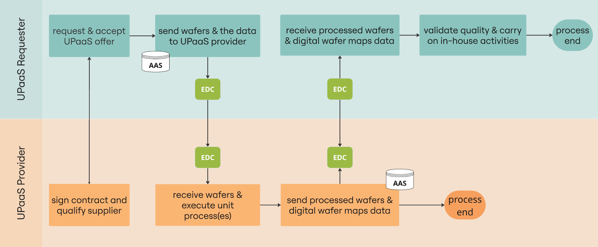
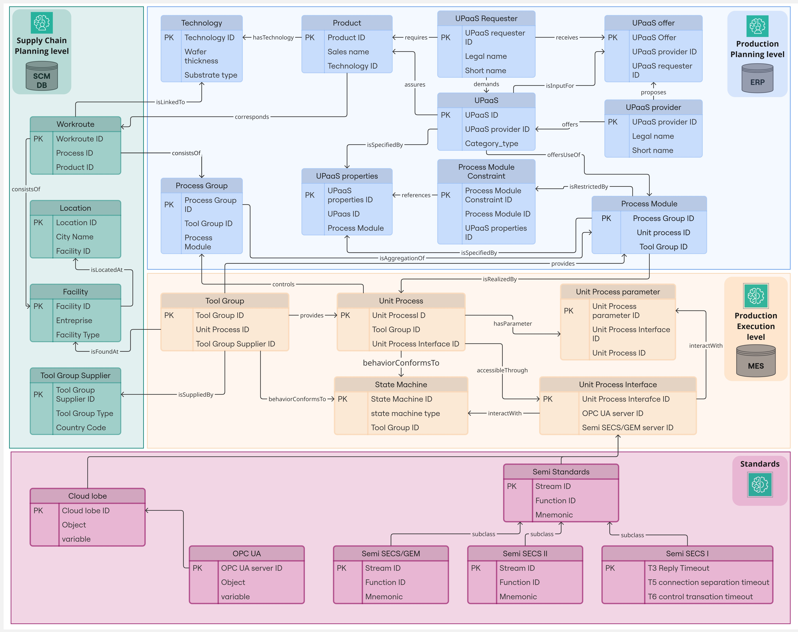
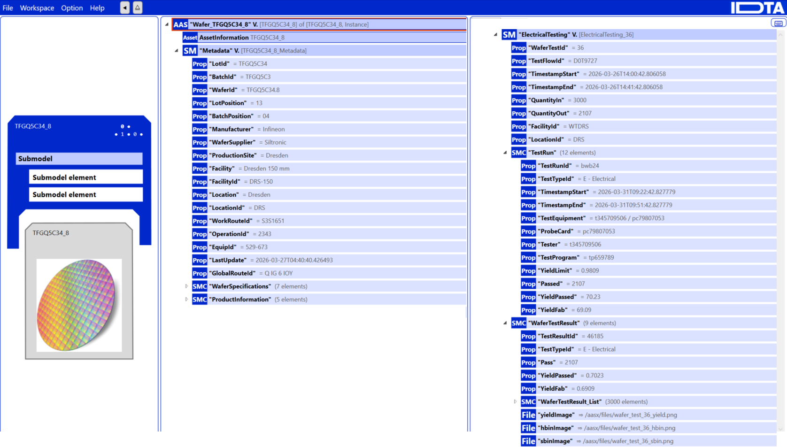

<!--
Copyright(c) 2026 Contributors to the Eclipse Foundation

See the NOTICE file(s) distributed with this work for additional
information regarding copyright ownership.

This work is made available under the terms of the
Creative Commons Attribution 4.0 International (CC-BY-4.0) license,
which is available at
https://creativecommons.org/licenses/by/4.0/legalcode.

SPDX-License-Identifier: CC-BY-4.0
-->

<!-- 
KIT LOGO START - Generated automatically from the configuration done in Kit Master Data
Replace  Unit-Process-as-a-Service with the id from your kit referenced in `data/kitsData.js`.
Do not remove!
This logo is only visible when compiled with Docusaurus (final version of the hosted KIT)
-->

import Kit3DLogo from '@site/src/components/2.0/Kit3DLogo';

<Kit3DLogo kitId="unit-process-as-a-service" />

<!--
KIT LOGO END
-->

## Introduction

<!-- Describe what problem this KIT solves and who benefits from it. -->

The Unit-Process-as-a-Service (UPaaS) KIT enables companies to outsource individual semiconductor manufacturing unit steps — from frontend processes like wafer testing to backend processes like packaging and assembly — in a standardized, data-sovereign way, without exposing confidential fab data. Unlike general manufacturing marketplaces, UPaaS operates at the granularity of a single unit process within the semiconductor value chain, combining physical material exchange with a structured digital twin handoff. In its current implementation, which focuses on wafer testing, the primary stakeholders are semiconductor manufacturers, foundries, integrated device manufacturers (IDMs), outsourced semiconductor assembly and test providers (OSATs), and equipment providers participating in outsourced wafer-testing workflows.

## Vision and Mission

<!-- What is the long-term goal? What does the KIT deliver today? Problem statement -->

### Vision

Semiconductor supply chains are uniquely fragile: long process times, around-the-clock fabs, short product life cycles, and extreme capital intensity mean a single disruption — geopolitical, pandemic, or natural — can propagate across the entire global value chain. The vision of this KIT is a European semiconductor ecosystem where individual unit processes — whether in wafer fabrication, wafer testing, packaging, or assembly — can be commercially exchanged as modular, trusted services between qualified partners, without lock-in, without exposing proprietary process data, and without requiring custom bilateral integration for each new partner relationship. In this long-term vision, the ecosystem also includes startups, research institutions, and small pilot lines as additional process steps are standardized beyond wafer testing.

### Mission

The UPaaS KIT delivers the building blocks for standardized, execution-level unit process exchange in semiconductor manufacturing. Concretely, it provides:

- A semiconductor-specific semantic data model built on the Digital Reference ontology, covering technologies, workroutes, process groups, and unit processes across the full semiconductor value chain
- Business Process Model and Notation (BPMN) 2.0 workflows formalizing the requester-provider interaction from offer to physical execution and digital data return
- Asset Administration Shell (AAS) submodel templates for wafer testing (Metadata + Electrical Testing) aligned with Industrial Digital Twin Association (IDTA) conventions, designed to be extensible to other unit processes such as packaging or final test
- A Qualified Synthetic Data (QSD) pipeline to enable realistic but non-confidential exchange of wafer-testing data
- Secure, policy-controlled data exchange via the Eclipse Dataspace Connector (EDC)

The first reference scenario is wafer testing as a frontend unit process, but the semantic model, AAS submodel structure, and EDC exchange mechanism are designed to be transferable to both other frontend unit processes and backend unit processes like packaging and assembly.

## Chances & Risks

The adoption of UPaaS opens up tangible growth opportunities for the European semiconductor
ecosystem, while also introducing risks that must be actively managed. Importantly, each risk
carries an inherent growth opportunity: addressing it not only removes a barrier but strengthens
the overall model. The following chances and risks are prioritized by their expected impact and
the resources required to address them (see Figure 1).


Figure 1: Chances and risks of UPaaS, plotted by impact and prioritization (resource allocation).

### Chances

**1 – Increased Resilience (Resi):** The ability to flexibly source unit-process services from
different marketplace providers directly addresses the fragility of semiconductor supply chains.
Companies can react to disruptions and absorb demand volatility (bullwhip-effect) without
requiring dedicated backup capacity — converting a structural weakness of the industry into a
competitive advantage.

**2 – Economies of Scale (Econ):** By accessing specialized manufacturing capabilities through
an open marketplace, participants reduce individual capital investment while increasing overall
utilization across the ecosystem. Shared infrastructure can unlock efficiency gains that no single player could achieve alone.

**3 – Faster Innovation Adoption (Inno):** Standardized interfaces and semantic models lower
the barrier for introducing and spreading new technologies across sites. A new process or tool
integrated once into the UPaaS framework becomes immediately accessible to all marketplace
participants.

### Risks — and how to turn them into Opportunities

**4 – Dependence on Data-Exchange Infrastructure (Dep):** Reliable UPaaS services require
functioning, secure data-sharing platforms. This risk is best mitigated by building on proven,
open-source infrastructure (e.g. Eclipse Dataspace Connector) with defined governance — turning
a technical dependency into a shared, resilient foundation for the entire ecosystem.

**5 – Legal Issues / Data Sovereignty (Legal):** Cross-company data transactions raise questions
around data ownership, sovereignty, and liability. Proactively establishing clear data-sharing
agreements and leveraging Open Digital Rights Language (ODRL)-based usage policies within the EDC transforms legal uncertainty
into a trust-building mechanism that lowers the entry barrier for new participants.

**6 – Market Adoption Uncertainty (Adop):** If companies hesitate to join, the UPaaS model
cannot achieve its intended impact. Mitigating this risk through reference implementations,
demonstrable business value, and a low-friction onboarding experience converts early adopters
into multipliers — each successful integration reduces uncertainty for the next participant.

## Business Context

<!-- Describe the business process or domain this KIT addresses. If a use case describe the use case. -->

The semiconductor value chain spans a sequence of highly specialized steps — from frontend processes like lithography, etching, and wafer testing to backend processes like dicing, packaging, and final assembly — each requiring specific equipment, certifications, and process know-how. In a UPaaS scenario, a semiconductor manufacturer (Requester) ships physical materials (e.g. wafers, dies, or partial assemblies) to a qualified external partner (Provider) to perform a specific unit process step, then receives both the processed materials and the corresponding digital results packaged as AAS digital twins. The marketplace orchestrates the service request, offer, contract, and data exchange lifecycle across company boundaries. The business process of UPaaS is illustrated in the swimlane diagram below (Figure 2).

Key stakeholders:

- **UPaaS Requester** — a semiconductor manufacturer (e.g. IDM or fabless company) seeking flexible access to a specific unit process it cannot or does not want to perform in-house
- **UPaaS Provider** — a qualified fab, OSAT, or equipment operator offering certified unit process capability
- **Marketplace operator** — governing the trust framework and the Semiconductor-X data space infrastructure


Figure 2: Business process of UPaaS, illustrating the main interactions between the UPaaS Requester and UPaaS Provider.

## Business Value

<!-- Describe why this KIT is attractive for service providers to be implemented -->

For **Providers**, implementing UPaaS unlocks new revenue from underutilized capacity without requiring custom bilateral integration per customer — the standardized AAS and EDC interfaces handle the data handoff. For **Requesters**, it enables access to qualified unit process capacity on demand, reducing the need for full fab ownership and shortening recovery time after disruptions. At the ecosystem level, UPaaS contributes to the goals of the European Chips Act by enabling capacity sharing between European semiconductor players, reducing single-point-of-failure dependencies, and improving the agility of the European semiconductor supply chain against geopolitical risk.

## Semantic Models / Data Model

<!-- Reference the relevant semantic models, APIs, or standards. -->

Unlike general-purpose manufacturing capability models, the UPaaS data model is grounded in semiconductor-specific semantics. It is represented as an RDF ontology built on the **Digital Reference (DR)** — a semantic vocabulary for semiconductor supply chains developed in the EU Productive4.0 project and extended in SC³ and Semiconductor-X. The model is structured across three levels covering the full semiconductor value chain:

- **Supply chain level** — workroutes, facilities, and tool group suppliers across both frontend and backend
- **Production planning level** — products, technologies (e.g. IGBT, MOSFET, SiC), requester/provider interaction, UPaaS offers, process groups, and process module constraints
- **Production execution level** — unit processes, parameters, interfaces (OPC UA, Semi SECS/GEM), and state machines

A visual representation of the semantic data model is shown in Figure 3.

The **Wafer Testing AAS submodel** is the first concrete instantiation of this model, organizing data into two blocks aligned with IDTA conventions:

- **Metadata** — lot ID, wafer ID, facility, routing, timestamps, input/output quantities
- **Electrical Testing** — die-level pass/fail, hard/soft bin classifications, yield metrics, wafer map images

Primary attributes were derived from Infineon's synthetic wafer-testing datasets to ensure industrial relevance. The structure is designed to be extensible to other unit processes such as packaging or final test. The wafer Digital Twin is depicted in Figure 4.

<!-- QSD maybe not relevant for the KIT as only for testing 

The **Qualified Synthetic Data (QSD)** pipeline generates realistic wafer-testing datasets — combining wafer geometry, stochastic defects, and position-dependent edge effects — without exposing confidential production data. Output formats include JSON, CSV, and wafer-map visualizations (yield mode and HBIN mode).
-->


Figure 3: A visual representation of the UPaaS semantic data model.


Figure 4: Wafer Digital Twin shown in the AASX Package Explorer, including the "Metadata" and "Electrical Testing" submodels.

<details>
  <summary>Wafer Testing AAS Submodel – Metadata (click to expand)</summary>

```json
{
  "Metadata": {
    "LotId": "string",
    "BatchId": "string",
    "WaferId": "string",
    "LotPosition": "integer",
    "BatchPosition": "integer",
    "Manufacturer": "string",
    "WaferSupplier": "string",
    "ProductionSite": "string",
    "Facility": "string",
    "FacilityId": "string",
    "Location": "string",
    "LocationId": "string",
    "WorkRouteId": "string",
    "OperationId": "string",
    "EquipId": "string",
    "LastUpdate": "datetime",
    "GlobalRouteId": "string",
    "WaferSpecifications": {
      "Diameter": "float",
      "BaseMaterial": "string",
      "ThicknessRaw": "float",
      "ThicknessFinished": "float",
      "Dopant": "string",
      "IngotPulling": "string",
      "ResistivityClass": "float"
    },
    "ProductInformation": {
      "ProductNumber": "string",
      "Technology": "string",
      "BasicType": "string",
      "ChipsPerWafer": "integer",
      "ChipSize": "string"
    }
  }
}
```

</details>

<details>
  <summary>Wafer Testing AAS Submodel – Electrical Testing (click to expand)</summary>

```json
{
  "ElectricalTesting": {
    "WaferTestId": "integer",
    "TestFlowId": "string",
    "TimestampStart": "datetime",
    "TimestampEnd": "datetime",
    "QuantityIn": "integer",
    "QuantityOut": "integer",
    "FacilityId": "string",
    "LocationId": "string",
    "TestRun": {
      "TestRunId": "string",
      "TestTypeId": "string",
      "TimestampStart": "datetime",
      "TimestampEnd": "datetime",
      "TestEquipment": "string",
      "ProbeCard": "string",
      "Tester": "string",
      "TestProgram": "string",
      "YieldLimit": "float",
      "Passed": "integer",
      "YieldPassed": "float",
      "YieldFab": "float"
    },
    "WaferTestResult": {
      "TestResultId": "integer",
      "TestTypeId": "string",
      "Pass": "integer",
      "YieldPassed": "float",
      "YieldFab": "float",
      "DieResults": [{
        "DieId": "string",
        "HBIN": "string",
        "SBIN": "string",
        "Pass": "string",
        "DieLocation": "string"
      }]
    }
  }
}
```

</details>

## Use-Case: Offering wafer testing & metrology capacities between fabs and companies

The reference use case for the UPaaS KIT is the offering of wafer testing and metrology capacities between semiconductor fabs and companies, originating from Use Case 3.2.3 of the Semiconductor-X project. It covers two complementary scenarios driven by the same root cause: semiconductor fabs typically operate metrology and wafer testing equipment at around 80% capacity utilization, leaving approximately 20% idle. This unused capacity can be mobilized to harvest growth opportunities or to mitigate the impact of disruptions such as equipment failures, geopolitical tensions, or demand spikes.

### Sub-Use Case 1: Metrology Capacity Sharing Within a Production Network (Intra-Company)

A fab within a company's production network experiences a bottleneck at its metrology equipment — caused by increased demand, a tool failure, or a supply disruption. A sister site with available metrology capacity offers its unused slots through the marketplace. The UPaaS Requester and Provider are sites within the same organization, which reduces the data-sensitivity threshold but still requires standardized interfaces to avoid bespoke point-to-point integrations between internal systems.

### Sub-Use Case 2: Wafer Testing Capacity Sharing Between Companies (Inter-Company)

A semiconductor manufacturer cannot execute wafer testing in-house and seeks a qualified external partner via the marketplace. The Provider — a certified OSAT or fab — receives the physical wafers, executes the testing unit process, and returns both the processed wafers and the corresponding digital results as an AAS digital twin (Wafer Testing submodel + wafer maps) via the EDC. This scenario involves a full cross-company data exchange under defined access and usage policies, and requires both parties to be enrolled as trusted partners in the UPaaS data space.

### Scope Comparison

| | Metrology (Intra-Company) | Wafer Testing (Inter-Company) |
|---|---|---|
| **Trust boundary** | Within one organization | Between separate legal entities |
| **Physical exchange** | Equipment capacity shared internally | Physical wafers shipped to external provider |
| **Data sensitivity** | Lower — internal process data | Higher — proprietary test results and wafer maps |
| **AAS exchange** | Lightweight | Full Wafer Testing submodel + wafer maps |
| **EDC policies** | Internal access control | Full ODRL-based access and usage policies |

Both sub-use cases are served by the same UPaaS semantic model and business process structure described above.

## Reference Implementation

The UPaaS concept has been validated through a technical demonstration
between Infineon Technologies AG and OPAIX. The demonstration covers
end-to-end exchange of wafer-testing data between a UPaaS requester
and provider via a policy-controlled dataspace connection, confirming
the feasibility of the proposed marketplace model.

For full technical details see the
[Development View](../development-view/development-view.md) and the
[UPaaS Technical Demo Repository](https://github.com/Abdelgafar-copilot/UPaaS-QSD-Code).

## Relation to other KITs

The UPaaS KIT builds on and complements several existing Tractus-X KITs:

| KIT | Relation |
| --- | -------- |
| [Connector KIT](../../connector-kit/adoption-view/adoption-view.md) | Provides the EDC/Dataspace Protocol foundation used for the policy-controlled exchange of UPaaS assets. |
| [Digital Twin KIT](../../digital-twin-kit/adoption-view.md) | Defines the AAS-based digital twin infrastructure; the UPaaS Wafer Testing Submodel follows these conventions. |
| [MaaS KIT](../../manufacturing-as-a-service-kit/adoption-view.md) | Addresses marketplace-based offering of complete manufacturing services; UPaaS complements this at the granularity of individual semiconductor unit processes (e.g. wafer testing). |

## Standards

<!-- Provide a list of standards this KIT. -->

| Name | Description | Link to standard |
| ---- | ----------- | ---------------- |
| `Digital Reference (DR)` | Semiconductor-specific semantic vocabulary (from EU Productive4.0 / SC³) used as the ontological foundation; covers products, unit processes, tool groups, and facilities | [ifx-dr.github.io](https://ifx-dr.github.io/DigitalReference/) |
| `IDTA AAS Submodel Templates` | AAS meta-model conventions used to structure the wafer testing digital twin with IDTA-compliant IdShorts, cardinality, and data types | [industrialdigitaltwin.org](https://industrialdigitaltwin.org) |
| `BPMN 2.0` | Used to formalize the UPaaS requester-provider workflow as a swimlane model covering service request, offer, contract, execution, and data return | [omg.org](https://www.omg.org/bpmn/) |
| `Eclipse Dataspace Connector (EDC)` | Open-source framework for ODRL policy-controlled, sovereign data exchange; used to transfer AAS packages between requester and provider | [eclipse.org/edc](https://projects.eclipse.org/projects/technology.edc) [eclipse-tractusx/tractusx-edc](https://github.com/eclipse-tractusx/tractusx-edc) |
| `SEMIKONG` | Open-source semiconductor domain foundation model used alongside the DR for common semantics in process and technology description | [arxiv.org](https://arxiv.org/abs/2411.13802) |
| `ECLASS` | Economic Classification System used for cross-vendor semantic interoperability in AAS-based machine identification | [eclass.eu](https://eclass.eu) |
| `OPC UA` | Industrial communication standard used as a unit process interface specification within the AAS execution model | [opcfoundation.org](https://opcfoundation.org) |
| `Semi SECS/GEM (SEMI E5/E30)` | Semiconductor equipment communication standard used as the primary fab-floor interface for unit process execution and monitoring | [semi.org](https://www.semi.org) |
| `ODRL` | Open Digital Rights Language used by the EDC to define and enforce access and usage policies during data exchange | [w3.org](https://www.w3.org/TR/odrl-model/) |

## Further Resources

- [Catena-X standard library](https://catenax-ev.github.io/docs/next/standards/overview)
- [Semiconductor-X project](https://semiconductor-x.com)
- [Eclipse Dataspace Connector (EDC)](https://github.com/eclipse-edc/Connector)
- [UPaaS Technical Demo Repository (QSD + EDC)](https://github.com/Abdelgafar-copilot/UPaaS-QSD-Code)

## NOTICE

This work is licensed under the [CC-BY-4.0](https://creativecommons.org/licenses/by/4.0/legalcode).

- SPDX-License-Identifier: CC-BY-4.0
- SPDX-FileCopyrightText: 2026 Infineon Technologies AG
- SPDX-FileCopyrightText: 2026 Fraunhofer-Gesellschaft zur Förderung der angewandten Forschung e.V. (Fraunhofer-Institut für Werkzeugmaschinen und Umformtechnik IWU)
- SPDX-FileCopyrightText: 2026 EXPO21XX GmbH
- SPDX-FileCopyrightText: 2026 Contributors to the Eclipse Foundation
- Source URL: [https://github.com/eclipse-tractusx/eclipse-tractusx.github.io](https://github.com/eclipse-tractusx/eclipse-tractusx.github.io)
