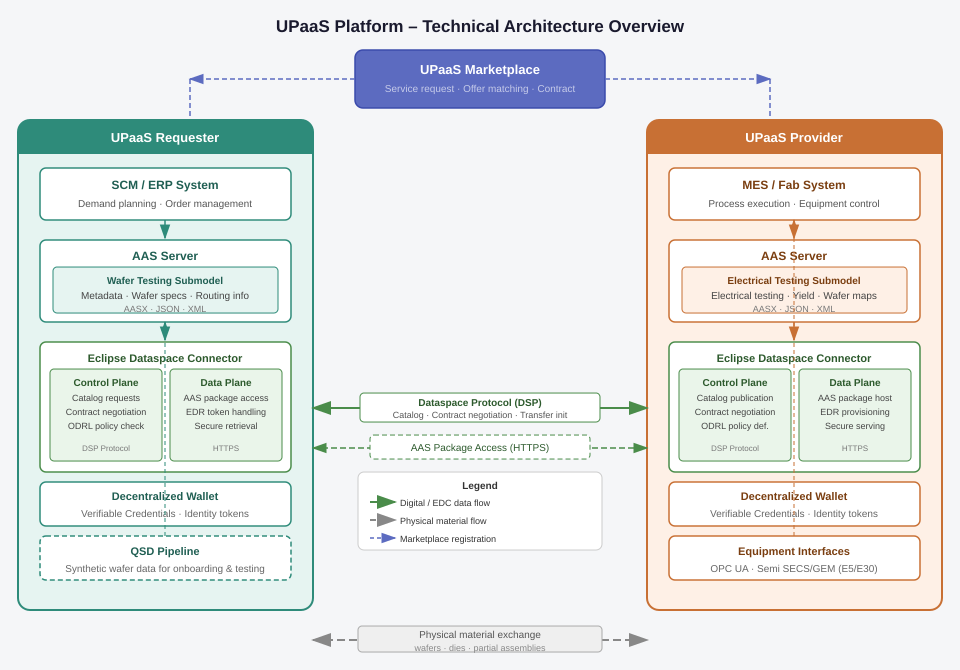
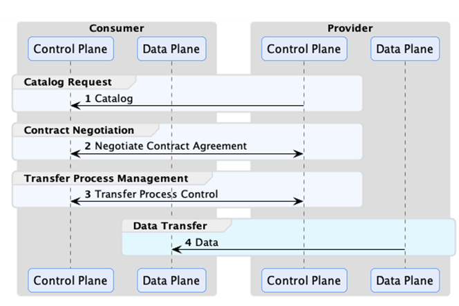

<!--
Copyright(c) 2026 Contributors to the Eclipse Foundation

See the NOTICE file(s) distributed with this work for additional
information regarding copyright ownership.

This work is made available under the terms of the
Creative Commons Attribution 4.0 International (CC-BY-4.0) license,
which is available at
https://creativecommons.org/licenses/by/4.0/legalcode.

SPDX-License-Identifier: CC-BY-4.0
-->

<!-- 
KIT LOGO START - Generated automatically from the configuration done in Kit Master Data
Replace  Unit-Process-as-a-Service with the id from your kit referenced in `data/kitsData.js`.
Do not remove!
This logo is only visible when compiled with Docusaurus (final version of the hosted KIT)
-->

import Kit3DLogo from '@site/src/components/2.0/Kit3DLogo';

<Kit3DLogo kitId="unit-process-as-a-service" />

<!--
KIT LOGO END
-->

## Architecture Overview

<!-- High-level diagram of the technical approach. -->

The UPaaS platform connects a **UPaaS Requester** and a **UPaaS Provider** through a shared marketplace and a sovereign data exchange layer. Each party operates its own infrastructure independently; the Eclipse Dataspace Connector (EDC) serves as data connector between them. A visualization of the architecture is provided below in Figure 1:



Figure 1: High-Level Architecture of the UPaaS marketplace platform

**Requester infrastructure** consists of an SCM/ERP system that initiates service requests, an AAS Server hosting the Wafer AAS, consisting of metadata and electrical testing data submodels (Metadata block: lot, wafer specs, routing), an EDC instance that **acts as the EDC provider**: it creates and publishes the EDC asset referencing the AAS Server endpoint, defines ODRL-based access and usage policies, and creates the contract definition that the UPaaS Provider must agree to before retrieving the data, and a **Decentralized Wallet** that stores Verifiable Credentials used to prove the requester’s identity and membership within the dataspace following the [Decentralized Claims Protocol (DCP)](https://eclipse-dataspace-dcp.github.io/decentralized-claims-protocol/v1.0.1/). A QSD pipeline is provided for onboarding and integration testing, generating synthetic but structurally realistic wafer datasets without exposing confidential production data.

**Provider infrastructure** mirrors this structure: a MES or fab system drives process execution and captures test results via equipment interfaces (OPC UA, Semi SECS/GEM), which are surfaced through an AAS Server hosting the Wafer AAS, consisting of metadata and electrical testing data submodels (die-level results, yield metrics, wafer maps). The provider’s EDC **acts as the EDC consumer**: it browses the UPaaS Requester’s catalog, initiates contract negotiation, and retrieves the resulting AAS package from the UPaaS Requester’s AAS Server once a contract has been agreed upon. A **Decentralized Wallet** stores the provider’s Verifiable Credentials and supports token-based identity verification during dataspace interactions. More information about the EDC can be found in the [Connector KIT](https://eclipse-tractusx.github.io/docs-kits/next/kits/connector-kit/adoption-view/).

**Data exchange** between the two EDC instances follows two layers:

- The **Control Plane** exchanges catalog, contract negotiation, and transfer initiation messages via the Dataspace Protocol (DSP).
- The **Data Plane** performs the actual AAS package transfer over HTTPS once a contract agreement is established, using Endpoint Data References (EDRs) for token-authenticated retrieval.

**Physical material exchange** (wafers, dies, or partial assemblies) occurs outside the digital platform, in parallel with the digital handoff.

## Data Exchange

The UPaaS data exchange is implemented using the Eclipse Dataspace Connector (EDC) and follows a four-step
interaction sequence between the UPaaS Requester (acting as **EDC provider**) and the UPaaS Provider (acting as **EDC consumer**), illustrated in Figure 2.



Figure 2: Basic interaction flow in the EDC between provider (UPaaS Requester) and consumer (UPaaS Provider).

> **Note on EDC role assignment:** In the UPaaS context, the **UPaaS Requester acts as the EDC provider** and the **UPaaS Provider acts as the EDC consumer**. This is intentional and follows from the data flow: the UPaaS Requester (e.g. Infineon) needs to share wafer specifications and lot data with the UPaaS Provider (e.g. OPAIX) so that the outsourced test process can be executed. Because the UPaaS Requester is the party exposing this data, it takes on the EDC provider role — creating the asset, defining the policies, and serving the data. The UPaaS Provider, receiving this data to perform the requested service, acts as the EDC consumer. The terms *requester* and *provider* in the UPaaS business context therefore refer to the **service relationship** (who is requesting the unit process vs. who is providing it), not the EDC data-exchange role.

### Step 1 – Catalog Request

The UPaaS Provider’s (EDC consumer) Control Plane queries the UPaaS Requester’s (EDC provider) catalog to discover available UPaaS assets. In the
EDC, an asset is an abstract reference to a data resource or service — in this case, a reference to the
UPaaS Requester’s AAS Server endpoint rather than an individual AAS shell. The EDC does not expose individual
digital twins directly; instead, it provides controlled access to them through a service abstraction. The
catalog entry contains the asset ID, its description, and the ODRL-based access and usage policies the
UPaaS Requester has attached to it. Once the UPaaS Provider holds a valid asset reference, it can use it to access the
Wafer Testing Submodel instance for a given lot or wafer hosted on the UPaaS Requester’s AAS Server.

### Step 2 – Contract Negotiation

Once a matching asset is identified, the UPaaS Provider’s (EDC consumer) Control Plane initiates a contract negotiation. Both
parties' Control Planes exchange and validate the ODRL policy. The policy defines:

- **Permissions** — which party may access the asset and under what conditions (e.g. restricted to
  enrolled Semiconductor-X dataspace participants)
- **Obligations** — requirements that must be fulfilled during or after the exchange (e.g. data may
  only be used for quality validation purposes)
- **Prohibitions** — actions that are explicitly forbidden (e.g. redistribution to third parties)

A signed contract agreement is stored on both sides upon successful negotiation.

### Step 3 – Transfer Process Management

With a valid contract in place, the UPaaS Provider’s (EDC consumer) Control Plane sends a transfer initiation request to
the UPaaS Requester’s (EDC provider) Control Plane. The UPaaS Requester generates an **Endpoint Data Reference (EDR)** — a
short-lived, token-authenticated reference to the actual asset endpoint on the UPaaS Requester’s AAS Server —
and forwards it to the UPaaS Provider’s Data Plane. This step ensures that only parties holding a valid
contract can retrieve the underlying data.

### Step 4 – Data Transfer

The UPaaS Provider’s (EDC consumer) Data Plane uses the EDR to retrieve the AAS package directly from the UPaaS Requester’s AAS
Server over HTTPS. Depending on the process phase, the transferred package is an **AASX / JSON / XML file** containing:

- **Before unit-process execution**: the **Metadata submodel** — lot ID, wafer ID, facility, routing, timestamps, and input/output quantities
- **After unit-process execution**: the **Metadata submodel** plus the **Electrical Testing submodel** — lot ID, wafer ID, facility, routing, timestamps, and input/output quantities **+** die-level pass/fail results, hard and soft bin classifications,
  yield metrics, and wafer map image files (yield mode and HBIN mode)

The detailed submodel structure can be found in the [Semantic Models / Data Model](../adoption-view/adoption-view.md#semantic-models--data-model) section of the Adoption View.

The UPaaS Provider’s AAS Server ingests the received package, making it available for downstream quality
validation and in-house processing steps.

### Security and Sovereignty

Token-based authentication via EDRs ensures that asset endpoints are not directly exposed and that
access expires after the agreed transfer window. Policy enforcement is performed by both Control Planes
independently, meaning neither party needs to trust the other's internal systems — only the
contractually agreed ODRL terms are enforced at the connector level. This mechanism was validated in
the reference implementation between Infineon Technologies AG and OPAIX.

The illustrative usage policy below restricts data use to the UPaaS core purpose and requires acceptance of the Data Exchange Governance framework agreement before the wafer-testing asset may be consumed.

<details>
  <summary>ODRL snippet (click to expand)</summary>

```json
{
  "@context": {
    "@vocab": "https://w3id.org/edc/v0.0.1/ns/"
  },
  "@type": "PolicyDefinition",
  "@id": "policy-id-placeholder",
  "policy": {
    "@type": "Set",
    "@context": [
      "https://w3id.org/catenax/2025/9/policy/odrl.jsonld",
      "https://w3id.org/catenax/2025/9/policy/context.jsonld"
    ],
    "permission": [
      {
        "action": "use",
        "constraint": [
          {
            "and": [
              {
                "leftOperand": "UsagePurpose",
                "operator": "isAnyOf",
                "rightOperand": [
                  "sx.upaas.core:1"
                ]
              },
              {
                "leftOperand": "FrameworkAgreement",
                "operator": "eq",
                "rightOperand": "DataExchangeGovernance:1.0"
              }
            ]
          }
        ]
      }
    ],
    "obligation": [],
    "prohibition": []
  }
}
```

</details>

## Marketplace Platform

Work in progress: The marketplace platform is currently under development and will be made available as part of the final KIT release. It will provide a user-friendly interface for discovering and onboarding UPaaS providers, managing service requests, and monitoring data exchange activities. The platform will also include features for contract management, policy configuration, and analytics to support continuous improvement of the UPaaS ecosystem.

## Qualified Synthetic Data (QSD)

Real wafer-testing data is highly confidential and cannot be shared directly during onboarding,
integration testing, or development against the UPaaS interfaces. The QSD pipeline provides a
substitute: structurally realistic wafer-testing datasets that preserve the format and statistical
characteristics of production data without exposing any proprietary fab information.

The output of the pipeline is a complete wafer-testing data package — identical in structure to what
a real provider would produce — and serves as the input for instantiating the Wafer Testing AAS
submodel and exercising the full EDC exchange flow end-to-end. An exemplary wafer map can be found in Figure 3 below.


Figure 3: Wafer maps generated by the QSD pipeline, showing realistic yield distributions and defect patterns.

The repository with the code used to generate the wafer maps can be found [here](https://github.com/Abdelgafar-copilot/UPaaS-QSD-Code/tree/main/QSD).

### Pipeline Stages

The QSD generation pipeline consists of six sequential stages:

1. **Lot-level metadata instantiation** — defines the production and routing context of the wafer,
   including lot ID, batch ID, product type, facility, and global route ID.

2. **Wafer geometry generation** — places rectangular dies on a circular wafer, accounting for wafer
   diameter, edge exclusion zone, notch or flat orientation, die size, and scribe-line spacing. A
   brute-force offset search is applied to maximize the number of usable dies within the active area.

3. **Full wafer and product metadata assembly** — combines the geometry output with product
   information and facility attributes to produce the complete Metadata submodel content.

4. **Electrical wafer testing simulation** — simulates die-level pass/fail outcomes by combining
   stochastic defect distributions with position-dependent failure effects, in particular elevated
   failure rates at wafer edges. Each die is assigned a hard bin (HBIN) and soft bin (SBIN)
   classification.

5. **Yield metric computation** — aggregates die-level outcomes into wafer-level yield indicators,
   including total yield, fab yield (dies failed during production), and passed die count.

6. **Export and packaging** — transforms the generated dataset into exchange-ready formats and
   produces wafer-map visualizations in two modes:
   - **Yield mode** — pass/fail status per die position
   - **HBIN mode** — bin-based die classification across the wafer surface

### Output Formats

| Format | Purpose |
|--------|---------|
| `JSON` | Primary structured output; used to instantiate the Electrical Testing AAS submodel |
| `CSV` | Tabular die-level data for downstream analysis and validation tooling |
| `AASX` | Packaged AAS shell combining Metadata and Electrical Testing submodels, ready for EDC exchange |
| Wafer map images | Visual representations (yield and HBIN mode) embedded as file elements in the AASX package |

### Integration with the AAS and EDC

The JSON output of the pipeline maps directly onto the Wafer Testing AAS submodel structure. It is
first transformed into an AASX package using the AAS Package Explorer, then deployed to the provider's
AAS Server, where it becomes available as an EDC asset. This allows developers to exercise the full
four-step EDC exchange flow — catalog request, contract negotiation, transfer initiation, and data
retrieval — without requiring access to real production data.

## Reference Implementation

The UPaaS concept has been validated through a technical demonstration
between Infineon Technologies AG (IFX) and OPAIX, a company specializing
in semiconductor supply chain innovation. The demonstration showcases the
end-to-end exchange of wafer-testing data between a UPaaS requester and
provider using the Eclipse Dataspace Connector (EDC) with policy-controlled
access.

The implementation covers three main components:

- **Qualified Synthetic Data (QSD)**: A Python-based pipeline that generates
  realistic but non-confidential wafer-testing data, including die-level
  pass/fail results, bin classifications, yield metrics, and wafer-map
  visualizations in both yield and HBIN modes.
- **Asset Administration Shell (AAS)**: Wafer-testing data is packaged into
  an AASX structure using the Wafer Testing Submodel, making it
  machine-readable and interoperable across company boundaries.
- **EDC Exchange**: AAS assets are exchanged between provider and requester
  via the Eclipse Dataspace Connector, with token-based authentication and
  ODRL-based access and usage policies enforced throughout.

The wafer maps for yield and HBIN mode generated by the QSD pipeline are the ones shown in Figure 3 above.

A sample wafer-testing data file in lean exchange format is available
[here](../documentation/wafer_sample.json).

The changelog for the EDC interactions during the demonstration, including catalog requests, contract negotiations, and data transfers, is documented in the [EDC Exchange Log](../documentation/edc-exchange-log.md).

The full technical implementation, including the QSD pipeline and full EDC data exchange collection is available at the
[UPaaS Technical Demo Repository](https://github.com/Abdelgafar-copilot/UPaaS-QSD-Code).

## Protocols

| Name | Description | Link to Documentation |
| ---- | ----------- | ----------------------|
| Dataspace Protocol (DSP) | Used by the EDC control planes for catalog requests, contract negotiation, and transfer process management between the exchange partners. | [Dataspace Protocol](https://eclipse-dataspace-protocol-base.github.io/DataspaceProtocol/) |
| Dataspace Claims Protocol (DCP) | Used by the EDC control plane and the Decentralized Identity wallet to enable authentication and trust in between dataspace particiapant identities. | [Decentralized Claims Protocol](https://eclipse-dataspace-dcp.github.io/decentralized-claims-protocol/v1.0.1/) |
| HTTPS | Used by the EDC data plane for the actual transfer of the AAS package once a contract agreement is established; assets are retrieved via token-authenticated Endpoint Data References (EDRs). | [Eclipse Dataspace Connector](https://github.com/eclipse-edc/Connector) [eclipse-tractusx/tractusx-edc](https://github.com/eclipse-tractusx/tractusx-edc) |
| ODRL | Policy language used within the EDC to define the permissions, obligations, and prohibitions governing the data exchange. | [ODRL Information Model 2.2](https://www.w3.org/TR/odrl-model/) |
| AAS REST API / AASX | Interface and packaging format of the exchanged wafer-testing digital twin; EDRs reference assets served by the AAS server infrastructure. | [IDTA AAS Specifications](https://industrialdigitaltwin.org/en/content-hub/aasspecifications) |

## NOTICE

This work is licensed under the [CC-BY-4.0](https://creativecommons.org/licenses/by/4.0/legalcode).

- SPDX-License-Identifier: CC-BY-4.0
- SPDX-FileCopyrightText: 2026 Infineon Technologies AG
- SPDX-FileCopyrightText: 2026 Fraunhofer-Gesellschaft zur Förderung der angewandten Forschung e.V. (Fraunhofer-Institut für Werkzeugmaschinen und Umformtechnik IWU)
- SPDX-FileCopyrightText: 2026 EXPO21XX GmbH
- SPDX-FileCopyrightText: 2026 Contributors to the Eclipse Foundation
- Source URL: [https://github.com/eclipse-tractusx/eclipse-tractusx.github.io](https://github.com/eclipse-tractusx/eclipse-tractusx.github.io)
