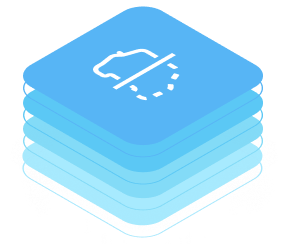
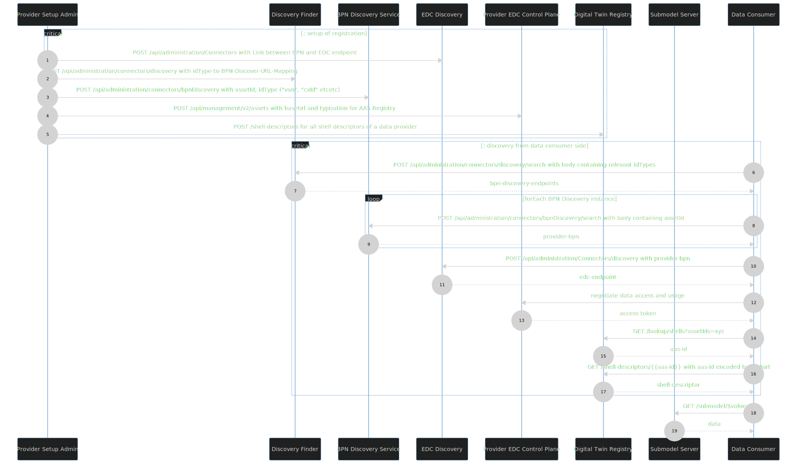

<!--
Development View of the Kit.
-->



### Digital Twin KIT

<!-- !Mandatory! -->
## API Specifications

All openAPI-specifications for the Digital Twin Kit services are rendered in the section [of these docs](API%20AAS%20Discovery/dotaas-part-2-http-rest-discovery-service-specification.info.mdx)

### Asset Administration Shell

The Asset Administration Shell (AAS) is a specification that is released by the Industrial Digital Twin Association
[(IDTA)](https://industrialdigitaltwin.org/) with a perspective to be adopted by the International Electrotechnical
Commission [(IEC)](https://www.iec.ch/homepage).
Its mission is defining how “information about assets […] can be exchanged in a meaningful way between partners in a value
creation network”. As such, it is well-suited to contribute to the toolbox of Catena-X. While the Spec offers an extensive
suite of meta-model elements and APIs, Catena-X only uses a small subset. What exactly is defined in the Catena-X standard
CX - 0002.

#### Submodels

An Asset Administration Shell is organized in Submodels. Each Submodel represents a self-contained aspect of an asset -
typical examples are the Nameplate or SingleLevelBomAsBuilt (which denotes the hierarchical composition of parts into
a whole). As different aspects of an Asset may be known to different parties on the value-chain, Submodels for a single asset
must be capable to run independently of each other. The specification explicitly allows this, enabling easy cross-company
data integration.

Recognizing that not all use-cases require the full functionality of the AAS-Spec, Catena-X demands that Data
Providers offer only a subset of the SubmodelServiceSpecification - namely the `$value` serialization. This is an abbreviated
notation of an AAS-Submodel that is focused on data instead of context. While it is advisable to expose Submodels with help of
a full-fletched AAS-server SDK that provides the content-modifiers and API-endpoints out-of-the-box, this is not yet
mandatory.

#### Digital Twin Registry

What Catena-X calls the "Digital Twin Registry" (DTR) is actually the union of two different services that the AAS specification
has specified. For the sake of simplicity, they are both defined in a single service. The DTR serves a similar function as the
index in a book: When trying to discover information, it's convenient to have an overview WHAT one will find and HOW to
access it. The registry caters exactly that information: For every asset it knows, it holds a number of Submodel Descriptors and in
these, a consumer app will find information WHAT it will find (via the semanticId) and how to access the information (endpoint,
security setup etc.). As the information contained in the DTR may be sensitive and not be trusted with a central entity,
every data provider must offer his own DTR as an EDC Data Asset. While it is only mandatory to implement the GET endpoints
as specified in the [Development View](https://eclipse-tractusx.github.io/docs-kits/next/kits/Digital%20Twin%20Kit/Software%20Development%20View/Specification%20Digital%20Twin%20Kit),
data providers may find it useful to implement POST requests for registration on top. Either way, they are free to populate
their DTR in any way they desire.

### Catena-X specific Services

DTRs hold sensitive information: a SubmodelDescriptor may not give access to the actual Submodel-data but all in cumulo hint at
production volumes as each Twin represents an asset. Therefore, Catena-X implements decentral DTRs (DDTR), each running with a
business partner. [In an IDTA-Whitepaper](https://industrialdigitaltwin.org/en/wp-content/uploads/sites/2/2023/06/Decentralized-Registries-Taxonomy-of-decentralized-registries-and-an-architectural-overview_.pdf ),
several high-level concepts for DDTRs are introduced. The AAS-specification remains agnostic to the approaches and endorses
none of them. Catena-X must deal with the additional complexity that stems from the interaction with the EDC.

Leveraging the native capabilities of the EDC and the EDC Discovery Service, Catena-X uses a discovery pattern that has the
same capability as a central [Digital Twin Registry](#digital-twin-registry): It allows to start a Discovery Process with only an AssetId and
As none of the options fit the data-space-specific requirements of Catena-X entirely, yet a different approach is implemented:
However, in Catena-X some of the data is deemed so sensitive that a central authority can't be
trusted with it. Thus, each Data Provider will run their own DTR which poses a challenge for discovery. After all, a
Data Consumer must still find out the address where to fetch the data from. That's why Catena-X has introduced a
three-step discovery pattern made up of the central microservices Discovery Finder, BPN Discovery (or several of them)
and finally the EDC discovery that is part of the CX-Portal. They are also part of this Kit.

## Discovery Sequence

The services that make up the Digital Twin Kit partly rely on each other. Executing them in the right sequence allows
a Data Consumer to get access to data whose location was previously unknown. However, this discovery process relies on a
set of assumptions. Most relevant is the presence of the discovery services defined in CX - 0053 ([Discovery Finder](./API%20Discovery%20Finder/discovery-finder.info.mdx),
[BPN Discovery](./API%20BPN%20Discovery/bpn-discovery-service.info.mdx)) and CX - 0001 ([EDC Discovery](./API%20EDC%20Discovery/post-list-of-bpns-to-retrieve-available-company-connector.api.mdx)).
As portrayed in the [Operation View](../page_software-operation-view.md), these
discovery services are assumed to run centrally in a data space. A concept for decentralization will be validated in the
future.

Apart from their presence, the discovery services also must be populated with data by the data providers. This process
is portrayed in the "setup of registration" section of the diagram below (steps 1-5). They describe the assumed calls
that have been made prior to consumer-side discovery. While step 1 was completed during onboarding of a company to the
Catena-X network, step 2 was executed by the operating company offering the BPN-Discovery Service. Step 3-5 are in the
responsibility of each Data Provider.

In steps 6-17, the consumer fetches the previously registered data from the central services and initiates data access.
Please note that especially steps 12 & 13 (negotiation at EDC) are simplified in this figure as they are explained in the
Connector Kit already. The discovery sequence ends with step 17, after which the data consumer can make a request for the
data that he set out to find.



Some use-cases assume that a consumer has prior knowledge of an asset's location in a provider's infrastructure. That's
why data on a new asset will not necessarily be obtained by executing the whole discovery sequence above. For example,
a consumer may know not only the assetId but also the provider's BPN, allowing him to enter the sequence at step 10.
If this prior knowledge is given under all circumstances, registration steps 2-3 can be skipped provider-side.

<!-- Recommended -->
## Sample Data

Generic sample data for relevant data objects is contained in the openAPI-specs of the respective services. This chapter
contains data structures that are more specifically designed for use in the Digital Twin Kit. They are compliant with
the base-specifications (like AAS) but restrict the application even further for use in this dataspace.

### Registration at EDC

While the exact AAS-EDC-integration is at the discretion of each Kit and use case, there are good practices
that are likely to be standardized on the level of CX-0002 in the future. One relevant question is how the EDC-shielded services
of this Kit should register with the Asset endpoint of the EDC Management API. The following recommendations follow
the data structure expected from tractusx-edc v0.4.1 onwards. It demands a json-ld structure.

Json-ld is a serialization for RDF graphs (see [Resource Description Framework](https://www.w3.org/RDF/)). The json-ld
`@context` section can declare the namespaces that resources explicitly mentioned in the rest of the document belong to.
It may also define default namespace with `@vocab` for resources without explicitly stated namespaces. Outside of
the "@context" section, the "@type" property always defines the class that an object belongs to.
As stated in the openAPI-specification of the EDC Management API's relevant endpoint, all entries in the `asset/properties`
object and the `privateProperties` object can be chosen freely. The section on the `dataAddress` is structured depending
on the `edc:type` property. The example below is determined by the [HttpDataAddress](https://github.com/eclipse-edc/Connector/blob/main/spi/common/core-spi/src/main/java/org/eclipse/edc/spi/types/domain/HttpDataAddress.java)
class. Other implementations may require different parameters.

For successful discovery of Digital Twins, it is critical to register Submodels and Digital-Twin-Registries in a
harmonized way. The following overview shall explain how the `asset/properties` section could be used. Bear in mind that
this is a non-normative example.

- `asset:prop:type` (mandatory as per CX-0002): denotes the type of Asset that is registered. For all AAS-registries
this property must be set to `data.core.digitalTwinRegistry`.
- `rdfs:label` (optional): short name for asset.
- `rdfs:comment` (optional): free text property for human consumption.
- `dcat:version` (optional): version-string of the registered resource. Please note that the version of the AAS-spec is
  already considered in the `aas`-namespace.

The top-level `@id` field denotes the identifier of the resource that is being registered.

#### Digital Twin Registry as EDC Data Asset

The top-level `@id` field is mandatory but can (for a DTR) be chosen freely at registration since a DTR usually has no unique
identifier. Please note that the dataAddress field `edc:baseUrl` ends before the URL-segments`/shell-descriptors/` and
`/lookup/`. Those must be added by the data consumer. The segments in the baseUrl are purely at the discretion of the data
provider as they are not specified by CX-0018 (and thus by the underlying IDTA-Standard).

```json
{
  "@context": {
    "@base": "http://myCompany.org/identifiers/",
    "edc": "https://w3id.org/edc/v0.0.1/ns/",
    "dcat": "https://www.w3.org/ns/dcat/",
    "rdfs": "http://www.w3.org/2000/01/rdf-schema#"
  },
  "edc:asset": {
    "@type": "Asset",
    "@id": "04a0993c-aa76-446f-a026-cb2ed62ea03f",
    "edc:properties": {
      "asset:prop:type": "data.core.digitalTwinRegistry",
      "rdfs:label": "Digital Twin Registry",
      "rdfs:comment": "DTR Endpoint of provider Processor_BackendIntegrationTests",
      "dcat:version": "0.0.1"
    },
    "edc:privateProperties": null
  },
  "edc:dataAddress": {
    "@type": "DataAddress",
    "edc:type": "edc:HttpData",
    "edc:baseUrl": "https://mycompany.com/dtr/api/v3/",
    "edc:authKey": "Authorization",
    "edc:authCode": "Basic XXX",
    "edc:proxyBody": "true",
    "edc:proxyPath": "true",
    "edc:proxyQueryParams": "true",
    "edc:proxyMethod": "true",
    "edc:contentType": "application/json"
  }
}
```


#### Submodel as EDC Data Asset

Registering a Submodel as Asset with the EDC Management API is at the discretion of each Data Provider.

She may createone entry per Submodel or bundle them into one - yielding a smaller catalogue hence better performance.
This may seem strange because unharmonized Asset Registration does not allow a Data Consumer to systematically find all
EDC-Assets of type "Submodel". The discovery-sequence, however, is still intact since a Data Consumer will always know the
Data Plane and Control Plane of a Submodel from its [Submodel Descriptor in the Digital Twin Registry](#registration-at-digital-twin-registry).

The following shows an example for registration of an AAS-Submodel as EDC Data Asset. The basic structure lends a type to
the asset and additionally holds `hasSemantics:semanticId`. It is recommended and shall signify the meaning of the
Submodel's payload.

The top-level `@id` field should be equivalent to the id of the Submodel.
```json
{
  "@context": {
    "@base": "http://myCompany.org/identifiers/",
    "rdfs": "http://www.w3.org/2000/01/rdf-schema#",
    "edc": "https://w3id.org/edc/v0.0.1/ns/",
    "aas": "https://admin-shell.io/aas/API/3/0/",
    "aas-submodel": "aas:SubmodelServiceSpecification/",
    "aas-semantics": "aas:hasSemantics/"
  },
  "edc:asset": {
    "@id": "urn:uuid:ca180cf7-7ed6-4f53-b32f-d072d4cad834",
    "@type": "Asset",
    "edc:properties": {
      "asset:prop:type": ["aas-submodel:SSP001"],
      "rdfs:label": "PCF Data",
      "rdfs:comment": "Endpoint for PCF data",
      "aas-semantics:semanticId": "urn:bamm:io:pcf:4.0.1:Pcf",
      "edc:contentType": "application/json"
    },
    "edc:privateProperties": null,
    "edc:dataAddress": {
      "@type": "DataAddress",
      "edc:type": "edc:HttpData",
      "edc:baseUrl": "https://data.plane",
      "edc:authKey": "Authorization",
      "edc:authCode": "Basic XXX",
      "edc:proxyBody": "true",
      "edc:proxyPath": "false",
      "edc:proxyQueryParams": "true",
      "edc:proxyMethod": "true",
      "edc:contentType": "application/json"
    }
  }
}
```

### Registration at Digital Twin Registry

#### Example for AAS-Registration

```json
{
  "id": "urn:uuid:e5c96ab5-896a-1234-8761-efd74777ca97",
  "idShort": "myAas",
  "specificAssetIds": [
    {
      "name": "manufacturerPartId",
      "value": "BPN:123-345-567103",
      "externalSubjectId": {
        "type": "ExternalReference",
        "keys": [
          {
            "type": "GlobalReference",
            "value": "BPNL:someBpnOfAssetOwner"
          }
        ]
      }
    }
  ],
  "submodelDescriptors": [
    {
      "id": "e5c96ab5-896a-482c-8761-efd74777ca97",
      "semanticId": {
        "type": "ExternalReference",
        "keys": [
          {
            "type": "GlobalReference",
            "value": "urn:bamm:io.catenax.material_for_recycling:1.1.0#MaterialForRecycling"
          }
        ]
      },
      "endpoints": [
        {
          "interface": "SUBMODEL-3.0",
          "protocolInformation": {
            "href": "https://edc.data.plane/mypath/submodel",
            "endpointProtocol": "HTTP",
            "endpointProtocolVersion": [
              "1.1"
            ],
            "subprotocol": "DSP",
            "subprotocolBody": "id=123;dspEndpoint=http://edc.control.plane/",
            "subprotocolBodyEncoding": "plain",
            "securityAttributes": [
              {
                "type": "NONE",
                "key": "NONE",
                "value": "NONE"
              }
            ]
          }
        }
      ]
    }
  ]
}
```

#### Example for Submodel-Registration at existing AAS

The Submodel Descriptors in the DTR must not only follow the schema defined by the openAPI file. Additionally, it is
imperative that the network mandates how they shall be populated with data. This is especially critical because the
data access is not straight-forward but passes through an EDC which the Data Consumer must negotiate with. That's why
the subprotocol body holds information on how to talk to the EDC's Data Plane.

```json
{
  "id": "e5c96ab5-896a-482c-8761-efd74777ca97",
  "semanticId": {
    "type": "ExternalReference",
    "keys": [
      {
        "type": "GlobalReference",
        "value": "urn:bamm:io.catenax.material_for_recycling:1.1.0#MaterialForRecycling"
      }
    ]
  },
  "endpoints": [
    {
      "interface": "SUBMODEL-3.0",
      "protocolInformation": {
        "href": "https://edc.data.plane/mypath/submodel",
        "endpointProtocol": "HTTP",
        "endpointProtocolVersion": [
          "1.1"
        ],
        "subprotocol": "DSP",
        "subprotocolBody": "id=123;dspEndpoint=http://edc.control.plane/",
        "subprotocolBodyEncoding": "plain",
        "securityAttributes": [
          {
            "type": "NONE",
            "key": "NONE",
            "value": "NONE"
          }
        ]
      }
    }
  ]
}

```
Currently, this structure is still standardized ambiguously in CX-0002. There, the `subprotocolBody` is not mandated to
contain the specific data (`"id=xyz;dspEndpoint=myControlPlane"`). As this is however good practice in other Kits, the
structure will likely find its way into the CX-0002 standard in the future.

<!-- Recommended -->

### EDC Usage Policies

The decision what policies shall be implemented for the exchange of data is at the discretion of each use-case and cannot
be standardized in the context of the semantics-standards or the DT Kit.

## Data Provisioning

### Patterns

Data Providers will usually follow one of two patterns:
1. Digital Twin Repository: Deploying a dedicated Repository for the persistence of digital twins and related data is the most
convenient way to get going with the AAS. Due to the risk of data duplication and unclear initial ingestion mechanisms,
it may not scale to industrial sizes.
2. Delegation: Wrapping another API or a database may deploy the Submodel API as a new facade. It delegates the incoming
requests to the respective backend systems.

Offering data to the network requires mappings that are naturally dependent on the data source format. More on data integration
can be found in the corresponding [CX e.V. guide](https://catena-x.net/fileadmin/user_upload/04_Einfuehren_und_umsetzen/Onboarding/DataIntegrationPatterns_Guide_Final_V1.pdf).

### Register Digital Twins

As mentioned in CX - 0002, every Data Provider is required not only to deploy a DTR in his infrastructure but also to
register each of the Submodels. Otherwise, the data will not be discoverable by Data Consumers.
