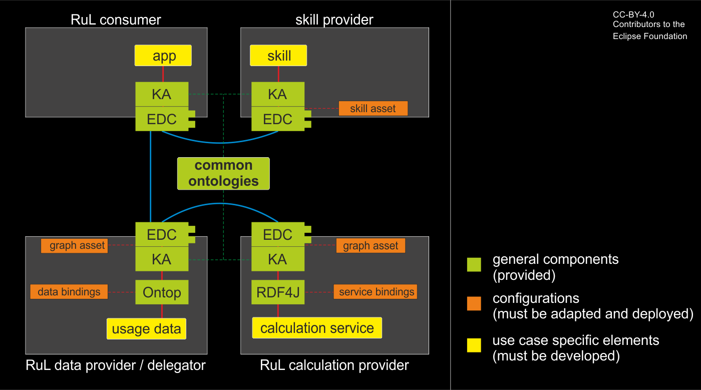

<!--
Development View of the Kit.
-->
### Remaining Useful Life Kit

**This is only a preview KIT.**

There will be changes in the following releases.
We plan to provide a more general RuL skill and more generalized interfaces for service
input data. With these improvements, it will be much easier and more flexible for you to
participate in the RuL use case.

## Overview

The RuL use case takes advantage of knowledge graphs. Therefore, every participant must support the Knowledge Agent (see Knowledge Agent KIT).

### Roles

As a developer in the Remaining Useful Life use case, you may apply to one or more
of the following roles:

- RuL consumer (RuL result requester)
- skill provider (provider of the use case logic)
- RuL data provider (provider of usage data, likely an OEM)
- delegator (likely a supplier of a component that is assembled of subcomponents which are providing RuL calculation services)
- RuL calculation service provider (likely a supplier of a part or component)

### Logic

The central logic of the RuL use case is a **RuL skill**.  
You can use a predefined RuL skill and use it or modify it to build up a similar use
case. It is written in SPARQL, a query language for federated knowledge graphs.  
The current RuL skill takes vehicle identifier numbers (VINs) as parameters.  
In general, a RuL skill will take one or more vehicle/component IDs as parameters.
It then collects the related usage data at the RuL data providers and calls the RuL
calculation services at the RuL service providers. The result is then collected and
transferred to the consumer.  

### Your interface

You always need access to your **running EDC with knowledge agent components** and
the (extensible) **ontologies of Catena-X**. In most cases, you can use them as they are.  

Your interface to the use case depends on your role(s):  
If you are only a consumer, you are fine with the previous mentioned components.  
If you are a data provider or delegator, you may have your data organized in relational databases. In this case, you need to have a running **provisioning
agent** with **configured data bindings** (linking your data to the knowledge graph).  
If you are a service provider, you need to have a running **remoting agent** with
**configured service bindings** (linking your service to the knowledge graph).  

For more information, see the operation view.

### Mandatory components

- ontologies (semantic models)
- usage data
- calculation services
- EDC + knowledge agent
- delegation data
- matchmaking agent: Mapping ontology to knowledge graph, integrated into KA-dataplane
- binding agents:
  - provisioning agent: provide data
  - remoting agent: bind service to graph

| | calculation service provider | delegator | RuL data provider | RuL consumer | skill provider |
| --------------------- | :---: | :---: | :---: | :---: | :---: |
| EDC + knowledge agent <br/>+ matchmaking agent | x | x | x | x | x |
| ontologies                                | x | x | x | x | x |
| skill-access                              |   |   |   | x | x |
| delegation data                           |   | x | x | x |   |
| usage data                                |   |   | x |   |   |
| provisioning agent                        |   |   | x |   |   |
| calculation service                       | x |   |   |   |   |
| remoting agent                            | x |   |   |   |   |

### Knowledge graph basics

Knowledge graphs are buildup of semantic triplets (subject --predicate-> object), where subject and object are nodes, the predicate is a unidirectional edge. All nodes are object instances, and the edges between them are their relations. For more information, see [W3C Resource Description Framework (RDF)](https://www.w3.org/RDF/).  
Object types and relations are formally defined within ontologies.

### Basic Architecture

For a detailed view of the architecture with the knowledge agent see the Knowledge Agent KIT.
Here you can see an overview over the used components and elements that must be developed:



### Ontology

For the Behaviour Twin (BT) RuL User Case, beside the [core](https://w3id.org/catenax/core_ontology.ttl) and [common](https://w3id.org/catenax/common_ontology.ttl) ontologies, a specific ontology was defined. For our use cases following sub-ontologies are needed:

- [reliability ontology](https://w3id.org/catenax/reliability_ontology.ttl)
- [vehicle ontology](https://w3id.org/catenax/vehicle_ontology.ttl) and
- [behaviour ontology](https://w3id.org/catenax/behaviour_twin.ttl)

All needed ontologies for the RuL use case are bundled in one named on our [Behaviour Twin Kit](https://w3id.org/catenax/usecase/behaviour_twin.ttl).

General information about Knowledge-Agent Semantic Models refer to the [KA-KIT](https://catenax-ng.github.io/product-knowledge/docs/development-view/modules#semantic-models).
The specific (reliability and behaviour) ontologies are based respectively compatible with the standardized SAMM Models ([Load Spectrum](https://github.com/eclipse-tractusx/sldt-semantic-models/tree/main/io.catenax.classified_load_spectrum) and [Remaining Useful Life](https://github.com/eclipse-tractusx/sldt-semantic-models/blob/main/io.catenax.rul/1.0.0/RemainingUsefulLife.ttl)) release by  Behaviour Twin team.

For the calculation of the remaining useful life for a specific component, the service needs to get the Load Spectrum data to proceed with the calculation. Hence, in the reliability ontology all needed semantic models are defined.

``` ttl
################################################################
# Copyright (c) 2022,2023 T-Systems International GmbH
# Copyright (c) 2022,2023 Bayerische Motoren Werke Aktiengesellschaft (BMW AG) 
# Copyright (c) 2022,2023 ZF Friedrichshafen AG
# Copyright (c) 2023 Allgemeine Deutsche Automobil-Club (ADAC) e.V
# Copyright (c) 2022,2023 Mercedes-Benz AG
# Copyright (c) 2022,2023 Contributors to the Catena-X Association
#
# See the NOTICE file(s) distributed with this work for additional
# information regarding copyright ownership.
#
# This program and the accompanying materials are made available under the
# terms of the Apache License, Version 2.0 which is available at
# https://www.apache.org/licenses/LICENSE-2.0.
#
# Unless required by applicable law or agreed to in writing, software
# distributed under the License is distributed on an "AS IS" BASIS, WITHOUT
# WARRANTIES OR CONDITIONS OF ANY KIND, either express or implied. See the
# License for the specific language governing permissions and limitations
# under the License.
#
# SPDX-License-Identifier: Apache-2.0
################################################################

###  https://w3id.org/catenax/ontology/reliability#LoadSpectrum
cx-reliability:LoadSpectrum rdf:type owl:Class ;
                            rdfs:subClassOf cx-reliability:AnalysisResult ;
                            rdfs:seeAlso <https://de.wikipedia.org/wiki/Lastkollektiv> ,
                                         <https://en.wikipedia.org/wiki/Mechanical_load> ;
                            skos:altLabel "load collective"@en ;
                            skos:definition "Load spectrum is a 2d histogram that contains the load history of a vehicle, i.e. how a vehicle was used, for a given time period."@en ;
                            skos:example "force"@en ,
                                         "tension"@en ,
                                         "torque"@en ;
                            skos:prefLabel "Lastkollektiv"@de ,
                                           "Load Spectrum"@en .
```

The RuL services were designed with interoperability in mind, thus the communication in both directions (input/input) fully supports the Catena-X Notification standard. These aspects are also covered by Catena-X ontologies. The RuL Calculation can return two values:

- Remaining Running Distance and
- Remaining Operating Hours

For this purpose, in the behaviour_ontology, a function is defined:

``` ttl
################################################################
# Copyright (c) 2022,2023 T-Systems International GmbH
# Copyright (c) 2022,2023 Bayerische Motoren Werke Aktiengesellschaft (BMW AG) 
# Copyright (c) 2022,2023 ZF Friedrichshafen AG
# Copyright (c) 2023 Allgemeine Deutsche Automobil-Club (ADAC) e.V
# Copyright (c) 2022,2023 Mercedes-Benz AG
# Copyright (c) 2022,2023 Contributors to the Catena-X Association
#
# See the NOTICE file(s) distributed with this work for additional
# information regarding copyright ownership.
#
# This program and the accompanying materials are made available under the
# terms of the Apache License, Version 2.0 which is available at
# https://www.apache.org/licenses/LICENSE-2.0.
#
# Unless required by applicable law or agreed to in writing, software
# distributed under the License is distributed on an "AS IS" BASIS, WITHOUT
# WARRANTIES OR CONDITIONS OF ANY KIND, either express or implied. See the
# License for the specific language governing permissions and limitations
# under the License.
#
# SPDX-License-Identifier: Apache-2.0
################################################################

cx-behaviour:RemainingUsefulLife rdf:type cx-fx:Function;
  dc:description "Remaining Useful Life is a Prediction of the Estimated Mileage/Runtime until a Breakdown."@en ;
  dc:title "Remaining Useful Life" ;
  cx-fx:input cx-behaviour:notification;
  cx-fx:input cx-behaviour:sender;
  cx-fx:input cx-behaviour:senderConnector;
  cx-fx:input cx-behaviour:recipient;
  cx-fx:input cx-behaviour:recipientConnector;
  cx-fx:input cx-behaviour:recipient;
  cx-fx:input cx-behaviour:recipientConnector;
  cx-fx:input cx-behaviour:severity;
  cx-fx:input cx-behaviour:status;
  cx-fx:input cx-behaviour:targetDate;
  cx-fx:input cx-behaviour:timeStamp;
  cx-fx:input cx-behaviour:classification;
  cx-fx:input cx-behaviour:component;
  cx-fx:input cx-behaviour:metadata;
  cx-fx:input cx-behaviour:statusDate;
  cx-fx:input cx-behaviour:statusOperatingHours;
  cx-fx:input cx-behaviour:statusMileage;
  cx-fx:input cx-behaviour:countingMethod;
  cx-fx:input cx-behaviour:countingValue;
  cx-fx:input cx-behaviour:countingUnit;
  cx-fx:input cx-behaviour:headerChannels;
  cx-fx:input cx-behaviour:bodyClasses;
  cx-fx:input cx-behaviour:bodyCountsList;
  cx-fx:result cx-behaviour:response.
```  

The result contains the expected values:

``` ttl
################################################################
# Copyright (c) 2022,2023 T-Systems International GmbH
# Copyright (c) 2022,2023 Bayerische Motoren Werke Aktiengesellschaft (BMW AG) 
# Copyright (c) 2022,2023 ZF Friedrichshafen AG
# Copyright (c) 2023 Allgemeine Deutsche Automobil-Club (ADAC) e.V
# Copyright (c) 2022,2023 Mercedes-Benz AG
# Copyright (c) 2022,2023 Contributors to the Catena-X Association
#
# See the NOTICE file(s) distributed with this work for additional
# information regarding copyright ownership.
#
# This program and the accompanying materials are made available under the
# terms of the Apache License, Version 2.0 which is available at
# https://www.apache.org/licenses/LICENSE-2.0.
#
# Unless required by applicable law or agreed to in writing, software
# distributed under the License is distributed on an "AS IS" BASIS, WITHOUT
# WARRANTIES OR CONDITIONS OF ANY KIND, either express or implied. See the
# License for the specific language governing permissions and limitations
# under the License.
#
# SPDX-License-Identifier: Apache-2.0
################################################################

cx-behaviour:response rdf:type cx-fx:Result;
dc:description "The asynchronous notification response."@en ;
dc:title "Asynchronous notification response." ;
cx-fx:output cx-behaviour:remainingOperatingHours;
cx-fx:output cx-behaviour:remainingRunningDistance.

cx-behaviour:remainingOperatingHours rdf:type cx-fx:ReturnValue;
  dc:description "Predicted Operating Hours of Remaining Useful Life Response"@en ;
  dc:title "Remaining Useful Life Operating Hours" ;
  cx-fx:dataType xsd:float.

cx-behaviour:remainingRunningDistance rdf:type cx-fx:ReturnValue;
  dc:description "Predicted Distance of Remaining Useful Life Response"@en ;
  dc:title "Remaining Useful Life Distance" ;
  cx-fx:dataType xsd:int.
```  

### Standards/SAMM

- [Load Spectrum](https://github.com/eclipse-tractusx/sldt-semantic-models/tree/main/io.catenax.classified_load_spectrum)
- [Remaining Useful Life](https://github.com/eclipse-tractusx/sldt-semantic-models/blob/main/io.catenax.rul/1.0.0/RemainingUsefulLife.ttl)

## RuL Skill

Applies to: *RuL Skill provider*

For the RuL calculation of a vehicle part, we have three different "roles" involved:

- consumer: which request the RuL value by VIN.
- OEM: which has the vehicle Load Spectrum data and forwards them by calling the supplier of that specific part.
- Supplier: which provides the service for the RuL calculation for his parts.

A reference (sample) Agent-Skill for a Gearbox is implemented,

For more information regarding the RuL Skill see [Knowledge Agent KIT](https://bit.ly/tractusx-agents).

``` sparql
################################################################
# Copyright (c) 2022,2023 T-Systems International GmbH
# Copyright (c) 2022,2023 Bayerische Motoren Werke Aktiengesellschaft (BMW AG) 
# Copyright (c) 2022,2023 ZF Friedrichshafen AG
# Copyright (c) 2023 Allgemeine Deutsche Automobil-Club (ADAC) e.V
# Copyright (c) 2022,2023 Mercedes-Benz AG
# Copyright (c) 2022,2023 Contributors to the Catena-X Association
#
# See the NOTICE file(s) distributed with this work for additional
# information regarding copyright ownership.
#
# This program and the accompanying materials are made available under the
# terms of the Apache License, Version 2.0 which is available at
# https://www.apache.org/licenses/LICENSE-2.0.
#
# Unless required by applicable law or agreed to in writing, software
# distributed under the License is distributed on an "AS IS" BASIS, WITHOUT
# WARRANTIES OR CONDITIONS OF ANY KIND, either express or implied. See the
# License for the specific language governing permissions and limitations
# under the License.
#
# SPDX-License-Identifier: Apache-2.0
################################################################

PREFIX cx-common:       <https://w3id.org/catenax/ontology/common#>
PREFIX cx-core:         <https://w3id.org/catenax/ontology/core#>
PREFIX cx-vehicle:      <https://w3id.org/catenax/ontology/vehicle#>
PREFIX cx-reliability:  <https://w3id.org/catenax/ontology/reliability#>
PREFIX cx-behaviour:    <https://w3id.org/catenax/ontology/behaviour#>
PREFIX rdf:             <http://www.w3.org/1999/02/22-rdf-syntax-ns#>
PREFIX rdfs:            <http://www.w3.org/2000/01/rdf-schema#>
PREFIX xsd:             <http://www.w3.org/2001/XMLSchema#>
PREFIX json:            <https://json-schema.org/draft/2020-12/schema#> 
PREFIX bpnl:            <bpn:legal:>
PREFIX oem:             <GraphAsset?oem=>
PREFIX supplier:        <GraphAsset?supplier=>

################################################################
# Sample for a Federated (Consumer-Deployed) SparQL Skill which
#  - Jumps into an OEM-owned reliability asset given a set of candidate VANs
#  - Feeds the gathered data back into the respective supplier connector/agent 
#.   to perform a health indication 
# Author: cgjung
# (c) 2023 Catena-X assocation
################################################################

SELECT DISTINCT ?vehicle ?van ?aggregate ?assembly ?supplier ?distanceKm ?timeHours WHERE {

  VALUES (?van ?aggregate) { 
      ("@van"^^xsd:string "Differential Gear"^^xsd:string) 
  }

  VALUES (?ls_type) { 
      ("GearOil"^^xsd:string) ("GearSet"^^xsd:string) 
  }

  bpnl:{{oemBPNL}} cx-common:hasConnector ?oemEDC.
  ?oemEDC cx-common:offers [ rdfs:isDefinedBy <https://w3id.org/catenax/ontology/reliability>; cx-common:id ?reliabilityAssetId].
  
  SERVICE ?oemEDC {  
      GRAPH ?reliabilityAssetId {
        ?vehicle rdf:type cx-vehicle:Vehicle;
            cx-vehicle:vehicleIdentificationNumber ?van.

        ?assembly rdf:type cx-vehicle:Part;
            cx-vehicle:name ?aggregate;
            cx-vehicle:isPartOf ?vehicle;
            cx-vehicle:supplier ?supplier.
            
        ?teleAnalysis rdf:type cx-reliability:Analysis;
            cx-reliability:analysedObject ?assembly;
            cx-reliability:operatingHoursOfVehicle ?operatingTime;
            cx-reliability:mileageOfVehicle ?mileage;
            cx-core:startDateTime ?recordDate;
            cx-reliability:result [
                cx-core:id ?ls_type;
                cx-core:name ?ls_name;
                cx-reliability:countingValue ?ls_value;
                cx-reliability:countingUnit ?ls_unit;
                cx-reliability:countingMethod ?ls_method;
                cx-reliability:channels ?ls_channels;
                cx-reliability:classes ?ls_classes;
                cx-reliability:values ?ls_values
            ].
    } # OEM#GRAPH

    ?supplier cx-common:hasConnector ?supplierEDC.
    ?supplierEDC cx-common:offers [ rdfs:isDefinedBy <https://w3id.org/catenax/ontology/behaviour>; cx-common:id ?prognosisAssetId].

    SERVICE ?supplierEDC {
        GRAPH ?prognosisAssetId {
            SELECT ?distanceKm ?timeHours WHERE {
                ?invocation a cx-behaviour:RemainingUsefulLife;
                        cx-behaviour:sender bpnl:{{oemBPNL}};
                        cx-behaviour:senderConnector ?oemEDC;
                        cx-behaviour:recipient ?supplier;
                        cx-behaviour:recipientConnector ?supplierEDC;
                        cx-behaviour:targetDate ?recordDate;
                        cx-behaviour:timeStamp ?recordDate;
                        cx-behaviour:component ?assembly;
                        cx-behaviour:observationType ?ls_type;
                        cx-behaviour:statusDate ?recordDate;
                        cx-behaviour:statusOperatingHours ?operatingTime;
                        cx-behaviour:statusMileage ?mileage;
                        cx-behaviour:countingValue ?ls_value;
                        cx-behaviour:countingUnit ?ls_unit;
                        cx-behaviour:countingMethod ?ls_method;
                        cx-behaviour:headerChannels ?ls_channels;
                        cx-behaviour:bodyClasses ?ls_classes;
                        cx-behaviour:bodyCountsList ?ls_values;
                        cx-behaviour:remainingOperatingHours ?timeHours;
                        cx-behaviour:remainingRunningDistance ?distanceKm.
            }
        } # SUPPLIER#GRAPH          
    } # SUPPLIER#CATALOG

  } # OEM#CATALOG

} # SELECT
```

### Skill usage

The registered skill is available over Agent Plane API and can be called also for a list of input variables:

```curl
curl --location 'agentPlaneEdcUrl/api/agent?asset=SkillAsset%3Fconsumer%3DRemainingUsefulLife' \
--header 'Content-Type: application/sparql-results+json' \
--data '{
    "head": { "vars": [ "van" ]},
    "results": { "bindings": [
            {   "van": { "type": "literal", "value": "FNLQNRVCOFLHAQ"}}
        ]
    }
}'
```

The RuL results for the given VAN's is provided are provided as bindings for the requested variables in the Skill itself and looks like:

```json
{
   "head": {
      "vars": [
         "vehicle",
         "van",
         "aggregate",
         "assembly",
         "supplier",
         "distanceKm",
         "timeHours"
      ]
   },
   "results": {
      "bindings": [
         {
            "vehicle": {
               "type": "uri",
               "value": "urn:uuid:4cf8b668-0f27-4f39-b986-36423d81d222"
            },
            "van": {
               "type": "literal",
               "value": "FNLQNRVCOFLHAQ"
            },
            "aggregate": {
               "type": "literal",
               "value": "Some vehicle name"
            },
            "assembly": {
               "type": "",
               "value": "urn:uuid:4cf8b668-0f27-4f39-b986-36423d81d111"
            },
            "supplier": {
               "type": "uri",
               "value": "bpn:legal:BPNL0000SUPPLIER"
            },
            "distanceKm": {
               "type": "",
               "datatype": "http://w3.org/2001/XMLSchema#int",
               "value": "123000"
            },
            "timeHours": {
               "type": "",
               "datatype": "http://w3.org/2001/XMLSchema#float",
               "value": "12345.0"
            }
         }
      ]
   }
}
```

If the given VAN is not found on OEM side, then we get an empty binding result:

```json
{
    "head": {
        "vars": [
            "vehicle",
            "van",
            "aggregate",
            "assembly",
            "supplier",
            "distanceKm",
            "timeHours"
        ]
    },
    "results": {
        "bindings": []
    }
}
```

## Data bindings for relational data

Applies to: *RuL data provider* and *delegator*

### Overview

In this context, data are usage data as well as delegation data (where the sill/data have to go next).  

In most cases, data are provided in relational form (relational databases, data lakes, ...).
To provide such data as part of the knowledge graph, you have to bind/map them to the underlying ontologies.

### Data mapping tool

To bind the relational data to the knowledge graph, you can use a **provisioning agent**, also called the **data binding agent**. The software **Ontop** (see the Ontop webpage [https://ontop-vkg.org/](https://ontop-vkg.org/)), which is under the Apache 2.0 license, is our tool of choice in this case.  
  
### Data mapping configuration

To configure the bindings, a config file for the Ontop software has to be created. The file is written in the Ontop mapping language and has the extension **.obda**. For more information, see the Knowledge Agent KIT.

### Construction of a single data binding

Each data binding consists of 3 lines in the config file.  
The first line defines a unique mapping id (arbitrarily selectable).  
The second line lists one or more RDF triplets (target).  
The third line is a SQL statement on the relational data source.  

A simple example from:

``` obda
  mappingId   partsvehicle
  target      <{gearbox_id}> cx-vehicle:isPartOf <{vehicle_id}> .
  source      SELECT vehicle_id, gearbox_id FROM vehicles
```

The target is described as a triple with two variables: gearbox_id and vehicle_id. The exact same variables must occur in the result of the source SQL statement. The SQL result is then mapped to the variables in the target triplets.  
For each row in the SQL result, a triplet instance is created. If the SQL result is empty, no triplet instances are created.  
The result of this example is a triplet that represents the relation between a specific vehicle its gearbox.

A little more complex example:

``` obda
  mappingId   vehicles
  target      <{vehicle_id}> rdf:type cx-vehicle:Vehicle ; cx-vehicle:vehicleIdentificationNumber {van}^^xsd:string; cx-vehicle:worldManufaturerId bpnl:{oem_bpnl}; cx-vehicle:productionDate {production_date}^^xsd:date.
  source      SELECT vehicle_id, van, oem_bpnl, production_date FROM vehicles
```

The target now consists of 4 triplets, all with the same subject (<{vehicle_id}>) and separated by a semicolon. The semicolon means, the following triplet only defines the predicate and the object while the subject from the previous triplet is reused.  
In the example above, there are the following triplets:

- *<{vehicle_id}> rdf:type cx-vehicle:Vehicle*: All objects in the database table/view "vehicles" are mapped to the type cx-vehicle:Vehicle.
- *<{vehicle_id}> cx-vehicle:vehicleIdentificationNumber {van}^^xsd:string*: Relation between a vehicle and the related VAN. The type of VAN must be string.
- *<{vehicle_id}> cx-vehicle:worldManufaturerId bpnl:{oem_bpnl}*: Relation between a vehicle and its manufacturer's BPN.
- *<{vehicle_id}> cx-vehicle:productionDate {production_date}^^xsd:date*: Relation between a vehicle and it's date of production. The type of production_date must be date.

Complex types like the load spectra are composed of many triplets. If you have stored those load spectra as SAMM specified JSON strings, you may decompose them with specific JSON functions of your database system.

#### Full example

The following example shows mappings at an OEM that can be used to determine the vehicle object by a given VIN, find the related gearbox and the associated gearbox load spectra:

```obda
################################################################
# Copyright (c) 2022,2023 T-Systems International GmbH
# Copyright (c) 2022,2023 Bayerische Motoren Werke Aktiengesellschaft (BMW AG) 
# Copyright (c) 2022,2023 ZF Friedrichshafen AG
# Copyright (c) 2023 Allgemeine Deutsche Automobil-Club (ADAC) e.V
# Copyright (c) 2022,2023 Mercedes-Benz AG
# Copyright (c) 2022,2023 Contributors to the Catena-X Association
#
# See the NOTICE file(s) distributed with this work for additional
# information regarding copyright ownership.
#
# This program and the accompanying materials are made available under the
# terms of the Apache License, Version 2.0 which is available at
# https://www.apache.org/licenses/LICENSE-2.0.
#
# Unless required by applicable law or agreed to in writing, software
# distributed under the License is distributed on an "AS IS" BASIS, WITHOUT
# WARRANTIES OR CONDITIONS OF ANY KIND, either express or implied. See the
# License for the specific language governing permissions and limitations
# under the License.
#
# SPDX-License-Identifier: Apache-2.0
################################################################
````

```obda
  [PrefixDeclaration]
  cx-common:          https://w3id.org/catenax/ontology/common#
  cx-core:            https://w3id.org/catenax/ontology/core#
  cx-vehicle:         https://w3id.org/catenax/ontology/vehicle#
  cx-reliability:     https://w3id.org/catenax/ontology/reliability#
  uuid:               urn:uuid:
  bpnl:               bpn:legal:
  owl:                http://www.w3.org/2002/07/owl#
  rdf:                http://www.w3.org/1999/02/22-rdf-syntax-ns#
  xml:                http://www.w3.org/XML/1998/namespace
  xsd:                http://www.w3.org/2001/XMLSchema#
  json:               https://json-schema.org/draft/2020-12/schema#
  obda:               https://w3id.org/obda/vocabulary#
  rdfs:               http://www.w3.org/2000/01/rdf-schema#
  oem:                urn:oem:

  [MappingDeclaration] @collection [[
  mappingId   vehicles
  target      <{vehicle_id}> rdf:type cx-vehicle:Vehicle ; cx-vehicle:vehicleIdentificationNumber {van}^^xsd:string; cx-vehicle:worldManufaturerId bpnl:{oem_bpnl}; cx-vehicle:productionDate {production_date}^^xsd:date.
  source      SELECT vehicle_id, van, oem_bpnl, production_date FROM vehicles

  mappingId   partsvehicle
  target      <{gearbox_id}> cx-vehicle:isPartOf <{vehicle_id}> .
  source      SELECT vehicle_id, gearbox_id FROM vehicles

  mappingId   vehicleparts
  target      <{vehicle_id}> cx-vehicle:hasPart <{gearbox_id}> .
  source      SELECT vehicle_id, gearbox_id FROM vehicles

  mappingId   parts
  target      <{gearbox_id}> rdf:type cx-vehicle:Part ; cx-vehicle:id {gearbox_id}^^xsd:string; cx-vehicle:name {partTypeInformation_nameAtManufacturer}^^xsd:string; cx-vehicle:number {partTypeInformation_manufacturerPartId}^^xsd:string; cx-vehicle:supplier bpnl:{gearbox_manufacturer_bpnl}; cx-vehicle:productionDate {production_date}^^xsd:date .
  source      SELECT gearbox_id, production_date, 'Differential Gear' as partTypeInformation_nameAtManufacturer, gearbox_manufacturer_bpnl, 'Dummy Gearbox' as partTypeInformation_manufacturerPartId FROM vehicles

  mappingId   partAnalysis
  target      oem:{newest_telematics_id} cx-reliability:analysedObject <{gearbox_id}>.
  source      SELECT gearbox_id, newest_telematics_id FROM vehicles

  mappingId   analysisInformation
  target      oem:{id} rdf:type cx-reliability:Analysis; cx-reliability:operatingHoursOfVehicle {metadata_status_operatingHours}^^xsd:float; cx-core:startDateTime {metadata_status_date}^^xsd:dateTime; cx-core:endDateTime {metadata_status_date}^^xsd:dateTime; cx-reliability:mileageOfVehicle {metadata_status_mileage}^^xsd:int.
  source      SELECT id, metadata_status_operatingHours, metadata_status_date, metadata_status_mileage FROM reading

  mappingId   analysisResult
  target      oem:{id} cx-reliability:result oem:{id}/{index}.
  source      SELECT id, index FROM loadspectra

  mappingId   loadspectrum
  target      oem:{id}/{index} rdf:type cx-reliability:LoadSpectrum; cx-core:id {metadata_componentDescription}^^xsd:string; cx-core:name {metadata_projectDescription}^^xsd:string; cx-reliability:description {metadata_routeDescription}^^xsd:string; cx-reliability:countingValue {body_counts_countsName}^^xsd:string; cx-reliability:countingUnit {header_countingUnit}^^xsd:string; cx-reliability:countingMethod {header_countingMethod}^^xsd:string; cx-reliability:channels {header_channels}^^json:Object; cx-reliability:classes {body_classes}^^json:Object; cx-reliability:values {body_counts_countsList}^^json:Object .
  source      SELECT id, index, metadata_componentDescription, metadata_projectDescription, metadata_routeDescription, header_countingUnit, header_countingMethod, header_channels, body_classes, body_counts_countsName, body_counts_countsList FROM loadspectra

  ]]  
```

### Graph asset for the data binding

To enable the knowledge agent's matchmaking agent to find the data bindings, a graph asset has to be registered at the EDC. This asset must have a property "rdfs:isDefinedBy" that defines the shape of the provided graph.

```shacl
"<https://w3id.org/catenax/usecase/behaviourtwin>,<https://w3id.org/catenax/ontology/core>,<https://w3id.org/catenax/ontology/vehicle>,<https://w3id.org/catenax/ontology/reliability>",
            "cx-common:implementsProtocol": "cx-common:Protocol?w3c:http:SPARQL",
            "sh:shapesGraph": "@prefix cx-common: <https://w3id.org/catenax/ontology/common#>. \n@prefix : <GraphAsset?oem=BehaviourTwinReliability#> .\n@prefix cx-tele: <https://w3id.org/catenax/ontology/reliability#> .\n@prefix owl: <http://www.w3.org/2002/07/owl#> .\n@prefix rdf: <http://www.w3.org/1999/02/22-rdf-syntax-ns#> .\n@prefix xsd: <http://www.w3.org/2001/XMLSchema#> .\n@prefix sh: <http://www.w3.org/ns/shacl#> .@prefix : <urn:cx:Graph:oem:BehaviourTwin> .\n\n:OemLoadSpectrum rdf:type sh:NodeShape ;\n  sh:targetClass cx-tele:LoadSpectrum ;\n  sh:property [\n        sh:path cx-tele:provisionedBy ;\n        sh:hasValue <urn:bpn:legal:BPNL000000000OEM> \n    ] ;\n  sh:property [\n        sh:path cx-tele:Version ;\n        sh:hasValue \"0\"^^xsd:long \n    ] ;\n  sh:property [\n        sh:path cx-tele:component ;\n        sh:class :SupplierParts \n    ] .\n\n:SupplierParts rdf:type sh:NodeShape ;\n  sh:targetClass cx-tele:VehicleComponent ;\n  sh:property [\n        sh:path cx-tele:isProducedBy ;\n        sh:hasValue <urn:bpn:legal:BPNL0000SUPPLIER> \n    ] .\n"
```

For more information see the Knowledge Agent KIT.

## Service Bindings

Applies to: *RuL calculation service provider*

### Overview

In most cases, services are provided via REST APIs and are using JSON as input and output format. For the RuL use case, the output format is specified by a SAMM model.  
To include those services into the knowledge graph, you have to bind/map them to the underlying ontologies.

### Service mapping tool

To bind a service to the knowledge graph, you must use a **remoting agent**, also called the **service binding agent**. The software **RDF4J** (see the RDF4J webpage [https://rdf4j.org/](https://rdf4j.org/)), which is under the Eclipse Distribution License (EDL), v1.0, is our tool of choice in this case.  
  
### Service mapping configuration

For RDF4J, a configuration must be provided that formally describes the service binding.  
The configuration is written in Turtle (Terse RDF Triple Language) and has the extension **.ttl**. For more information, see the Knowledge Agent KIT.  

#### RDF4J repository

The RDF4J repository is the basic configuration that refers to the service object and defines the callback endpoint for an asynchronous response of this service.

```ttl
################################################################
# Copyright (c) 2022,2023 T-Systems International GmbH
# Copyright (c) 2022,2023 Bayerische Motoren Werke Aktiengesellschaft (BMW AG) 
# Copyright (c) 2022,2023 ZF Friedrichshafen AG
# Copyright (c) 2023 Allgemeine Deutsche Automobil-Club (ADAC) e.V
# Copyright (c) 2022,2023 Mercedes-Benz AG
# Copyright (c) 2022,2023 Contributors to the Catena-X Association
#
# See the NOTICE file(s) distributed with this work for additional
# information regarding copyright ownership.
#
# This program and the accompanying materials are made available under the
# terms of the Apache License, Version 2.0 which is available at
# https://www.apache.org/licenses/LICENSE-2.0.
#
# Unless required by applicable law or agreed to in writing, software
# distributed under the License is distributed on an "AS IS" BASIS, WITHOUT
# WARRANTIES OR CONDITIONS OF ANY KIND, either express or implied. See the
# License for the specific language governing permissions and limitations
# under the License.
#
# SPDX-License-Identifier: Apache-2.0
################################################################

[] rdf:type rep:Repository ;
  rep:repositoryID "rul" ;
  rdfs:label "Remainig Useful Life Functions Repository" ;
  rep:repositoryImpl [
      rep:repositoryType "openrdf:SailRepository" ;
      sr:sailImpl [
        sail:sailType "org.eclipse.tractusx.agents:Remoting" ;
        cx-fx:supportsInvocation cx-behaviour:RemainingUsefulLife;
        cx-fx:callbackAddress <https://remoting-agent.supplier.com/rdf4j-server/callback>;
      ]
  ].
```

The callback address in this example is the callback address of the own RDF4J server.

#### Types to be bound

##### cx-fx:Function

Definition of the function. It defines the endpoint and describes the input and output elements (analogous to the ontology).

```ttl
################################################################
# Copyright (c) 2022,2023 T-Systems International GmbH
# Copyright (c) 2022,2023 Bayerische Motoren Werke Aktiengesellschaft (BMW AG) 
# Copyright (c) 2022,2023 ZF Friedrichshafen AG
# Copyright (c) 2023 Allgemeine Deutsche Automobil-Club (ADAC) e.V
# Copyright (c) 2022,2023 Mercedes-Benz AG
# Copyright (c) 2022,2023 Contributors to the Catena-X Association
#
# See the NOTICE file(s) distributed with this work for additional
# information regarding copyright ownership.
#
# This program and the accompanying materials are made available under the
# terms of the Apache License, Version 2.0 which is available at
# https://www.apache.org/licenses/LICENSE-2.0.
#
# Unless required by applicable law or agreed to in writing, software
# distributed under the License is distributed on an "AS IS" BASIS, WITHOUT
# WARRANTIES OR CONDITIONS OF ANY KIND, either express or implied. See the
# License for the specific language governing permissions and limitations
# under the License.
#
# SPDX-License-Identifier: Apache-2.0
################################################################

cx-behaviour:RemainingUsefulLife rdf:type cx-fx:Function;
    dcterms:description "Remaining Useful Life is an asynchronous batch invocation."@en ;
    dcterms:title "Remaining Useful Life" ;
    cx-fx:targetUri "https://rul.supplier.com/api/v1/routine/notification";
    cx-fx:invocationMethod "POST-JSON";
  # cx-common:authenticationKey "Authorization";
  # cx-common:authenticationCode "Basic Zdm7vsdgasfghcg==";
    cx-fx:invocationMethod "POST-JSON";
    cx-fx:invocationIdProperty "header.notificationID,content.requestRefId";
    cx-fx:callbackProperty "header.respondAssetId";
    cx-fx:input cx-behaviour:notification;
    cx-fx:input cx-behaviour:sender;
    cx-fx:input cx-behaviour:senderConnector;
    cx-fx:input cx-behaviour:recipient;
    cx-fx:input cx-behaviour:recipientConnector;
    cx-fx:input cx-behaviour:recipient;
    cx-fx:input cx-behaviour:recipientConnector;
    cx-fx:input cx-behaviour:severity;
    cx-fx:input cx-behaviour:status;
    cx-fx:input cx-behaviour:targetDate;
    cx-fx:input cx-behaviour:timeStamp;
    cx-fx:input cx-behaviour:classification;
    cx-fx:input cx-behaviour:component;
    cx-fx:input cx-behaviour:observationType;
    cx-fx:input cx-behaviour:statusDate;
    cx-fx:input cx-behaviour:statusOperatingHours;
    cx-fx:input cx-behaviour:statusMileage;
    cx-fx:input cx-behaviour:observationType;
    cx-fx:input cx-behaviour:metadata;
    cx-fx:input cx-behaviour:countingMethod;
    cx-fx:input cx-behaviour:countingValue;
    cx-fx:input cx-behaviour:countingUnit;
    cx-fx:input cx-behaviour:headerChannels;
    cx-fx:input cx-behaviour:bodyClasses;
    cx-fx:input cx-behaviour:bodyCountsList;
    cx-fx:result cx-behaviour:response.
```

##### cx-fx:Argument

The input data that are received from the knowledge graph are converted to the desired JSON format that is requested by the service. Therefore, each value (input parameter) that is represented in the ontology as a separate object must be described as an argument which is related to the corresponding JSON path. The argument name represents the JSON path. Default values can be specified in case some values are not present in the knowledge graph.

```ttl
cx-behaviour:recipient rdf:type cx-fx:Argument;
  dcterms:description "Recipient of the notification as a BPN."@en ;
  dcterms:title "Notification Recipient";
  cx-fx:argumentName "header.recipientBPN";
  cx-fx:default "anonymous".
```

##### cx-fx:Result

The result of the service is also a JSON string. It consists of properties and output values.  
The mapping must provide all data that are defined in the ontology.  
The properties are of predefined types and are mapped directly (without further descriptions and attributes).  
The output values are specified each separate.

```ttl
################################################################
# Copyright (c) 2022,2023 T-Systems International GmbH
# Copyright (c) 2022,2023 Bayerische Motoren Werke Aktiengesellschaft (BMW AG) 
# Copyright (c) 2022,2023 ZF Friedrichshafen AG
# Copyright (c) 2023 Allgemeine Deutsche Automobil-Club (ADAC) e.V
# Copyright (c) 2022,2023 Mercedes-Benz AG
# Copyright (c) 2022,2023 Contributors to the Catena-X Association
#
# See the NOTICE file(s) distributed with this work for additional
# information regarding copyright ownership.
#
# This program and the accompanying materials are made available under the
# terms of the Apache License, Version 2.0 which is available at
# https://www.apache.org/licenses/LICENSE-2.0.
#
# Unless required by applicable law or agreed to in writing, software
# distributed under the License is distributed on an "AS IS" BASIS, WITHOUT
# WARRANTIES OR CONDITIONS OF ANY KIND, either express or implied. See the
# License for the specific language governing permissions and limitations
# under the License.
#
# SPDX-License-Identifier: Apache-2.0
################################################################

cx-behaviour:response rdf:type cx-fx:Result;
  dcterms:description "The asynchronous notification response."@en ;
  dcterms:title "Asynchronous notification response." ;
  cx-fx:callbackProperty "header.referencedNotificationID";
  cx-fx:outputProperty "content.endurancePredictorOutputs";
  cx-fx:output cx-behaviour:remainingOperatingHours;
  cx-fx:output cx-behaviour:remainingRunningDistance.
```

##### cx-fx:ReturnValue

The output values (return values) are specified with their path in the output JSON structure and their data type.

```ttl
################################################################
# Copyright (c) 2022,2023 T-Systems International GmbH
# Copyright (c) 2022,2023 Bayerische Motoren Werke Aktiengesellschaft (BMW AG) 
# Copyright (c) 2022,2023 ZF Friedrichshafen AG
# Copyright (c) 2023 Allgemeine Deutsche Automobil-Club (ADAC) e.V
# Copyright (c) 2022,2023 Mercedes-Benz AG
# Copyright (c) 2022,2023 Contributors to the Catena-X Association
#
# See the NOTICE file(s) distributed with this work for additional
# information regarding copyright ownership.
#
# This program and the accompanying materials are made available under the
# terms of the Apache License, Version 2.0 which is available at
# https://www.apache.org/licenses/LICENSE-2.0.
#
# Unless required by applicable law or agreed to in writing, software
# distributed under the License is distributed on an "AS IS" BASIS, WITHOUT
# WARRANTIES OR CONDITIONS OF ANY KIND, either express or implied. See the
# License for the specific language governing permissions and limitations
# under the License.
#
# SPDX-License-Identifier: Apache-2.0
################################################################

cx-behaviour:remainingOperatingHours rdf:type cx-fx:ReturnValue;
  dcterms:description "Predicted Operating Hours of Remaining Useful Life Response"@en ;
  dcterms:title "Remaining Useful Life Operating Hours" ;
  cx-fx:valuePath "0.remainingUsefulLife.remainingOperatingHours";
  cx-fx:dataType xsd:float.
```

#### Full Example

In this example, an asynchronous calculation service for gearbox RuL values is bound. It uses the Catena-X notification format as a container for the input data. The content of the notification is a JSON structure with a list of load spectra in it. The input format provides more than one Element (batch processing), but the RuL logic always requires exact one input per calculation. Therefore, always the first (and only the first) item of the input list is bound.

```ttl
################################################################
# Copyright (c) 2022,2023 T-Systems International GmbH
# Copyright (c) 2022,2023 Bayerische Motoren Werke Aktiengesellschaft (BMW AG) 
# Copyright (c) 2022,2023 ZF Friedrichshafen AG
# Copyright (c) 2023 Allgemeine Deutsche Automobil-Club (ADAC) e.V
# Copyright (c) 2022,2023 Mercedes-Benz AG
# Copyright (c) 2022,2023 Contributors to the Catena-X Association
#
# See the NOTICE file(s) distributed with this work for additional
# information regarding copyright ownership.
#
# This program and the accompanying materials are made available under the
# terms of the Apache License, Version 2.0 which is available at
# https://www.apache.org/licenses/LICENSE-2.0.
#
# Unless required by applicable law or agreed to in writing, software
# distributed under the License is distributed on an "AS IS" BASIS, WITHOUT
# WARRANTIES OR CONDITIONS OF ANY KIND, either express or implied. See the
# License for the specific language governing permissions and limitations
# under the License.
#
# SPDX-License-Identifier: Apache-2.0
################################################################

#
# Rdf4j configuration for a rul-specific remoting
#
@prefix rdf:            <http://www.w3.org/1999/02/22-rdf-syntax-ns#>.
@prefix rdfs:           <http://www.w3.org/2000/01/rdf-schema#>.
@prefix rep:            <http://www.openrdf.org/config/repository#>.
@prefix sr:             <http://www.openrdf.org/config/repository/sail#>.
@prefix sail:           <http://www.openrdf.org/config/sail#>.
@prefix sp:             <http://spinrdf.org/sp#>.
@prefix xsd:            <http://www.w3.org/2001/XMLSchema#> .
@prefix json:           <https://json-schema.org/draft/2020-12/schema#> .
@prefix dcterms:        <http://purl.org/dc/terms/> .
@prefix cx-fx:          <https://w3id.org/catenax/ontology/function#>.
@prefix cx-common:      <https://w3id.org/catenax/ontology/common#>.
@prefix cx-core:        <https://w3id.org/catenax/ontology/core#>.
@prefix cx-vehicle:     <https://w3id.org/catenax/ontology/vehicle#>.
@prefix cx-reliability: <https://w3id.org/catenax/ontology/reliability#>.
@prefix cx-behaviour:   <https://w3id.org/catenax/ontology/behaviour#>.

[] rdf:type rep:Repository ;
  rep:repositoryID "rul" ;
  rdfs:label "Remainig Useful Life Functions Repository" ;
  rep:repositoryImpl [
      rep:repositoryType "openrdf:SailRepository" ;
      sr:sailImpl [
        sail:sailType "org.eclipse.tractusx.agents:Remoting" ;
        cx-fx:supportsInvocation cx-behaviour:RemainingUsefulLife;
        cx-fx:callbackAddress <https://remoting-agent.supplier.com/rdf4j-server/callback>;
      ]
  ].

cx-behaviour:RemainingUsefulLife rdf:type cx-fx:Function;
  dcterms:description "Remaining Useful Life is an asynchronous batch invocation."@en ;
  dcterms:title "Remaining Useful Life" ;
  cx-fx:targetUri "https://rul.supplier.com/api/v1/routine/notification";
  cx-fx:invocationMethod "POST-JSON";
# cx-common:authenticationKey "Authorization";
# cx-common:authenticationCode "Basic AAAAAAAAAAAAA==";
  cx-fx:invocationMethod "POST-JSON";
  cx-fx:invocationIdProperty "header.notificationID,content.requestRefId";
  cx-fx:callbackProperty "header.respondAssetId";
  cx-fx:input cx-behaviour:notification;
  cx-fx:input cx-behaviour:sender;
  cx-fx:input cx-behaviour:senderConnector;
  cx-fx:input cx-behaviour:recipient;
  cx-fx:input cx-behaviour:recipientConnector;
  cx-fx:input cx-behaviour:recipient;
  cx-fx:input cx-behaviour:recipientConnector;
  cx-fx:input cx-behaviour:severity;
  cx-fx:input cx-behaviour:status;
  cx-fx:input cx-behaviour:targetDate;
  cx-fx:input cx-behaviour:timeStamp;
  cx-fx:input cx-behaviour:classification;
  cx-fx:input cx-behaviour:component;
  cx-fx:input cx-behaviour:observationType;
  cx-fx:input cx-behaviour:statusDate;
  cx-fx:input cx-behaviour:statusOperatingHours;
  cx-fx:input cx-behaviour:statusMileage;
  cx-fx:input cx-behaviour:observationType;
  cx-fx:input cx-behaviour:metadata;
  cx-fx:input cx-behaviour:countingMethod;
  cx-fx:input cx-behaviour:countingValue;
  cx-fx:input cx-behaviour:countingUnit;
  cx-fx:input cx-behaviour:headerChannels;
  cx-fx:input cx-behaviour:bodyClasses;
  cx-fx:input cx-behaviour:bodyCountsList;
  cx-fx:result cx-behaviour:response.

cx-behaviour:notification rdf:type cx-fx:Argument;
  dcterms:description "A default notification output template."@en ;
  dcterms:title "Notification Template";
  cx-fx:argumentName ".";
  cx-fx:dataType json:Object;
  cx-fx:priority "-1"^^xsd:integer;
  #cx-fx:default "{ \"content\": { \"endurancePredictorInputs\": [ { } ]}}"^^json:Object.
  cx-fx:default "{ \"content\": { \"endurancePredictorInputs\": [ ]}}"^^json:Object.

cx-behaviour:sender rdf:type cx-fx:Argument;
  dcterms:description "Sender of the notification as a BPN."@en ;
  dcterms:title "Notification Sender";
  cx-fx:argumentName "header.senderBPN";
  cx-fx:default "anonymous".

cx-behaviour:senderConnector rdf:type cx-fx:Argument;
  dcterms:description "Sender Address of the notification as a URL."@en ;
  dcterms:title "Notification Sender Address";
  cx-fx:argumentName "header.senderAddress";
  cx-fx:default "unknown".

cx-behaviour:recipient rdf:type cx-fx:Argument;
  dcterms:description "Recipient of the notification as a BPN."@en ;
  dcterms:title "Notification Recipient";
  cx-fx:argumentName "header.recipientBPN";
  cx-fx:default "anonymous".

cx-behaviour:recipientConnector rdf:type cx-fx:Argument;
  dcterms:description "Recipient Address of the notification as a URL."@en ;
  dcterms:title "Notification Recipient Address";
  cx-fx:argumentName "header.recipientAddress";
  cx-fx:default "unknown".

cx-behaviour:severity rdf:type cx-fx:Argument;
  dcterms:description "Severity of the notification."@en ;
  dcterms:title "Notification Severity";
  cx-fx:argumentName "header.severity";
  cx-fx:dataType xsd:string;
  cx-fx:default "MINOR".

cx-behaviour:status rdf:type cx-fx:Argument;
  dcterms:description "Status of the notification."@en ;
  dcterms:title "Notification Status";
  cx-fx:argumentName "header.status";
  cx-fx:dataType xsd:string;
  cx-fx:default "SENT".

cx-behaviour:targetDate rdf:type cx-fx:Argument;
  dcterms:description "Target Date of the notification."@en ;
  dcterms:title "Notification Target Date";
  cx-fx:dataType xsd:dateTime;
  cx-fx:argumentName "header.targetDate".

cx-behaviour:timeStamp rdf:type cx-fx:Argument;
  dcterms:description "Timestamp of the notification."@en ;
  dcterms:title "Notification Timestamp";
  cx-fx:dataType xsd:dateTime;
  cx-fx:argumentName "header.timeStamp".

cx-behaviour:classification rdf:type cx-fx:Argument;
  dcterms:description "Classification of the notification."@en ;
  dcterms:title "Notification Classification";
  cx-fx:argumentName "header.classification";
  cx-fx:dataType xsd:string;
  cx-fx:default "RemainingUsefulLifePredictor".

cx-behaviour:component rdf:type cx-fx:Argument;
  dcterms:description "Component of the Predicition."@en ;
  dcterms:title "Predicted Component";
  cx-fx:formsBatchGroup "true"^^xsd:boolean;
  cx-fx:argumentName "content.endurancePredictorInputs.0.componentId,content.endurancePredictorInputs.0.classifiedLoadSpectrum{https://w3id.org/catenax/ontology/behaviour#observationType}.targetComponentId".

cx-behaviour:observationType rdf:type cx-fx:Argument;
  dcterms:description "The type of observation made."@en ;
  dcterms:title "Observation Type";
  cx-fx:argumentName "content.endurancePredictorInputs.0.classifiedLoadSpectrum{https://w3id.org/catenax/ontology/behaviour#observationType}.metadata.componentDescription";
  cx-fx:dataType xsd:string.

cx-behaviour:metadata rdf:type cx-fx:Argument;
  dcterms:description "Metadata of the Loadspectrum."@en ;
  dcterms:title "Loadspectrum Metadata";
  cx-fx:argumentName "content.endurancePredictorInputs.0.classifiedLoadSpectrum{https://w3id.org/catenax/ontology/behaviour#observationType}";
  cx-fx:dataType json:Object;
  cx-fx:priority "0"^^xsd:integer;
  cx-fx:default "{ \"metadata\":{ \"projectDescription\": \"pnr_76543\", \"routeDescription\": \"logged\" }, \"bammId\": \"urn:bamm:io.openmanufacturing.digitaltwin:1.0.0#ClassifiedLoadSpectrum\" }"^^json:Object.

cx-behaviour:statusDate rdf:type cx-fx:Argument;
  dcterms:description "Time of Recording."@en ;
  dcterms:title "Loadspectrum Recording Time";
  cx-fx:dataType xsd:dateTime;
  cx-fx:argumentName "content.endurancePredictorInputs.0.classifiedLoadSpectrum{https://w3id.org/catenax/ontology/behaviour#observationType}.metadata.status.date".

cx-behaviour:statusOperatingHours rdf:type cx-fx:Argument;
  dcterms:description "Operating Hours of Target Component at Time of Recording."@en ;
  dcterms:title "Loadspectrum Operating Hours";
  cx-fx:dataType xsd:float;
  cx-fx:argumentName "content.endurancePredictorInputs.0.classifiedLoadSpectrum{https://w3id.org/catenax/ontology/behaviour#observationType}.metadata.status.operatingHours".

cx-behaviour:statusMileage rdf:type cx-fx:Argument;
  dcterms:description "Mileage of Component at Time of Recording."@en ;
  dcterms:title "Loadspectrum Mileage";
  cx-fx:dataType xsd:int;
  cx-fx:argumentName "content.endurancePredictorInputs.0.classifiedLoadSpectrum{https://w3id.org/catenax/ontology/behaviour#observationType}.metadata.status.mileage".

cx-behaviour:countingUnit rdf:type cx-fx:Argument;
  dcterms:description "Counting Unit of Load Spectrum."@en ;
  dcterms:title "Loadspectrum Counting Unit";
  cx-fx:dataType xsd:string;
  cx-fx:argumentName "content.endurancePredictorInputs.0.classifiedLoadSpectrum{https://w3id.org/catenax/ontology/behaviour#observationType}.header.countingUnit".

cx-behaviour:countingValue rdf:type cx-fx:Argument;
  dcterms:description "Counting Value Name of Load Spectrum."@en ;
  dcterms:title "Loadspectrum Counting Value";
  cx-fx:dataType xsd:string;
  cx-fx:argumentName "content.endurancePredictorInputs.0.classifiedLoadSpectrum{https://w3id.org/catenax/ontology/behaviour#observationType}.header.countingValue,content.endurancePredictorInputs.0.classifiedLoadSpectrum{https://w3id.org/catenax/ontology/behaviour#observationType}.body.counts.countsName".

cx-behaviour:countingMethod rdf:type cx-fx:Argument;
  dcterms:description "Counting Method of Load Spectrum."@en ;
  dcterms:title "Loadspectrum Counting Method";
  cx-fx:dataType xsd:string;
  cx-fx:argumentName "content.endurancePredictorInputs.0.classifiedLoadSpectrum{https://w3id.org/catenax/ontology/behaviour#observationType}.header.countingMethod".

cx-behaviour:headerChannels rdf:type cx-fx:Argument;
  dcterms:description "Channels of Load Spectrum."@en ;
  dcterms:title "Loadspectrum Channels";
  cx-fx:dataType json:Object;
  cx-fx:argumentName "content.endurancePredictorInputs.0.classifiedLoadSpectrum{https://w3id.org/catenax/ontology/behaviour#observationType}.header.channels".

cx-behaviour:bodyClasses rdf:type cx-fx:Argument;
  dcterms:description "Classes of Load Spectrum."@en ;
  dcterms:title "Loadspectrum Classes";
  cx-fx:dataType json:Object;
  cx-fx:argumentName "content.endurancePredictorInputs.0.classifiedLoadSpectrum{https://w3id.org/catenax/ontology/behaviour#observationType}.body.classes".

cx-behaviour:bodyCountsList rdf:type cx-fx:Argument;
  dcterms:description "Counts List of Load Spectrum."@en ;
  dcterms:title "Loadspectrum Counts List";
  cx-fx:dataType json:Object;
  cx-fx:argumentName "content.endurancePredictorInputs.0.classifiedLoadSpectrum{https://w3id.org/catenax/ontology/behaviour#observationType}.body.counts.countsList".

cx-behaviour:response rdf:type cx-fx:Result;
  dcterms:description "The asynchronous notification response."@en ;
  dcterms:title "Asynchronous notification response." ;
  cx-fx:callbackProperty "header.referencedNotificationID";
  cx-fx:outputProperty "content.endurancePredictorOutputs";
  cx-fx:output cx-behaviour:remainingOperatingHours;
  cx-fx:output cx-behaviour:remainingRunningDistance.

cx-behaviour:remainingOperatingHours rdf:type cx-fx:ReturnValue;
  dcterms:description "Predicted Operating Hours of Remaining Useful Life Response"@en ;
  dcterms:title "Remaining Useful Life Operating Hours" ;
  cx-fx:valuePath "0.remainingUsefulLife.remainingOperatingHours";
  cx-fx:dataType xsd:float.

cx-behaviour:remainingRunningDistance rdf:type cx-fx:ReturnValue;
  dcterms:description "Predicted Distance of Remaining Useful Life Response"@en ;
  dcterms:title "Remaining Useful Life Distance" ;
  cx-fx:valuePath "0.remainingUsefulLife.remainingRunningDistance";
  cx-fx:dataType xsd:int.
```

### Graph asset for the service binding

To enable the knowledge agent's matchmaking agent to find the service binding, a graph asset has to be registered at the EDC. This asset must have a property "rdfs:isDefinedBy" that defines the shape of the provided graph.

```shacl
"<https://w3id.org/catenax/ontology/common>,<https://w3id.org/catenax/ontology/core>,<https://w3id.org/catenax/ontology/function>,<https://w3id.org/catenax/ontology/behaviour>",
            "cx-common:implementsProtocol": "cx-common:Protocol?w3c:http:SPARQL",
            "sh:shapesGraph": "@prefix cx-common: <https://w3id.org/catenax/ontology/common#>. \n@prefix : <GraphAsset?supplier=BehaviourTwinRUL#> .\n@prefix cx-prognosis: <https://w3id.org/catenax/ontology/behaviour#> .\n@prefix cx-fx: <https://w3id.org/catenax/ontology/function#> .\n@prefix owl: <http://www.w3.org/2002/07/owl#> .\n@prefix rdf: <http://www.w3.org/1999/02/22-rdf-syntax-ns#> .\n@prefix xsd: <http://www.w3.org/2001/XMLSchema#> .\n@prefix sh: <http://www.w3.org/ns/shacl#> .\n\n:Tier1LifetimePrognosis rdf:type sh:NodeShape ;\n  sh:targetClass cx-prognosis:Function ;\n  sh:property [\n        sh:path cx-prognosis:provisionedBy ;\n        sh:hasValue <urn:bpn:legal:BPNL000000000000> ]."
```

For more information see the [Knowledge Agent KIT](https://bit.ly/tractusx-agents).
