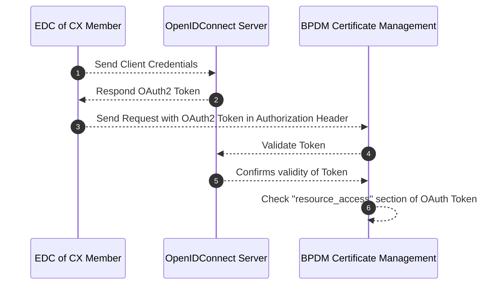
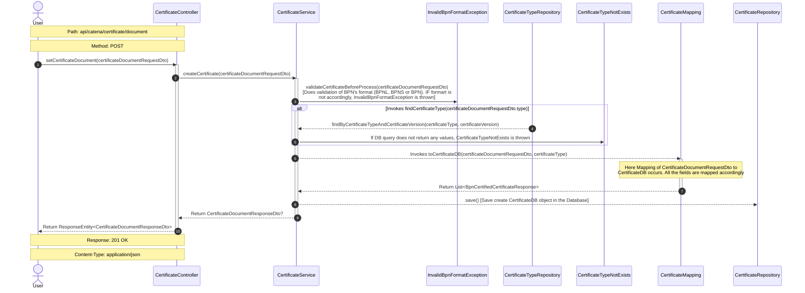
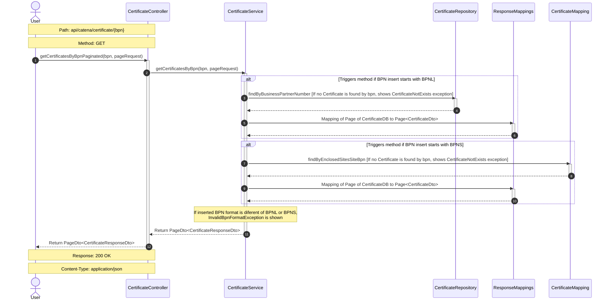
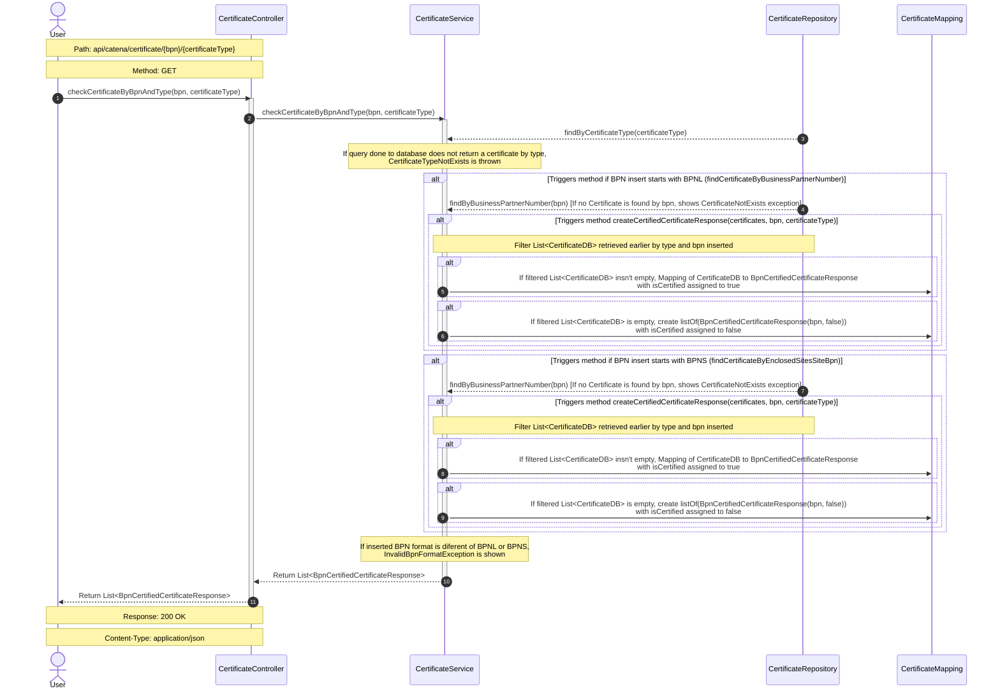
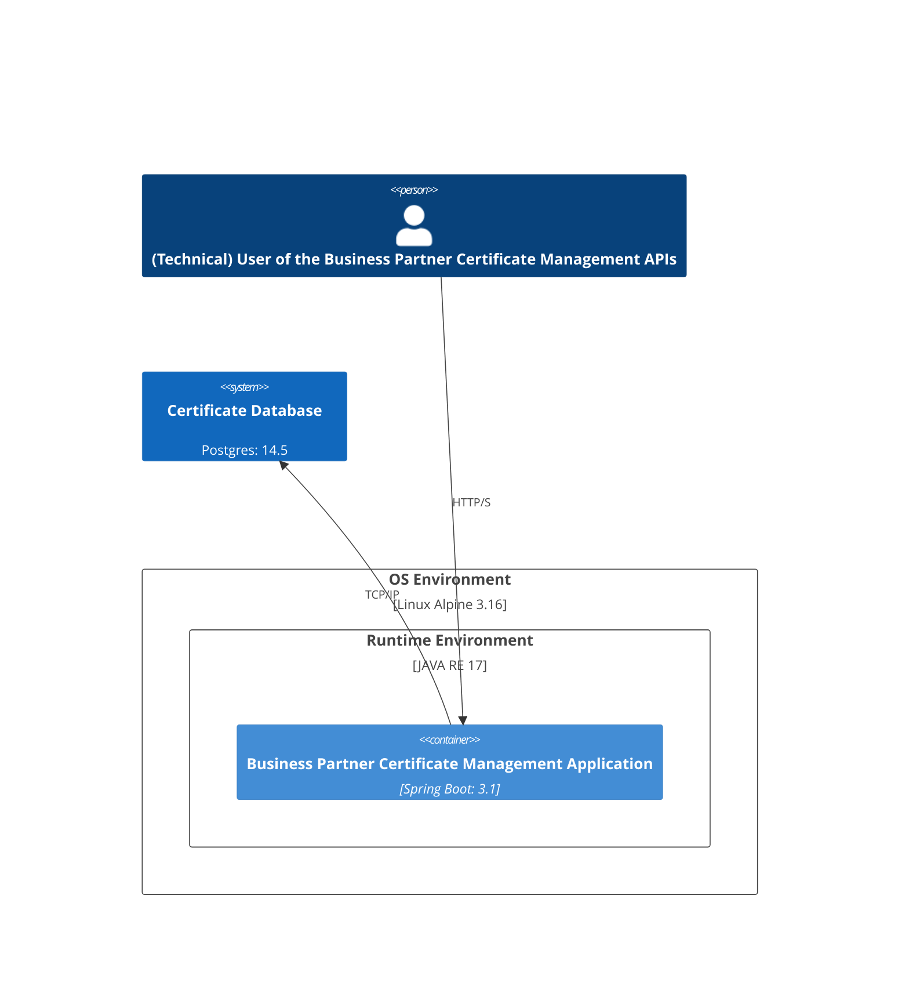
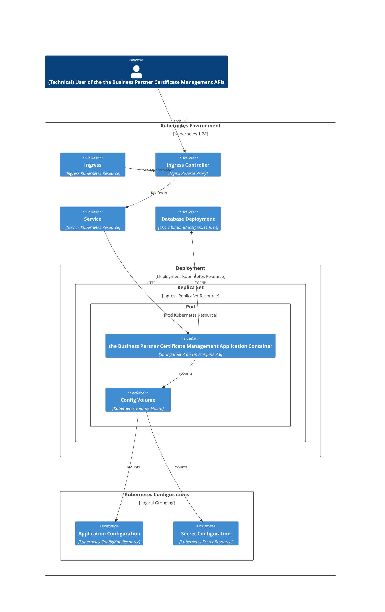

## Certificate Management KIT

## Introduction and Goals

This architecture documentation should foster an understanding on how to utilize the BPDM certificate management KIT effectively. How to integrate the KIT or mainly the API into the application and make use of it.

This Kit covers various aspects, starting from how utilize the available API Endpoints, the used data models and how to make them available to the Catena-X network.

A solution provider should make the following information available for their customers:

- Get all certificates available for a specific BPN - business partner number
- Get a specific certificate (certificate type - e.g. IATF)  based on the BPN
- Get just the simple information whether a provided company based on the BPN is certified for a specific certificate type (true or false)
- Get the certificate document (e.g. the PDF file)
- Get a list of all available certificate types

A solution provider should be able to receive a certificate by a customer:

- Provide certificate data
- Provide a new certificate type

**Additional Information Material**:

- Visit BPDM on the official Catena-X Website: [bpdm_catenax_website](https://catena-x.net/en/offers-standards/bpdm)

## Goals Overview

The following goals have been established for this system:

| Priority | Goal |
| :--- | :--- |
| 1 | Enable network-based data sharing for business partner certificates to increase overall data quality and reliability |
| 2 | Enable also Small and medium-sized Businesses (SMEs) to use the services |
| 3 | Provide a change history for business partner certificate data |

## Requirements Overview

> :warning: **Note:** Cross-Check with CACs

## Quality Goals

| Priority | Quality Goal | Scenario |
|:---|:---|:---|
| 1 | Security | All users and services which access the Application must be authenticated and authorized. Consuming services/users are only allowed to read data. In addition they are only allowed to read the specific data that belongs with this, the Data Sovereignty principles of Catena-X has to be fulfilled |
| 2 | Integrity | All changes must be traceable and must be able to be rolled back |
| 3 | Legally | No natural persons are allowed to get uploaded and stored. For all other uploaded Business Partner data it is mandatory that users (CX Members) can only see their own uploaded certificate data and that it is not possible to draw conclusions about other business partner relationships |
| 4 | Integrity & Correctness |  It must be ensured that the data of the certificate record which is created during the process is correct. |
| 5 | Reliability | The Golden Record Application is a central foundation in the Catena-X Network. It provides all participants and services, business partner data and the unique Business Partner Number (BPN) as identifier. Therefore the BPDM Certificate Management Service must be always/highly available |
| 6 | Functional Stability |  Since the Golden Record Application is a central foundation in the Catena-X Network the defined standards of the API and datamodel for the associated Release Version must be fulfilled |
| 7 | Sensitivity of data | The uploaded business partner certificate data is highly sensitive, that's why it must be ensured that no unauthorized user/system can access data which does not belong to it. More over it must be guaranteed that no one can see the business partners related to the specific Catena-X Member. |

## Architecture Constraints

| Constraint ID | Constraint | Description |
|:---|:---|:---|
| C-1  | Software and third party software must be compliant to the Catena-X and Eclipse Foundation Guidelines/Policies [eclipse_foundation](https://www.eclipse.org/projects/dev_process/) |  |
| C-2 | [Eclipse Dataspace Connector](https://github.com/eclipse-tractusx/tractusx-edc/tree/main) must be used for data transfer between different legal entities |  |

## System Scope and Context

## Business Context

The following figure depicts the business context setup for :

The following are the various components of the business context setup:

### **Master Data Management (Catena-X Member)**

A backend system thats operated by a company / sharing member (e.g. Tier-1) which is participating in the Catena-X Ecosystem and consuming digital services or data assets.

### **Catena-X Portal/Marketplace (CX Portal)**

The Portal which provides an entry point for the Catena-X Members, to discover Apps that are offered in Catena-X.

### **Catena-X BPDM Certificate Management Application**

The Application which offers services to Catena-X Members and Catena-X Use Cases for consuming and processing business partner certificate data.

## Solution Strategy (High Level Picture)

The following high level view gives a basic overview about Components:

### **BPDM Certificate Management**

- The BPDM Certificate Management provides the interfaces for Catena-X Members to manage their business partner certificate data within Catena-X.
- For the current reference implementation, multi-tenancy is realized via a 1:1 deployment for each Catena-X Member. This means that every Catena-X Member who shares his business partner certificate data, has its own persistence.

## Keycloak Authentication & Autorization Flow

## Runtime View

### Upload Business Partner Certificate

The diagram below describes the flow of uploading a business partner certificate.

For further information about the different certificate types, please have a look on the Standards [CX - 00135 Business Partner Number](https://catena-x.net/de/standard-library)

### Query Certificate by Business Partner Number

### Check Certificate availability by Type and Business Partner Number

## Deployment View

### Applications Deployment without Kubernetes

### Single Application Kubernetes Deployment

## Crosscutting Concepts

### Business Partner Certificate Management Standards

[bp_cetificate_management_standards](https://catena-x.net/de/standard-library)

### Logging Behavior

As Spring Boot applications Business Partner Certificate Management employs Spring
specific [logging behavior](https://docs.spring.io/spring-boot/docs/3.0.0/reference/htmlsingle/#features.logging)

We enhance the default log entries with user request information including the determined user ID and a generated request ID.
Not all logs belong to an ongoing user request in which case these entries are empty.

In addition to the Spring standard logs the Business Partner Certificate Management applications keep a log of the following events:

- INFO: User requesting resource with resource name and HTTP verb
- INFO: Request HTTP response
- INFO: Update/Create Business Partners Certificate Types
- INFO: Creating Business Partner Certificate
- ERROR: Uncaught exceptions occurring in the service logic

## Quality Requirements

- see: [Quality Goals](#quality-goals)

## Risks and Technical Debts

### **Open EDC Questions**

- What capabilities will be provided in the future?
- How to deal with APIs provided behind an EDC? Swagger documentation cannot be seen by the requesting service?
- How can we authorize and authenticate a User/System with individual permissions after it passes the EDC?
- Will there by a Proxy EDC concept?
- ...
