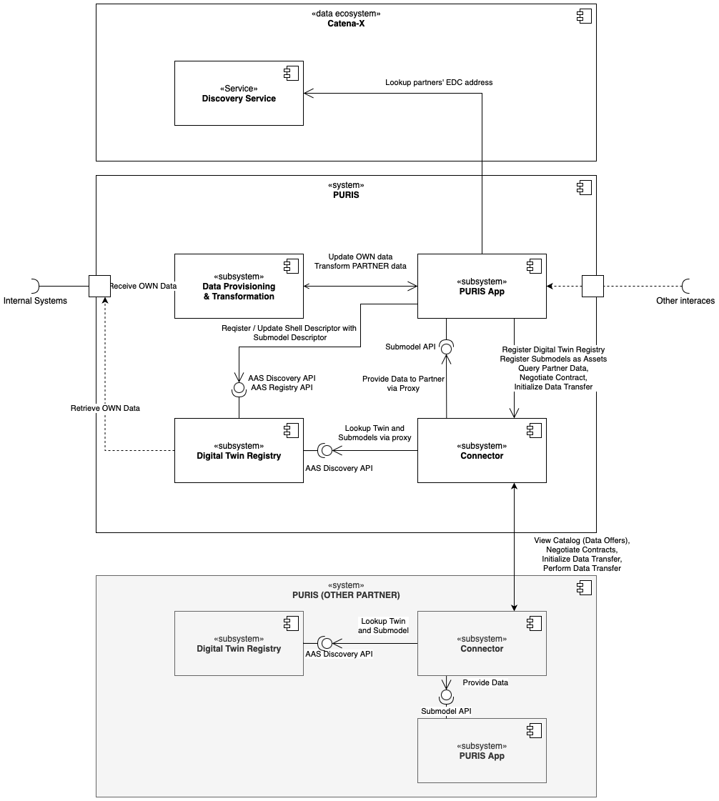
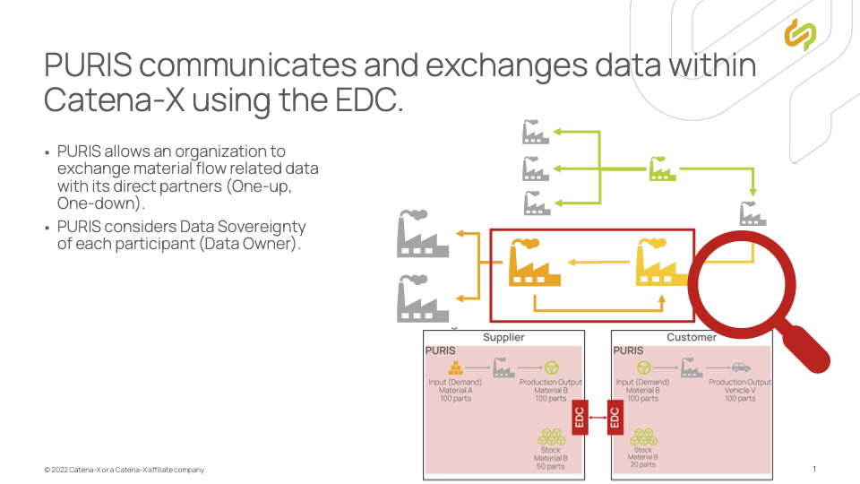

### PURIS Kit

## Vision & Mission

### Vision

***Revolutionizing the Global Supply Chain Ecosystem with Integrated, Proactive Data Sharing and Collaboration***

The introduction of the **P**redictive **U**nit **R**eal-Time **I**nformation **S**ervice (PURIS) enriches a company's resilience strategy through enhanced data sharing, giving stakeholders heightened transparency and comprehensive information. This clarity allows PURIS users to detect supply chain issues earlier, initiate solution-finding more swiftly, and access a wider array of options, leading to more effective, cost-efficient, and environmentally friendly outcomes. By facilitating proactive anticipation, concurrent management, and reactive recovery, PURIS supports the supply chain across pre-, during-, and post-disruption phases, thereby improving operational efficiency and resilience within the Catena-X network.

### Mission

***Empowering Stakeholders with Real-time, Predictive Insights for Proactive Supply Chain Management***

Building on a robust foundation, PURIS is redefining the paradigms of supply chain by establishing necessary standards and guidelines that ensure a comprehensive and compliant exchange of information. This initiative is not just about data exchange; it's about transforming the very fabric of supply chain interactions to foster and enable a proactive, rather than reactive, management approach.

At the heart of PURIS's mission is the goal to provide stakeholders with advanced capabilities that enable informed, strategic decision-making. By integrating daily and predictive data, spanning (1) **Item Stock**, (2) **Short-term Material Demand**, (3) **Planned Production Outputs**, and (4) **Delivery Information**, PURIS creates a rich data landscape. This empowers businesses to anticipate, adapt, and align their operations with both current and upcoming events.

Key aspects of PURIS include:

- Ensuring that only necessary information is exchanged, maintaining privacy and compliance while offering a clear view of the supply situation based on actual, operational data.
- making the application accessible to all players in the supply chain, aiming to become a foundational building block for future industry standards.
- Facilitating a transparent, efficient, and compliant information exchange, enhancing predictive monitoring and early detection capabilities to optimize resource allocation and decision-making.
- Cultivating a collaborative environment where stakeholders can align on shared objectives, transitioning the industry towards a more transparent, predictable, and resilient supply chain ecosystem.
By considering these principles, PURIS is not just enhancing current supply chain management practices but is also paving the way for a more agile, informed, and responsive automotive industry.

#### Example Use Case

***Empowering Stakeholders with Predictive Insights for Proactive Supply Chain Management***

The rapid growth of the Electric Vehicle (EV) market has presented several significant supply chain challenges for automotive manufacturers. One of the critical issues involves managing the intricate supply chain for EV batteries, which are composed of various components such as lithium, cobalt, and nickel, sourced globally. This supply chain is not only highly complex but also highly volatile, with frequent fluctuations in demand and supply affecting production schedules, inventory levels, and ultimately, delivery times to consumers.

In light of these challenges, the mission of PURIS, providing advanced data exchange and collaboration capabilities, becomes crucial. The mission addresses a concrete industry problem: the need for greater transparency, predictability, and efficiency in managing the EV battery supply chain. By enabling predictive insights into material shortages and facilitating daily data exchange on production outputs and material demands, stakeholders can proactively manage their operations, reduce risks of disruption, and optimize inventory management.

##### Implementation Example

1. Automotive manufacturers and suppliers enhance transparency in the supply chain by sharing daily data— manufacturers on short-term material demand and suppliers on planned production outputs. This shared data network allows manufacturers to validate whether their production demand will be met, reducing the risk of the bullwhip effect caused by information asymmetry. Conversely, suppliers gain insights into future demand, enabling them to optimize their production schedules more effectively. While this system doesn't predict customers' call offs, it allows both parties to make informed decisions, aligning production with actual market needs and ensuring a steady supply of EV batteries.
2. By leveraging standardized item stock and delivery information exchanges, manufacturers and suppliers can view daily inventory levels across the supply chain. This visibility enables them to manage stock more effectively, minimizing excess inventory and reducing the risk of stock shortages.
3. In the face of a sudden spike in demand or an unforeseen disruption in the supply of critical materials like lithium, the standardized data exchange framework allows for seamless information sharing among stakeholders. Manufacturers can quickly communicate their needs to suppliers, who can then adjust their delivery schedules or production outputs accordingly. This dynamic collaboration ensures that production is not halted and that customer demand is met without delay.

##### Impact & Benefits

This use case illustrates how PURIS enhancing data collaboration directly addresses the challenges of the EV battery supply chain. By providing a comprehensive, daily view of demand, stock levels, and production schedules, stakeholders can make informed decisions, respond flexibly to changes, and maintain efficient operations. Ultimately, this leads to shorter lead times, cost reductions, and a more responsive supply chain, benefiting manufacturers, suppliers, and consumers alike in the rapidly evolving EV market.

## Business Value

The traditional approach to managing supply chains is often unflexible and manual, leading to delays and limited proactive actions. This is particularly challenging when dealing with potential shortages that can affect the entire supply chain.
PURIS transforms this by creating a collaborative network within the CATENA-X data space, where partners, including suppliers and customers, share and use daily data. This approach allows for a dynamic and interconnected supply chain management, enhancing the ability to monitor supply and demand, identify potential issues early, and make informed decisions.
The benefits of adopting PURIS and the KIT for suppliers and customers include:

- **Enhanced Operational Efficiency**: Automation and daily data sharing improve processes, reduce errors, and enhance inventory management, leading to lower costs, faster lead times, and better market responsiveness.
- **Strategic Supply Chain Resilience**: Predictive analytics help anticipate and mitigate risks, ensuring continuous and reliable service, maintaining customer trust, and safeguarding revenue.
- **Data-Driven Decision Making**: Access to comprehensive data supports advanced analytics and informed strategic choices, fostering innovation and tailored services for the automotive industry.
- **Ecosystem Collaboration and Innovation**: Participation in the Catena-X data space fosters collaboration and innovation, driving digital transformation in the automotive sector.
- **Sustainability and Regulatory Compliance**: Improved efficiency and transparency contribute to waste reduction, lower emissions, and compliance with environmental regulations and sustainability goals.

By integrating PURIS KIT, service providers in the CATENA-X data space are not just responding to digital advancements but are actively defining the future of automotive supply chain management, emphasizing efficiency, resilience, and innovation.

## Use Case / Domain explanation

Given the context of the automotive industry and the integration of PURIS within the Catena-X network, let's delve into a specific use case domain: Optimization of supply chain visibility for electric vehicle (EV) production. This use case aims to address the challenges of electric vehicle manufacturing, which requires a complex network of suppliers and a high degree of component diversity.

### Today's Challenge

The shift to electric vehicle (EV) production presents companies with new and distinct challenges, particularly due to the complex and often volatile supply chain for EV components such as batteries, electric motors, and power electronics. Manufacturers frequently encounter challenges like unpredictable lead times, fluctuating demand for raw materials, and the need for stringent quality and safety standards. These factors lead to inefficiencies and elevated production costs, underscoring the importance of reliable supply chains to address these challenges effectively.

Challenge

1. Supply Chain Opacity: The lack of daily data and transparency in the supply chain makes it difficult to anticipate disruptions, manage inventory efficiently, and ensure timely delivery of components.
2. Complex and Volatile Supplier Network: The EV supply chain, with its widespread and diverse suppliers, faces visibility and control challenges. Demand volatility, influenced by key companies, impacts forecasting and immediate needs. Enhanced visibility can reduce costs by improving inventory management.
3. Regulatory and Environmental Compliance: With increasing regulation on carbon emissions and waste, there is a pressing need for manufacturers to ensure sustainable practices along the entire supply chain.

Opportunities

1. Increased Resilience: By engaging in this use case, stakeholders commit to a resilient supply chain capable of withstanding disruptions and adapting to changes in demand or supply conditions.
2. Innovation and Competitive Advantage: Embracing digital transformation through Catena-X compliant systems provides a foundation for innovation, allowing for novel solutions in EV production and beyond.
3. Sustainability and Compliance: Meeting the growing demands for environmental sustainability and regulatory compliance becomes attainable, enhancing brand reputation and stakeholder trust.

### Benefits for LE (OEM, tier 1, etc.), SME, Solution Provider

- **For Large Enterprises (LEs)**: Achieving daily visibility into the supply chain not only optimizes inventory levels and reduces lead times but also aids in strategic decision-making for future product developments. LEs benefit from enhanced agility, allowing them to better respond to market demand and regulatory changes while minimizing environmental impact.
- **For Small and Medium-sized Enterprises (SMEs)**: Currently companies often need to integrate to different customers' solutions to provide data or do it manually. Being part of a standardized, transparent network levels the playing field, giving SMEs the opportunity to showcase their capabilities and integrate more effectively into the supply chains of larger OEMs. It also reduces the barriers to entry for new markets and facilitates access to critical information that can drive operational improvements and innovation.
- **For Solution Providers**: Solution providers should align with Catena-X by offering interoperable, standardized services for the supply chain. This includes predictive analytics and collaborative platforms, enhancing innovation without risking lock-in, and promoting a competitive ecosystem.

### Use Case Conclusion

Addressing the challenge of optimizing supply chain visibility for EV production through the Catena-X network and KIT system provides tangible benefits for all stakeholders involved, from reducing operational inefficiencies and costs to fostering sustainability and innovation. The collaboration facilitated by this ecosystem encourages sharing of best practices, co-development of standards, and joint efforts in solving industry-wide challenges, ultimately leading to a more coherent, resilient, and sustainable automotive sector.

## Semantic Models

The information about the provided PURIS standardization objects is detailed in this section. It's used in ongoing business relationships and build-to-order (BTO) contexts, not for build-to-stock (BTS) situations without existing business ties.

| Semantic Model                             | Version | Link to GitHub Repository                                                                                                                       |
| ------------------------------------------ | :-----: | ----------------------------------------------------------------------------------------------------------------------------------------------- |
| Item Stock (Release 24.05)                 | v.2.0.0 | [io.catenax.item_stock](https://github.com/eclipse-tractusx/sldt-semantic-models/tree/main/io.catenax.item_stock)                               |
| Short-Term Material Demand (Release 24.05) | v.1.0.0 | [io.catenax.material_demand](https://github.com/eclipse-tractusx/sldt-semantic-models/tree/main/io.catenax.material_demand)                     |
| Planned Production Output (Release 24.05)  | v.2.0.0 | [io.catenax.planned_production_output](https://github.com/eclipse-tractusx/sldt-semantic-models/tree/main/io.catenax.planned_production_output) |
| Delivery Information (Release 24.05)       | v.2.0.0 | [io.catenax.delivery_information](https://github.com/eclipse-tractusx/sldt-semantic-models/tree/main/io.catenax.delivery_information)           |

### Item Stock

The Item Stock is the amount of material allocated to a partner that hasn't been shipped from the supplier and sits in the outbound warehouse or that has reached the customer but hasn't been used yet and sits in the inbound warehouse. By standardizing the Item Stock's definition and provisioning data via digital twins, all participants in the supply chain can share details about their material and product inventory quickly. This improves coordination and increases the options available to address any supply shortages.

**Benefits for LEs, SMEs, and Solution Providers**:

- **LEs**: They gain daily visibility into material availability, reducing the risk of production delays and enabling more efficient inventory management.
- **SMEs**: SMEs can enhance their responsiveness to market changes and improve supply chain collaboration, leading to better resource utilization and cost savings.
- **Solution Providers**: They can offer more valuable services by providing insights into inventory levels, helping users optimize their supply chain and reduce wastage.

### Short-Term Material Demand

This exchange refers to the amount of material a customer's production line needs from an item from a supplier within the next four weeks. It's meant to add context to regular orders, not replace them. Customers can also clarify which demands are essential for their upcoming production and which are extra, perhaps for creating safety stocks. This extra detail helps suppliers plan their production and suggest proactive solutions for potential shortages.
**Benefits for LEs, SMEs, and Solution Providers**:

- **LEs**: Enables better production planning of the supplier by providing the actual material demand, which results in reduced risk of production halts and less shortages.
- **SMEs**: Enhanced ability to communicate urgent needs, helping them maintain steady production and build safety stocks efficiently.
- **Solution Providers**: Better insight into client needs allows for tailored solutions and proactive management of supply challenges.

### Planned Production Output

The exchange illustrates the quantity of material a supplier intends to produce for a specific customer, as agreed upon with the partners, yet remains unmanufactured. By standardizing this exchange through digital platforms, it enables clear communication of forthcoming production volumes, allowing supply chain participants to align their expectations and planning, enhancing responsiveness to market needs and production adjustments.
**Benefits for LEs, SMEs, and Solution Providers**:

- **LEs**: They can better anticipate the availability of necessary materials, allowing for more accurate scheduling and efficient use of production resources.
- **SMEs**: SMEs gain insights into their suppliers' production plans, enabling them to adjust their strategies and operations accordingly for better resource allocation.
- **Solution Providers**: They can offer enhanced forecasting and planning services, helping clients optimize their supply chain and production processes based on upcoming production outputs.

### Delivery Information

Delivery Information includes logistics details and delivery metrics. Logistics details specify the shipment's timing, location, and quantity. Delivery metrics focus on the planned versus actual departure and arrival times, such as shipments leaving a supplier's factory or arriving at a customer's factory. The model provides data on departure and arrival dates and times, locations, quantities shipped, tracking numbers, and other essential logistics information to help coordinate and streamline the delivery process.

**Benefits for LEs, SMEs, and Solution Providers**:

- **LEs**: Enhanced tracking and coordination of incoming and outgoing shipments, enabling better production planning and inventory management.
- **SMEs**: Improved visibility into delivery timings and quantities helps in adjusting operations, reducing storage costs, and enhancing customer satisfaction.
- **Solution Providers**: Ability to offer more accurate and timely logistics services, enhancing value to clients through better supply chain transparency and efficiency.

## Business Process

PURIS orchestrates a set of business processes within the Catena-X network, enhancing supply chain visibility and operational coordination. These processes, characterized by their adaptability to multi-sourcing strategies, are described as follows:

**Actors and Roles**:

- **Data Senders**: Act as data consumers needing information on customers' production output and material demand.
- **Data Receivers**: Act as data providers, offering detailed information about their material demand and production plans to suppliers.

**Data Exchange and Allocation**:

- **Delivery Information**: Unidirectional and direct exchange of information that maintains the confidentiality of delivery data, tailored according to INCOTERMS.
- **Item Stock**: Bidirectional exchange of actual allocated inventory data, not forecasts, considering specific warehouse locations and integrating into consignment processes.
- **Planned Production Output**: Suppliers planned production output to meet customer specific requirements.
- **Short-Term Material Demand**: Complements regular orders with detailed insights into customers' immediate production material requirements, with demand data specifically broken down for each supplier.

**Key Processes**:

- **Single Sourcing**: Direct allocation of orders and material demand in a one-to-one relationship between customer and supplier.
- **Multi-Sourcing**: One item is supplied from more than one supplier. The exchanged data must be allocated to each supplier.
- **Multi-Customer**: One item is provided to more than one customer. The exchanged data must be allocated to each customer.
- **Demand Categories**: Differentiation between regular and extraordinary demand to assist suppliers in prioritization and planning.
- **Production Planning**: Daily versus non-daily planning, with a recommendation for daily planning to enhance accuracy and responsiveness.

The business process facilitated by PURIS enables partners in the Catena-X network to swiftly act on up-to-date information, adapt to the fluidity of market conditions, and develop a well-rounded view of supply chain operations. This comprehensive approach not only encourages collaborative partnerships but also advances risk mitigation strategies and bolsters the overall resilience of the supply chain ecosystem.

### Business Architecture

#### Introduction

PURIS enables exchange of data with suppliers and customers via standardized interfaces (see Digital Twin KIT, Industry Core KIT). The PURIS KIT delivers:

- Operative capabilities to exchange information with direct upstream / downstream supply chain partners in a strict 1-up / 1-down manner.
- Data models that MUST be applied for the interoperable data exchange
- Process help on how to provision data correctly, especially in regard to multi-sourcing and multi-customer scenarios.
- Ideas on value-adding usage of these concepts (see use case example above).

To allow all partners to benefit in the best way from PURIS, each involved party needs to provide their data on the basis of the latest information from the shop floor and its internal systems.

#### Components

From conceptual point of view a PURIS system consists of different building blocks. These building blocks in the following diagram show which participant deploys which components. Identification and Access Management is omitted for simplicity reasons.

The PURIS App is a software application that allows to exchange relevant data with partners. It's meant to

- Provide data following the shared asset approach (see Digital Twin KIT). It manages the Digital Twin Registry (AAS Registry and AAS Discovery API) and provides the data in the correct format via Submodel API.
- Manage the apis and assets in the Connector (see Connector KIT).

The following components are needed for the communication based on the PURIS standard:

- PURIS App = Component orchestrating the Data Exchange following this KIT (as explained above) while providing business value.
- Connector = Component that manages data and API as assets to enable the sovereign data exchange (see Connector KIT)
- Digital Twin Registry = Component that provides AAS Registry and AAS Discovery API implementations (see Digital Twin KIT)
- Data Provisioning & Transformation = Proprietary component allowing to use OWN data or to use PURIS data in internal systems.
- Identity and Access Management (IAM) = Identity Provider spanning authentication and authorization within Catena-X and / or your company. Includes the Credential Service to proof e.g. that a participant signed the Framework Agreement.

## Logic & Schema

PURIS enables data exchange between partners (one-up/one-down) within Catena-X using the Connector, focusing on a short-term horizon, such as 4 weeks, without imposing a strict time limit.

- PURIS allows organizations to exchange material flow-related data with contractual partners (one-up, one-down)
- PURIS respects the data sovereignty of each participant with regard to its own data or data owner

## Standards

Our relevant standards can be downloaded from the official [Catena-X Standard Library](https://catena-x.net/de/standard-library):

| Standard                   | Standard Name | Version |
| -------------------------- | ------------- | :-----: |
| Delivery Information       | CX-0118       | v2.0.0  |
| Short-Term Material Demand | CX-0120       | v2.0.0  |
| Planned Production Output  | CX-0121       | v2.0.0  |
| Item Stock                 | CX-0122       | v2.0.0  |

## Notice

This work is licensed under the CC-BY-4.0

- SPDX-License-Identifier: CC-BY-4.0
- SPDX-FileCopyrightText: 2024,Contributors of the Eclipse Foundation
- SPDX-FileCopyrightText: 2024,ISTOS GmbH (a member of the DMG Mori Group)
- SPDX-FileCopyrightText: 2024,Fraunhofer-Gesellschaft zur Foerderung der angewandten Forschung e.V. (represented by Fraunhofer ISST)
- SPDX-FileCopyrightText: 2024,TRUMPF Werkzeugmaschinen SE + Co. KG
- SPDX-FileCopyrightText: 2024,Volkswagen AG
