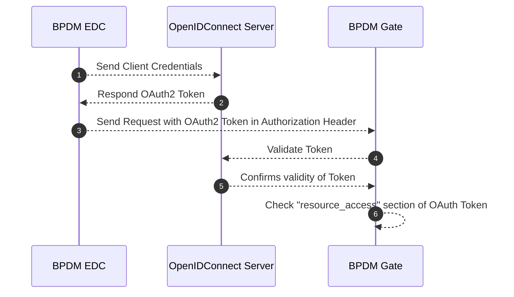
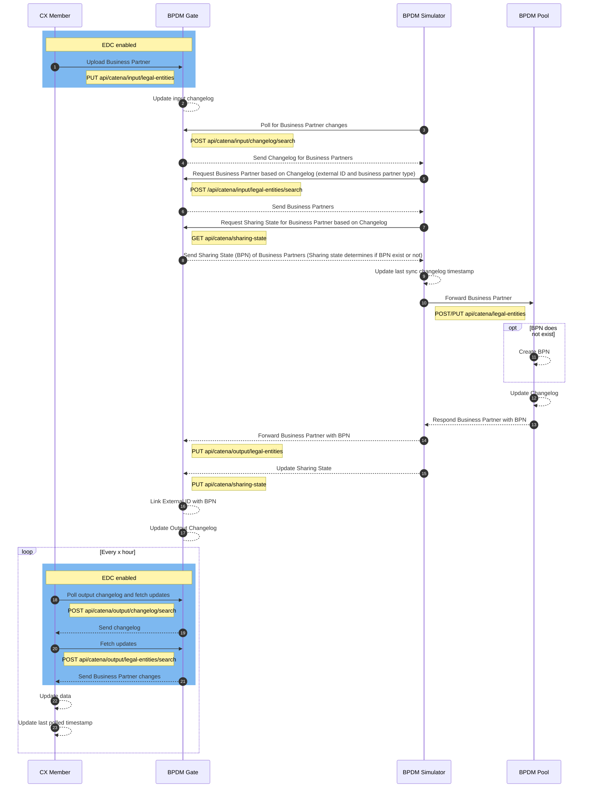
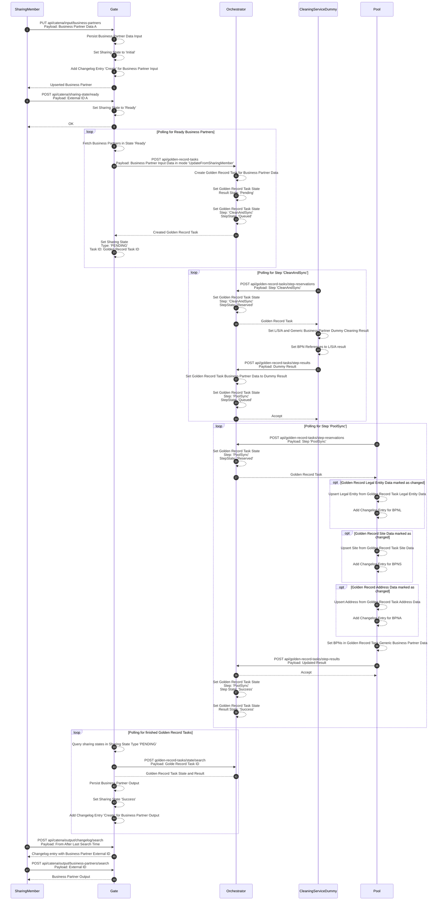
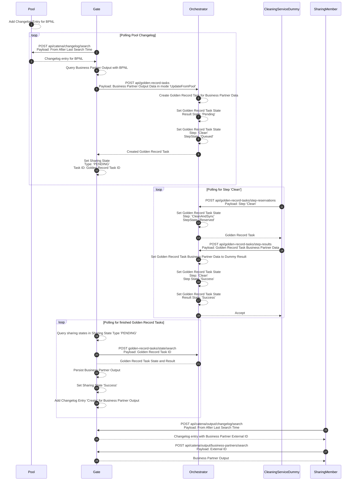
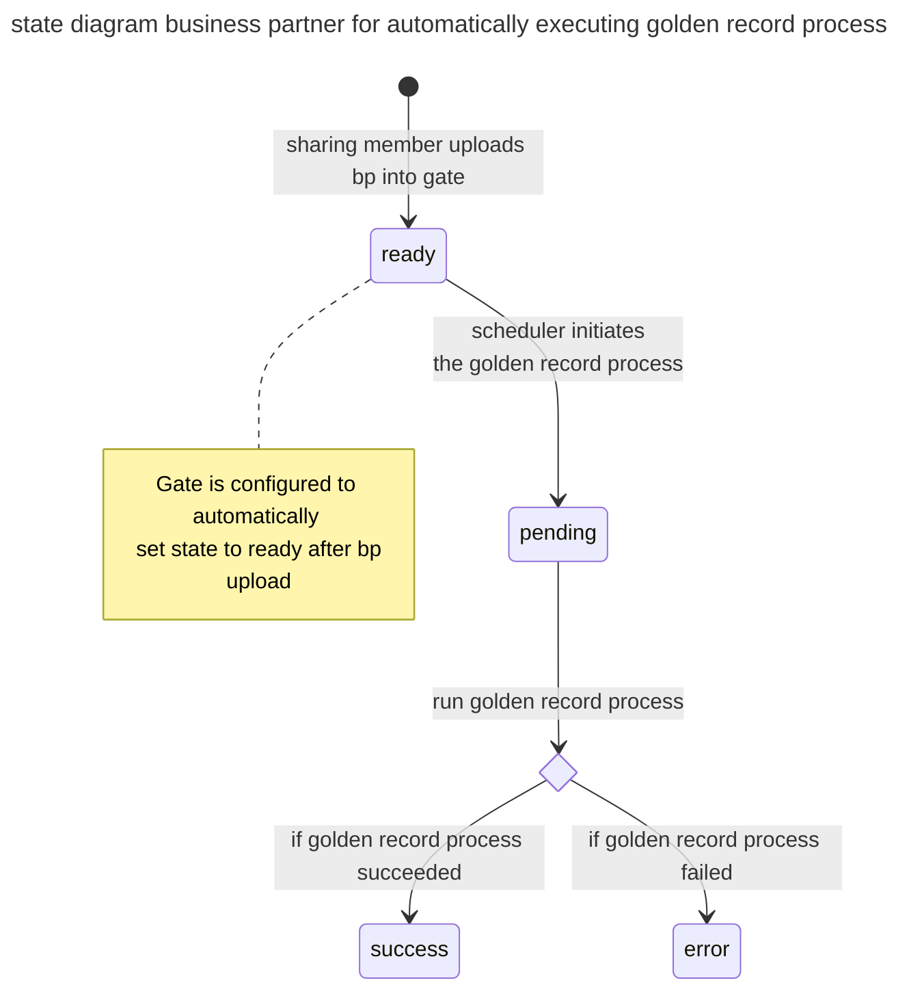
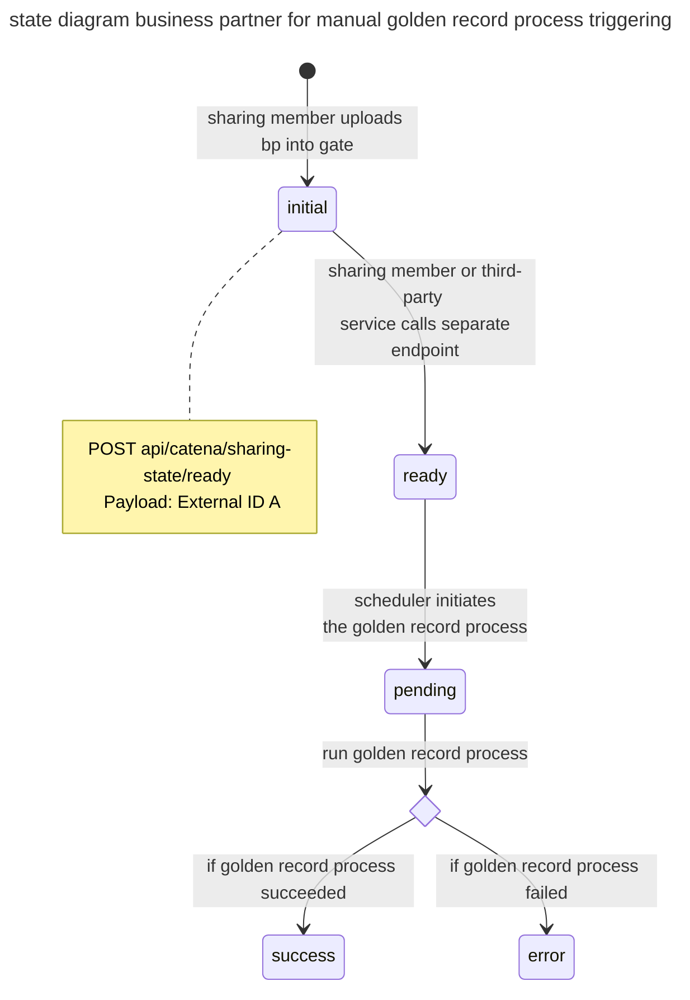
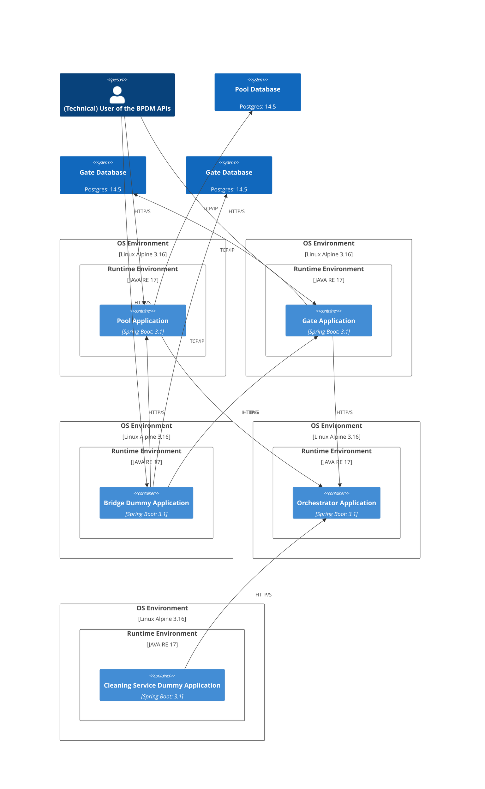
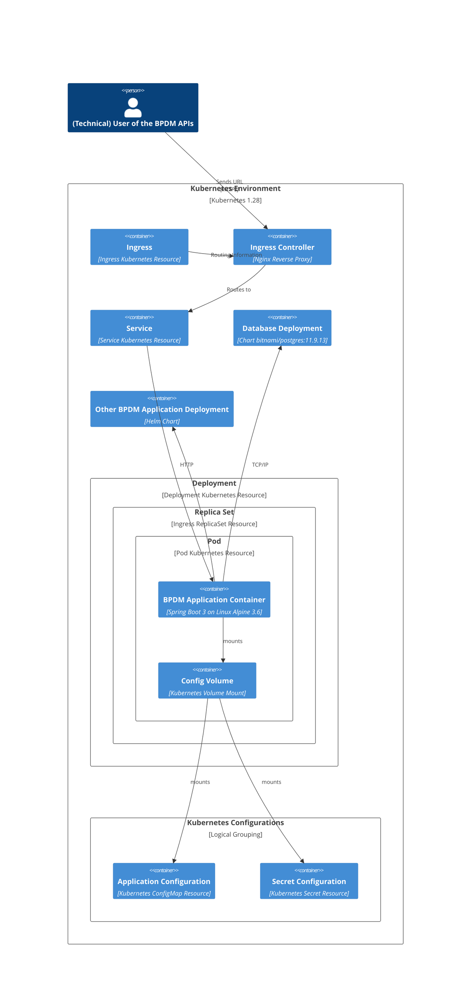

## Business Partner Data Management Application for Golden Record (BPDM)

- [Business Partner Data Management Application for Golden Record (BPDM)](#business-partner-data-management-application-for-golden-record-bpdm)
- [Introduction and Goals](#introduction-and-goals)
  - [Goals Overview](#goals-overview)
  - [Requirements Overview](#requirements-overview)
  - [Quality Goals](#quality-goals)
  - [Stakeholders](#stakeholders)
- [Architecture Constraints](#architecture-constraints)
- [System Scope and Context](#system-scope-and-context)
  - [Business Context](#business-context)
  - [Technical Context](#technical-context)
- [Solution Strategy (High Level Picture)](#solution-strategy-high-level-picture)
- [Building Block View](#building-block-view)
  - [High-Level Architecture (L/S/A Endpoints)](#high-level-architecture-lsa-endpoints)
  - [High-Level Architecture (Generic Endpoint)](#high-level-architecture-generic-endpoint)
  - [Keycloak Authentication \& Authorization Flow](#keycloak-authentication--authorization-flow)
- [Runtime View](#runtime-view)
  - [Upload Business Partner (BPN-L)](#upload-business-partner-bpn-l)
  - [Upsert Generic Business Partner](#upsert-generic-business-partner)
  - [Update on Golden Record Change](#update-on-golden-record-change)
- [Business Partner Data Records - States](#business-partner-data-records---states)
  - [Automatically executing golden record process](#automatically-executing-golden-record-process)
  - [Manually triggering golden record process](#manually-triggering-golden-record-process)
- [Deployment View](#deployment-view)
  - [Applications Deployment without Kubernetes](#applications-deployment-without-kubernetes)
  - [Single Application Kubernetes Deployment](#single-application-kubernetes-deployment)
- [Crosscutting Concepts](#crosscutting-concepts)
  - [Business Partner Data Management Standards](#business-partner-data-management-standards)
  - [Logging Behavior](#logging-behavior)
- [Architecture Decisions](#architecture-decisions)
- [Quality Requirements](#quality-requirements)
- [Risks and Technical Debts](#risks-and-technical-debts)
- [Glossary](#glossary)
  - [NOTICE](#notice)

## Introduction and Goals

This document describes the Catena-X Business Partner Data Management Application, short BPDM.

In the Catena-X Automotive Network, the so-called Golden Record, together with a unique identifier, the Business Partner Number (BPN), creates an efficient solution to the increasing data retention costs.

The Golden Record is a concept that identifies, links and harmonizes identical data on legal entites, sites and addresses from different sources (“sharing members"). During the creation of the Golden Record data, duplicates are removed, the quality within the data records is improved, missing information is added and deviations are automatically corrected. This is done using public, commercial or other agreed sources of trust and/or information. This approach reduces costs of business partner data maintenance and validation for all the companies concerned.

The BPN, as the unique identifier of the Golden Record, can be stored as a verifiable credential used in an SSI solution so that a business partner can provide it for authentication and authorization.

The Golden Record business partner data in combination with the BPN acts as the basis for a range of supplementary value-added services to optimize business partner data management. These are referred to as value-added services. Together with decentralized, self-determined identity management, they create a global, cross-industry standard for business partner data and a possible 360° view of the value chain.

> [!NOTE]
> A Business Partner Data cleaning as well as Golden Record Creation Process is **not** part of this reference implementation!

**Additional Information Material**:

- Visit BPDM on the official Catena-X Website: [bpdm_catenax_website](https://catena-x.net/en/offers-standards/bpdm)

## Goals Overview

The following goals have been established for this system:

| Priority | Goal                                                                                                         |
| -------- | ------------------------------------------------------------------------------------------------------------ |
| 1        | Provide unique global business partner IDs within the Catena-X Network                                       |
| 1        | Provide centralized Master Data Management for business partner data                                         |
| 2        | Enable network-based data sharing for business partner data to increase overall data quality and reliability |
| 2        | Enable also Small and medium-sized Businesses (SMEs) to use the services |
| 3        | Provide a change history für business partner data |

## Requirements Overview

> [!IMPORTANT]
> **Cross-Check with CACs**

The following Usecases together with its requirements exist for this system:

| Req-Id  | Requirement        | Explanation |
| ------- | ------------------ | ----------- |
| BPDM-R1 | Upload and curate BP data     | CX Member can upload their business partner and get curated business partner information back, based on the Golden Record             |
| BPDM-R2 | Provide changelog for BP | A changelog is provided to determine which changes on which date are available             |
| BPDM-R3 | Provide GR                    | Based on the shared business partner information and external service providers a Golden Record is created             |
| BPDM-R4 | Provide changelog for GR        | A changelog is provided to determine which changes on which date are available             |
| BPDM-R5 | Keep GR up-to-date based on external resources                    | Golden Records must regularly checked for changes based on external resources             |
| BPDM-R6 | Provide unique business partner IDs                    | For each Golden Record a unique ID, the so called Business Partner Number (BPN) is created             |

## Quality Goals

| Priority | Quality Goal            | Scenario                                                                                                                                                                                                                                                                                                                                                                                             |
| -------- | ----------------------- | ---------------------------------------------------------------------------------------------------------------------------------------------------------------------------------------------------------------------------------------------------------------------------------------------------------------------------------------------------------------------------------------------------- |
| 1        | Security                | All users and services which access the Golden Record Application must be authenticated and authorized. Only the Golden Record Application itself is allowed to perform changes on data. Consuming services/users are only allowed to read data. In addition they are only allowed to read the specific data that belongs with this, the Data Sovereignty principles of Catena-X has to be fulfilled |
| 1        | Integrity               | Only the Golden Record Application is allowed to perform changes on the data. In addition, all changes must be traceable and must be able to be rolled back                                                                                                                                                                                                                                          |
| 1        | Legally                 | No natural persons are allowed to get uploaded and stored. For all other uploaded Business Partner data it is mandatory that users (CX Members) can only see their own uploaded data and that it is not possible to draw conclusions about other business partner relationships                                                                                                                      |
| 1        | Integrity & Correctness | It must be ensured that the data of the golden record which is created during the process is correct.                                                                                                                                                                                                                                                                                                |
| 2        | Reliability             | The Golden Record Application is a central foundation in the Catena-X Network. It provides all participants and services, business partner data and the unique Business Partner Number (BPN) as identifier. Therefore the BPDM Services must be always/highly available                                                                                                                              |
| 2        | Functional Stability    | Since the Golden Record Application is a central foundation in the Catena-X Network the defined standards of the API and datamodel for the associated Release Version must be fulfilled                                                                                                                                                                                                              |
| 1        | Sensitivity of data     | the uploaded business partner data is highly sensitive, that's why it must be ensured that no unauthorized user/system can access data which does not belong to it. More over it must be guaranteed that no one can see the business partners related to the specific Catena-X Member.                                                                                                               |

## Stakeholders

| Role/Name               | Expectations                                                                                                 | Example                                                                                                                                     |
| ----------------------- | ------------------------------------------------------------------------------------------------------------ | ------------------------------------------------------------------------------------------------------------------------------------------- |
| Big Company (CX-Member) | Company wants to have cleaned and enriched business partner data objects with a BPN.                         |                                                                                                                                             |
| SME Company (CX-Member) | Company wants to have cleaned and enriched business partner data objects with a BPN based on a CSV data.     |                                                                                                                                             |
| CX Apps                 | Other apps and their use cases want to use the business partner data objects and the BPN for their processes | The CX Portal will use the BPN for on-boarding new companies into the network. Traceability Apps will use BPN to describe business partners |

## Architecture Constraints

| Constraint ID | Constraint                                                                                                                                                      | Description |
| ------------- | --------------------------------------------------------------------------------------------------------------------------------------------------------------- | ----------- |
| C-1           | Software and third party software must be compliant to the Catena-X and Eclipse Foundation Guidelines/Policies [eclipse_foundation](https://www.eclipse.org/projects/dev_process/) |             |
| C-2          | [Eclipse Dataspace Connector](https://github.com/eclipse-tractusx/tractusx-edc/tree/main) must be used for data transfer between different legal entities        |             |

## System Scope and Context

## Business Context

The following figure depicts the business context setup for BPDM:

The following are the various components of the business context setup:

### **Master Data Management (Catena-X Member)**

A backend system that's operated by a company which is participating in the Catena-X Ecosystem and consuming digital services or data assets.

### **Small-Medium-Enterprises (SME) (Catena-X Member)**

A SME company that's participating in the Catena-X Ecosystem and consuming digital services or data assets.

### **Catena-X Portal/Marketplace (CX Portal)**

The Portal which provides an entry point for the Catena-X Members, to discover Apps that are offered in Catena-X.

### **Value Added Services**

- Value Added Services can be provided be either the Operator itself or by an external App/Service Provider. The Value Added Services provide data or service offers based on Catena-X Network data.
- There are several value added services that can be offered in context of business partner data. For example a Fraud Prevention Dashboard/API, Country Risk Scoring and so on.

### **Catena-X Operative Environment for BPDM**

- Within Catena-X there will be only one central operation environment that operates the BPDM Application. This operative environment provides the services and data for other operation environment or applications which needs to consume business partner data or golden record data.

### **Catena-X BPDM Application**

- The BPDM Application which offers services to Catena-X Members, Catena-X Use Cases and Catena-X BPDM Value Added Services for consuming and processing business partner data as well as Golden Record Information and BPN Numbers.

### **Curation & Enrichment Services**

- To offer the BPDM and Golden Record Services, Catena-X uses services from external third party service providers. These can either be operated by the operator itself or external companies that have a contract with the operator.

## Technical Context

The technical context setup including deployment is depicted in the following figure:

- The BPDM Application follows a microservice approach to separate the different components of the system.
- Within Catena-X there will be only one central operation environment that operates the BPDM Application. This operation environment provides the services and data for other operation environment or applications which needs to consume business partner data or golden record data.

## Solution Strategy (High Level Picture)

The following high level view gives a basic overview about the BPDM Components:

### **BPDM Gate**

- The BPDM Gate provides the interfaces for Catena-X Members to manage their business partner data within Catena-X.
- Based on the network data a Golden Record Proposal is created.
- The BPDM Gate has its own persistence layer in which the business partner data of the Catena-X Members are stored.
- For the current reference implementation, multi-tenancy is realized via a 1:1 deployment for each Catena-X Member. This means that every Catena-X Member who shares his business partner data, has its own Gate and own persistence.

### **BPDM Pool**

- The BPDM Pool is the central instance for business partner data within Catena-X.
- The BPDM Pool provides the interface and persistance for accessing Golden Record Data and the unique Business Partner Number.
- In comparison to the BPDM Gate, there is only one central instance of the BPDM Pool.

### **BPN Issuer**

- Every participant in the Catena-X network shall have a unique Business Partner Number (BPN) according to the concept defined by the Catena-X BPN concept. The task of the BPN Generator is to issue such a BPN for a presented Business Partner data object. In that, the BPN Generator serves as the central issuing authority for BPNs within Catena-X.
- Technically, it constitutes a service that is available as a singleton within the network.
- Currently, creation of BPNs is part of the BPDM Pool implementation. After implementing the BPDM Orchestrator, it can be considered if it should be an independent component.

### **BPDM Orchestrator**

- Intention of the BPDM Orchestrator is to provide a passive component that offers standardized APIs for the BPDM Gate, BPDM Pool and Data Curation and Enrichment Services to orchestrate the process of Golden Record Creation and handling the different states a business partner record can have during this process.

## Building Block View

### High-Level Architecture (L/S/A Endpoints)

Due to a transmission phase there are two concepts of Business Partner Upload Models. The target is to only have the generic Business Partner on the BPDM Gate.

### High-Level Architecture (Generic Endpoint)

#### **Simulator Service**

- To become more independent in testing the BPDM Application, a Simulator Service was developed.
- The Simulator Services supports the E2E Test Cases to validate the flow from BPDM Gate to BPDM Pool and back again.

#### **EDC Operator**

- The diagram above shows two EDCs on Operator side. This is only for visualization purpose. On a technical level there is only one EDC.

#### **SME**

-Currently there is no SME Application available

## Keycloak Authentication & Authorization Flow

## Runtime View

### Upload Business Partner (BPN-L)

The diagram below describes the flow of uploading a business partner of type "legal entity".
For further information about the different business partner types (Legal Entity, Site, Address), please have a look on the Standards [CX - 0010 Business Partner Number](https://catena-x.net/de/standard-library)

### Upsert Generic Business Partner

> [!NOTE]
> An additional endpoint was implemented as requirements came up that required business partner data records not to be fed directly into the golden record process after an upload. Instead, this endpoint makes it possible to change the status of a business partner data record from "inital" to "ready". Only data records with the status "ready" are fed into the golden record process.
> We are aware that the existing integration scenarios, such as with the portal team, are impacted by this. For this reason, we recommend that the gate is configured accordingly so that the status is set to "ready" by default when a data record is uploaded. The operator can configure this behavior in the gate individually based on the requirements.

### Update on Golden Record Change

## Business Partner Data Records - States

This sections describes the different states a business partner data record can have.

### Automatically executing golden record process

### Manually triggering golden record process

## Deployment View

### Applications Deployment without Kubernetes

### Single Application Kubernetes Deployment

## Crosscutting Concepts

### Business Partner Data Management Standards

[bpdm_standards](https://catena-x.net/de/standard-library)

### Logging Behavior

As Spring Boot applications BPDM employs Spring
specific [logging behavior](https://docs.spring.io/spring-boot/docs/3.0.0/reference/htmlsingle/#features.logging)

We enhance the default log entries with user request information including the determined user ID and a generated request ID.
Not all logs belong to an ongoing user request in which case these entries are empty.

In addition to the Spring standard logs the BPDM applications keep a log of the following events:

- INFO: User requesting resource with resource name and HTTP verb
- INFO: Request HTTP response
- INFO: Update/Create Golden Record Business Partners
- INFO: Creating BPNs
- ERROR: Uncaught exceptions occurring in the service logic

## Architecture Decisions

[Architecture Decision Logs](https://confluence.catena-x.net/display/CORE/BPDM+%7C+Decision+Logs)
(Link will be replaced with ADRs based on Markdown)

- 001-multitenancy_approach
- 002-edc_for_pool_api
- 003-orchestrator_serviceApi_vs_messagebus_approach
- 004-openapi_descriptions
- 005-edc-usage-for-third-party-services
- 006-bpdm-edc-asset-structuring (TBD)

## Quality Requirements

- see: [Quality Goals](#quality-goals)

## Risks and Technical Debts

### **Open EDC Questions**

- What capabilities will be provided in the future?
- How to deal with APIs provided behind an EDC? Swagger documentation cannot be seen by the requesting service?
- How can we authorize and authenticate a User/System with individual permissions after it passes the EDC?
- Will there by a Proxy EDC concept?
- ...

### **Semantic Model and SSI Integration of the Golden Record**

- Not in scope.

### **Dependency on third party service provider**

- Currently we are not flexible enough to easily change the third party service provider for golden record creation. Therefore the next step will be to introduce an own data persistence layer, getting more independent.
- ✔️Solved via "Simulator Application"

### **Data Storage and anonymize concept**

- How to anonymize the relations between CX-Member and its belonging Business Partner?
- 💡 Idea: using kind of "ticket numbering"
- ✔️ Solved via ticketing.

### **Accessability for SMEs**

- Uploading via CSV File. Does it requires an EDC?
- ⚠️Current State: Yes, is needed.

## Glossary

The Glossary is currently under development and will be added below after internal approval ([DRAFT](https://confluence.catena-x.net/display/CORE/BPDM+Glossary+-+Internal+-+DRAFT)).

The current version you can find in the Catena-X Standards.

## NOTICE

This work is licensed under the [Apache-2.0](https://www.apache.org/licenses/LICENSE-2.0).

- SPDX-License-Identifier: Apache-2.0
- SPDX-FileCopyrightText: 2023,2024 ZF Friedrichshafen AG
- SPDX-FileCopyrightText: 2023,2024 Bayerische Motoren Werke Aktiengesellschaft (BMW AG)
- SPDX-FileCopyrightText: 2023,2024 Mercedes Benz Group
- SPDX-FileCopyrightText: 2023,2024 Schaeffler AG
- SPDX-FileCopyrightText: 2023,2024 Contributors to the Eclipse Foundation
- Source URL: [https://github.com/eclipse-tractusx/bpdm](https://github.com/eclipse-tractusx/bpdm)
