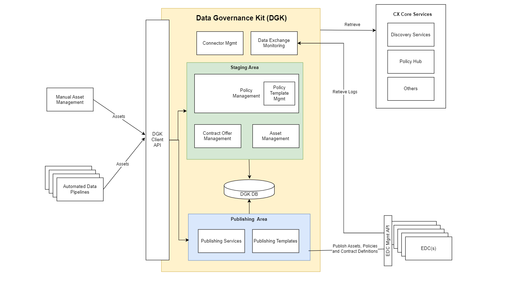

## Data Governance KIT

<!--
 * Copyright (c) 2021,2023 T-Systems International GmbH
 * Copyright (c) 2021,2023 Contributors to the Eclipse Foundation
 *
 * See the NOTICE file(s) distributed with this work for additional
 * information regarding copyright ownership.
 *
 * This documentation and the accompanying materials are made available under the
 * terms of the Creative Commons Attribution 4.0 International License,  which is available at
 * https://creativecommons.org/licenses/by/4.0/legalcode.
 *
 * Unless required by applicable law or agreed to in writing, software
 * distributed under the License is distributed on an "AS IS" BASIS, WITHOUT
 * WARRANTIES OR CONDITIONS OF ANY KIND, either express or implied. See the
 * License for the specific language governing permissions and limitations
 * under the License.
 *
 * SPDX-License-Identifier: CC-BY-4.0

-->

This document describes the foundations of the Data Governance KIT (=Keep It Together).

For more information see

* [Development View and Architecture](./development-view)

### Overview

The Data Governance Kit provides a set of API specifications which would help the application developers in developing the abstraction layer of EDC to simplify the data governance. This should be helpful in building products but won't be one in itself. The client API from Data Governance Kit should cover the most typical Data Provider and Consumer functions, including publishing and managing data offers, managing policies, listing data transfers and contract negotiations. Important to note here is that the API specifications makes it possible to interact with multiple EDC connectors at once.

### High Level Architecture

As it would be clear now that the Data Governance Kit acts as an abstraction layer for multiple EDC Connctors and hides the EDC complexities behind it. This is achieved by using the below concepts:

* Staging (or Management )
* Publication

The staging or Management refers to the creation, updation, deletion of various Assets, Policies and Contract Offers locally within the Governance KIT before actually sending those to the connectors. The users can create as many Assets, Policies or Contract Offers, get those reviewed and approved by any manual or automatic workflow process. Once the users are sure that now the data is ready to be sent to Connectors, the Publication process kicks in. Using the publication process, all the reviewed/approved assets, policies and contract offers can be sent to the required connectors. The following high level architecture provides more details.

### API Specifications

The Data Governance KIT API specifications can be found here.

[Data Governance Kit Swagger API Specifications](https://eclipse-tractusx.github.io/api-hub/eclipse-tractusx.github.io/kit-data-governance-openAPI-0.0.1-SNAPSHOT/swagger-ui/)

## NOTICE

This work is licensed under the [CC-BY-4.0](https://creativecommons.org/licenses/by/4.0/legalcode).

* SPDX-License-Identifier: CC-BY-4.0
* SPDX-FileCopyrightText: 2023,2024 T-Systems International GmbH
* SPDX-FileCopyrightText: 2022,2023 Contributors to the Eclipse Foundation
