## Business Roles and Functions

Delta production data is embedded into the WeekBasedCapacityGroup aspect model. This means that only suppliers provide delta production related data and customers consume it.

|Function / Role|Customer|Supplier|
|-|-|-|
|Solve bottleneck via pre production||X|
|Solve bottleneck via post production||X|
|Inform customer||X|
|Acknowledge that bottleneck has been solved|X||

## Sequence Diagram

```mermaid
sequenceDiagram
Participant c as Customer
Participant s as Supplier
rect rgb(157,93,00) 
c->>s: I need 100 blue toys each in weeks 47, 48, 49 and 50
end
s->>s: Manage Capacities
s->>s: There is a bottleneck in week 50
s->>s: It is solvable via pre-production in weeks 48 and 49  

rect rgb(64,74,00)
s-->>c: I can produce 100 in week 47, 0 in week 50 and 150 in weeks 48 and 49
s->>c: 50 each in weeks 48 und 49 are pre-produced to cover the demand in week 50
end
```

For further details, please refer to [CX-0128 Demand and Capacity Management Data Exchange][StandardLibrary].

## Notice

This work is licensed under the [CC-BY-4.0](https://creativecommons.org/licenses/by/4.0/legalcode)

- SPDX-License-Identifier: CC-BY-4.0
- SPDX-FileCopyrightText: 2023,2024 ZF Friedrichshafen AG
- SPDX-FileCopyrightText: 2023,2024 Bayerische Motoren Werke Aktiengesellschaft (BMW AG)
- SPDX-FileCopyrightText: 2023,2024 SAP SE
- SPDX-FileCopyrightText: 2023,2024 Volkswagen AG
- SPDX-FileCopyrightText: 2023,2024 Mercedes Benz Group AG
- SPDX-FileCopyrightText: 2023,2024 BASF SE
- SPDX-FileCopyrightText: 2023,2024 SupplyOn AG
- SPDX-FileCopyrightText: 2023,2024 Henkel AG & Co.KGaA
- SPDX-FileCopyrightText: 2023,2024 Fraunhofer-Gesellschaft zur Förderung der angewandten Forschung e.V (Fraunhofer)
- SPDX-FileCopyrightText: 2023,2024 Contributors to the Eclipse Foundation

[StandardLibrary]: https://catenax-ev.github.io/docs/next/standards/CX-0128-DemandandCapacityManagementDataExchange
