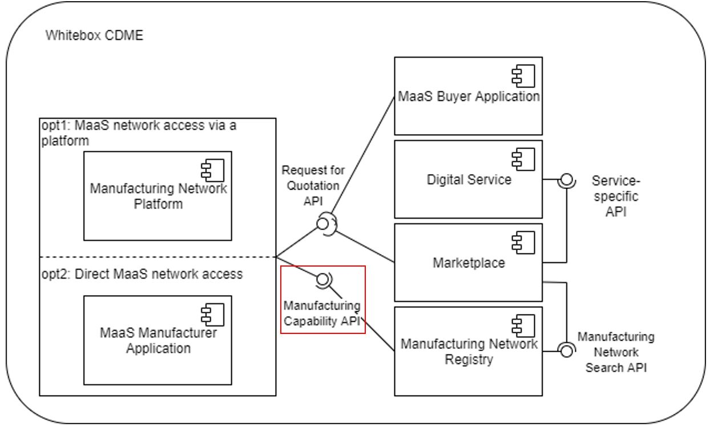

MaaS scenarios focus on connecting buyers and manufacturers. Buyers have a demand for products, which are produced by manufacturers with the required production capabilities. The Manufacturing Capability API defines how to share the manufacturing capabilities, e.g. to onboard them to a Manufacturing Network Registry. Manufacturing Network Platforms and MaaS Manufacturer Application can use the Manufacturing Capability API to onboard their manufacturing capabilities in the Manufacturing Network Registry (see figure).



The Manufacturing Capability API description below shows how the Manufacturing Capability Aspect Model could be used. The aspect model is designed to represent manufacturing capabilities based on the concepts of products, processes, resources and capabilities and their relations to each other.

Depending on the use case different request paths can be implemented, based on the specific MaaS implementations. Below are two sample request options:

- GET: /\{api-endpoint\}/ManufacturingCapability
  - Description: The API endpoint to get manufacturing capabilities of a manufacturer.
- POST: /\{api-endpoint\}/ManufacturingCapability
  - Description: The API endpoint to register manufacturing capabilities of a manufacturer.

## Sample Data

```json
{
  "machineTools": [
    {
      "canProcessMaterials": [
        {
          "belongsToMaterialFamilies": [
            {
              "specializes": [
                {
                  "hierarchyElementId": "urn:manufacturing-capability:material-family:4"
                }
              ],
              "label": {
                "und": "aluminum"
              },
              "generalizes": [
                {
                  "hierarchyElementId": "urn:manufacturing-capability:material-family:4"
                }
              ],
              "hierarchyElementId": "urn:manufacturing-capability:material-family:4",
              "properties": [
                {
                  "semanticReferences": [
                    {
                      "semanticReferenceId": "urn:eclass:0173-1#02-AAF583#002"
                    }
                  ],
                  "propertyLabel": {
                    "und": "nominal voltage"
                  },
                  "propertyValue": "220"
                }
              ]
            }
          ],
          "properties": [
            {
              "semanticReferences": [
                {
                  "semanticReferenceId": "urn:eclass:0173-1#02-AAF583#002"
                }
              ],
              "propertyLabel": {
                "und": "nominal voltage"
              },
              "propertyValue": "220"
            }
          ],
          "label": {
            "und": "aluminum"
          }
        }
      ]
    }
  ],
  "processes": [
    {
      "billOfProcessIdentification": "www.1234-bar-chair-billOfProcess.de"
    }
  ],
  "machines": [
    {
      "containsTools": [
        {
          "canProcessMaterials": [
            {
              "belongsToMaterialFamilies": [
                {
                  "specializes": [
                    {
                      "hierarchyElementId": "urn:manufacturing-capability:material-family:4"
                    }
                  ],
                  "label": {
                    "und": "aluminum"
                  },
                  "generalizes": [
                    {
                      "hierarchyElementId": "urn:manufacturing-capability:material-family:4"
                    }
                  ],
                  "hierarchyElementId": "urn:manufacturing-capability:material-family:4",
                  "properties": [
                    {
                      "semanticReferences": [
                        {
                          "semanticReferenceId": "urn:eclass:0173-1#02-AAF583#002"
                        }
                      ],
                      "propertyLabel": {
                        "und": "nominal voltage"
                      },
                      "propertyValue": "220"
                    }
                  ]
                }
              ],
              "properties": [
                {
                  "semanticReferences": [
                    {
                      "semanticReferenceId": "urn:eclass:0173-1#02-AAF583#002"
                    }
                  ],
                  "propertyLabel": {
                    "und": "nominal voltage"
                  },
                  "propertyValue": "220"
                }
              ],
              "label": {
                "und": "aluminum"
              }
            }
          ]
        }
      ],
      "label": {
        "und": "aluminum"
      },
      "provides": [
        {
          "specializes": [
            {
              "hierarchyElementId": "urn:manufacturing-capability:material-family:4"
            }
          ],
          "capabilityConstraintSet": [
            {
              "capabilityConstraintProperties": [
                {
                  "semanticReferences": [
                    {
                      "semanticReferenceId": "urn:eclass:0173-1#02-AAF583#002"
                    }
                  ],
                  "propertyLabel": {
                    "und": "nominal voltage"
                  },
                  "propertyValue": "220"
                }
              ],
              "refersToMaterial": {
                "belongsToMaterialFamilies": [
                  {
                    "specializes": [
                      {
                        "hierarchyElementId": "urn:manufacturing-capability:material-family:4"
                      }
                    ],
                    "label": {
                      "und": "aluminum"
                    },
                    "generalizes": [
                      {
                        "hierarchyElementId": "urn:manufacturing-capability:material-family:4"
                      }
                    ],
                    "hierarchyElementId": "urn:manufacturing-capability:material-family:4",
                    "properties": [
                      {
                        "semanticReferences": [
                          {
                            "semanticReferenceId": "urn:eclass:0173-1#02-AAF583#002"
                          }
                        ],
                        "propertyLabel": {
                          "und": "nominal voltage"
                        },
                        "propertyValue": "220"
                      }
                    ]
                  }
                ],
                "label": {
                  "und": "aluminum"
                },
                "properties": [
                  {
                    "semanticReferences": [
                      {
                        "semanticReferenceId": "urn:eclass:0173-1#02-AAF583#002"
                      }
                    ],
                    "propertyLabel": {
                      "und": "nominal voltage"
                    },
                    "propertyValue": "220"
                  }
                ],
                "@type": "MaterialEntity"
              }
            }
          ],
          "capabilityId": "urn:manufacturing-capability:capability:42",
          "capabilityLabel": {
            "und": "sawing"
          },
          "label": {
            "und": "aluminum"
          },
          "generalizes": [
            {
              "hierarchyElementId": "urn:manufacturing-capability:material-family:4"
            }
          ],
          "semanticReferences": [
            {
              "semanticReferenceId": "urn:eclass:0173-1#02-AAF583#002"
            }
          ],
          "hierarchyElementId": "urn:manufacturing-capability:material-family:4",
          "properties": [
            {
              "semanticReferences": [
                {
                  "semanticReferenceId": "urn:eclass:0173-1#02-AAF583#002"
                }
              ],
              "propertyLabel": {
                "und": "nominal voltage"
              },
              "propertyValue": "220"
            }
          ]
        }
      ],
      "properties": [
        {
          "semanticReferences": [
            {
              "semanticReferenceId": "urn:eclass:0173-1#02-AAF583#002"
            }
          ],
          "propertyLabel": {
            "und": "nominal voltage"
          },
          "propertyValue": "220"
        }
      ]
    }
  ],
  "capabilities": [
    {
      "specializes": [
        {
          "hierarchyElementId": "urn:manufacturing-capability:material-family:4"
        }
      ],
      "capabilityConstraintSet": [
        {
          "capabilityConstraintProperties": [
            {
              "semanticReferences": [
                {
                  "semanticReferenceId": "urn:eclass:0173-1#02-AAF583#002"
                }
              ],
              "propertyLabel": {
                "und": "nominal voltage"
              },
              "propertyValue": "220"
            }
          ],
          "refersToMaterial": {
            "belongsToMaterialFamilies": [
              {
                "specializes": [
                  {
                    "hierarchyElementId": "urn:manufacturing-capability:material-family:4"
                  }
                ],
                "label": {
                  "und": "aluminum"
                },
                "generalizes": [
                  {
                    "hierarchyElementId": "urn:manufacturing-capability:material-family:4"
                  }
                ],
                "hierarchyElementId": "urn:manufacturing-capability:material-family:4",
                "properties": [
                  {
                    "semanticReferences": [
                      {
                        "semanticReferenceId": "urn:eclass:0173-1#02-AAF583#002"
                      }
                    ],
                    "propertyLabel": {
                      "und": "nominal voltage"
                    },
                    "propertyValue": "220"
                  }
                ]
              }
            ],
            "label": {
              "und": "aluminum"
            },
            "properties": [
              {
                "semanticReferences": [
                  {
                    "semanticReferenceId": "urn:eclass:0173-1#02-AAF583#002"
                  }
                ],
                "propertyLabel": {
                  "und": "nominal voltage"
                },
                "propertyValue": "220"
              }
            ],
            "@type": "MaterialEntity"
          }
        }
      ],
      "capabilityId": "urn:manufacturing-capability:capability:42",
      "capabilityLabel": {
        "und": "sawing"
      },
      "label": {
        "und": "aluminum"
      },
      "generalizes": [
        {
          "hierarchyElementId": "urn:manufacturing-capability:material-family:4"
        }
      ],
      "semanticReferences": [
        {
          "semanticReferenceId": "urn:eclass:0173-1#02-AAF583#002"
        }
      ],
      "hierarchyElementId": "urn:manufacturing-capability:material-family:4",
      "properties": [
        {
          "semanticReferences": [
            {
              "semanticReferenceId": "urn:eclass:0173-1#02-AAF583#002"
            }
          ],
          "propertyLabel": {
            "und": "nominal voltage"
          },
          "propertyValue": "220"
        }
      ]
    }
  ],
  "certificates": [
    {
      "properties": [
        {
          "semanticReferences": [
            {
              "semanticReferenceId": "urn:eclass:0173-1#02-AAF583#002"
            }
          ],
          "propertyLabel": {
            "und": "nominal voltage"
          },
          "propertyValue": "220"
        }
      ],
      "label": {
        "und": "aluminum"
      }
    }
  ],
  "products": [
    {
      "properties": [
        {
          "semanticReferences": [
            {
              "semanticReferenceId": "urn:eclass:0173-1#02-AAF583#002"
            }
          ],
          "propertyLabel": {
            "und": "nominal voltage"
          },
          "propertyValue": "220"
        }
      ],
      "label": {
        "und": "aluminum"
      }
    }
  ]
}
```
