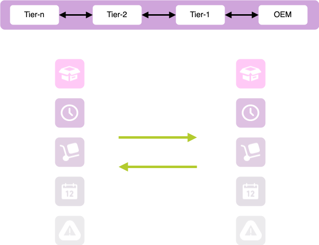
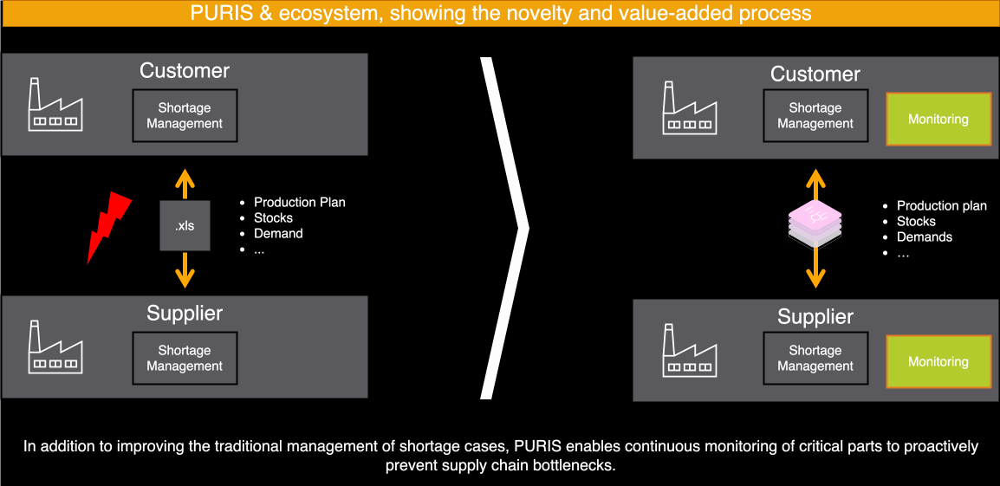

### PURIS Kit

## Vision & Mission

### Vision

**_Revolutionizing the Global Supply Chain Ecosystem with Integrated, Proactive Data Sharing and Collaboration_**

The introduction of the **P**redictive **U**nit **R**eal-Time **I**nformation **S**ervice (PURIS) enriches a company's resilience strategy through standardized data sharing, giving stakeholders heightened transparency and comprehensive information. This clarity allows PURIS users to detect supply chain issues earlier, initiate solution-finding more swiftly, and access a wider array of options, leading to more effective, cost-efficient, and environmentally friendly outcomes. By facilitating proactive anticipation, concurrent management, and reactive recovery, PURIS supports the supply chain across pre-, during-, and post-disruption phases, thereby improving operational efficiency and resilience within the Catena-X network.

<iframe
  width="560"
  height="315"
  src="https://www.youtube.com/embed/O-xD-2AeseQ?wmode=opaque"
  frameborder="0"
  allow="autoplay; encrypted-media"
  allowfullscreen>
</iframe>

## Mission

**_Empowering Stakeholders with Real-time, Predictive Insights for Proactive Supply Chain Management_**

The PURIS KIT provides the necessary standards, aspect models, interfaces, logics, and processes to implement a comprehensive and compliant exchange of short term supply chain key information between business partners. It intends to enhance the foundation of supply chain interactions, encouraging a proactive management approach over a reactive one.

The core is the exchange of supply chain key information between partners within a horizon of up to four weeks, including:

1. **Item Stock:** Visibility of current inventory levels on both sides
2. **Short-term Material Demand**: Forecast of materials needed for production
3. **Planned Production Output:** Anticipated production output quantities
4. **Delivery Information:** Scheduled and actual deliveries and their details
5. **Days of Supply:** Information on how long the inventory on hand will last

With PURIS, supply chain partners can anticipate, adapt, and align their operations to both current and future events, optimizing inventory levels, production and planning capabilities. The result is improved operational efficiency, enabling businesses to respond adequate and quickly to changes and disruptions in the supply chain.

The PURIS service enriches companies' resilience strategy by improving data sharing and providing key information between supply chain partners on demand. This enables users to identify and manage supply chain issues with enlarged foresight. The result is that \(from a process perspective\) downstream services, systems or applications can detect critical bottlenecks at an earlier stage.

_Figure 1: PURIS information exchange between partners_.

Key aspects of PURIS are:

- **Standardized information exchange**: Base for a fast and effective handling of shortages and enhances early detection capabilities for optimized supply chain decision-making.
- **Short-term focus:** PURIS targets a period of 0-4 weeks, although longer periods are not technically restricted.
- **Collaborative approach**: Equal and fair data exchange \(quid-pro-quo\) between partners \(1-up / 1-down\), leading to a more transparent, predictable, and resilient supply chain ecosystem.
- **Data usage control and compliance**: PURIS employs the Catena-X data space to ensure the required level of data security and sovereignty for all participants.
- **Accessibility**: PURIS provides a FOSS \(Free and Open-Source Software\) reference implementation that aims to keep the entry threshold for participating in PURIS as low as possible, making it easier for smaller businesses to participate and take advantage of the benefits.

By considering these principles, PURIS is not just enhancing current supply chain management practices but is also paving the way for a more agile, informed, and responsive automotive industry

## Today's Challenge

Supply chain complexity and the frequency of crises and exceptional situations pose a growing threat of significant disruptions, supply shortages and even temporary production halts for both small and medium enterprises \(SMEs\) and large enterprises \(LEs\). Rapid response and replanning are critical, which can involve considerable expenses. Costly, drawn-out decision-making among partners who might be reluctant to share information can lead to expensive special arrangements and workarounds. The longer the problem persists, the fewer viable alternatives for ensuring a continuous supply. There is an urgent need for a better information base for decision-making.

Status-quo:

1. **Supply Chain Transparency:** The lack of up-to-date data and transparency in the supply chain makes it difficult to anticipate disruptions and actual demand, manage production and inventory efficiently, and ensure timely deliveries. Complex and Volatile Supplier Network: The supply chain, with its widespread and diverse suppliers, faces visibility and control challenges. Demand volatility, influenced by key companies, impacts forecasting and immediate needs.
2. **Inefficient communication:** Manual and non-standardized information exchange, e.g. via Excel or phone, between partners is slow and can lead to misunderstandings, errors and unnecessary effort, which in turn negatively impacts the supply situation and increases costs.
3. **Lack of Trust:** Reluctance to share sensitive information, such as inventory levels, demand forecasts, and production capacities hinders the flow of critical information and prevent the formation of a cohesive, collaborative supply chain network. This can lead to a siloed and inefficient supply chain, where the best and most sustainable solutions are not realized. Consequences are missed opportunities, increased costs, and decreased competitiveness.

Moreover, currently only proprietary systems are available, which are insufficiently scalable and also involve a vendor lock-in. This highlights the need for an open standard and a FOSS \(Free and Open Source Software\) reference implementation. Moreover, these systems often have a long-term focus on demand and capacity management.

## Business Value

The traditional approach to managing supply chains is often inflexible and involves a high degree of manual work, leading to delays and limited opportunities for proactive measures. This is particularly challenging when dealing with potential shortages that can affect the entire supply chain.

PURIS transforms this by creating a collaborative network within the Catena-X data space, where partners, including suppliers and customers, share and use daily data. This approach allows for a dynamic and interconnected supply chain management, enhancing the ability to monitor supply and demand, identify potential issues early, and make informed decisions.

The benefits of adopting the PURIS KIT for suppliers and customers include:

**Improved Efficiency and Data Quality**:

- Less manual information gathering through automated exchange of required supply chain information.
- Higher data quality and reliability through the use of standardized plan and actual data.
- Efficient planning by having a broader information and decision base.

**Better Visibility and Collaboration**:

- Shared view of the supply and demand situation between partners; especially in tight supply situations.
- Data sovereignty through the usage of Catena-X standards and principles as a base for trustful cooperation.

**Cost Reduction and Sustainability**:

- Reduced costs through avoidance of downtime, production holds and overstocks.
- Contribute to waste reduction, lower emissions, and compliance with environmental regulations and sustainability goals by avoiding unnecessary logistics measures, such as underutilized transportation of small quantities.

Overall, adapting PURIS helps businesses achieve operational excellence, strategic resilience, data-driven decision making, collaborative innovation, and sustainability, all while reducing costs and improving market responsiveness.

**Benefits for Large Enterprises, Small and Medium-sized Enterprises, and Solution Provider**:

- **For OEMs and large suppliers:**
  - **Increased overall supply chain efficiency:** When a critical mass of participants is reached, the PURIS standard can increase efficiency of the entire supply chain, ultimately benefiting OEMs and large Tier-1s at the end of the chain.
  - **Lower operating and maintenance costs:** Consolidating and standardizing data flow through the PUris standard can reduce operating and maintenance costs for proprietary systems.
  - **Avoid vendor lock-in:** With the PURIS standard, there is no need to depend on a dominant solutions provider that can result in vendor lock-in.
- **For Small and Medium-sized Enterprises \(SMEs\):**
  - **Single integration point:** With PURIS there is just a single integration point, reducing the complexity and costs of managing and serving multiple customer interfaces, systems and platforms.
  - **Bi-directional data exchange:** One of the significant benefits of PURIS is that it enables small and medium companies to receive information in addition to providing it. This bi-directional data exchange on equal footing reduces blind decision-making and guesswork, allowing for more informed decision-making and collaboration
  - **Competitive advantage:** Using the PURIS standard can give a competitive advantage when bidding for contracts, as compliance with the PURIS standard can be favored in some procurement processes. By adopting the PURIS standard, it can be demonstrated to potential partners that a SME ist committed to data exchange best practices, making it a more attractive partner for collaboration and contract opportunities.
- **For Solution Providers:**
  - **Scaling solutions:** Solution providers can scale their PURIS solutions in the market and thereby access new customer groups.
  - **Versatile business models:** Offerings in the areas of consulting, integration, and operation allow for various business models, providing solution providers with the flexibility to tailor their services to specific customer needs.

## Example Use Case

In the following example, a Supply Chain Manager uses a tool similar to the PURIS reference application to monitor goods and parts. If problems arise, I can immediately check the status of my parts and respond appropriately.

**The results in detail:**

- I have a perfect view of my material pipeline towards my customer at any time.
- I can rely on updates immediately if necessary.
- This gives me confidence in my supply situation as result of my work.

**Decisions about replenishment, additional transportation or other measures can be made immediately if necessary:**

- I always have a clear perspective on the most economical booking methods, such as with agents.
- I receive immediate updates if necessary. This provides my organization with cost savings, even in critical situations, as a result of these practices.

**Stressful phone calls & meetings with my customer can be reduced to exceptional situations.**

- I no longer need to circulate Excel spreadsheets and fill them in manually.
- This means for me less stress and work load.

_Figure 2: Use case for standardized information exchange via PURIS_

## Semantic Models

The information about the provided PURIS standardization objects is detailed in this section. It's used in ongoing business relationships and build-to-order \(BTO\) contexts, not for build-to-stock \(BTS\) situations without existing business ties.

| Semantic Model                                                                                                                               | Semantic Model Version | Standard name | Description                                                                                                                                                                                                                                                                                           |
| -------------------------------------------------------------------------------------------------------------------------------------------- | :--------------------: | :-----------: | ----------------------------------------------------------------------------------------------------------------------------------------------------------------------------------------------------------------------------------------------------------------------------------------------------- |
| [Item Stock](https://github.com/eclipse-tractusx/sldt-semantic-models/tree/main/io.catenax.item_stock/2.0.0)                                 |        v.2.0.0         |    CX-0122    | Item Stock includes materials in the outbound warehouse or inbound at the customer's site. Standardizing its definition and using digital twins for data sharing allows quick inventory updates across the supply chain, improving coordination and addressing supply shortages.                      |
| [Short-Term Material Demand](https://github.com/eclipse-tractusx/sldt-semantic-models/tree/main/io.catenax.short_term_material_demand/1.0.0) |        v.1.0.0         |    CX-0120    | This exchange specifies the material a customer's production line needs from a supplier in the next four weeks. It adds context to regular orders, highlighting essential demands and extra requests for safety stocks. This detail helps suppliers plan and address potential shortages proactively. |
| [Planned Production Output](https://github.com/eclipse-tractusx/sldt-semantic-models/tree/main/io.catenax.planned_production_output/2.0.0)   |        v.2.0.0         |    CX-0121    | This exchange shows the agreed but unmanufactured material quantity a supplier plans to produce for a customer. Standardizing this via digital platforms ensures clear communication of future production volumes, aligning supply chain expectations and improving responsiveness to market needs.   |
| [Delivery Information](https://github.com/eclipse-tractusx/sldt-semantic-models/tree/main/io.catenax.delivery_information/2.0.0)             |        v.2.0.0         |    CX-0118    | Delivery Information includes logistics details and metrics. It specifies shipment timing, location, quantity, and compares planned vs. actual departure and arrival times. This data, including tracking numbers and essential logistics info, helps coordinate and streamline deliveries.           |
| [Days of Supply](https://github.com/eclipse-tractusx/sldt-semantic-models/tree/main/io.catenax.days_of_supply/2.0.0)                         |         v2.0.0         |    CX-0145    | The Days of Supply \(DoS\) standard measures how long inventory can sustain operations without replenishment. This metric helps manage inventory efficiently. The standard supports proactive decisions and ensures data accuracy across the supply chain.                                            |

## Business Process

PURIS orchestrates a set of business processes within the Catena-X network, enhancing supply chain visibility and operational coordination. These processes, characterized by their adaptability to multi-sourcing strategies, are described as follows:

### Actors and Roles

- **Data Provider:** Act as data consumers needing information on customers' production output and material demand.
- **Data Consumer:** Act as data providers, offering detailed information about their material demand and production plans to suppliers.

### Key Processes

- **Single Sourcing:** Direct allocation of orders and material demand in a one-to-one relationship between customer and supplier.
- **Multi-Sourcing:** One item is supplied from more than one supplier. The exchanged data must be allocated to each supplier.
- **Multi-Customer:** One item is provided to more than one customer. The exchanged data must be allocated to each customer.
- **Demand Categories:** Differentiation between regular and extraordinary demand to assist suppliers in prioritization and planning.
- **Production Planning:** Daily versus non-daily planning, with a recommendation for daily planning to enhance accuracy and responsiveness.
- **Inventory Management:** Balances inventory to prevent excess and shortages, optimizing costs and enhancing supply chain responsiveness.
- **Shortage Management:** Early detection and rapid response to supply disruptions via standardized data exchange.

The business process facilitated by PURIS enables partners in the Catena-X network to swiftly act on up-to-date information, adapt to the fluidity of market conditions, and develop a well-rounded view of supply chain operations. This comprehensive approach not only encourages collaborative partnerships but also advances risk mitigation strategies and bolsters the overall resilience of the supply chain ecosystem.

## Standards

The relevant standards can be found in the [Catena-X Association Standard Library](https://catenax-ev.github.io/docs/next/standards/overview)\:

- [CX-0118 Delivery Information Exchange 2.0.0](https://catenax-ev.github.io/docs/next/standards/CX-0118-ActualDeliveryInformationExchange)
- [CX-0120 Short-Term Material Demand Exchange 2.0.0](https://catenax-ev.github.io/docs/next/standards/CX-0120-ShortTermMaterialDemandExchange)
- [CX-0121 Planned Production Output Exchange](https://catenax-ev.github.io/docs/next/standards/CX-0121-PlannedProductionOutputExchange)
- [CX-0122 Item Stock Exchange 2.0.0](https://catenax-ev.github.io/docs/next/standards/CX-0122-ItemStockExchange)
- [CX-0145 Days of Supply Exchange 1.0.0](https://catenax-ev.github.io/docs/next/standards/CX-0145-DaysofsupplyExchange)

## Notice

This work is licensed under the CC-BY-4.0

- SPDX-License-Identifier: CC-BY-4.0
- SPDX-FileCopyrightText: 2024 Fraunhofer-Gesellschaft zur Foerderung der angewandten Forschung e.V. (represented by Fraunhofer ISST)
- SPDX-FileCopyrightText: 2024 TRUMPF Werkzeugmaschinen SE + Co. KG
- SPDX-FileCopyrightText: 2024 ISTOS GmbH (a member of the DMG Mori Group)
- SPDX-FileCopyrightText: 2024 Volkswagen AG
- SPDX-FileCopyrightText: 2024 Contributors to the Eclipse Foundation
