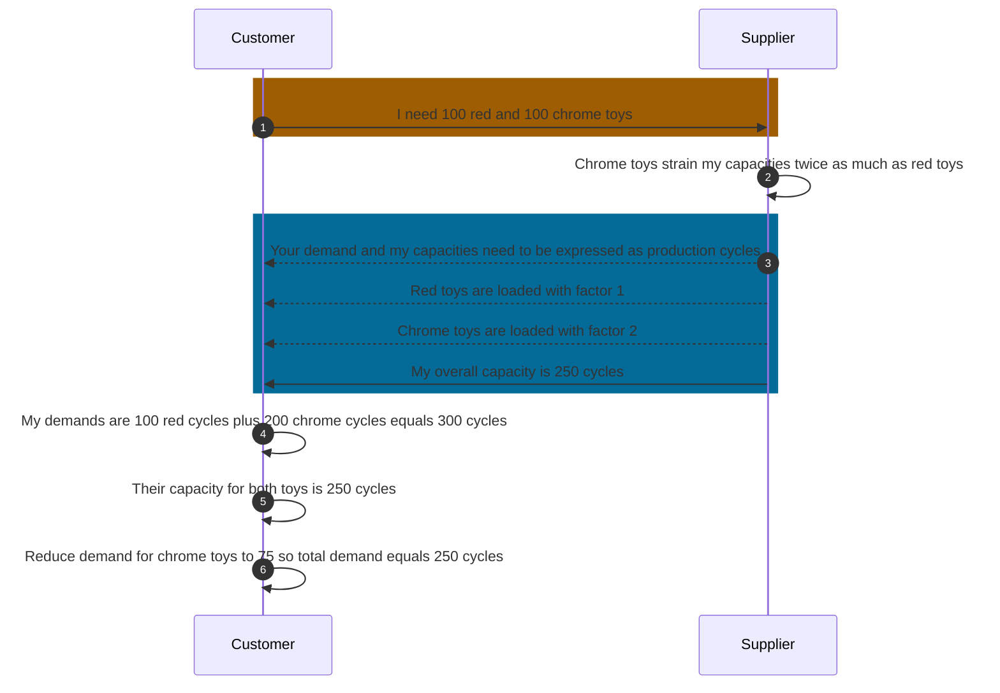
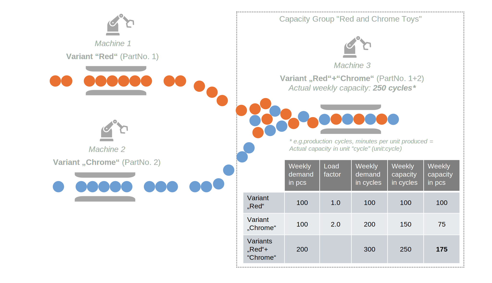

## Business Roles and Functions

Load Factors are advanced parameters of a Capacity Group structure and therefore used optionally by suppliers. The application of Load Factors is embedded into the WeekBasedCapacityGroup aspect model. This means that only suppliers may apply Load Factors and customers consume it.

|Function / Role|Customer|Supplier|
|-|-|-|
|Define Load Factors for materials||X|
|Define conversion factor for unit of measure||X|
|Inform business partners about factors||X|
|Acknowledge factors|X||
|Recalculate demands in user interface, based on factors |X|X|

## Business value

The feature “Load Factors” allows suppliers to model and represent otherwise impossible capacity occurrences, by introducing a numerical multiplication factor, that changes the demand volume interpretation of a capacity group.

Load Factors should be used to solve the following two problems:

- Processing of non-homogeneous material variants within a capacity group, resulting in diverging capacity utilization.

- Requirement for having a different unit of measure within a WeekBasedCapacityGroup, in relation to its linked WeekBasedMaterialDemand.

Load Factors solve these problems by:

- Scaling the weekly demand linearly if a material variant causes higher or lower than normal load within the capacity group. Load Factors can, for example, express a reduction to 90% or an increase to 150%.

- Acting as conversion factors, converting the unit of measure of a WeekBasedMaterialDemand into the unit of measure of the WeekBasedCapacityGroup. This leads to a conversion into either “time” (unit:secondUnitOfTime) or “cycle” (unit:cycle), expressing that, for example, a piece of material takes 12 seconds, or a set of material takes half a cycle to manufacture.

### Advantages

- Possible differentiation of capacity utilization for product variants within a capacity group
- Possible conversion of different units of measure
- Better reflection of actual production environment

## Functional description

Figure: *Capacity group structure with linked material demand incl. Load Factors*

Suppliers may apply Load Factors within WeekBasedCapacityGroup aspect model via the parameter:

| Main Parameters | Required? | Description | Example |
|-|-|-|-|
| Load Factor | No | If applied, a Load Factor indicates that in order to produce the required material demand, more (or less) production resources are required.| Decimal value (e.g. "3.5"). A value of 3.5 means that in the respective week the demand value is multiplied by 3,5 in order to reflect the required capacity needed to fulfil the demand. |

Suppliers can apply Load Factors within the WeekBasedCapacityGroup model via a parameter. If they choose to do so, a Load Factor must be assigned to every WeekBasedMaterialDemand linked to the WeekBasedCapacityGroup.

A Load Factor of 1 is neutral and does not change the linked WeekBasedMaterialDemand. Since Load Factors are applied via the WeekBasedCapacityGroup, a WeekBasedMaterialDemand can have multiple, differing Load Factors.

Without Load Factors, the units of measure of a WeekBasedCapacityGroup and its linked WeekBasedMaterialDemand should be identical. With Load Factors, they may differ.

### Considerations

- The standard does not specify individual calculation logic for applying a Load Factor (e.g., converting capacity in pieces to production cycles). This logic depends on the suppliers’ individual planning requirements and tools. Indicating a Load Factor informs the customer that a conversion has taken place but does not affect the transferred demand or capacity values.
- Lot size restrictions, especially lot size = 1, are not considered when using Load Factors.
- To maintain consistency in demand-capacity comparison, rounding of fractional conversion results should be avoided.
- If a WeekBasedCapacityGroup links several WeekBasedMaterialDemand containing the same material, the Load Factors applied to these WeekBasedMaterialDemand should be identical.

Suppliers can use comments to provide customers with additional information about the applied Load Factors. For more details on this communication feature, see Chapter 5.9 of [CX-0128 Demand and Capacity Management Data Exchange][StandardLibrary]

## Example

The supplier produces two toys colored red and chrome on its line for the customer.
Both materials pass through the same station within the coloring process.

Red toy needs 1 cycle at this station. Chrome toy needs 2 cycles because it needs to be painted twice. The supplier can effectively produce 250 cycles per week at this station.

### Sequence Diagram

Figure: *Utilizing load factors*

The supplier has created a capacity group "Red and Chrome Toys" with the unit “cycle” (unit:cycle). A processing time per piece of 1 cycle is set for red toys and 2 cycles for chrome toys. The maximum available process time is set to 250 cycles.

The customer requires 100 pieces of red toys and 100 pieces of chrome toys in the respective week. The supplier calculates the required process time to be 300 cycles, i.e. 100(red)\*1 + 100(chrome)\*2 = 100 + 200 = 300 cycles.

Without the Load Factor applied, it would not have been transparent for the customer, that the required amount of red and chrome toys is not possible to be fulfilled and it is necessary to decrease the volume in the respective week.

One possible solution would be to reduce the chrome toys by 25 pieces to 75 pieces. New required process time would add up to 100(red)\*1 + 75(chrome)\*2 = 100 + 150 = 250 cycles.

Figure: *Example for application of Load Factor within WeekBasedCapacityGroup*

For further details, please refer to [CX-0128 Demand and Capacity Management Data Exchange][StandardLibrary].

### Sample Data

For sample data please refer to [Aspect Model - WeekBasedCapacityGroup](../../development-view/model-capacity-group.md).

### Notice

This work is licensed under the [CC-BY-4.0](https://creativecommons.org/licenses/by/4.0/legalcode)

- SPDX-License-Identifier: CC-BY-4.0
- SPDX-FileCopyrightText: 2023 BASF SE
- SPDX-FileCopyrightText: 2023 Bayerische Motoren Werke Aktiengesellschaft (BMW AG)
- SPDX-FileCopyrightText: 2024 Capgemini SE
- SPDX-FileCopyrightText: 2023 Fraunhofer-Gesellschaft zur Förderung der angewandten Forschung e.V (Fraunhofer)
- SPDX-FileCopyrightText: 2023 Henkel AG & Co.KGaA
- SPDX-FileCopyrightText: 2023 Mercedes Benz Group AG
- SPDX-FileCopyrightText: 2023 SAP SE
- SPDX-FileCopyrightText: 2023 SupplyOn AG
- SPDX-FileCopyrightText: 2023 Volkswagen AG
- SPDX-FileCopyrightText: 2023 ZF Friedrichshafen AG
- SPDX-FileCopyrightText: 2023 Contributors to the Eclipse Foundation

[StandardLibrary]: https://catenax-ev.github.io/docs/next/standards/CX-0128-DemandandCapacityManagementDataExchange
