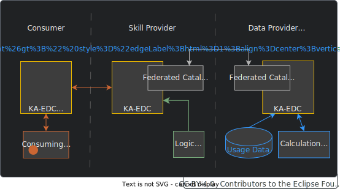
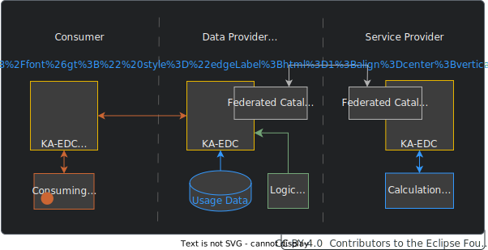
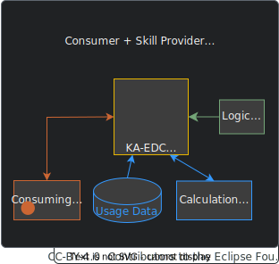

---
id: architecture
title: Architecture
description: Behaviour Twin KIT
---

  

  

  

Behaviour Twin KIT
  

## BASIC ARCHITECTURE

### OVERVIEW

A Behaviour Twin use case consists of data and calculation services. In addition, a logic is required, that defines how data and services must interact to produce the desired result. This logic is called *skill*. It must be invoked directly or indirectly by the consumer.

Data and services are federated over the dataspace:

A use case may consist of multiple data sources and calculation services:

### ROLES

Each participant in a Behaviour Twin use case applies to one or more of the following roles:

- **consumer** (result requester)
- **skill provider** (provider of the use case logic)
- **data provider** (provider of usage data, likely an OEM)
- **delegator** (delegates data to calculation services, likely a supplier of a component that
  is assembled of sub-components which are providing calculation services)
- **calculation service provider** (likely a supplier of a part or component)

## DETAILED ARCHITECTURE

### KNOWLEDGE AGENT

The architecture is based on so-called Knowledge Agents that consists of:

- Federated Catalog
- Matchmaking Agent
- Binding Agents (Provisioning Agent/Remoting Agent)
- Bindings (configurations of binding agents)

The components are federated over all participants. All data (and services) are represented together as a federated knowledge graph. The processing logic for the agents is defined in so-called *skills*. All communication is handled by EDC connectors.

A detailed view of how *Knowledge Agents* and *skills* work is given in the section [Knowledge Agent](./knowledge-agent) (which comes next to this section).

### BUSINESS PROCESS

In Behaviour Twin use cases, the fist step into the federated logic is usually the data provider. There, dependencies of the targeted main-component (e.g. a vehicle) are known. Therefore, registering predefined skills at the data provider is a common option. Such skills then can be initiated by external partners as well as internally. As an alternative, skills can be hosted externally (at the consumer or a third party). In every case, especially if the skill is not located at the data provider, the skill must be written in a way that the relation between the usage data and the calculation services is resolved at the data provider or any other party, that has all the required information in its federated catalog (see [To Be Considered](./to-be-considered#data-sovereignty)).

The following business process is only an example. Depending on how the skill is written, the process can vary.

0. **Register skill asset (0.1) and sync federated catalog (0.2):**   The predefined skill is registered as an asset at the data provider's EDC connector. The federated catalogs are synchronized periodically.

1. **Invoke skill asset:**   The consumer invokes the skill by calling the agents API at its own EDC connector. The partner's EDC connector address must be known. To resolve this address is up to the use case. A prognosis function result type and a component or vehicle ID (e.g. VIN) is set as parameter for the skill.

2. **Request skill asset:**   The skill is invoked by requesting the skill asset at the data provider via EDC connectors.

3. **Resolve prognosis function assets by requested result type:**   The Knowledge Agent resolves all prognosis function assets from the federated catalog that matches the desired result type.

4. **Resolve prognosis data assets by function parameter types:**   The Knowledge Agent resolves all data assets by the parameter types of the previously matched prognosis function(s).

5. **Resolve actual usage data and service provider by component ID:**   The Knowledge Agent resolves the sub-component of interest, its supplier and the actual related data by the component's ID.

6. **Fetch data:**   The data (parameters for prognosis functions) are fetched from the data provider's bound data source. They are transferred into graph representation by a provisioning agent (data binding agent).

7. **Transfer data and deploy sub-skill:**   The fetched data and a sub-skill (logic for calling the calculation service) are transferred to the calculation service provider's Knowledge Agent via EDC connectors.

8. **Call service and fetch result:**   The calculation service (prognosis function) is called. The data (parameters for the prognosis function) are translated into the format the service requires. This is automatically done by an remoting agent (service binding agent), which is statically configured by service bindings. The result of the service then is translated back into graph format by the remoting agent.

9. **Return result:**   The result is transferred to the invoker of the sub-skill (here, it is the data provider) via EDC connectors.

10. **Delegate result:**   The result is delegated to the consumer via EDC connectors.

11. **Get result:**   The result is delegated to the consumer's application.

To have a common understanding of how to interpret and translate elements in the graph, common ontologies and taxonomies must be used. These are also needed for the interpretation of skills and sub-skills as there is e.g. inheritance in ontologies which must be known by the Knowledge Agent to resolve relations.

### BUILDING BLOCK COMPONENTS

#### USE-CASE-SPECIFIC COMPONENTS

|Subsystem|Description|
|---------|-----------|
|Data Consuming App|This component is the app that is hosted at the *consumer* and provides the end user interface.|
|Usage Data|A data source at the *data provider* that provides usage data that are required for prognosis services.   It can be accessed by the Knowledge Agent via data bindings.|
|Calculation Service|A calculation service at the *service provider*. It accepts input data from federated data sources, calculates the result values and returns them.|

#### KNOWLEDGE AGENT COMPONENTS

|Subsystem|Description|
|---------|-----------|
|Matchmaking Agent|This component supports SPARQL (skills/sub-skills) to traverse the federated data space as a large data structure. It interacts with the EDC connector.   A **provider's Matchmaking Agent** will be activated by its EDC connector. Therefore, the EDC must offer a Graph Asset (variant of ordinary data assets in the related Catena-X standards).   A **consumer's Matchmaking Agent** interacts with its EDC to negotiate and perform the transfer of sub-skills to other dataspace participants.   The Matchmaking Agents are matching the (sub-)graphs and negotiate appropriated graph assets with the partner EDCs.|
|Binding Agent|The Binding Agent is a restricted version of the Matchmaking Agent (subset of OWL/SPARQL, e.g., without federation) which is just focused on translating sub-skills of a particular business domain (Bill-Of-Material, Chemical Materials, Production Sites, etc.) into proper SQL- or REST based backend system calls.  Binding agents for data bindings are called **Provisioning Agent**.  Binding agents for service bindings are called **Remoting Agent**. |
|Binding|A Binding is part of the configuration of a Binding Agent. It defines the binding (translation form/into graph representation) for specific data/service instances.|
|Ontology|The ontology is a formal representation of knowledge that captures concepts, relationships, and properties. It allows a shared understanding and reasoning about the respective domain.   It must be hosted in a way that all participants can access it.|
|Skill/Sub-Skill|The Skill describes, what to do (which data have to be connected, transferred, processed ...).|

#### CATENA-X CORE SERVICES (EXCEPT KNOWLEDGE AGENT COMPONENTS)

|Subsystem|Description|
|---------|-----------|
|EDC connector|The Connector of the Eclipse Dataspace Components (EDC) provides a framework for sovereign, inter-organizational data exchange. It implements the International Data Spaces standard (IDS) as well as relevant protocols associated with GAIA-X. The connector is designed in an extensible way in order to support alternative protocols and integrate in various ecosystems.|

## MANDATORY COMPONENTS

You always need access to your **running connector (EDC) with knowledge agent components** and
the (extensible) **ontologies of Catena-X**. In most cases, you can use them as they are.  

Depending on your role, you need a combination of the following components:

- EDC connector + knowledge agent
- ontologies (semantic models)
- usage data
- calculation services
- matchmaking agent: mapping ontology to knowledge graph, integrated into KA-dataplane
- binding agents:
  - provisioning agent: provide data
  - remoting agent: bind service to graph

| | service provider | delegator | data provider | consumer | skill provider |
| ---------------------------------- | :---: | :---: | :---: | :---: | :---: |
| EDC connector   + agent plane / matchmaking agent  | x | x | x | x | x |
| ontologies                                             | x | x | x | x | x |
| skill-access                                           |   |   |   | x | x |
| usage data                                             |   |   | x |   |   |
| provisioning agent                                     |   |   | x |   |   |
| calculation service                                    | x |   |   |   |   |
| remoting agent                                         | x |   |   |   |   |

## USE CASE TYPES

Depending on how roles coincide and where skills are executed, the use case architecture, graph assets and skills must be adapted. Detailed information about how to write dedicated skills can be found in the [Agents KIT's Operation View](../../knowledge-agents/operation-view/agent_edc).

### COMBINATION OF ROLES

The use cases can be divided depending on which roles coincide. When writing a skill, you always have to keep in mind who has access to whose resources and how to write the skill correctly and safely.

The roles *data provider* and *calculation service provider* can occur more than once. There are many combinations of the roles possible, but the following ones are the more common ones.

#### SKILL PROVIDER IS NEUTRAL ENTITY

There may be reasons why the *skill provider* is not the consumer, as well as not one of the other roles:

- The skill provider invents new skills and offers them.
- The skill provider is a trustee, it has knowledge over relations that others don't have.

#### CONSUMER IS SKILL PROVIDER

Often the consumer is also the skill provider. It knows what to ask for and how to process the data to get the desired results.

#### DATA PROVIDER IS CALCULATION SERVICE PROVIDER

If the *data provider* is also the *calculation service provider*, from the caller's point of view, it's like they're different entities that have full access to each other. The *skill provider* is a neutral entity.

#### DATA PROVIDER IS SKILL PROVIDER

In some cases, the *data provider* provides a skill that can process its data in a data sovereign way. Through this, it has the full control over how its data can be processed.

#### CALCULATION SERVICE PROVIDER IS SKILL PROVIDER

If the *calculation service provider* provides a skill, from the caller's point of view, it's like a data asset that can be parameterized.

#### CONSUMER IS SKILL PROVIDER AND IS DATA PROVIDER

With this combination, a *consumer* can utilize its own data in any way it wants to by using external calculation services.

#### CONSUMER IS SKILL PROVIDER AND IS CALCULATION SERVICE PROVIDER

With this combination, a *consumer* can parameterize its own calculation service with data of partners in any way it wants to.

#### CONSUMER IS SKILL PROVIDER AND DATA PROVIDER IS CALCULATION SERVICE PROVIDER

If the *data provider* is also the *calculation service provider*, from the caller's point of view, it's like they're different entities that have full access to each other. When using its own skill, the consumer has control over how the data is processed.

#### ALL ROLES COINCIDE

With this combination, a *consumer* can utilize its own data in any way it wants to.

#### MORE COMBINATIONS

All combinations above may be extended by additional, separate data and/or calculation service providers.

### SKILL EXECUTION

There are different options where and how the skill is executed initially:

- at consumer side or at provider side
- ad hoc or as a registered skill

Allowed variants may be dependent on a *framework agreement*.

For more information, see [Agents KIT's Operation View](../../knowledge-agents/operation-view/agent_edc).
