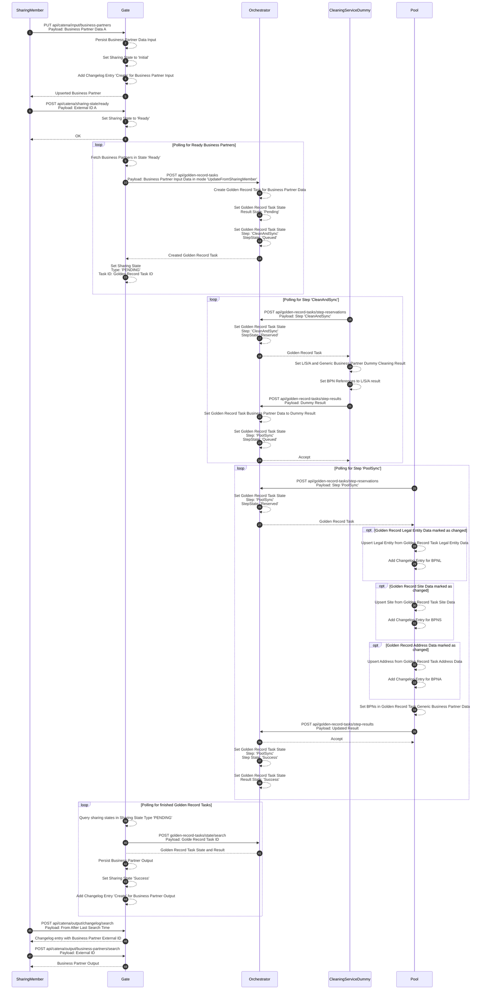
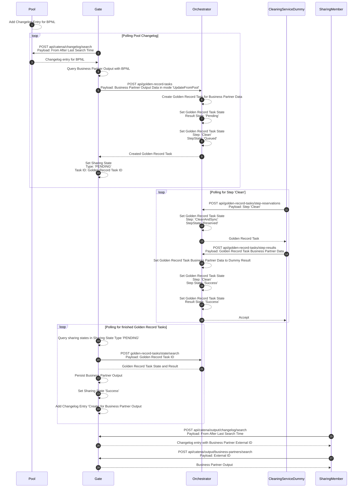
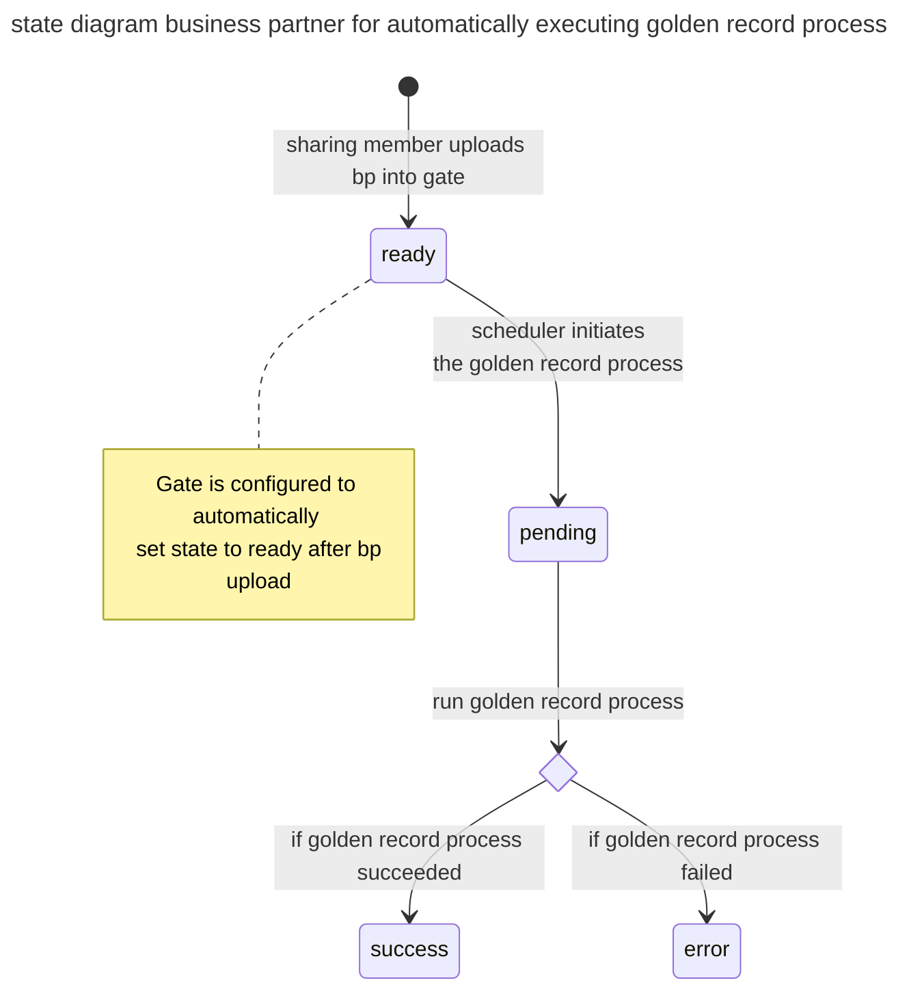
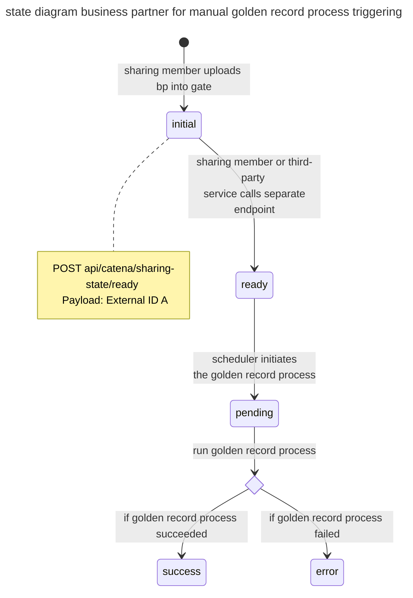
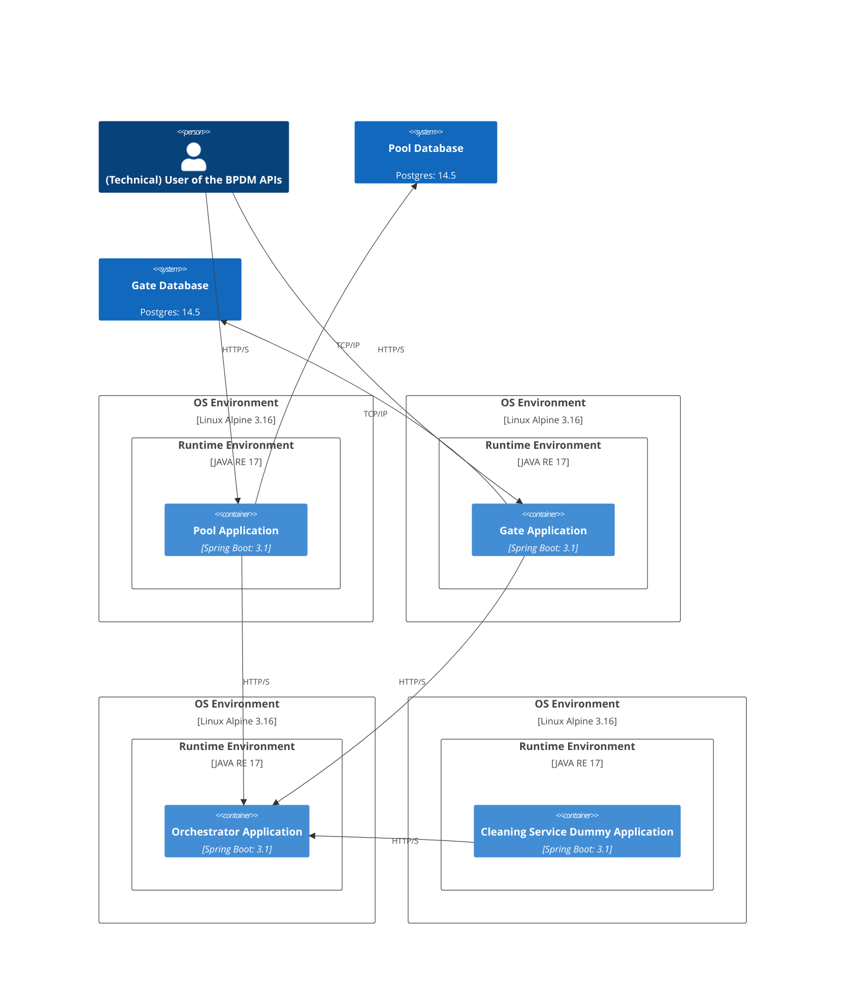
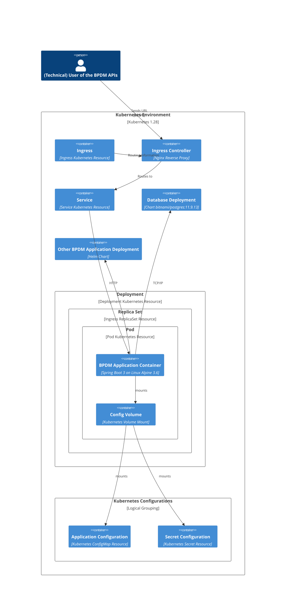
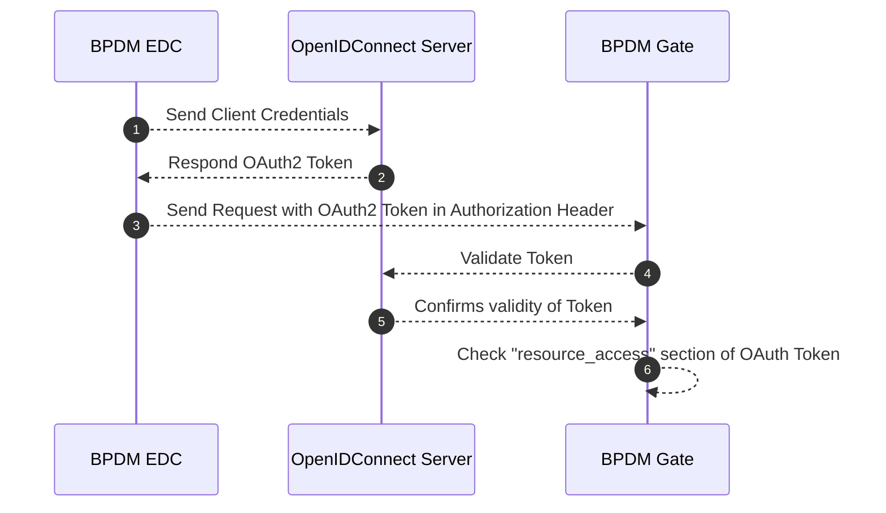

## Business Partner Data Management Application for Golden Record (BPDM)

- [Business Partner Data Management Application for Golden Record (BPDM)](#business-partner-data-management-application-for-golden-record-bpdm)
- [Introduction and Goals](#introduction-and-goals)
  - [Goals Overview](#goals-overview)
  - [Requirements Overview](#requirements-overview)
  - [Quality Goals](#quality-goals)
  - [Stakeholders](#stakeholders)
- [Architecture Constraints](#architecture-constraints)
- [System Scope and Context](#system-scope-and-context)
  - [Business Context](#business-context)
  - [Technical Context](#technical-context)
- [Solution Strategy (High Level Picture)](#solution-strategy-high-level-picture)
- [Building Block View](#building-block-view)
  - [High-Level Architecture (Generic Endpoint)](#high-level-architecture-generic-endpoint)
  - [Keycloak Authentication \& Autorization Flow](#keycloak-authentication--autorization-flow)
- [Runtime View](#runtime-view)
  - [Upsert Generic Business Partner](#upsert-generic-business-partner)
  - [Update on Golden Record Change](#update-on-golden-record-change)
- [Business Partner Data Records - States](#business-partner-data-records---states)
  - [Automatically executing golden record process](#automatically-executing-golden-record-process)
  - [Manually triggering golden record process](#manually-triggering-golden-record-process)
- [Deployment View](#deployment-view)
  - [Applications Deployment without Kubernetes](#applications-deployment-without-kubernetes)
  - [Single Application Kubernetes Deployment](#single-application-kubernetes-deployment)
- [Crosscutting Concepts](#crosscutting-concepts)
  - [Business Partner Data Management Standards](#business-partner-data-management-standards)
  - [Logging Behavior](#logging-behavior)
- [Architecture Decisions](#architecture-decisions)
- [Quality Requirements](#quality-requirements)
- [Risks and Technical Debts](#risks-and-technical-debts)
- [Glossary](#glossary)
  - [NOTICE](#notice)

## Introduction and Goals

This document describes the Catena-X Business Partner Data Management Application, short BPDM.

In the Catena-X Automotive Network, the so-called Golden Record, together with a unique identifier, the Business Partner Number (BPN), creates an efficient solution to the increasing data retention costs.

The Golden Record is a concept that identifies, links and harmonizes identical data on legal entites, sites and addresses from different sources (“sharing members"). During the creation of the Golden Record data, duplicates are removed, the quality within the data records is improved, missing information is added and deviations are automatically corrected. This is done using public, commercial or other agreed sources of trust and/or information. This approach reduces costs of business partner data maintenance and validation for all the companies concerned.

The BPN, as the unique identifier of the Golden Record, can be stored as a verifiable credential used in an SSI solution so that a business partner can provide it for authentication and authorization.

The Golden Record business partner data in combination with the BPN acts as the basis for a range of supplementary value-added services to optimize business partner data management. These are referred to as value-added services. Together with decentralized, self-determined identity management, they create a global, cross-industry standard for business partner data and a possible 360° view of the value chain.

> [!NOTE]
> A Business Partner Data cleaning as well as Golden Record Creation Process is **not** part of this reference implementation!

**Additional Information Material**:

- Visit BPDM on the official Catena-X Website: [bpdm_catenax_website](https://catena-x.net/en/offers-standards/bpdm)

## Goals Overview

The following goals have been established for this system:

| Priority | Goal                                                                                                         |
| -------- | ------------------------------------------------------------------------------------------------------------ |
| 1        | Provide unique global business partner IDs within the Catena-X Network                                       |
| 1        | Provide centralized Master Data Management for business partner data                                         |
| 2        | Enable network-based data sharing for business partner data to increase overall data quality and reliability |
| 2        | Enable also Small and medium-sized Businesses (SMEs) to use the services |
| 3        | Provide a change history für business partner data |

## Requirements Overview

> [!IMPORTANT]
> **Cross-Check with CACs**


The following Usecases together with its requirements exist for this system:

| Req-Id  | Requirement        | Explanation |
| ------- | ------------------ | ----------- |
| BPDM-R1 | Upload and curate BP data     | CX Member can upload their business partner and get curated business partner information back, based on the Golden Record             |
| BPDM-R2 | Provide changelog for BP | A changelog is provided to determine which changes on which date are available             |
| BPDM-R3 | Provide GR                    | Based on the shared business partner information and external service providers a Golden Record is created             |
| BPDM-R4 | Provide changelog for GR        | A changelog is provided to determine which changes on which date are available             |
| BPDM-R5 | Keep GR up-to-date based on external resources                    | Golden Records must regularly checked for changes based on external resources             |
| BPDM-R6 | Provide unique business partner IDs                    | For each Golden Record a unique ID, the so called Business Partner Number (BPN) is created             |

## Quality Goals

| Priority | Quality Goal            | Scenario                                                                                                                                                                                                                                                                                                                                                                                             |
| -------- | ----------------------- | ---------------------------------------------------------------------------------------------------------------------------------------------------------------------------------------------------------------------------------------------------------------------------------------------------------------------------------------------------------------------------------------------------- |
| 1        | Security                | All users and services which access the Golden Record Application must be authenticated and authorized. Only the Golden Record Application itself is allowed to perform changes on data. Consuming services/users are only allowed to read data. In addition they are only allowed to read the specific data that belongs with this, the Data Sovereignty principles of Catena-X has to be fulfilled |
| 1        | Integrity               | Only the Golden Record Application is allowed to perform changes on the data. In addition, all changes must be traceable and must be able to be rolled back                                                                                                                                                                                                                                          |
| 1        | Legally                 | No natural persons are allowed to get uploaded and stored. For all other uploaded Business Partner data it is mandatory that users (CX Members) can only see their own uploaded data and that it is not possible to draw conclusions about other business partner relationships                                                                                                                      |
| 1        | Integrity & Correctness | It must be ensured that the data of the golden record which is created during the process is correct.                                                                                                                                                                                                                                                                                                |
| 2        | Reliability             | The Golden Record Application is a central foundation in the Catena-X Network. It provides all participants and services, business partner data and the unique Business Partner Number (BPN) as identifier. Therefore the BPDM Services must be always/highly available                                                                                                                              |
| 2        | Functional Stability    | Since the Golden Record Application is a central foundation in the Catena-X Network the defined standards of the API and datamodel for the associated Release Version must be fulfilled                                                                                                                                                                                                              |
| 1        | Sensitivity of data     | the uploaded business partner data is highly sensitive, that's why it must be ensured that no unauthorized user/system can access data which does not belong to it. More over it must be guaranteed that no one can see the business partners related to the specific Catena-X Member.                                                                                                               |

[](@site/static/img/iso_25010.png)

## Stakeholders

| Role/Name               | Expectations                                                                                                 | Example                                                                                                                                     |
| ----------------------- | ------------------------------------------------------------------------------------------------------------ | ------------------------------------------------------------------------------------------------------------------------------------------- |
| Big Company (CX-Member) | Company wants to have cleaned and enriched business partner data objects with a BPN.                         |                                                                                                                                             |
| SME Company (CX-Member) | Company wants to have cleaned and enriched business partner data objects with a BPN based on a CSV data.     |                                                                                                                                             |
| CX Apps                 | Other apps and their use cases want to use the business partner data objects and the BPN for their processes | The CX Portal will use the BPN for on-boarding new companies into the network. Traceability Apps will use BPN to describe business partners |

## Architecture Constraints

| Constraint ID | Constraint                                                                                                                                                      | Description |
| ------------- | --------------------------------------------------------------------------------------------------------------------------------------------------------------- | ----------- |
| C-1           | Software and third party software must be compliant to the Catena-X and Eclipse Foundation Guidelines/Policies [eclipse_foundation](https://www.eclipse.org/projects/dev_process/) |             |
| C-2          | [Eclipse Dataspace Connector](https://github.com/eclipse-tractusx/tractusx-edc/tree/main) must be used for data transfer between different legal entities        |             |

## System Scope and Context

## Business Context

The following figure depicts the business context setup for BPDM:


The following are the various components of the business context setup:

### **Master Data Management (Catena-X Member)**

A backend system that's operated by a company which is participating in the Catena-X Ecosystem and consuming digital services or data assets.

### **Small-Medium-Enterprises (SME) (Catena-X Member)**

A SME company that's participating in the Catena-X Ecosystem and consuming digital services or data assets.

### **Catena-X Portal/Marketplace (CX Portal)**

The Portal which provides an entry point for the Catena-X Members, to discover Apps that are offered in Catena-X.

### **Value Added Services**

- Value Added Services can be provided be either the Operator itself or by an external App/Service Provider. The Value Added Services provide data or service offers based on Catena-X Network data.
- There are several value added services that can be offered in context of business partner data. For example a Fraud Prevention Dashboard/API, Country Risk Scoring and so on.

### **Catena-X Operative Environment for BPDM**

- Within Catena-X there will be only one central operation environment that operates the BPDM Application. This operative environment provides the services and data for other operation environment or applications which needs to consume business partner data or golden record data.

### **Catena-X BPDM Application**

- The BPDM Application which offers services to Catena-X Members, Catena-X Use Cases and Catena-X BPDM Value Added Services for consuming and processing business partner data as well as Golden Record Information and BPN Numbers.

### **Curation & Enrichment Services**

- To offer the BPDM and Golden Record Services, Catena-X uses services from external third party service providers. These can either be operated by the operator itself or external companies that have a contract with the operator.

## Technical Context

The technical context setup including deployment is depicted in the following figure:


- The BPDM Application follows a microservice approach to separate the different components of the system.
- Within Catena-X there will be only one central operation environment that operates the BPDM Application. This operation environment provides the services and data for other operation environment or applications which needs to consume business partner data or golden record data.

## Solution Strategy (High Level Picture)

The following high level view gives a basic overview about the BPDM Components:


### **BPDM Gate**

- The BPDM Gate provides the interfaces for Catena-X Members to manage their business partner data within Catena-X.
- Based on the network data a Golden Record Proposal is created.
- The BPDM Gate has its own persistence layer in which the business partner data of the Catena-X Members are stored.
- For the current reference implementation, multi-tenancy is realized via a 1:1 deployment for each Catena-X Member. This means that every Catena-X Member who shares his business partner data, has its own Gate and own persistence.

### **BPDM Pool**

- The BPDM Pool is the central instance for business partner data within Catena-X.
- The BPDM Pool provides the interface and persistance for accessing Golden Record Data and the unique Business Partner Number.
- In comparison to the BPDM Gate, there is only one central instance of the BPDM Pool.

### **BPN Issuer**

- Every participant in the Catena-X network shall have a unique Business Partner Number (BPN) according to the concept defined by the Catena-X BPN concept. The task of the BPN Generator is to issue such a BPN for a presented Business Partner data object. In that, the BPN Generator serves as the central issuing authority for BPNs within Catena-X.
- Technically, it constitutes a service that is available as a singleton within the network.
- Currently, creation of BPNs is part of the BPDM Pool implementation. After implementing the BPDM Orchestrator, it can be considered if it should be an independent component.

### **BPDM Orchestrator**

- Intention of the BPDM Orchestrator is to provide a passive component that offers standardized APIs for the BPDM Gate, BPDM Pool and Data Curation and Enrichment Services to orchestrate the process of Golden Record Creation and handling the different states a business partner record can have during this process.

## Building Block View

### High-Level Architecture (Generic Endpoint)


#### **Simulator Service**

- To become more independent in testing the BPDM Application, a Simulator Service was developed.
- The Simulator Services supports the E2E Test Cases to validate the flow from BPDM Gate to BPDM Pool and back again.

#### **EDC Operator**

- The diagram above shows two EDCs on Operator side. This is only for visualization purpose. On a technical level there is only one EDC.

#### **SME**

- Currently there is no SME Application available

## Runtime View

### Upsert Generic Business Partner

> [!NOTE]
> An additional endpoint was implemented as requirements came up that required business partner data records not to be fed directly into the golden record process after an upload. Instead, this endpoint makes it possible to change the status of a business partner data record from "inital" to "ready". Only data records with the status "ready" are fed into the golden record process.
> We are aware that the existing integration scenarios, such as with the portal team, are impacted by this. For this reason, we recommend that the gate is configured accordingly so that the status is set to "ready" by default when a data record is uploaded. The operator can configure this behavior in the gate individually based on the requirements.



### Update on Golden Record Change



## Business Partner Data Records - States

This sections describes the different states a business partner data record can have.

### Automatically executing golden record process



### Manually triggering golden record process



## Deployment View

### Applications Deployment without Kubernetes



### Single Application Kubernetes Deployment



## Crosscutting Concepts

## Authentication & Autorization

### Roles, Rights, Permissions

The authorization concept of the golden record process services (BPDM) has evolved. This impacts the permissions of portal users as well as as the creation of technical users in the Portal.

#### Relevant concepts

The golden record process contains sharing members which need to share their data (input) to the golden record process and read the result of that process (output). The Pool is a central place that offers golden records that have been created from the shared business partner data. Golden records are distinguished between whether they belong to Catena-X members or not.

#### BPDM Permission Groups

We defined the following relevant permission groups in BPDM:

1.Gate Admin: Create, update and read sharing member business partner input data as well as read the output data of the golden record process.

2.Gate Input Manager: Create, update and read sharing member business partner input data.

3.Gate Input Consumer: Read sharing member business partner input data.

4.Gate Output Consumer: Read sharing member business partner output data.

5.Pool Admin: Read, create and update golden records as well as meta data in the Pool.

6.Pool Cx Member: Read golden records that belong to Catena-X members from the Pool.

7.Pool Sharing Member: Read golden records of Catena-X members and the overall changelog.

8.Orchestrator Admin: Full access to Golden Record Tasks.

9.Orchestrator Task Creator: Create Golden Record Tasks, view task results and status.

10.Orchestrator Clean And Sync Task Processor: Reserve and resolve Golden Record Tasks in step 'Clean And
Sync'.

11.Orchestrator Clean Task Processor: Reserve and resolve Golden Record Tasks in step 'Clean'.

12.Orchestrator Pool Task Processor: Reserve and resolve Golden Record Tasks in step 'Pool'.

#### Permissions

##### Permissions as client resources

| BPDM Pool                                 | BPDM Gate                                 | BPDM Orchestrator                          |
|-------------------------------------------|-------------------------------------------|--------------------------------------------|
| • read_partner                            | • read_input_partner                      | • create_task                              |
| • write_partner                           | • write_input_partner                     | • read_task                                |
| • read_partner_member                     | • read_input_changelog                    | • create_reservation_clean                 |
| • read_changelog                          | • read_output_partner                     | • create_result_clean                      |
| • read_changelog_member                   | • read_output_changelog                   | • create_reservation_cleanAndSync          |
| • read_metadata                           | • read_sharing_state                      | • create_result_cleanAndSync               |
| • write_metadata                          | • write_sharing_state                     | • create_reservation_poolSync              |
|                                            | • read_stats                              | • create_result_poolSync                   |

##### Permissions by permission group

Gate Permission

| Admin             | Input Manager                          | Input Consumer                         | Output Consumer                        |
|-------------------|----------------------------------------|----------------------------------------|----------------------------------------|
| All of BPDM Gate  | • read_input_partner                   | • read_input_changelog                 | • read_output_changelog                |
|                   | • write_input_partner                  | • read_input_partner                   | • read_output_partner                  |
|                   | • read_input_changelog                 | • read_input_changelog                 | • read_output_changelog                |
|                   | • read_sharing_state                   | • read_sharing_state                   | • read_sharing_state                   |
|                   | • write_sharing_state                  | • read_stats                           | • read_stats                           |
|                   | • read_stats                           |                                        |                                        |

#### Pool Permission

| Admin             | Cx Member                              | Sharing Member                         |
|-------------------|----------------------------------------|----------------------------------------|
| All of BPDM Pool  | • read_partner_member                  | • read_partner_member                  |
|                   | • read_changelog_member                | • read_changelog_member                |
|                   | • read_metadata                        | • read_metadata                        |
|                   |                                        | • read_changelog                       |

#### Orchestrator Permissions

| Admin                   | Task Creator                    | Clean And Sync Task Processor               | Clean Task Processor            | Pool Task Processor              |
|-------------------------|---------------------------------|---------------------------------------------|---------------------------------|----------------------------------|
| All of BPDM Orchestrator | • create_task • read_task      |  •create_reservation_cleanAndSync • create_result_cleanAndSync | • create_reservation_clean  •create_result_clean |  • create_reservation_poolSync • create_result_poolSync |

#### Mapping to Portal user roles for all companies (for all Catena-X members)

| BPDM Permission Group         |  Portal Role |
|--|--|
| Gate Admin    |  Service Manager    |
| Pool Cx Member    |  CX User   |

#### Technical Users

The golden record service provider needs to be able to generate technical users for each permission group (1 - 8). The technical users for sharing member roles 1 - 4 should be associated with the sharing member's BPNL (So that resulting tokens will have the sharing member's BPNL for authorization purposes). Furthermore, there needs to be one technical user option per Pool and Orchestrator permission group.

### Resulting technical users to be creatable in the Portal

#### For BPDM service

- Gate BPNLX Admin (for each Sharing Member)

- Pool Admin

- Pool Cx Member

- Pool Sharing Member

#### For VAS

- Gate BPNLX Consumer: Having both roles 'Gate BPNLX Input Consumer' and 'Gate BPNLX Output Consumer ' (for each Sharing Member)

Companies which have booked the golden record service should not be able to create any technical users for BPDM. Any such feature to create technical users for companies that are not the golden record service provider should be removed.

#### Demo Configuration

BPDM is configurable to have arbitrary configurations when it comes to redirect URLs and clients. As long as the above requirements are implemented, BPDM can be configured to be compatible with any Portal environment.

Still, for the sake of defining a demo configuration, here is a proposal:

Clients:

BPDM Pool

BPDM Gate

#### BPDM Pool

Valid Origin:[Click Me](https://business-partners.{env}.demo.catena-x.net/pool/)*

Description: BPDM Pool

BPDM Gate:

Valid Origin: [Click Me](https://business-partners{env}.demo.catena-x.net/companies/)*

Description: BPDM Gate

#### Keycloak Example Configuration

This example configuration includes the roles, clients and client scopes that BPDM currently expects. The actual client IDs are subject to change depending on the name they receive in the Portal Keycloak configuration.CX-Central.json

For more details see: [Click Me](https://github.com/eclipse-tractusx/sig-release/issues/565/)*

### EDC Communication

#### Data Offer Configuration

Communication with BPDM application must be via EDC. The standards for EDC Assets are defined as follows:

- [BPDM Pool API Asset Structure](https://github.com/catenax-eV/product-standardization-prod/blob/main/standards/CX-0012-BusinessPartnerDataPoolAPI/4.0.0/CX-0012-BusinessPartnerDataPoolAPI-v4.0.0.md#223-data-asset-structure)
- [BPDM Gate API Asset Structure](https://github.com/catenax-eV/product-standardization-prod/blob/main/standards/CX-0074-BusinessPartnerGateAPI/3.0.0/CX-0074-BusinessPartnerGateAPI-v3.0.0.md#223-data-asset-structure)

An example postman collection for Asset definition you can find [here](https://github.com/eclipse-tractusx/bpdm/blob/main/docs/postman/EDC%20Provider%20Setup.postman_collection.json)

#### Verified Credentials

Gate

To enable communication for uploading and downloading from the gate through EDC, it's essential to have a Verifiable Credential stored in the wallet for BPDM Framework Agreement. This credential will be verified during EDC communication. Additionally, the BPN-Verifiable Credential needs to be validated to ensure that only the sharing member has access to its own gate.

Pool

To enable communication for downloading from the pool through EDC, it's essential to have a Verifiable Credential stored in the wallet for BPDM Framework Agreement. This credential will be verified during EDC communication. Additionally, the Membership Credential needs to be validated to ensure that only onboarded catena-x members have access to the pool.

Purposes
Additionally each of the purposes need to be checked. You can find them [here](https://github.com/catenax-eV/cx-odrl-profile/blob/main/profile.md#usagepurpose). All purposes beginning with cx.bpdm.gate and cx.bpdm.pool are relevant.

#### Keycloak Authentication & Autorization Flow



### Business Partner Data Management Standards

[bpdm_standards](https://catena-x.net/de/standard-library)

### Logging Behavior

As Spring Boot applications BPDM employs Spring
specific [logging behavior](https://docs.spring.io/spring-boot/docs/3.0.0/reference/htmlsingle/#features.logging)

We enhance the default log entries with user request information including the determined user ID and a generated request ID.
Not all logs belong to an ongoing user request in which case these entries are empty.

In addition to the Spring standard logs the BPDM applications keep a log of the following events:

- INFO: User requesting resource with resource name and HTTP verb
- INFO: Request HTTP response
- INFO: Update/Create Golden Record Business Partners
- INFO: Creating BPNs
- ERROR: Uncaught exceptions occurring in the service logic

## Architecture Decisions

### Use a multi gate deployment approach to realize multi-tenancy

- status: accepted
- date: 2023-06-01
- deciders: devs, architects
- consulted: ea, pca

### Context and Problem Statement

In BPDM a wide range of CX Member share their business partner data with our system. It must be ensured that each CX Member has only access to its own data. That's why our system must realize some kind of multi-tenancy.

<!-- This is an optional element. Feel free to remove. -->
### Decision Drivers

- in the automotive industry there are requirements and standards like TISAX that high confidential business partner data must be stored in secure manner

### Considered Options

- Use one Gate and implement multi-tenancy within the code base and database
- Use multiple Gates so that every member will have its own Gate with database

### Decision Outcome

Chosen option: "Use multiple Gates so that every member will have its own Gate with database", because so far its the most easiest and secure way to realize multi-tenancy in context of a reference implementation. It also provides the highest flexibility regarding to possible upcoming requirements. For example perspectively Gates could be deployed in different regions or locations. Also data is stored by default in different databases which gives additional security by default.

<!-- This is an optional element. Feel free to remove. -->
#### Consequences

- Good, because easier Identity and Access Management
- Good, because data separation by default
- Good, because better failure tolerance.
- Good, because flexibility in upcoming requirements.
- Bad, because we need a separate deployment and configuration for a new Gate when a new CX Member wants to use BPDM Service. As reference implementation this is fine, for production Usecases these deployments can be automated.

#### Implications on EDC and Asset Configuration

- Even if there are multiple BPDM Gate instances there will be only one deployed EDC

- In fact, new EDC Assets and Configurations must be applied for each new Catena-X Member who subscribes BPDM Application Service
- In context of reference implementation it is done manually. For operationalization an Operator should automate this.

#### Implications on SMEs

- To exchange business partner data accross legal entities and enabling contract negotiation, each SME needs to have its own EDC

- The EDC itself can be provided as offer by the operator or other "EDC as a Service" Service Provider

#### Implications on Value-Added-Services

- Currently it is out-of-scope that BPDM provides a kind of list or routing mechanism about which Gates are available to consume. The team is evaluating the possibility getting this information based on Catena-X Portal registrations.

- In fact for reference implementation a customer who wants to subscribe a Value Added Services has to provide his Gate/EDC Endpoints
- The Value Added Services also have to ensure by its own to secure and separate the data of each customer

<!-- This is an optional element. Feel free to remove. -->
### Pros and Cons of the Options

#### Use one Gate and implement multi-tenancy within the code base and database

- Good, because only one deployment is required
- Good, because better cost saving, because only one database is used
<!-- use "neutral" if the given argument weights neither for good nor bad -->
- Bad, because higher implementation effort
- Bad, because unknown requirements in data separation. If data **must** be stored in different databases, all our efforts would be for nothing.
- … <!-- numbers of pros and cons can vary -->

#### Use multiple Gates so that every member will have its own Gate with database

- Good, because easier Identity and Access Management
- Good, because data separation by default
- Good, because better failure tolerance.
- Good, because flexibility in upcoming requirements.
- Bad, because we need a separate deployment and configuration for a new Gate when a new CX Member wants to use BPDM Service. As reference implementation this is fine, for production Usecases these deployments can be automated.

### EDC is not a mandatory, but recommended component for accessing BPDM Pool API/Data

- status: accepted
- date: 2023-06-07
- deciders: devs, architects
- consulted: ea, pca

#### Context and Problem Statement

Ensuring Data Sovereignty is a very crucial point to be compliant to Catena-X Guidelines and passing the Quality Gates. A key aspect to technical realize Data Sovereignty is the Eclipse Dataspace Component (EDC). The question for this ADR is, clarifying if an EDC is required to access the BPDM Pool API/Data.

#### Decision Outcome

In alignment with PCA (Maximilian Ong) and BDA (Christopher Winter) it is not mandatory to have an EDC as a "Gatekeeper" in front of the BPDM Pool API for passing the Quality criteria/gates of Catena-X. Nevertheless it is recommended to use one. Especially when you think long-term about sharing data across other Dataspaces.

#### Reason

In case of BPDM Pool provides no confidential data about Business Partners. It's like a "phone book" which has public available data about the Business Partners which are commercially offered, because of the additional data quality and data enhancement features.

#### Implications

It must be ensured that only Catena-X Member have access to the BPDM Pool API. In Fact an Identity and Access Management is required in the Pool Backend which checks the technical users based on its associated roles and rights.

### Using an API based service component approach for orchestration logic instead of a message bus approach

#### Context and Problem Statement

Based on this [github issue](https://github.com/eclipse-tractusx/bpdm/issues/377) an orchestration logic is needed for the bpdm solution to manage communication between services and handles processing states of business partner records during the golden record process.

Orchestration logic can basically be realized via an API and service based approach or via a message bus approach. To keep on going with the development of BPDM solution a decision is needed which approach the team will follow to plan and implement the next tasks.

#### Considered Options

1. Using an API based service communication with an orchestrator service to handle business logic
2. Using a messaging based service communication with a message bus to handle business logic
3. Using a combination of orchestrator service together with a message bus to handle business logic

#### Decision Outcome

#### Chosen option: "1. Using an API based service communication with an orchestrator service to handle business logic", because

- **Interoperability & Standardization**:
  - Interoperability can be better realized and standardized via standardized APIs to grant third party services access and helps to prevent a vendor lock-in.
  - Especially when thinking about BPDM as a reference implementation and there might be multiple operating environments in the future that offer BPDM solution.

- **Flexibility**:
  - Thinking about future requirements that might come up like decentralized Gates, encryption of data, not storing business partner data for long-term, this solution is more flexible to deal with new requirements.

- **Anonymity**:
  - Having a service that works as a proxy for the connection between Sharing Member data and cleaning services, can ensure that the uploaded data stay anonymous.

- **Abstraction**:
  - The API based service approach allows better abstraction (who can access which kind of data?). Based on API access and the modelling of input and output data object, we can easily configure/decide which service should be able to access which kind of data or only sub-models of the data
  - Instead in a message bus and topic approach every subscriber would be able to easily see all data and can draw conclusions on ownership information and which sharing member was uploading which business partner data.

- **Cost-effectiveness**:
  - Building up on the existing infrastructure instead of setting up and operating an additional message bus system.

- **Request/Response Model**
  - Defined order via API, but not via messaging
  - Defined input and output formats / data models for service interaction

#### Decision against option 2. "Using a messaging based service communication with a message bus to handle business logic", because

- **Error handling**:
  - Error handling, error detection and tracing might become very complex in an event-based message bus architecture
  - Also race conditions might get problematic for event-based development.

- **Missing expertise**
  - Missing expertise in Catena-X team in regards to event-based data exchange (RabbitMQ, AMQP)
  - Missing expertise in operating and configuring securely a message bus system
  - Higher Effort in research, because of new concepts and business-logic for data processing and service interaction.

- **Cross-cutting concerns**:
  - Cross-cutting aspects should not depend on technology specific solutions like a message bus
  - Also there are already existing standard solutions available in for example Kubernetes or Spring Boot Framework.

- **Difficulty in interoperability and integration**:
  - Services in the chain need to 'play ball', they need to integrate into each other very well so well-defined payloads is important (Event Queue will just take any payload at first naturally)
  - No Request/Response Feedback.

- **Data Security**:
  - Cleaning requests in the queue are visible to every Gate. Even if business partners are anonymous in principle this could be a security issue.
  - Separate queues can also be problematic as it makes it visible in a message bus which Gate shared what business partner. So conclusions can be drawn which Member interacts with which business partners.

- **Higher Costs**:
  - potential higher cost operating cluster

- **Complexity**:
  - More complexity due to the Gates having to integrate to a message bus as well as an additional service
  - More complexity, because of bigger changes in business logic

- **Less flexibility for maybe upcoming requirements**
  - Hypothesis: We assume it will be easier to implement EDC with an API based service orchestrator solution than with  a message bus system
  - Not clear how message queuing based solution would work with EDC component/communication
  - Not clear how a decentralized approach would look like with an message bus approach

#### **Decision against option 3. "Using a combination of orchestrator service together with a message bus to handle business logic", because**

- Please see the downsides above for option 2

#### **Sum-up:**
>
> Arguments or advantages that comes with message bus, like a push mechanism, decoupling of services and asynchronous communication can also be realized via an API-based service interaction approach. Use cases for message bus are more focused on scenarios where you have to handle a lot of messages together with lots of message producers and consumers where most of them might be unknown in the network. But in our use case services are well-known and the number of producers and consumers are not that high. In addition, instead of communication via message bus, a callback approach for asynchronous communication might be more sufficient and could also be easier secured via EDC communication.

- **Push mechanism**: In regards to push mechanism, we do not have time critical requirements so polling is suitable for the moment. And in addition a push based solution can also be realized without a message bus in between the services.

- **Decoupling of services**: Making services more independent or decoupled is no good argument, because good API design also solves this issue and makes the services even more decoupled. In a message bus approach, every service depends on the input data and format which another service pushes inside

- **Asynchronous communication**: Asynchronous communication can be done via message bus as well as with API based communication

> **To sum up the benefits that brings a message bus approach, cannot be fully leveraged in our use case, so that the downsides outweigh the possible advantages.**

### Alternatives in more detail

#### Using an API based service communication with an orchestrator service to handle business logic

[Here](https://github.com/eclipse-tractusx/bpdm/issues/377#issuecomment-1683880275) you can find a description of the first Variant.

**❗Disclaimer**: Keep in mind that the shown interaction diagram is only a rough idea and the business logic and process flow must still be iterated and adjusted!

#### Using a messaging based service communication with a message bus to handle business logic

[Here](https://github.com/eclipse-tractusx/bpdm/issues/377#issuecomment-1683924791) you can find a description of the second Variant.

**❗Disclaimer**: Keep in mind that the shown interaction diagram is only a rough idea and the business logic and process flow must still be iterated and adjusted!

#### Using a combination of orchestrator service together with a message bus to handle business logic

[Here](https://github.com/eclipse-tractusx/bpdm/issues/377#issuecomment-1683942552) you can find a description of the third Variant.

**❗Disclaimer**: Keep in mind that the shown interaction diagram is only a rough idea and the business logic and process flow must still be iterated and adjusted!

<!-- This is an optional element. Feel free to remove. -->
### More Information / Outlook

(Further/Next Steps to be discussed)

Having in mind that a pushing mechanism might become required for a more efficient process orchestration or some other cases, it is not excluded to introduce an event queuing technology. We are open minded to this. But from current perspective we don't see hard requirements for this, so we want to focus on a minimal viable solution focusing on simplicity based on the KISS principle.

## Limitations of OpenAPI text descriptions

### Context and Problem Statement

There are two known issues with defining text descriptions in OpenAPI/SpringDoc that affect us:

1. Generic classes can't get specific schema descriptions determined by the type parameter using SpringDoc annotations.
   Example: `TypeKeyNameVerboseDto<CountryCode>`
   With SpringDoc's annotation `@Schema(description=...)` we can set a description for `TypeKeyNameVerboseDto` in general, but not
   for `TypeKeyNameVerboseDto<CountryCode>` specifically. Internally OpenAPI generates a specific class schema named `TypeKeyNameVerboseDtoCountryCode` that
   could theoretically have a different description.
2. There is an OpenAPI limitation not allowing to specify a field description for singular objects of complex type (contrary to collection objects of complex
   type and objects of primitive type),
   see [Github issue: Description of complex object parameters]( https://github.com/springdoc/springdoc-openapi/issues/1178).
   E.g. OpenAPI supports field descriptions for `val name: String` and `val states: Collection<AddressStateDto>`, but *not*
   for `val legalAddress: LogisticAddressDto`.
   The reason is that in the OpenAPI definition file, singular fields of complex type directly refer to the class schema using `$ref` and don't support a field
   description, while collection fields contain an automatic wrapper type which supports a description.
   So the only description possible for the last example is the catch-all schema description of `LogisticAddressDto`. The user should ideally get a more
   specific description for the field `legalAddress` than for just any other `LogisticAddressDto`.

### Considered Options

- Programmatically change the schema description of specific generic class instances (Workaround for issue 1).
- Programmatically create a schema clone for each case a specific field description is needed (Workaround for issue 2).
- Live with the OpenAPI limitations.

### Decision Outcome

Chosen option: "Live with the OpenAPI limitations", because the improvement is not worth the added complexity.

<!-- This is an optional element. Feel free to remove. -->

### Pros and Cons of the Options

#### Programmatically change the schema description of specific generic class instances (Workaround for issue 1)

Using the workaround described
in [Github issue: Ability to define different schemas for the same class](https://github.com/springdoc/springdoc-openapi/issues/685) it is possible to manually
override the description of each generated schema corresponding to a specific type instance in the `OpenAPI` configuration object, e.g.
for `TypeKeyNameVerboseDto<CountryCode>` the generated schema name is `TypeKeyNameVerboseDtoCountryCode`.

- Good, because this allows specific text descriptions for generic type instances (solves issue 1).
- Bad, because the descriptions must be assigned in the OpenAPI configuration class, not in the specific DTOs as for other descriptions.
- Bad, because this is hard to maintain.

This option could be potentially improved introducing custom annotations that define the description for a specific type instance inside the relevant DTO,
like `@GenericSchema(type=CountryCode::class, description="...")"`. But the result is not worth the effort.

#### Programmatically create a schema clone for each case a specific field description is needed (Workaround for issue 2)

This is based on the first option but additionally adds schema clones with different name and description, e.g. `legalAddressAliasForLogisticAddressDto` might
be the clone of `LogisticAddressDto` used for field `legalAddress`. This schema name is referred by the field
using `@get:Schema(ref = "legalAddressAliasForLogisticAddressDto")`.

- Bad, because this adds additional nearly identical class schemas that show up in the documentation.
- Bad, because the descriptions must be assigned in the OpenAPI configuration class, not in the specific DTOs as for other descriptions.
- Bad, because the correct schema clone must be referenced for each field using it which is very error-prone and inconsistent to other fields (
  using `@get:Schema(ref=...)` instead of `@get:Schema(description=...)`).
- Bad, because this is hard to maintain.

<!-- This is an optional element. Feel free to remove. -->

### More Information

The potential workarounds are implemented as proof-of-concept
in [Github pull request: Schema overriding hook for OpenApiConfig](https://github.com/eclipse-tractusx/bpdm/pull/405).

## Recommended usage scenarios of an EDC enabled communication in Business Partner Data Management Solution

### Context and Problem Statement

Again and again the discussion arises in which scenarios third party applications (also often called value-added-services (VAS)) must use EDC enabled communication and in which scenarios no EDC is needed. In this document we want to outpoint some scenarios and give guidance for it.

> :warning: NOTE:
> In the following diagrams the EDC component might be added multiple times within the same operating environment. This does not mean that multiple instances of EDC are used. It should only make more transparent when data or API calls takes place via EDC. It's on conceptual level, not on logical or physical. It's up to you how many instances of EDC you are operating.

#### TLDR

- EDC enabled communication must always be used when business data get exchanged between the systems of different legal entities!

- For reference implementations you should always assume that the value-added-service will be operated by a different operating environment than the operating environment of the core Business Partner Data Management Solution! That means the reference implementation must support EDC enabled communication between itself and the Business Partner Data Management Solution!

### Scenario 1.1: External web application/service that only visualizes data based on gate data and/or pool data

#### Description

In this scenario a third party service provider offers a value added services that implements a web dashboard to visualize processed data based on bpdm gate data and/or pool data and presenting it via this dashboard to the customer who owns the bpdm gate data.

- EDC enabled communication is needed between the Master Data Management System of the Sharing Member and the bpdm gate operated by the Operating Environment.

- EDC enabled communication is needed between the bpdm gate and the backend service that processes the data.

- EDC enabled communication is needed between the bpdm pool and the backend service that processes the data.

- No EDC is needed for presenting the visualization via a web frontend to the customer.


### Scenario 1.2: Internal web application that only visualizes data based on gate data and/or pool data

#### Description

In this scenario the operating environment itself operates a web application that implements a web dashboard to visualize processed data based on bpdm gate data and/or pool data and presenting it via this dashboard to the customer who owns the bpdm gate data.

- EDC enabled communication is needed between the Master Data Management System of the Sharing Member and the bpdm gate operated by the Operating Environment.

- No EDC enabled communication is needed for the backend service, processing gate and/or pool data, since every component is operated by the same legal entity, the operating environment.

- No EDC is needed for presenting the visualization via a web frontend to the customer.


### Scenario 2.1: External web application/service that provides enriched data based on gate data and/or pool data

#### Description

In this scenario a third party service provider offers a value added services that implements an interface for exchanging data between its own backend system and the system of the customer. This means that business data get exchanged between the systems of two different legal entities.

- EDC enabled communication is needed between the Master Data Management System of the Sharing Member and the bpdm gate operated by the Operating Environment.

- EDC enabled communication is needed between the bpdm gate and the backend service that processes the data.

-EDC enabled communication is needed between the bpdm pool and the backend service that processes the data.

- EDC enabled communication is needed between the value-added-service backend and the customer system.


### Scenario 2.2: Internal web application/service that provides enriched data based on gate data and/or pool data

#### Description

In this scenario the operating environment itself operates a backend service or value added service that processes bpdm gate and/or pool data and implements an interface for exchanging data between its own backend system and the system of the customer. This means that business data get exchanged between the systems of two different legal entities.

- EDC enabled communication is needed between the Master Data Management System of the Sharing Member and the bpdm gate operated by the Operating Environment.

- EDC enabled communication is needed between the value-added-service backend and the customer system.

- No EDC enabled communication is needed between the bpdm gate and the backend service that processes the data.

- No EDC enabled communication is needed between the bpdm pool and the backend service that processes the data.


## Quality Requirements

- see: [Quality Goals](#quality-goals)

## Risks and Technical Debts

### **Open EDC Questions**

- What capabilities will be provided in the future?
- How to deal with APIs provided behind an EDC? Swagger documentation cannot be seen by the requesting service?
- How can we authorize and authenticate a User/System with individual permissions after it passes the EDC?
- Will there by a Proxy EDC concept?
- ...

### **Semantic Model and SSI Integration of the Golden Record**

- Not in scope.

### **Dependency on third party service provider**

- Currently we are not flexible enough to easily change the third party service provider for golden record creation. Therefore the next step will be to introduce an own data persistence layer, getting more independent.
- ✔️Solved via "Simulator Application"

### **Data Storage and anonymize concept**

- How to anonymize the relations between CX-Member and its belonging Business Partner?
- 💡 Idea: using kind of "ticket numbering"
- ✔️ Solved via ticketing.

### **Accessability for SMEs**

- Uploading via CSV File. Does it requires an EDC?
- ⚠️Current State: Yes, is needed.

### Technical Debts

### Central-IDP

As of now the [Central-IDP](https://github.com/eclipse-tractusx/portal-iam) in release 3.1.0 is not fully compatible with the standard configuration of the BPDM rights and role concepts.
Therefore, the standard configuration of the BPDM deployment will **not** work with Central-IDP out of the box.
BPDM standard configuration needs to be adapted to be compatible.
This can be done over the application.yml files locally or in case of a Helm deployment these configuration overwrites can be placed in the `applicationConfig` values of the BPDM components (see [INSTALL](../software-operation-view.md) instructions).
[Here](#helm-configuration) a full Helm configuration for the needed adaptions is given.

#### Pool and Gate Clients

Client names for the Pool and Gate need to be adapted in the BPDM configuration in order to match with the Central-IDP configuration.

```yaml
# Pool application.yml
bpdm:
  security:
    client-id: "Cl7-CX-BPDM"
```

```yaml
# Gate application.yml
bpdm:
  security:
    client-id: "Cl16-CX-BPDMGate"
```

#### Orchestrator Authorization

The Central-IDP does not contain the roles and permissions for the BPDM Orchestrator as described in the rights and role concepts chapter and has no dedicated client for the Orchestrator component.

The configuration of the BPDM Orchestrator can be adapted to compensate for the mismatch.

```yaml
# Orchestrator application.yml
bpdm:
  security:
    client-id: "Cl7-CX-BPDM"
    permissions:
      createTask: "write_partner"
      readTask: "write_partner"
      reservation:
        clean: "write_partner"
        cleanAndSync: "write_partner"
        poolSync: "write_partner"
      result:
        clean: "write_partner"
        cleanAndSync: "write_partner"
        poolSync: "write_partner"
```

With this configuration the Orchestrator looks into the permissions of the Pool receiving a bearer token.
Furthermore, the permission overwrites let the Orchestrator only be accessed by services that already have direct write permissions to the Pool, saying:

If you can directly write into the Pool you are also allowed to manage tasks which lead to Pool updates.

The permissions to access the Orchestrator endpoints are stricter in this way than they have to be with dedicated Orchestrator permissions.

#### Service Accounts

BPDM components need service accounts with the necessary permissions to connect with each other in an authenticated deployment.
As of now, the Central-IDP does not feature dedicated service accounts for single BPDM components but rather has one overall BPDM Admin service account.
This one service account needs to be used by the BPDM components in order to connect to each other and realise the golden record process.

```yaml
# Pool application.yml
bpdm:
    client:
        orchestrator:
          registration:
            client-id: "sa-cl7-cx-5"
            client-secret: "*****"
```

```yaml
# Gate application.yml
bpdm:
    client:
        orchestrator:
          registration:
            client-id: "sa-cl7-cx-5"
            client-secret: "*****"
        pool:
          registration:
            client-id: "sa-cl7-cx-5"
            client-secret: "*****"
```

```yaml
# Cleaning Service dummy application.yml
bpdm:
    client:
        orchestrator:
          registration:
            client-id: "sa-cl7-cx-5"
            client-secret: "*****"
        pool:
          registration:
            client-id: "sa-cl7-cx-5"
            client-secret: "*****"
```

#### Helm Configuration

Here is a full helm values overwrite file containing all adaptions needed for the configuring the BPDM deployment to be compatible with the Central-IDP:

```yaml
# BPDM values overwrite
keycloak:
  enabled: false

bpdm-pool:
  applicationConfig:
    bpdm:
      security:
        auth-server-url: "http://central-idp-host-name/auth"
        client-id: "Cl7-CX-BPDM"
      client:
        orchestrator:
          registration:
            client-id: "sa-cl7-cx-5"
  applicationSecrets:
    bpdm:
      client:
        orchestrator:
          registration:
            client-secret: "*****"

bpdm-gate:
  applicationConfig:
    bpdm:
      security:
        auth-server-url: "http://central-idp-host-name/auth"
        client-id: "Cl7-CX-BPDM"
      client:
        orchestrator:
          registration:
            client-id: "sa-cl7-cx-5"
        pool:
          registration:
            client-id: "sa-cl7-cx-5"
  applicationSecrets:
    bpdm:
      client:
        orchestrator:
          registration:
            client-secret: "*****"
        pool:
          registration:
            client-secret: "*****"

bpdm-orchestrator:
  applicationConfig:
    bpdm:
      security:
        auth-server-url: "http://central-idp-host-name/auth"
        client-id: "Cl7-CX-BPDM"
        permissions:
          createTask: "write_partner"
          readTask: "write_partner"
          reservation:
            clean: "write_partner"
            cleanAndSync: "write_partner"
            poolSync: "write_partner"
          result:
            clean: "write_partner"
            cleanAndSync: "write_partner"
            poolSync: "write_partner"

bpdm-cleaning-service-dummy:
  applicationConfig:
    bpdm:
      client:
        orchestrator:
          provider:
            issuer-uri: "https://central-idp-host-name/auth/realms/CX-Central"
          registration:
            client-id: "sa-cl7-cx-5"
  applicationSecrets:
    bpdm:
      client:
        orchestrator:
          registration:
            client-secret: "*****"
```

#### Long-term mitigation

Note that the mitigating BPDM configuration above has a major drawback.
All systems directly integrating into the BPDM components need to be absolutely trusted as they receive write privileges on the pool.

The long-term resolution is to align the BPDM authorization concept with the Central-IDP configuration.
A proposal for this has already been submitted [here](https://github.com/eclipse-tractusx/portal-iam/issues/154).

Another step in this direction is also using the Central-IDP as a dependency directly for the BPDM Helm charts as proposed [here](https://github.com/eclipse-tractusx/bpdm/issues/994).

### Partner Network shows all golden records

Currently, the Portal's Partner Network page shows all business partners even though the intention is to only show Catena-X members.

#### Mitigation

In order to resolve this issue a different endpoint needs to be integrated: `POST v6/members/legal-entities/search`

Additionally, Central-IDP and the Portal need to make sure that the Portal users with the portal role `Cx-User` receive only the BPDM role `Pool Cx Member` as described in the roles and rights concept.

### Managing own company data error

When trying to manage own company data on the Portal's UI we are currently experiencing an error for being unauthorized.

This renders the Portal user with the role `Service Manager` unable to manage their own data.

#### Mitigation

The Portal can mitigate this issue by making sure that the portal user with role `Service Manager` obtains the role `Gate Admin` with permissions as defined in the roles and rights concept.

### Exposed technical users

Through the Portal's marketplace service and subscription process the subscribing company receive access to the created BPDM technical users.
This leads to the danger of companies bypassing the EDC offers and directly accessing the BPDM APIs.

Since this behaviour of creating technical users is an ingrained feature of the Portal there is no quick resolution to that mismatch.

#### Mitigation

As a mitigation the BPDM provider who is also the operator of the Central-IDP can decide to not use the automatic tehcnical user creation process of the Portal.
As a result, when BPDM services are requested the operator needs to create technical users directly in the Central-IDP.
These hidden technical users can then be used to configure EDC assets.

## Glossary

The Glossary is currently under development and will be added below after internal approval ([DRAFT](https://confluence.catena-x.net/display/CORE/BPDM+Glossary+-+Internal+-+DRAFT)).

The current version you can find in the Catena-X Standards.

## NOTICE

This work is licensed under the [Apache-2.0](https://www.apache.org/licenses/LICENSE-2.0).

- SPDX-License-Identifier: Apache-2.0
- SPDX-FileCopyrightText: 2023,2024 ZF Friedrichshafen AG
- SPDX-FileCopyrightText: 2023,2024 Bayerische Motoren Werke Aktiengesellschaft (BMW AG)
- SPDX-FileCopyrightText: 2023,2024 Mercedes Benz Group
- SPDX-FileCopyrightText: 2023,2024 Schaeffler AG
- SPDX-FileCopyrightText: 2023,2024 Contributors to the Eclipse Foundation
- Source URL: [https://github.com/eclipse-tractusx/bpdm](https://github.com/eclipse-tractusx/bpdm)
