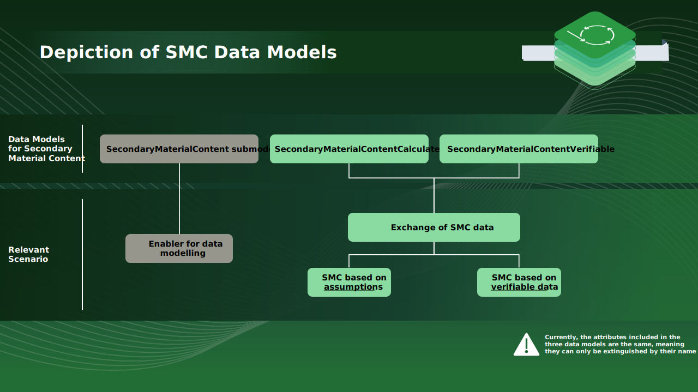

## Circularity KIT

### Vision & Mission

#### Introduction

The Circularity KIT shall empower stakeholders to transition towards a circular economy by providing frameworks, guidelines and best practices to enhance sustainability credentials, enable data-driven decision-making and foster collaboration and innovation in the automotive industry.

Secondary material content, material accounting, dismantling services, the CE Assistant, and the secondary marketplace are the five focus topics that form the Circularity KIT as of now. The offered content and artifacts address important use cases such as sustainable materials management, waste minimization and resource efficiency, that contribute to more sustainable and circular automotive value loops.

The overarching goals of the Circularity KIT, therefore, are to:

- Establish an understanding of requirements along circular value chains and how businesses can profit by implementing sustainable solutions.
- Offer standards and guidelines for industry stakeholders.
- Explain different circularity topics and provide tools to implement them.

#### Vision

Vision Catch Phrase: "Closing the Loop, by harnessing the power of Circularity"

Context: Our vision is to create a future where resources are intelligently and efficiently utilized, enabling industries and communities to minimize waste, embrace R-strategies, and foster a circular economy that leads to a sustainable and prosperous world.

The Circularity KIT serves as a practical set of tools, guidelines, and best practices designed to help stakeholders in the automotive industry to transition towards this vision.

#### Mission

In a world facing increasing environmental pressures and resource scarcity, transitioning to a circular economy is crucial. This approach ensures responsible resource management through R-strategies, secondary material quotas, material accounting, and optimized end-of-life processes. By closing the loop on material flows, we can reduce our environmental impact, drive innovation, and create economic opportunities that secure a sustainable future.

The KIT entails a description of the overall business value, use case context, an introduction to the subtopics secondary material content, material accounting, dismantling services, CE Assistant as well as a circularity glossary and is complemented by user journeys, business processes, calculation frameworks, interoperable data models and standards needed to adopt the Catena-X circularity focus topics.

All described specifications in the KIT are based on Catena-X standards like Asset Administration Shell, SSI and a decentral Digital Twin Registry. They refer to other Catena-X KITs like the Traceability KIT to ensure interoperability and data sovereignty according to IDSA and Gaia-X principles.

### Business Context

The Circularity KIT provides business opportunities for service providers in various ways:

1. **Unified Circular Economy Framework**: Service providers can leverage a comprehensive and standardized framework for implementing circular economy principles in the automotive industry. This unified approach simplifies integration and collaboration with other stakeholders, reducing investment costs and accelerating the development and deployment of innovative solutions.
2. **Access to New Market Opportunities**: The KIT enables service providers to tap into emerging market opportunities driven by the increasing demand for sustainable solutions. By offering tailored services on the Catena-X marketplace, service providers can scale their customer base, expand their reach, and unlock new revenue streams.
3. **Enhanced Sustainability Credentials**: By aligning with the principles of the Circularity KIT, service providers can demonstrate their commitment to sustainability and strengthen their reputation in the market. This commitment can lead to increased customer trust, better brand positioning, and a competitive advantage in the Catena-X network.
4. **Data-Driven Decision Making**: The Circularity KIT promotes data-driven decision making by offering access to material accounting data and insights into end-of-life processes within the automotive industry. Service providers can use this data to develop targeted solutions, optimize their offerings, and drive continuous improvement in their services.
5. **Collaboration and Innovation**: By using the Circularity KIT, service providers can actively participate in a network of automotive industry stakeholders committed to fostering a circular economy. This collaborative environment enables the exchange of ideas, knowledge, and best practices, driving innovation and enhancing the overall value of solutions offered in the Catena-X marketplace.

#### Circularity KIT Wheel

In its first version the KIT covers 5 focus topics along an automotive value loop.

1. **EoL / Dismantling Services:** offers essential support for the digitalization and automation of the EoL phase to consequently close value loops.
2. **CE Assistant (Circular Economy strategy Assistant):** is a decision support system that facilitates the selection of the optimal R-Strategy for end-of-life vehicles, with a focus on Reuse, Remanufacturing, Recycling, and Recovery, guided by a comprehensive technical and environmental assessment process.
3. **Secondary Marketplace:** buying and selling used components and secondary raw materials in order to create and open new opportunities for collaborating across the value chain and closing the loop on component and material level.
4. **Material Accounting:** provides standardized scrap/waste and secondary material data exchange for the ecosystem partners to create transparency about recycling activities and verifiable closed loops.
5. **Secondary Material Content:** promotes the use of secondary materials in the automotive industry by providing a standardized data model for data exchange and a calculation framework.

##### Figure 1

#### End-to-end User Journey

The following user journey of the Circularity KIT provides an end-to-end overview of the focus topics, connecting the circular flow of vehicles, components, and materials with the Catena-X solutions developed within this domain.

##### Figure 2

### Use Case / Domain Explanation

Status Quo / Today's challenge: The automotive industry is one of the largest consumers of raw materials, including metals, plastics, and textiles. Managing these materials sustainably and efficiently is a significant challenge, with an increasing focus on reducing waste, improving recyclability, and ensuring responsible sourcing. Traditional linear models of material consumption led to resource depletion, environmental degradation, and missed economic opportunities.

Values for taking the challenge: By adopting the Circularity KIT and embracing circular economy principles, automotive companies can transition to sustainable materials management, improve resource efficiency, and contribute to a greener, more resilient industry.

Benefits for OEMs, SMEs, and Solution Providers:

1. **OEMs and large suppliers:**
   - Minimize raw material consumption and waste generation by integrating R-strategies and secondary material quotas in their production processes.
   - Enhance their brand image and reputation by adopting eco-friendly practices and demonstrating commitment to sustainability.
   - Achieve regulatory compliance and meet customer expectations for environmentally responsible products.
2. **SMEs can:**
   - Access cost-effective, high-quality secondary materials for their production processes, reducing dependency on non-renewable resources.
   - Improve competitiveness by adopting innovative circular economy technologies and practices.
   - Collaborate with other industry stakeholders to develop and implement sustainable solutions.
3. **Solution Providers can:**
   - Develop and market innovative technologies, products, and services that support circular economy principles in the automotive industry.
   - Access new market opportunities and scale their customer base through a circularity network and shared services.
   - Leverage the collective wisdom of industry stakeholders to drive continuous improvement and innovation.

### Informational Requirements at End of Life

The regulatory movement and the industry trend towards circularity demand concerted action of all the industry participants addressing the R-strategies. Within the CE community of the Catena-x federation, two working groups with broad industry representation have been addressing the particular data requirements of the three R- strategies: Reuse, Remanufacturing and Recycle.

The following whitepaper addresses the data parameters required to enable dismantlers to effectively support form-preserving R-strategies at the end-of-life stage, with a special focus on reuse and remanufacturing. By identifying the critical data elements for informed decision-making in the management of end-of-life vehicles, this paper aims to promote a more sustainable and economically viable approach to component utilization in the automotive industry: [Informational Requirements at Dismantling to enable form preserving R-Strategies](https://catena-x.net/fileadmin/user_upload/Publikationen_und_WhitePaper_des_Vereins/2407_Reuse_Reman_Use_Case_WP_v1.pdf)

Addressing the challenging task of closing the loop for materials from an end-of-life vehicle to a new car component of a modern vehicle, has been attempted within the recycling working group, initially focusing on a few promising components and materials, but with the clear perspective to extend to more materials and their data requirements in further iterations and subsequent refinement of data models. Status of the whitepaper and its addressed examples can be found here: [Data requirements for recycling of ELVs](https://catena-x.net/fileadmin/user_upload/Publikationen_und_WhitePaper_des_Vereins/2407_Material_Recycling_WP_v1.pdf).

#### Closing Loops, Preserving Resources: Creating tomorrow's EoL landscape and empower the circularity

As part of the Circularity KIT, we are committed to developing services for the future of the circular economy in the end-of-life (EoL) sector of vehicles. This phase represents an important stage where decisions are made regarding the fate of vehicles and their components after their initial use. Recognizing the immense value of the world's limited resources, we are dedicated to minimizing waste and maximizing resource efficiency.

One of our key strategies involves creating a framework for an improved communication among all stakeholders involved in the EoL phase. This collaborative approach allows us to consider the needs and requirements of all participants, facilitating the collection and exchange of essential information. Importantly, we view the end of a vehicle's life as the beginning of a new one in the context of resource conservation.

Our overarching vision is to create a landscape that closes loops and preserves resources, ultimately empowering circularity in the industry. We aspire to provide digitized and scalable EoL services that align with circular economy principles and prioritize the preservation of components and materials. Simultaneously, we are committed to follow present and future changes in laws and regulations, which emphasizes environmentally friendly vehicle disposal and the recovery of critical raw materials (CRMs), aligning with the growing demand for closing component and material loops.

Our mission centres on empowering EoL and maintenance stakeholders by fostering continuous collaboration within the Catena-X Network and beyond. Through the Circularity KIT working group, we aim to develop and align various means, including data, business, and network models, to empower all stakeholders involved in the EoL phase. This mission is closely tied to our vision of promoting digitized and scalable end-of-life services across the industry while upholding the principles of circular economy.

Our strategy for achieving these goals involves several key steps. Firstly, we aim to enable EoL service models through data sharing based on digital twins (DT). This approach allows for efficient information sharing in an interoperable, standardized manner, which, in turn, supports dismantling and recycling operations. Furthermore, we are actively engaging with all relevant stakeholders, including policymakers, product designers (for circularity), and EoL service providers, to promote new "R-approaches" and facilitate their implementation.

Ultimately, our efforts provide essential support for the digitalization and automation of the EoL phase, with the ultimate goal of closing loops in the automotive sector. Through these digitized and scalable EoL services, we aim to contribute significantly to sustainable development and resource conservation, aligning with the principles of the circular economy.

### Business Context for End-of-Life

#### Data Journey "End-of-Life"

The "Data Journey" represents the entire process of dismantling an End-of-Life (EoL) vehicle. Each process step is accompanied by CX data models that would be necessary for digitally representing the individual process steps. This enables us to elevate the data journey for the dismantling process to a digital level and to gain an understanding of which data attributes and aspect models are required for each process step. It forms the foundation for the creation of digital EoL-solutions and the use of robotics.

##### Figure 3 End-of-Life

##### 3.1

##### 3.2

##### 3.3

##### 3.4

Future additions include data models for the following topics:

- Decommissioning Certificate
- Material for Recycling
- Adress Aspects
- ID Conversion
- Certificate of Dismantler
- Diagnostic Data
- Physical dimensions
- Mandatory dismantling
- Demand request
- Compatibility of components/ Design changes history
- Quality issue history
- Technical drawings & specifications
- PCF Information

#### User Journey "Certificate of Decomissioning"

The user journey "Certificate of Decommissioning" (CoDM) describes the moment at which a vehicle is transferred into the End-of-Life (EoL) phase from the perspective of an authorized collection point for EoL-vehicles, such as an authorized dismantling facility. The CoDM resembles the official Certificate of Destruction (CoD) but marks the starting point of the upcoming CX concept of a digital CoD.

##### Figure 4

##### Data Model and GitHub

The relevant data model can be found on the following link on GitHub: [https://github.com/eclipse-tractusx/sldt-semantic-models/tree/main/io.catenax.decomissioning_certificate/1.0.0](https://github.com/eclipse-tractusx/sldt-semantic-models/tree/main/io.catenax.decomissioning_certificate/1.0.0)

The open availability on GitHub allows companies to combine their own internal target guidance programs with the data models from Catena-X to the EoL-Services.

## CE Assistant

### Introduction

#### Empowering circular economy decisions: Introducing the CE Assistant

In the dynamic landscape of sustainability and resource conservation, the Circular Economy strategy Assistant (CE Assistant) provides decision support for the selection of strategies concerning end-of-life vehicles. The core task of the CE-Assistant is to evaluate and select an R-Strategy - namely Reuse, Remanufacturing, Recycling, and Recovery.

Based on the principles of Catena-X, the CE Assistant is aligned with a comprehensive assessment process that guides its functionality. This process is anchored in the Catena-X Digital Twin Framework, which combines the virtual representation and real-world insights.

The CE Assistant; a set of standards, aspect models, APIs, system architectures, and decision logics; fosters the development of data-centric, Catena-X compliant decision support system for circular economy strategies. The core circularity lies in the flow of technical information in a collaborative effort involving entities across the automotive value chain.

The concept of a Digital Twin (DT) builds the basis by providing a holistic virtual counterpart of products. The DT includes a set of unique identifiers, an evolving spectrum of aspects, connections to multiple data sources, and the capacity to track the entire lifecycle of assets and capture both individual and fleet-level knowledge.

In accordance with IDSA and Gaia-X principles, interconnectivity and data sovereignty, the CE-Assistant bases on the principles of interoperability, realized by the Connector KIT (EDC) and Data Chain KIT (Item Relation Ship, IRS).

The selection of circular economy strategies requires a comprehensive evaluation of emissions, natural resource preservation, energy management, and waste reduction. However, the effectiveness of such evaluations depends on access to detailed data covering the vehicle’s history, components, materials, and condition

This is where the CE Assistant can help by supporting a user-centered approach that bridges the gap between data availability and informed decision-making. By offering transparency into the environmental implications of diverse circular economy strategies, the CE Assistant facilitates a faster, information based, and efficient decision rooted in the digital twin's insights.

### Business Context

The CE Assistant provides decision support and circular strategies, enabling several key features for businesses:

1. **Component-level decision support:** The KIT provides decision support for selecting circular strategies at the component level.
2. **Efficient data-driven decisions:** Users can make faster and more efficient decisions based on data analysis.
3. **Enhanced circularity:** The KIT contributes to increasing the circularity of products and meeting reuse quotas.
4. **Sustainability milestones:** It helps achieve sustainability indicators and goals.
5. **Transparency on secondary materials:** The KIT offers transparency regarding the availability of secondary materials.
6. **Streamlined vehicle dismantling:** It optimizes the process of vehicle dismantling for improved resource recovery.

### User Journey and Architecture Overview

The user journey describes the system interaction of the CE Assistant with the user, the dismantling lead, with the aim of providing a recommendation for a component-level circular strategy for end-of-life vehicles. This involves breaking down the process of holistic decision-making into individual process steps and identifying the interaction with the user/system at each process step.

#### Figure 5

The following figure shows how the CE Assistant is embedded in the overall architecture:

##### Figure 6

### Logic / Schema

To assess the appropriate R-Strategy for individual components, it's essential to have various types of EoL data available at different decision-making stages within the logic. This involves distinguishing between process-related, product type-specific, and instance-specific information.

Process-related data encompasses details derived from the processes and operations of the executing company, such as the CO2 footprint of processes, energy consumption, and waste streams. Product type-specific data is rooted in the planning and development phase of the evaluated component and is influenced by the vehicle type and its design. This category includes information like weight, dimensions, installation requirements, and the bill of materials as built. Instance-specific data reflects the usage and maintenance conditions of individual components (e.g. mileage, quality status). This information is collected throughout the product's lifecycle using DT technology.

The decision support regarding the best R-Strategy is a multi-stage process, starting with the logic for the technical feasibility assessment. Because only when the R-Strategy is technically feasible, it must be checked for other indicators afterwards.

The outcome of the technical feasibility assessment will be analyzed to determine if an R-Strategy has to be excluded at the beginning based on regulatory requirements regarding an R-Strategy or a defect in functionality of specific components.

As shown in Figure 7, the process is started by entering the vehicle identification number (VIN) into the system, thereby requesting the corresponding Catena-X data. The registered companies in the Catena-X network act as data providers for this vehicle-specific data, as they register respective assets and sub-models. Catena-X Shared Services handle existing data models, contracts, usage and access control policies, and ultimately the final data exchange.

The system presents the information, such as corresponding vehicle, component and material based on DT data. This data is provided for the first overall manual inspection and evaluation. After that, the user selects the most relevant components for the R-Strategy decision. The decision logic is applied for this component and the possible R-Strategies are identified.

The following criteria are evaluated in a chronological order: the basic reuse-potential, material composition and remaining lifetime in comparison with the specific thresholds and the disassembly capability.

If one or more of these criteria are not fulfilled, the component will only be assigned to recovery or recycling. If the component qualifies for disassembly, a manual visual inspection and a functional check are conducted. For components, where the visual condition is relevant, such as body parts and interior components, the visual inspection is conducted first. In contrast, components, for which the technical condition is of significant relevance, such as engines and gearboxes, are first subjected to a functional test. Here, the data can also be provided in the Catena-X network as an update of the DT. Thereafter, a quality comparison of the component condition with threshold values takes place. When the quality is insufficient for reuse, the technical check for remanufacturing is carried out chronologically: assemblability, cleanability and restorability / upgradability. Finally, a possible strategy is given to the user as an intermediate result before further environmental assessment.

#### Figure 7

After assessing the technical feasibility, the environmental impact of the previously selected component is calculated and evaluated using the Life Cycle Assessment (LCA) methodology, following ISO 14040 and ISO 14044 standards. R-strategies that are not technically feasible are excluded from the subsequent decision logic, as depicted in Figure 8.

First, to obtain LCA-relevant activity data for EoL processes, process-related data of the dismantling and different R-Strategy processes needs to be entered into the decision support system by the user or retrieved from internal or external data collections. Examples for essential process-related data are: Use of process flows, operating resources, such as energy and material consumption, and location factors (e.g. distance to the nearest remanufacturer).

With the help of the process-related data in combination with product type-specific data requested from the Catena-X network, a subsequent input and output analysis of the dismantling process and remaining R-strategies leads to the collection of parameters in a Life Cycle Inventory (LCI): material consumption, energy consumption (electricity and fuels) and direct emission release (e.g. in CO2, SO2, NOx). Life Cycle Impact Assessment (LCIA) methods are then used to transfer the LCI results into a quantifiable environmental impact, such as global warming potential, of the corresponding R-Strategy in addition to the previous dismantling. To note that the resulting impact values are a pure process view of the EoL, the intermediate results are referred to as "relative total environmental impact" of the assessed R-strategies.

In order to decide for the best R-Strategy, the respective R-Strategy can be compared with each other and a comparison with production can also be made.

Finally, all absolute environmental impacts of the R-strategies are compared, and the most environmentally friendly strategy is recommended as a decision support for the dismantling lead. Moreover, the results of the CE Assistant can also be made available to other stakeholders via the Catena-X network to enable, for example, feedback-to-design for product development.

In the future research, consideration should also be given to the extent to which the use of a reused or remanufactured component causes emissions compared to a new component. Modern technological components can achieve a much higher level of efficiency in use, so that despite high emissions, it may make more sense to produce a new component than to extend the life cycle of the old component, which may have a significantly higher utilization cost.

##### Figure 8

### Whitepapers

If you are eager to dive deeper into the world of the CE Assistant, including its data provision via the Digital Twin and expert insights on technically feasible circular strategies and environmentally friendly choices, we invite you to explore our informative publications.

#### End-of-life decision support to enable circular economy in the automotive industry based on digital twin data

- **Abstract**: With the EU Green Deal and the UN Sustainable Developments Goals, the vision of a greenhouse gas-neutral and resource-efficient economy is already firmly anchored in world politics. In this context, the automotive industry faces many challenges including the increasing scarcity of natural resources, a rising demand in terms of sustainable vehicle design, production and materials sourcing. Due to all this, end-of-life decisions regarding dismantling have become increasingly important. A high proportion of secondary materials will be required in the vehicles of the future. To response to these challenges, companies have turned their focus towards the circular economy as a central approach to close material loops. In the German research project “Catena-X” a new data ecosystem with digital twins is one enabler that is being developed. The digital twins represent a promising approach to the circular economy by ensuring transparent, product-specific and end-to-end data exchange throughout the entire product lifecycle, from the material sourcing to the eventual dismantling and recycling. As one particular and unique solution, a decision framework that facilitates the best circular strategy at the end of a vehicle's life is developed and presented in this paper. The underlying data-driven decision support framework is based on circular economy KPIs. This includes material, components and specific vehicle KPIs to best identify the most suitable circular strategy. The framework was methodologically developed by an interdisciplinary team of partners, who are stakeholders throughout the value chain and participants in the Catena-X project. An integrated approach of user-centered design, an adapted version of the V-model and the Scaled Agile Framework were used for the methodology in the development of the solution. The paper presents the concept of a digital twin for a decision support system, that includes a central decision logic that also includes the relevant KPIs and a survey for evaluating the decision logic utilized with a chosen dismantling company.
- **Link**: [End-of-life decision support to enable circular economy in the automotive industry based on digital twin data - ScienceDirect](https://www.sciencedirect.com/science/article/pii/S2212827123006091)

##### Empowering End-of-Life Vehicle Decision Making with Cross-Company Data Exchange and Data Sovereignty via Catena-X

- **Abstract:** The mobility sector is the world’s second-largest producer of energy-related CO2 emissions, and it is facing a global resource shortage. The demand for circular products, the use of secondary materials in future vehicles, and the need for sustainable business models in the mobility sector is increasing. However, a transparent and end-to-end data exchange throughout the entire value network is missing, which is hindering an efficient circular economy. Relevant information on the vehicle, its components and materials at the end of the product life cycle are often missing. In this context, this paper presents a decision support system based on Digital Twin data for a circular economy solution as a software application. It was developed within the German research project Catena-X following an integrated approach of user-centered design, the V-model, and within the Scaled Agile Framework. By combining these methodological approaches, customer-oriented solutions were developed and continuously improved at each stage of development to shorten the time-to-market. Catena-X is based on Gaia-X principles. In Gaia-X, necessary core services are developed, and contraction negotiation for data exchange and usage policies is enabled and implemented. The decision support system provides important information about the exact composition and condition of the vehicle, its components, and its materials. Thus, it helps to improve efficiency, sustainability, and the implementation of the circular economy. The decision support system was tested and validated with a use case that provided Digital Twin data on the end-of-life vehicle.
- **Link**: [Sustainability | Free Full-Text | Empowering End-of-Life Vehicle Decision Making with Cross-Company Data Exchange and Data Sovereignty via Catena-X (mdpi.com)](https://www.mdpi.com/2071-1050/15/9/7187)

##### Digital Twins for Circular Economy - Enabling Decision Support for R-Strategies

- **Abstract:** Digital twins (DT) for circular economy (CE) offer a promising approach as part of digital data ecosystems for more sustainable value creation. By mapping and analyzing product, component and material specific data along the lifecycle, it is possible to address current challenges such as climate change and resource scarcity. Within Catena-X, specific solutions based on this cross-company exchanged data and information are developed. Here, the “CE-Assistant” is presented. It is an application, which identifies the best CE Strategy based on DT data at the end of a vehicle's life.
- **Link:** [OA_Mügge_6-2022 | INDUSTRIE-MANAGEMENT](https://www.industrie-management.de/node/556)

##### Digital Twins within the Circular Economy: Literature Review and Concept Presentation

- **Abstract:** Digital twins offer a promising approach to sustainable value creation by providing specific life cycle data and enabling the monitoring and implementation of circular economy strategies throughout the product’s life cycle. By analyzing product, component, and material data, as well as process data, it is possible to create transparency throughout a product’s life cycle, build a data-driven product ecosystem, and establish new business and value creation models, from SMEs to large enterprises. This paper identifies application scenarios, their technological readiness level, and the challenges of digital twins for the circular economy in the manufacturing industry based on a systematic literature review. Gaps such as ensuring a continuous flow of information and taking into account the different levels of digitalization of companies are identified. As a main result, a holistic concept for the scoping of a digital twin for the circular economy is presented. One specific use case for end-of-life decision-making is elaborated upon. It is shown that the circular economy can be supported by digital twin data, especially for the optimal decision on end-of-life vehicles.
- **Link:** [https://www.mdpi.com/2071-1050/16/7/2748](https://www.mdpi.com/2071-1050/16/7/2748)

## Secondary Marketplace

### Introduction

A secondary marketplace is fundamental to establish a circular economy where components and materials are available and offered to the interested users creating new value chains and extending the life of the parts and the materials before becoming waste. Digital platforms offering marketplace services are essential to enable trading of secondary materials and components, provide transparency into supply and demand that potential buyers and sellers can expect.

The main goals of the Marketplace are: (1) to match the demand and the supply of available components and secondary raw materials and (2) to provide transparency on sales opportunities for used components which can be, for example, reused or re-manufactured.

If offered, additional services such as grading, certifications for the offered listings (components or secondary materials) and transport handling and logistics could support trading processes.

### Business Context

A secondary marketplace enables closing the loop on economical and physical layers. Following the logic described in the previous chapter, there could be multiple scenarios related to R-strategies on how secondary marketplaces enable a circular economy.

Potential sales scenarios:

- Dismantling companies selling old components and material/scrap;
- Automotive manufacturers selling old unused components;
- Automotive manufacturers selling production waste and scrap;
- and others.

Potential purchase scenarios:

- Automotive companies buying components for re-manufacturing;
- Workshops buying components for re-use;
- Recyclers buying production waste and scrap;
- and others.

In all of those cases, having additional information (e.g. product carbon footprint or digital product passport details) on the products offered on the marketplace is beneficial.

### User Journey and Architecture Overview

In general, there are several goals that buyers and sellers pursue on a secondary marketplace:

- As a (Core) Purchaser, I want to search and filter for market supply on OE number level to match the market offers towards my demand.
- As a (Core) Purchaser, I want to reach as many possible sellers as possible to purchase parts that I cannot procure today. This includes brokers I don't buy from today.
- As a (Core) Seller, I want to place offers on the marketplace with standard upload tools and manually.
- As a (Core) Seller, I want to reach as many possible customers as possible to maximize my turnover. This includes customers I don't sell to today.

The key user journey relevant in Catena-X circular economy area relates to the need of a buyer to have full reliable information on a product that he is intending to purchase. This is especially important given that many buyers are looking for parts for re-manufacturing or re-use, where product quality plays a vital role. Furthermore, in case of recycling, recyclers are interested to know material composition and additional information that would influence their purchasing decision.

Some information could be provided by a variety of data models, but the highest value lies within the generic digital product passport (and by extension, battery passport, sealant passport, transmission passport). When a seller is publishing a listing with a product that he is willing to sell, there is only a limited amount of information he can provide with it, mostly the one available from the visual inspection or on-board data (such as mileage, OE-number, brand) as well as logistical/ sales information (such as location or price). When a potential buyer views the listing, he should have a possibility to request additional details from a data provider of the generic digital product passport (if available) for that product (see diagram below). More information on the digital product passport can be found in the [Ecopass KIT](https://eclipse-tractusx.github.io/docs-kits/kits/eco-pass-kit/adoption-view/).

#### Figure 9

This process is reflected in the architecture for communicating with the Catena-X network and data providers of the battery passport data model, as presented below.

#### Figure 10

When it comes to the data exchange schema and other details, see the [Triangle for Secondary Marketplace](https://catena-x.net/de/standard-library) document for more information on how such a request could be realized within Catena-X environment and according to applicable guidelines (e.g. on interoperability and data sovereignty). In a decentral environment, such attributes as manufacturer part ID and OE number play a vital role in order to get access to the right component and the right data model at data provider’s side.

### Semantic Models

In the following, relevant semantic models for the secondary marketplace are listed. For further information about the listed data models please refer to the Catena-X standards library for the respective data model, marked as “CX-“, which contains the standardized data models with further descriptions and explanations. The standards library can be founded here: [Catena-X Standard-Library](https://catena-x.net/de/standard-library)

The Marketplace Offer is an aspect model that is complementary to the concept of a secondary marketplace. It described a product (e.g. a used, dismantled component) that is placed for sale onto the marketplace, with key supporting information such as quantity, quality, or price. It provides essential information for potential buyers and could be used in the future to exchange product information between multiple marketplaces. This model can therefore be used to exchange offers between multiple marketplaces. As there is no exchange scenario defined yet, the Marketplace Offer is a recommendation and non-normative, since it is so far concerning the business application-internal data structure only. More information on this aspect model can be found under CX-0035 in the standards library or under the following link: [Marketplace Offer](https://github.com/eclipse-tractusx/sldt-semantic-models/tree/main/io.catenax.market_place_offer)

Additionally, two other aspect models could play a supporting role for secondary marketplaces.

The Return Request aspect model could be used to flag a vehicle or product to indicate that there is a demand or a request for return. It specifies the aspect of the recall of a vehicle part and thus provides the information whether and why a return request exists for a product. More information on this aspect model can be found under CX-0033 in the standards library or under the following link: [Return Request](https://github.com/eclipse-tractusx/sldt-semantic-models/tree/main/io.catenax.return_request)

The Product Passport aspect model could provide reliable details on the product characteristics or lifecycle information, therefore complementing the basic Marketplace Offer information. More information on this aspect model can be found under CX-0103 in the standards library or under the following link: [Digital Product Passport](https://github.com/eclipse-tractusx/sldt-semantic-models/tree/main/io.catenax.generic.digital_product_passport)

## Material Accounting

### Introduction

#### Material Accounting: Enabling Transparency in the Circular Economy to Validate Material Loops

In the dynamic landscape of modern industry, the pursuit of a circular economy has become increasingly vital. This transformative approach seeks to minimize waste and enhance resource efficiency by promoting the reuse, recycling and repurposing of materials throughout their entire lifecycle. However, the realization of a truly circular economy faces significant challenges, primarily stemming from the absence of standardized data exchange and communication among the diverse network of stakeholders involved in the process.

Currently, there is a notable absence of a uniform data format or exchange mechanism for recycled materials within industrial processes and value chains. This lack of transparency presents a barrier to comprehending the flow of materials and recycled materials circulating within this ecosystem. Without a standardized approach, tracking the contributions of recycled materials, assessing their successful reintegration into the circular loop, and quantifying output volumes remain challenging tasks.

The circular economy involves a complex interplay of various stakeholders, ranging from tier-n companies to original equipment manufacturers (OEMs), each employing unique methods for measuring inputs and outputs. The overarching objective of the material accounting feature in the Circularity KIT, therefore, is to make the circular economy visible and digitally verifiable across the automotive value chain.

To realize this ambition, a standardized framework is imperative, one that facilitates the exchange of material data for both primary and secondary raw materials, including corresponding quantities and qualities, illuminating material flows across the entire value chain.

The image below shows the big picture of a circular economy when material is tracked over its complete life cycle excluding the usage phase.

##### Figure 11

### Business Value

From a business perspective, the material accounting KIT is characterized by the following attributes:

1. **Standardized Data Exchange:** Facilitation of standardized data exchange regarding scrap, waste, and secondary materials among ecosystem partners.
2. **Verifiable Closed Loops:** The KIT enables the establishment of verifiable closed loops for material tracking.
3. **Increased Material Recycling:** The KIT promotes the recycling of materials within the same industry, increasing sustainability.
4. **Transparency:** It provides higher transparency regarding the availability of secondary materials.

### Use Case / Domain

#### Material Accounting in Catena-X

Catena-X offers a decentral, sovereign, cross-organizational data exchange. For Material Accounting the following scenario could be addressed: Registering secondary materials as decentral digital twins in the Catena-X network based on material batches.

The goal of the Material Accounting Feature inside the Catena-X consortium and association is to collaborate on exchanging standardized secondary material information across the upstream & downstream value in order to develop a standardized data model. To do so, we identified potential data points along a closed loop with OEM, recycler and supplier as stakeholders as seen in the picture below. Further feature content will follow in upcoming versions of the Circularity KIT.

##### Figure 12

## Secondary Material Content

### Introduction

_Introducing the Secondary Material Framework within the Circularity KIT by Catena-X: Enhancing Sustainability and Communication in the Automotive Value Chain._

In the pursuit of sustainability and resource efficiency, the automotive industry is continuously exploring innovative ways to incorporate secondary materials into its value chain. At the forefront of this endeavor is the secondary material framework, a pivotal component of Catena-X's Circularity KIT.

Designed with a clear mission, this framework seeks to revolutionize the utilization of secondary materials throughout the automotive value chain, extending its impact to tier-n companies and OEMs alike. Through a multi-faceted approach, the secondary material framework not only optimizes accessibility to secondary material information but also advances collaboration and communication among diverse stakeholders within the industry.

By facilitating seamless data exchange and introducing standardized calculation methodologies, this framework establishes a transparent foundation that harmonizes communication among stakeholders by employing consistent metrics. The decentralized nature of this data ecosystem empowers each actor to manage their own data and determine what can be shared with whom.

The secondary material content chapter of the Circularity KIT explores how the secondary material framework contributes to heightened transparency, empowered data management, and streamlined communication, ultimately fostering a more sustainable and interconnected automotive ecosystem.

### Business Context

#### Use Case / Domain Explanation

This user journey illustrates the data exchange process through Catena-X in the context of secondary material content. The user journey outlines the various stakeholders along the value chain and within the individual tiers and their involvement.

##### Figure 13

The user journey follows the same process during all four lifecycle stages and differ in data quality as stated below. Further information to the lifecycle stages can be found in the [Traceability KIT](https://eclipse-tractusx.github.io/docs-kits/kits/traceability-kit/business-view/).

| Lifecycle Stage | Explanation                                                                                       | Example                                                                                                                                                                           |
| --------------- | ------------------------------------------------------------------------------------------------- | --------------------------------------------------------------------------------------------------------------------------------------------------------------------------------- |
| As Designed     | Development phase: **Initial estimation** of secondary material content                           | The company that wishes to procure a component requires an initial estimate from the supplier regarding the elements of the SMC.                                                  |
| As Planned      | Planning phase: **Concretization** of the secondary material content                              | The company chooses a supplier based on the proposals received and obtains more detailed information about the SMC as the supplier can plan the component with greater precision. |
| As Ordered      | Ordering phase: Calculation of secondary material content on the **basis of supplied components** | The ordering phase occurs before the start of production, allowing for the calculation of the SMC information based on the specific parts and materials that are being supplied.  |
| As Built        | Production phase: Ongoing calculation **after start of production**                               | During the production process SMC information are regularly exchanged between supplier and OEM.                                                                                   |

### Semantic Models

There are different scenarios in which SMC Data can be exchanged. According to the semantic model framework, this implies that there is a specific data model for each purpose (scenario).

_In order to ensure efficiency by avoiding redundancy and maintaining multiple data models, the concept of a shared aspect model was used: This means that there is one Secondary Material “base model”, which is the SecondaryMaterialContent. This serves as an enabler for data modelling and not for data exchange itself, it is bad practice to use it for data exchange._

Instead, SecondaryMaterialContentCalculated or SecondaryMaterialContentVerifiable should be used when exchanging SMC data, depending on the actual scenario.

The main difference between these data models, is whether the data is based on assumptions or a prognosis and is therefore not fixed, in which case SecondaryMaterialContentCalculated is to be used. On the other hand, once the data is actually measured and can therefore be verified, the SecondaryMaterialContentVerifiable should be used. It is important to note that the models now include the same properties and can only be differentiated by the name of the relevant data model.

In the table below, different scenarios are described to clarify which data model is used in which case.

| Scenario                                     | Description                                                                                                                                   | Example from Practice                                                                                                             | Data Model                                                                                                                                                |
| -------------------------------------------- | --------------------------------------------------------------------------------------------------------------------------------------------- | --------------------------------------------------------------------------------------------------------------------------------- | --------------------------------------------------------------------------------------------------------------------------------------------------------- |
| Assumption-based SMC data exchange           | The SMC data exchanged in this scenario is based on assumptions made by considering various factors                                           | Tier-n requests an initial estimate of the SMC data for a new component from its supplier.                                        | [SecondaryMaterialContentCalculated](https://github.com/eclipse-tractusx/sldt-semantic-models/tree/main/io.catenax.secondary_material_content_calculated) |
| Prognosis-based SMC data exchange            | In this scenario, SMC data is exchanged based on a prediction or forecast of future events in the automotive sector.                          | When the production of a previously produced car is continued, a prognosis of the SMC is made based on the previous production.   | [SecondaryMaterialContentCalculated](https://github.com/eclipse-tractusx/sldt-semantic-models/tree/main/io.catenax.secondary_material_content_calculated) |
| Measured-information-based SMC data exchange | In this scenario, the SMC data that is exchanged is based on actual measured information and data. The relevant data is therefore verifiable. | During the production of a component, the order information of the used material clearly indicates the SMC of the used materials. | [SecondaryMaterialContentVerifiable](https://github.com/eclipse-tractusx/sldt-semantic-models/tree/main/io.catenax.secondary_material_content_verifiable) |

#### Figure 14

The next part provides an overview of the secondary material content (SMC) calculation framework, including relevant data points, the calculation of SMC, and links to the data model and GitHub. The goal is to create a common basis for the data relevant for the SMC. Based on this, steering for secondary material content (SMC) and secondary material quota (SMQ) is possible.

#### A. Introduction to the Semantic Models

The semantic model is based on data points regarding material and order data.

There are different timestamps to which data for SMC is relevant.

To ensure the accuracy of the data and account for varying availability and quality of the information, it is important to identify at which step of the process data is exchanged. The process is divided into four steps, which are explained below.

| **Timestamp**   Linked to [Traceability KIT](https://eclipse-tractusx.github.io/docs-kits/kits/traceability-kit/business-view/) | **Explanation**                                                                                                                                                                                                                                           | Concept in Catena-X developed   | Data Models that need to be filled                                                    |
| ------------------------------------------------------------------------------------------------------------------------------------------------------------- | --------------------------------------------------------------------------------------------------------------------------------------------------------------------------------------------------------------------------------------------------------- | ------------------------------- | ------------------------------------------------------------------------------------- |
| a. Supplier Inquiry/As Designed                                                                                                                               | This is the initial phase of the process where the supplier is inquired about the design of the product. The data exchanged in this phase is an initial estimation of secondary material content.                                                         | Concept currently not developed | N/A                                                                                   |
| b. Supplier Selection/ As Planend                                                                                                                             | In this phase, the supplier is selected, and the data exchanged is based on the planned production and concretized to the previous phase.                                                                                                                 | Concept developed               | 1. Part as Planned (Component)   2. SMC                                          |
| c. SOP/ Industrialisation/ As Ordered                                                                                                                         | This phase involves the ordering and the start of the production process. The data exchanged is based on the actual production process.                                                                                                                   | Concept currently not developed | N/A                                                                                   |
| d. Post-SOP/ Serie/ As Built                                                                                                                                  | This is the final phase of the process where the product is built, and the data exchanged is based on actual product specifications. The data exchange during this phase is regular and allows for the most precise calculation of SMC of all the stages. | Concept developed               | 1a. Serial Part (Component)   **or**   1b. Batch  **and**  2. SMC |

In addition to filling out the data model for Secondary Material Content, other data models must also be completed to ensure adequate information and compatibility within Catena-X. During the As-Planned phase, the Part as Planned (Component) data model must be filled in addition to the SMC data model. Once the as-built phase is reached, the serial part (Component) data model must be filled to provide information as manufacturer partID, and customer partID. As such, these values are not included in the SMC data model.

#### 1. Material

The Model is designed to address the material at the lowest level requiring descriptive information, such as the material name in accordance with a standardized format, as well as the name and code of the referenced standard _(materialNameStandardizedValue; referencedStandard; referencedStandardID)_. For example, a material name may be given based on the ISO 1043 standard, in which case ISO would be the referenced standard and ‘1043’ the referenced standard ID. The material class _(materialClass)_ must be provided in accordance with the VDA standard 231-106. To provide relevant data regarding the material mass per declared unit of the material, the unit of measure, such as gram or kilogram _(unitOfMeasureKey)_, must first be defined. Next, the gross material input weight _(grossMaterialInputMass)_ as well as the net mass of the material _(materialNetMass)_ shall be provided.

Essential material characteristics that are mandatory within the data model include the use of bio-based materials and their material class _(bioBasedClass)_, as well as the percentage of material weight of each primary and secondary bio-based material _(primaryBioBased; secondaryBioBased)_. For secondary bio-based material it can be chosen whether a mass balancing approach was followed or not _(isMassBalanced)_. Further information on mass-balancing can be found under [_B. Accounting for chain of custody models_](#b-accounting-for-chain-of-custody-models).

Further, information regarding inorganic/fossil-based materials is required. The percentage of primary inorganic/fossil-based material weight _(percentageOfMaterialWeight)_ shall be provided. When it comes to secondary material, the percentage of material weight of chemically and mechanically recycled pre-consumer and post-consumer material according to ISO 14021 should be included _(percentageOfMaterialWeight)_. Post-Consumer material is divided into two streams: Post consumer material from end-of-life vehicles as well as post consumer from other sources. When chemical or mechanical recycling has been applied, it is important to disclose information whether a mass balancing approach was followed _(isMassBalanced)_.

_Definition of pre-consumer material:_

“Material diverted from the waste stream during a manufacturing process. Excluded is reutilization of materials such as rework, regrind or scrap generated in a process and capable of being reclaimed within the same process that generated it. Pre consumer material can be used in form of recovered or recycled material as a substitute for primary material.”

_Definition of post-consumer material:_

“Material generated by households or by commercial, industrial and institutional facilities in their role as end-users of the product which can no longer be used for its intended purpose. This includes returns of material from the distribution chain. Post-consumer material can be used in form of recovered or recycled material as a substitute for primary material.”

#### Optional Information, such as Reutilization

Optional information can be included to enhance the quality of the provided data, such as the percentage of material weight of reutilization material content _(additionalInformation)_.

_Definition of Reutilization:_

“Reutilization of materials such as rework, regrind or scrap materials generated within the process and capable of being reused within the same process that generated it. Any operation by which products or components that are not waste are used again for the same purpose for which they were originally intended. Reutilization allows waste to be reduced and materials can be kept in the cycle.”

Even though Reutilization fosters the avoidance of waste, it does not count as recyclate according to ISO 14021 and is an optional attribute for this data model.

If available, the name of a certificate verifying the recycling content and a link to its PDF validating the provided information can be included _(certificate)_.

##### Figure 15

The schematic depiction above provides a visual representation of the connection between various material characteristics, facilitating an understanding of how different data points relate to each other and contribute to the calculation of SMC.

#### 2. Order Data

To clearly identify the order and relevant material, the order number (orderNumber) can be provided on an optional basis.

#### B. Accounting for Chain of Custody Models

Please see the Catena-X Product Carbon Footprint (PCF) Rulebook for further information. Chain of custody is an administrative process by which information about materials is transferred, monitored, and controlled as those materials move through supply chains [ISO 22095:2020]. There are in principle four chains of custody models possible, illustrated in the figure below. Their common objective is to guarantee correct bookkeeping and to corroborate a link between in-going content, e.g., ‘sustainable’, ‘recycled’ or ‘organic’ by harmonized definitions, and the finally out-going product. They differ regarding physical or administrative links. Furthermore, they differ on the set of rules for balancing, and the possibility to keep materials streams segregated or not.

##### Figure 16

[^1]

[^1]: Original image taken from [Mass Balance EMF White Paper](https://emf.thirdlight.com/link/f1phopemqs36-8xgjzx/@/preview/1?o), visually adapted for this purpose.

The following table is adapted from the [Mass Balance EMF White Paper](https://emf.thirdlight.com/link/f1phopemqs36-8xgjzx/@/preview/1?o) and provides high-level explanations and differentiations for the four chain of custody models:

| Model                                           | Explanation                                                                                                                                                                                                                                                                                                                                                                                                                                                                              | Example                                                                                                                                                                                                                                                                                           |
| ----------------------------------------------- | ---------------------------------------------------------------------------------------------------------------------------------------------------------------------------------------------------------------------------------------------------------------------------------------------------------------------------------------------------------------------------------------------------------------------------------------------------------------------------------------- | ------------------------------------------------------------------------------------------------------------------------------------------------------------------------------------------------------------------------------------------------------------------------------------------------- |
| Identity Preservation                           | It is possible to physically track the product to its desired origin, ensuring unique traceability and physical separation of products from other sources along the supply chain.                                                                                                                                                                                                                                                                                                        | Buying food from a single certified producer.                                                                                                                                                                                                                                                     |
| Segregation                                     | Consists in the aggregation of volumes of products of identical origin or produced according to the same standards in one stock item.                                                                                                                                                                                                                                                                                                                                                    | Buying food from a trader that exclusively handles identically certified supplies.                                                                                                                                                                                                                |
| Mass Balance                                    | Considering the output, no physical or chemical difference exists between in-scope and out-of-scope. It involves balancing volume reconciliation to ensure the exact account of volumes of in- and out-of-scope source is maintained along the supply chain, provided that the volume or the ratio of sustainable material integrated is reflected in the product produced and sold to customers. This model requires that a reconciliation period is defined (e.g. a month, a year).    | Buying a certain percentage of a supply from certified origin. Applies to, e.g., sustainable forestry for wooden materials, recycled, bio-based or renewable materials, organic cotton                                                                                                            |
| Book and Claim – Restricted Certificate Trading | The certified product / component is disconnected from the certification data but belongs to the same production system or value chain. The certified product evolves in separate flows from the certified supply. Certificates are issued at the beginning of the supply chain by an independent body reflecting the sustainable content of supplies. The intended outcome is that outputs from one supply chain are associated with total claims corresponding to the certified input. | Buying material with renewable/recycled/ biobased content. Certificates with guarantee of origin or comparable certifications declaring e.g. recycled, renewable, biobased content. CO2 capture certificates from a production system controlled by the company, e.g. carbon capture and storage. |

For calculating the PCF according to the Catena-X rulebook all types of models may be taken into account, if the requirements listed below are met and an independent third-party chain of custody verification for the balance of materials is available. The balance between input and output shall be correct.

The mass balance approach helps enabling fossil raw materials to be replaced by more sustainable alternative materials (e.g. with recycled content, bio-content). In contrast to a segregated use of alternative raw materials, mass balance enables to use existing production networks with minimized or no investments into new process technologies and production facilities. A book and claim model can be applied when there is no direct connection between the final product and the certified supply. An example for a book and claim model is applied in green electricity markets and receives more attention in other sectors as a way to support circular transformation of the industry, therefore it is accepted as a solution. There will be a regular review by Catena-X to decide about the further necessity.

##### Guiding Principles

In implementing chain-of-custody methods, including the mass balance one, the following set of guiding principles shall be fulfilled:

1. The use of chain-of-custody approaches shall achieve significant changes and an effective transition towards a more circular, more bio-based and lower GHG emissions production in complex value chains.
2. The choice and implementation of chain-of-custody approaches and models shall be transparent, clear, and credible – abiding by relevant standards such as ISO and CEN. Such credibility can also be achieved but is not limited to accepted third-party certification schemes, e.g. ISCC PLUS, REDCert2 and RSB.

   Note: Certification Schemes are not yet available in all sectors.

3. Labels and claims referring to chain-of-custody controlled specified characteristics and used on products shall fulfill the following requirements:

   - description of the chain-of-custody approaches and models
   - accurate and appropriate implementation of the chain-of-custody model
   - compliant with existing standards and regulations
   - non-misleading

   In case the “specified characteristic” content in products cannot be measured and verified, labels and claims products may reflect this in ways that clearly differentiate and specify the actual content.

4. No double counting: A reliable bookkeeping system shall be installed at each operating site to avoid the sales of a greater amount of alternative attributed products than physically available in the company.

   Additional requirements for mass balance chain of custody approach:

5. The operating sites in the spatial boundaries for mass balancing are under the operational control of the same company/corporate group/joint venture.

6. It shall be technically possible according to standard industry practice to produce a mass balanced product from an alternative feedstock. The share of mass-balanced material can be technically lower than the attributed share.

7. Applied emissions factors for the mass balance system boundaries shall be material and process specific.

For the SMC data model, information whether a mass-balanced approach has been applied or not can be provided in the data model.

#### C. Calculation Logic for SMC

The secondary material quota (SMQ) is a KPI measuring the usage of secondary materials within a vehicle. A vehicle can be defined as the sum of its individual components. Therefore, the secondary material content (SMC) is defined as the ratio between secondary material used and total material used on component level. To enable steering for secondary material content on the component level, it is important to establish a common understanding of the SMC of a single material. Based on the data model and information provided earlier, the SMC of a material can be calculated. The SMC can be divided into different pillars: Pre-consumer material and Post-consumer material and, optional: Reutilization material content

All secondary material usage types are being expressed as percentages of the relationship between secondary materials and total materials used.

##### 1. Pre-consumer material content

**Definition of pre-consumer material:**

“Material diverted from the waste stream during a manufacturing process. Excluded is reutilization of materials such as rework, regrind or scrap generated in a process and capable of being reclaimed within the same process that generated it. Pre consumer material can be used in form of recovered or recycled material as a substitute for primary material.”

##### 2. Post-consumer material content

**Definition of post-consumer material:**

“Material generated by households or by commercial, industrial and institutional facilities in their role as end-users of the product which can no longer be used for its intended purpose. This includes returns of material from the distribution chain. Post-consumer material can be used in form of recovered or recycled material as a substitute for primary material.”

##### 3. Optional: Reutilization content

**Definition of reutilization:**

“Reutilization of materials such as rework, regrind, or scrap materials generated within the process and capable of being reused within the same process that generated it. Any operation by which products or components that are not waste are used again for the same purpose for which they were originally intended. Reutilization allows waste to be reduced and materials can be kept in cycle.”

#### SMC and SMQ Calculation

The SMC calculates as the sum of the above defined secondary material usage types:

In the above-described manner, the secondary material content is to be calculated for every component of the vehicle.

The SMQ as a KPI defined on vehicle level which is calculated based on the individual SMC’s of the respective components:

It is important to note that data quality may vary during different stages of the process, and this should be taken into consideration to ensure the highest level of data accuracy.

To calculate the average portion of, for instance, the amount of mechanical recycling of post-consumer material content in the whole material, the values along the data model must be multiplied. For example, the content of inorganic or fossil-based material, content of secondary inorganic or fossil-based material, post-consumer material content, and mechanical recycling would be multiplied as can be seen in the schematic depiction below.

##### Figure 17

#### D. Data Models and Github

The relevant data models can be found via the following links on GitHub:

- [Secondary Material Content](https://github.com/eclipse-tractusx/sldt-semantic-models/tree/main/io.catenax.shared.secondary_material_content)
- [Secondary Material Content Calculated](https://github.com/eclipse-tractusx/sldt-semantic-models/tree/main/io.catenax.secondary_material_content_calculated)
- [Secondary Material Content Verifiable](https://github.com/eclipse-tractusx/sldt-semantic-models/tree/main/io.catenax.secondary_material_content_verifiable)

The open availability on GitHub allows companies to combine their own internal target guidance programs with the data models from Catena-X to SMC.

## NOTICE

This work is licensed under the [CC-BY-4.0](https://creativecommons.org/licenses/by/4.0/legalcode).

- Copyright (c) 2023,2024 BMW AG
- Copyright (c) 2023,2024 Fraunhofer-Gesellschaft zur Foerderung der angewandten Forschung e.V. (represented by Fraunhofer IPK)
- Copyright (c) 2023,2024 BASF SE
- Copyright (c) 2023,2024 SAP Deutschland SE & Co.KG
- Copyright (c) 2023,2024 T-Systems International GmbH
- Copyright (c) 2023,2024 LRP Auto-Recycling Leipzig GmbH
- Copyright (c) 2023,2024 Robert Bosch GmbH
- Copyright (c) 2023,2024 tec4U-Ingenieurgesellschaft mbH
- Copyright (c) 2023,2024 TÜV Süd AG
- Copyright (c) 2023,2024 Valeo SA
- Copyright (c) 2023,2024 Volvo Group Aktiebolag
- Copyright (c) 2023,2024 Volvo Car Aktiebolag
- Copyright (c) 2023,2024 Brain of Materials AG
- Copyright (c) 2023,2024 thyssenkrupp Material Services GmbH
- Copyright (c) 2023,2024 Contributors to the Eclipse Foundation
