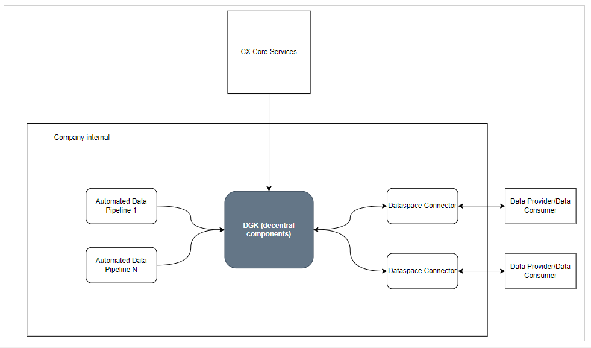

## Data Governance KIT

<!--
 * Copyright (c) 2024 T-Systems International GmbH
 * Copyright (c) 2021,2023 Contributors to the Eclipse Foundation
 *
 * See the NOTICE file(s) distributed with this work for additional
 * information regarding copyright ownership.
 *
 * This documentation and the accompanying materials are made available under the
 * terms of the Creative Commons Attribution 4.0 International License,  which is available at
 * https://creativecommons.org/licenses/by/4.0/legalcode.
 *
 * Unless required by applicable law or agreed to in writing, software
 * distributed under the License is distributed on an "AS IS" BASIS, WITHOUT
 * WARRANTIES OR CONDITIONS OF ANY KIND, either express or implied. See the
 * License for the specific language governing permissions and limitations
 * under the License.
 *
 * SPDX-License-Identifier: CC-BY-4.0

-->

This document describes the foundations of the Data Governance KIT (=Keep It Together).

For more information see

* [Development View and Architecture](./development-view)

### Vision & Mission

#### Vision

Data Governance KIT (DGK) has the objective to enable and simplify data governance within Catena-X by providing API specifications for the KIT so as to enable the application developers to create applications around these API specifications. The decentral components of the DGK enable dataspace participants to exercise control over all data governance related topics, e.g.

* Manage data assets, policies and contracts in a convenient way, i.e. via templates/blueprints
* Streamline the process of publishing data into the dataspace
* Providing transparency of all data offers for a given organization
* Monitor data exchange
* Multi EDC Management

The decentral components of the DGK are tightly coupled with the dataspace connector (EDC) and backend data services. Together with the connector and backend data services a streamlined and trusted environment for dataspace participation can be built.

#### Mission

The mission is to provide all the required details about Adoption View, Operation View and Development View for the KIT as well as to drive the standardization topics for EDC Management APIs.

### Overview

The Data Governance Kit will provide the API specifications which in turn will enable the develpment of the decentralized components that links Backend Data Services with Data Space Connectors to ease the management of the data governance aspects. This should be helpful in building products but won't be one in itself. The client API from Data Governance Kit should cover the most typical Data Provider and Consumer functions, including publishing and managing data offers, managing policies, listing data transfers and contract negotiations.

### Business Value

Data sovereignty is one of the core value propositions of Catena-X. EDC contributes some core functions but it does not provide a holistic view of all data governance topics within a data provider/consumer space. Therefore, the KIT provides answers to the following questions:

* How to shield the complexity of publishing data into dataspace via EDC from Backend Data Services?
* How to ensure that Backend Data Services publish data with correct policies and under the correct contract offers?
* How to manage multiple EDCs?
* How to document transfers and negotiated policies in a single place?
* How to see which policy is active and when does it expire?

#### Data Provider

Any party who provides data (for example by a backend database or other supported Applications or Services), for example an Automotive OEM (original equipment manufacturer). Any party who wants to maintain multiple connectors and provide the data to other consumers via those connectors as well as use the governance features from Data Governance Kit.

#### Data Consumer

Any party who wants to consume the data made available by the data providers and use the governance features from Data Governance Kit.

### Target Group / Service/ Apps that need the enabler

* All Data Providers
* All Data Consumers
* Any Enablement Service Provider
* Any Business Application Provider

## NOTICE

This work is licensed under the [CC-BY-4.0](https://creativecommons.org/licenses/by/4.0/legalcode).

* SPDX-License-Identifier: CC-BY-4.0
* SPDX-FileCopyrightText: 2023,2024 T-Systems International GmbH
* SPDX-FileCopyrightText: 2022,2023 Contributors to the Eclipse Foundation
