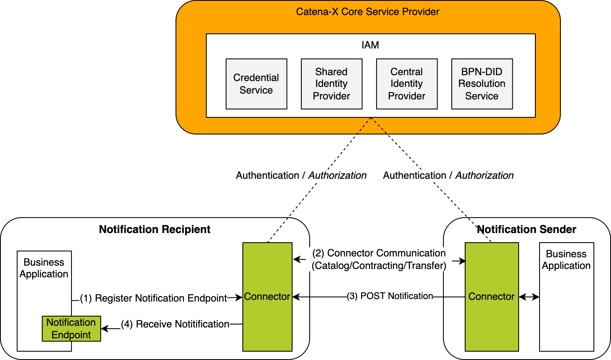
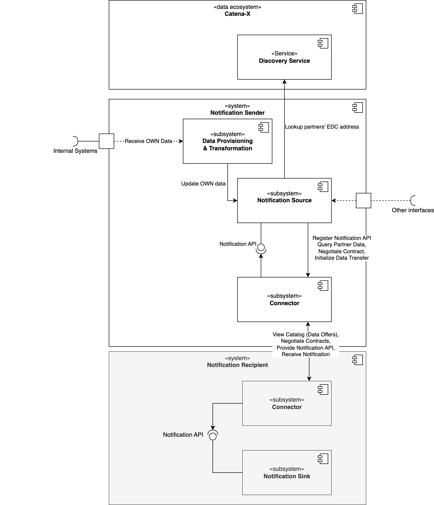

## Introduction

The Development View provides information and resources for implementing Supply Chain Disruption Notifications (further: notifications) standards. The architecture chapter describes the interactions of all components in the notifications context. The policies chapter describes the access policies, usage policies and contract definitions. The protocol chapter gives examples how the data asset is registered in the connector. In the chapter sample data the semantic data model of the Supply Chain Disruption Notifications are defined with a reference to the turtle file and an example JSON payload. For quick installation guides and reference to a ready implementation of notifications, please see Operation View.

## Architecture

Figure 1 shows the high-level architecture of the notification exchange in the Catena-X dataspace and the services that
are involved. Both the notification sender and the notification recipient must be members of the Catena-X network in
order to communicate with each other. With the help of the Identity Access Management (IAM) each participant can
authenticate itself, verify the identity of the requesting party and decide whether to authorize the request.


_Figure 1: High-level architecture of the notification exchange in the Catena-X dataspace_

From conceptual point of view the system consists of different building blocks. These building blocks in the following
diagram show which participant deploys which components. Identification and Access Management is omitted for simplicity
reasons.


_Figure 2: Whitebox view on a PURIS system_

## Policies

This chapter describes the access & usage policies as well as the contract definitions. For more information on the
access & usage policies, please refer to
the [policies documentation in the tractusx-edc repository](https://github.com/eclipse-tractusx/tractusx-edc/blob/main/docs/usage/management-api-walkthrough/02_policies.md).

### Access Policies

To enable data sovereignty, access and usage policies are important to protect the data assets of a data provider in the
connector, as described in
the [Connector KIT](https://eclipse-tractusx.github.io/docs-kits/next/category/connector-kit).

To decide which company has access to the data assets, access policy should be used. Note that without protecting data
assets with access policies, they become publicly available in the Catena-X network which is not recommended.

Therefore, every asset should be protected and only be made available through specified BPNL policy groups or specific
BPNL policies. For a detailed description,
see [Business Partner Validation Extension](https://github.com/eclipse-tractusx/tractusx-edc/tree/main/edc-extensions/bpn-validation).

#### BPNL Access Policy

This policy allows limiting access to a data offer based on a list of specific BPNLs. This translates to the following
functionality:

- The data offer creator will be able to create a policy listing all the BPN that can access the data offer.
- This means that only the connectors registered in the Catena-X network with the BPNL listed in the policy can see the
  data offer and accept it (for the creation of data contracts and subsequent data exchange).

#### Implementation Hint

Examples including a JSON payload for a BPNL group access policy are described in
the [Business Partner Validation Extension](https://github.com/eclipse-tractusx/tractusx-edc/tree/main/edc-extensions/bpn-validation).

The reference implementation (see Operation View) also provides an extension to add the BPNL of the requesting party to
the header of a proxied request. As a result, during implementation one can use this BPNL to design the internal
submodel API.

### Usage Policies

To decide which company can use the data asset under specific conditions, usage policies (also referred to as contract
policies) are used. Therefore, they are more specific than access policies and only used just after access is granted.
Currently, the usage policies aren't technically enforced but based on a legal framework agreements. Signing of
framework agreements can be enforced during negotiation depending on the connector implementation.

Policies are defined based on the [W3C ODRL format](https://www.w3.org/TR/odrl-model/). This allows a standardized way
of formulating policy payloads. It further allows to stack different constraints with the `odrl:and` operator.
Therefore, every data provider can decide on his or her own under which conditions their data assets are shared in the
network. It is recommended to restrict the data usage for all exchanged data standards. An example of one usage policy
containing three different constraints is shown and described in the following:

```json
{
  "@context": [
    "http://www.w3.org/ns/odrl.jsonld",
    {
      "edc": "https://w3id.org/edc/v0.0.1/ns/",
      "cx-policy": "https://w3id.org/catenax/policy/"
    }
  ],
  "@type": "PolicyDefinitionRequestDto",
  "@id": "<POLICY-ID>",
  // Important for the contract definition
  "edc:policy": {
    "@type": "Set",
    "profile": "cx-policy:profile2405",
    "permission": [
      {
        "action": "use",
        "constraint": {
          "@type": "LogicalConstraint",
          "and": [
            {
              "@type": "LogicalConstraint",
              "leftOperand": "cx-policy:FrameworkAgreement",
              "operator": "eq",
              "rightOperand": "<FRAMEWORK-AGREEMENT>"
            },
            {
              "@type": "LogicalConstraint",
              "leftOperand": "cx-policy:UsagePurpose",
              "operator": "eq",
              "rightOperand": "<USAGE-PURPOSE>"
            },
            {
              "@type": "LogicalConstraint",
              "leftOperand": "cx-policy:ContractReference",
              "operator": "eq",
              "rightOperand": "x12345"
            }
          ]
        }
      }
    ]
  }
}
```

It is recommended to use the following values for rightOperand of FrameworkAgreement and UsagePurpose depending on the
use case:

| Use case | cx-policy:FrameworkAgreement | cx-policy:UsagePurpose |
| -------- | ---------------------------- | ---------------------- |
| DCM      | `DemandCapacity:1.0`         | `cx.dcm.base:1`        |
| PURIS    | `Puris:1.0`                  | `cx.puris.base:1`      |

More information can be found in
the [Policies in Catena-X of the Connector KIT](https://eclipse-tractusx.github.io/docs-kits/kits/connector-kit/adoption-view_policies_cx/).

### Contract Definitions

In the connector, every policy is associated with a contract. Thus, a contract definition is needed, detailing what
policies are required when contracting assets.

When using an above mentioned Access Policy, their `ACCESS_POLICY_ID` needs to be included as a value of
the `accessPolicyId` key in the contract definition.

When using an above mentioned Usage Policy, their `CONTRACT_POLICY_ID` needs to be included as a value of
the `contractPolicyId` key in the contract definition.

```json
{
  "id": "{{CONTRACT_DEFINITION_ID}}",
  "criteria": [
    {
      "operandLeft": "asset:prop:id",
      "operator": "=",
      "operandRight": "{{ASSET_ID}}"
    }
  ],
  "accessPolicyId": "{{ACCESS_POLICY_ID}}",
  "contractPolicyId": "{{CONTRACT_POLICY_ID}}"
}
```

For a more detailed tutorial on creating contracts for assets, see
in [Chapter 3 of the End-to-End Adopter Journey](https://eclipse-tractusx.github.io/docs/tutorials/e2e/boost/provideData).

## Protocol

This chapter contains data structures that are designed for providing data for notifications.

### Connector Data Asset Structure for "Notification API"

To enable notifications, the recipient has to register its notification API as a data asset as follows:

```json
{
  "@context": {
    "@vocab": "https://w3id.org/edc/v0.0.1/ns/",
    "cx-taxo": "https://w3id.org/catenax/taxonomy#",
    "cx-common": "https://w3id.org/catenax/ontology/common#",
    "dct": "http://purl.org/dc/terms/"
  },
  "@id": "{{DEMAND_AND_CAPACITY_NOTIFICATIONS_REQUEST_API_ASSET_ID}}",
  "properties": {
    "dct:type": {
      "@id": "cx-taxo:DemandAndCapacityNotificationApi"
    },
    "cx-common:version": "1.0",
    "description": "Demand and Capacity Notification API Endpoint"
  },
  "dataAddress": {
    "@type": "DataAddress",
    "type": "HttpData",
    "proxyBody": "true",
    "proxyMethod": "true",
    "baseUrl": "{{DEMAND_AND_CAPACITY_NOTIFICATION_API_ENDPOINT}}",
    "contentType": "application/json"
  }
}
```

This asset can then be contracted by senders of notifications.

## Sample Data

The semantic models in the business context are defined in the Adoption View of this KIT. This chapter gives additional
information for each aspect model by providing the example data objects in JSON format, link to the RDF turtle file on
GitHub and unique semantic id of the aspect model. Currently the standard _Supply Chain Disruption Notifications_
provides one semantic model _Demand and Capacity Notification_.

### 1. Demand and Capacity Notification

GitHub link to semantic data model in RDF turtle
format: [https://github.com/eclipse-tractusx/sldt-semantic-models/blob/main/io.catenax.demand_and_capacity_notification/2.0.0/DemandAndCapacityNotification.ttl](https://github.com/eclipse-tractusx/sldt-semantic-models/blob/main/io.catenax.demand_and_capacity_notification/2.0.0/DemandAndCapacityNotification.ttl)

This aspect model has the following semantic id:

`urn:samm:io.catenax.demand_and_capacity_notification:2.0.0#DemandAndCapacityNotification`

The following JSON provides an example of the value-only serialization of the _Supply Chain Disruption Notification_
aspect model for a sample notification. The notification informs the supplier about a strike at the customer's site
resulting in a demand reduction between 12.12.2023 and 17.12.2023.

```json
{
  "affectedSitesSender": ["BPNS7588787849VQ"],
  "affectedSitesRecipient": ["BPNS6666787765VQ"],
  "materialNumberSupplier": ["MNR-8101-ID146955.001"],
  "contentChangedAt": "2023-12-13T15:00:00+01:00",
  "startDateOfEffect": "2023-12-13T15:00:00+01:00",
  "materialNumberCustomer": ["MNR-7307-AU340474.002"],
  "leadingRootCause": "strike",
  "effect": "demand-reduction",
  "notificationId": "urn:uuid:d8b6b4ca-ca9c-42d9-8a34-f62591a1c68a",
  "relatedNotificationId": "urn:uuid:d8b6b4ca-ca9c-42d9-8a34-f62591a1c68a",
  "sourceNotificationId": "urn:uuid:d8b6b4ca-ca9c-42d9-8a34-f62591a1c68a",
  "text": "Capacity reduction due to ongoing strike.",
  "expectedEndDateOfEffect": "2023-12-17T08:00:00+01:00",
  "status": "open"
}
```

The following JSON provides an example with the same payload and additionally with a message header. For more
information on the message header, see
the [RDF turtle file of the message header](https://github.com/eclipse-tractusx/sldt-semantic-models/blob/main/io.catenax.shared.message_header/3.0.0/MessageHeaderAspect.ttl).

```json
{
  "header": {
    "senderBpn": "BPNL7588787849VQ",
    "context": "CX-DemandAndCapacityNotification:1.0",
    "messageId": "3b4edc05-e214-47a1-b0c2-1d831cdd9ba9",
    "receiverBpn": "BPNL6666787765VQ",
    "sentDateTime": "2023-12-01T21:24:00+07:00",
    "version": "3.0.0"
  },
  "content": {
    "demandAndCapacityNotification": {
      "affectedSitesSender": ["BPNS7588787849VQ"],
      "affectedSitesRecipient": ["BPNS6666787765VQ"],
      "materialNumberSupplier": ["MNR-8101-ID146955.001"],
      "contentChangedAt": "2023-12-13T15:00:00+01:00",
      "startDateOfEffect": "2023-12-13T15:00:00+01:00",
      "materialNumberCustomer": ["MNR-7307-AU340474.002"],
      "leadingRootCause": "strike",
      "effect": "demand-reduction",
      "notificationId": "urn:uuid:d8b6b4ca-ca9c-42d9-8a34-f62591a1c68a",
      "relatedNotificationId": "urn:uuid:d8b6b4ca-ca9c-42d9-8a34-f62591a1c68a",
      "sourceNotificationId": "urn:uuid:d8b6b4ca-ca9c-42d9-8a34-f62591a1c68a",
      "text": "Capacity reduction due to ongoing strike.",
      "expectedEndDateOfEffect": "2023-12-17T08:00:00+01:00",
      "status": "open"
    }
  }
}
```

## NOTICE

This work is licensed under the [CC-BY-4.0](https://creativecommons.org/licenses/by/4.0/legalcode)

- SPDX-License-Identifier: CC-BY-4.0
- SPDX-FileCopyrightText: 2024 ZF Friedrichshafen AG
- SPDX-FileCopyrightText: 2024 Bayerische Motoren Werke Aktiengesellschaft (BMW AG)
- SPDX-FileCopyrightText: 2024 SAP SE
- SPDX-FileCopyrightText: 2024 Mercedes Benz Group AG
- SPDX-FileCopyrightText: 2024 BASF SE
- SPDX-FileCopyrightText: 2024 SupplyOn AG
- SPDX-FileCopyrightText: 2024 Henkel AG & Co.KGaA
- SPDX-FileCopyrightText: 2024 Contributors of the Eclipse Foundation
- SPDX-FileCopyrightText: 2024 ISTOS GmbH (a member of the DMG Mori Group)
- SPDX-FileCopyrightText: 2024 Fraunhofer-Gesellschaft zur Foerderung der angewandten Forschung e.V. (represented by Fraunhofer ISST)
- SPDX-FileCopyrightText: 2024 TRUMPF Werkzeugmaschinen SE + Co. KG
- SPDX-FileCopyrightText: 2024 Volkswagen AG
- SPDX-FileCopyrightText: 2024 Contributors to the Eclipse Foundation
- Source URL: https://github.com/eclipse-tractusx/eclipse-tractusx.github.io/docs-kits_versioned_docs/version-24.12/kits/supply-chain-disruption-notification-kit/software-development-view.md
