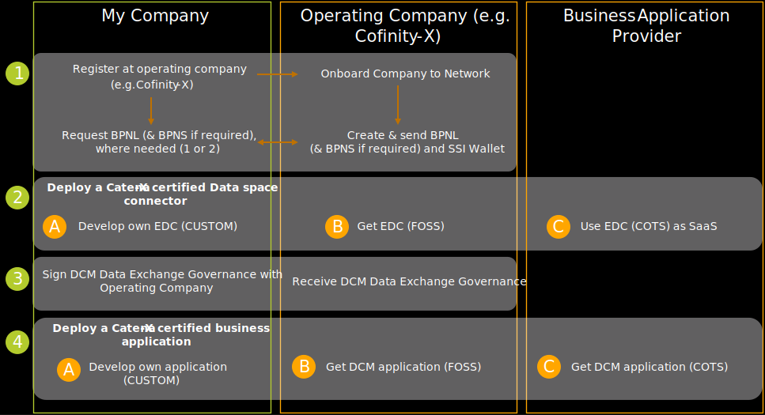

You can participate in the Catena-X data ecosystem in various roles. Become acquainted with the foundational building blocks of Catena-X and how all participants collaborate within a global ecosystem by reading the [Whitepaper describing the Catena-X operating model](https://catena-x.net/fileadmin/_online_media_/CX_Operating_Modelv2.1_final.pdf).

Actors willing to use the Catena-X DCM standard, and start a collaboration with other supply chain partners enabled by an interoperable solution, can prepare asking the IT colleagues to check the following [End-to-End Adopter Journey](https://eclipse-tractusx.github.io/docs/tutorials/e2e/).

## Roles

Within DCM customer and supplier both act as data provider and data consumer. In order to execute the DCM process they utilize an application from the Catena-X marketplace, provided by a business application provider or they use their own custom in-house solution.

### Data Providers and Data Consumers

#### Onboarding

Figure: *DCM Onboarding*

|#|Requirement|Further details|
|-|-|-|
|1|Subscribe to an Operating Company and get required credentials| [Cofinity-X Onboarding](https://www.cofinity-x.com/onboarding/)|
|2|Deploy a Catena-X certified dataspace connector|Depending on your adoption strategy you will buy the connector or you might have to develop and certify it yourself|
|3|Sign DCM Data Exchange Governance|Signed Data Exchange Governance with Operating Company is required to participate in the Catena-X Dataspace|
|4|Deploy a Catena-X certified business application|See adoption strategy table below|

#### Adoption Strategy

If you are interested in utilizing DCM within the Catena-X dataspace you can follow one of the following three approaches.

|#|Approach|Details|
|-|-|-|
|A|CUSTOM|Adopt and integrate the business logic, aspect models and APIs, as described in the [DCM standard][StandardLibrary], yourself |
|B|FOSS|Adopt, customize and deploy an existing **F**ree and **O**pen **S**ource **S**oftware **S**olution|
|C|COTS|Purchase a certified **C**ommercial **O**ff **T**he **S**helf solution via the Catena-X marketplace, accessible through your operating company (e.g. [Cofinity-X Marketplace](https://www.cofinity-x.com/app-marketplace/))|

### Business Application Providers

#### Onboarding

Business Application Providers that want to enable their commercial software for Catena-X DCM need to register for the Catena-X Ecosystem following the specific information described in [Offering a Catena-X Solution](https://catena-x.net/en/catena-x-introduce-implement/offering-a-catena-x-solution) (including next steps and contacts).

Please refer to the [Catena-X Library][StandardLibrary] for the newest version of the DCM as well as other standards.

### Software Developers

[https://catena-x.net/en/tractus-x-1](https://catena-x.net/en/tractus-x-1)

[https://github.com/eclipse-tractusx](https://github.com/eclipse-tractusx)

## Notice

This work is licensed under the [CC-BY-4.0](https://creativecommons.org/licenses/by/4.0/legalcode)

- SPDX-License-Identifier: CC-BY-4.0
- SPDX-FileCopyrightText: 2023 BASF SE
- SPDX-FileCopyrightText: 2023 Bayerische Motoren Werke Aktiengesellschaft (BMW AG)
- SPDX-FileCopyrightText: 2024 BearingPoint Holding B.V
- SPDX-FileCopyrightText: 2023 Fraunhofer-Gesellschaft zur Förderung der angewandten Forschung e.V (Fraunhofer)
- SPDX-FileCopyrightText: 2023 Henkel AG & Co.KGaA
- SPDX-FileCopyrightText: 2023 Mercedes Benz Group AG
- SPDX-FileCopyrightText: 2023 SAP SE
- SPDX-FileCopyrightText: 2023 SupplyOn AG
- SPDX-FileCopyrightText: 2023 Volkswagen AG
- SPDX-FileCopyrightText: 2023 ZF Friedrichshafen AG
- SPDX-FileCopyrightText: 2023 Contributors to the Eclipse Foundation

[StandardLibrary]: https://catenax-ev.github.io/docs/next/standards/CX-0128-DemandandCapacityManagementDataExchange
