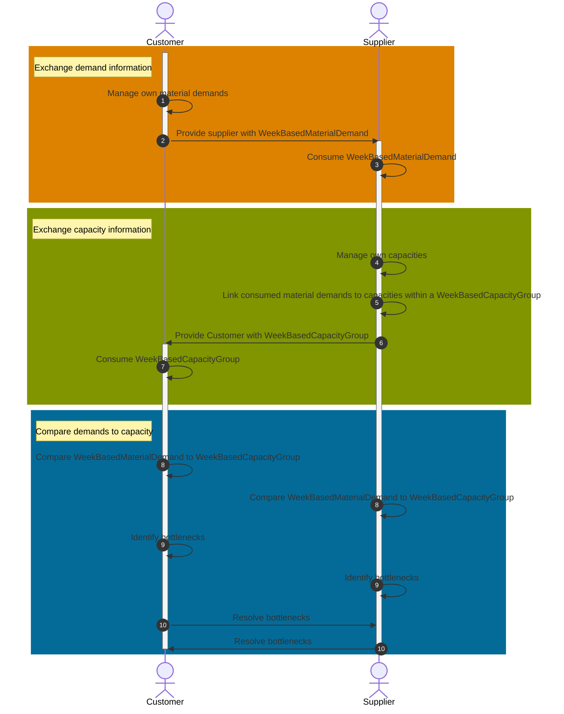

## Vision and Mission

The Catena-X-Standards for Demand- and Capacity-Management enable participants of the automotive supply chain to become more resilient and to increase the degree of collaboration aimed at avoiding or solving production bottlenecks as well as surplus situations in a tactical horizon of 1-2 years.

Thereby the standards empower participants to share data in a secure and sovereign way while ensuring the interoperability of the different applications involved in the process.

## Status Quo

### Today's challenge for automotive companies

Resilience has become imperative within Supply Chain Management, especially over the past years. With the growing complexity of supply chains and a rising number of global and local crises, small and medium enterprises (SMEs) as well as large enterprises (LEs) are facing an increased risk of serious disruptions in their supply chains, bullwhip effects and in the worst case even temporary production shutdowns with a high effort and costs of replanning.

Inside the volatile and highly complex surroundings of the automotive industry nowadays, mostly tailor-made, proprietary and often fully manual IT solutions support the demand and capacity management processes along the value chain. On the one side there is no common understanding of these processes among the participants. On the other side, different data formats as well as application programming interfaces are used, which is increasing the complexity in the data exchange and which is leading to transfer problems, inconsistencies, or even loss of data.

## Business Value

### Why DCM KIT?

The purpose and focus of Demand and Capacity Management (DCM) KIT is twofold:

- Define a common understanding of the DCM process thus paving the way for more proactive and efficient collaboration.
- Establish process and application interoperability with the help of common semantics and unified interfaces for data exchange while ensuring the data sovereignty of data providers.

Implementing the DCM standards will add the following core capabilities to business applications:

- Provisioning and consumption of material demands data in a sovereign manner.
- Provisioning and consumption of capacity data in a sovereign manner.
- Discovery of bottlenecks and surplus capacity situations by employing a unified calculation logic.

### POWER of STANDARD

Standards create trust. Customer and Supplier can form new partnerships confidently. Knowing that integration in the network will be dramatically simplified. Standardization can help reduce costs by eliminating redundancies and streamlining processes. By adopting a common set of practices and technologies, businesses can avoid the need to develop their own proprietary systems, which can be expensive and time-consuming.

### DATA SOVEREIGNTY in FOCUS

DCM KIT keeps up with Catena X commitment to data sovereignty. This KIT has the goal to always comply with the data sovereignty principle implemented by the Eclipse Dataspace Connector. That enables all participants in the supply chain to always stay in full control of their own data.

This is how sharing data is fun.

### INTEROPERABILITY at its BEST

Application and Service Provider can reduce investments to integrate DCM data models/API specification from DCM KIT.

The Kit enables the offering of value-add services and innovation based on process description of the core business logic and how a collaborative approach is a win-win-situation for customer and supplier.

### COLLABORATION is KEY

The DCM KIT enables better and faster issue resolution. We believe that collaboration is the key to creating and maintaining strong partnerships between customers and suppliers and, at the same time, enhancing problem solving to reach a more balanced and efficient supply and demand management.

Of course, by realizing efficiency through improved collaboration all involved partners will gain a competitive advantage over those that do not collaborate.

## Semantic Models

| Semantic Model          | Link to GitHub Repository                                                                                                                               |
| -------------           | -------------                                                                                                                                           |
| WeekBasedCapacityGroup  | [Click Me](https://github.com/eclipse-tractusx/sldt-semantic-models/blob/main/io.catenax.week_based_capacity_group/3.0.0/WeekBasedCapacityGroup.ttl)    |
| WeekBasedMaterialDemand | [Click Me](https://github.com/eclipse-tractusx/sldt-semantic-models/blob/main/io.catenax.week_based_material_demand/3.0.0/WeekBasedMaterialDemand.ttl)  |
| IdBasedRequestForUpdate | [Click Me](https://github.com/eclipse-tractusx/sldt-semantic-models/blob/main/io.catenax.id_based_request_for_update/3.0.0/IdBasedRequestForUpdate.ttl) |
| IdBasedComment          | [Click Me](https://github.com/eclipse-tractusx/sldt-semantic-models/blob/main/io.catenax.id_based_comment/1.0.0/IdBasedComment.ttl)                     |

## Logic / Schema

The core of the DCM business process is about exchanging demand and capacity information, identifying problems and solving those problems.

Figure: *Core business process*

## Business Process

### Business Architecture

Figure: *Supply network*

A supply network can be divided into a multitude of interlinking supply chains. Every supply chain consists of multiple chain links. Individual business partner relationships are these chain links. Data exchange conforming to [CX-0128 Demand and Capacity Management Data Exchange][StandardLibrary] always happens within such a chain link, ensuring that every company has full control over which data they provide. Demand information travels from one end of the supply chain to the other. For capacity information the situation is reversed.

Figure: *Supply chain*

DCM allows for demand and capacity information to be exchanged only within the individual business relationship. However, because within a supply chain mist companies act as a "one-up" in one business relationship, while acting as a "one-down" withing the next business relationship, the impact of increasing or decreasing demand or capacity anywhere in the supply chain can safely travel through the chain, reaching every single impacted company. This is how DCM builds chains, while at the same time ensuring data sovereignty.

### Access and Usage Policies

Because of the way that communication within CX-0128 is defined companies are not exposing data but rather API endpoints for their business partners to push data to. These API endpoints are registered as EDC data assets. This means that from an information protection perspective data has to be actively provided, further ensuring data sovereignty.

 Conforming to [CX-0128 Demand and Capacity Management Data Exchange][StandardLibrary] the following policies have to be applied.

| Category | Policy Name | Description |Usage recommendation|
|:---------|:------------|:------------|:-------------------|
| **Access Policy** | BPN-restricted Data Usage | Limit access to the data offered to a list of specified BPNs (to the connectors with the BPN attribute listed in the policy) |Limit access to assets to all your known business partners.|
| **Access Policy** | Membership Credential | Limit access to data offered to Catena-X participants |Use as is.|
| **Usage Policy** | DCM Framework Agreement Credential | Limit access to data offered to participants who have signed the DCM Framework Agreement |Use as is.|

### Standards

|Content|Standard|Version|Section|Description|
|-|-|-|-|-|
|DCM Business Logic|[CX-0128 Demand and Capacity Management Data Exchange][StandardLibrary]|2.1.0|5|Focuses on a common understanding of the DCM processes among participants.|
|DCM Aspect Models|[CX-0128 Demand and Capacity Management Data Exchange][StandardLibrary]|2.1.0|3|Aligns the structure of the shared information and enables the adoption of the core business logic without misinterpretation.|
|DCM APIs|[CX-0128 Demand and Capacity Management Data Exchange][StandardLibrary]|2.1.0|4|Ensures that data is provided and consumed properly as well as identically interpreted across companies.|
|Notification Process, Aspect Model and API|[CX-0146 Supply Chain Disruption Notifications][StandardLibrary]|1.0.0|*|Optional capability referenced in Section 5.10 of CX-0128. Focuses on quickly informing business partners of impactful events, where the impact cannot be precisely quantified yet.|

## Frequently asked Questions

In case of further questions, feel free to visit our [FAQ](./qna.md).

## Notice

This work is licensed under the [CC-BY-4.0](https://creativecommons.org/licenses/by/4.0/legalcode)

- SPDX-License-Identifier: CC-BY-4.0
- SPDX-FileCopyrightText: 2023 BASF SE
- SPDX-FileCopyrightText: 2023 Bayerische Motoren Werke Aktiengesellschaft (BMW AG)
- SPDX-FileCopyrightText: 2023 Fraunhofer-Gesellschaft zur Förderung der angewandten Forschung e.V (Fraunhofer)
- SPDX-FileCopyrightText: 2023 Henkel AG & Co.KGaA
- SPDX-FileCopyrightText: 2023 Mercedes Benz Group AG
- SPDX-FileCopyrightText: 2023 SAP SE
- SPDX-FileCopyrightText: 2023 SupplyOn AG
- SPDX-FileCopyrightText: 2023 Volkswagen AG
- SPDX-FileCopyrightText: 2023 ZF Friedrichshafen AG
- SPDX-FileCopyrightText: 2023 Contributors to the Eclipse Foundation

[StandardLibrary]: https://catenax-ev.github.io/docs/next/standards/CX-0128-DemandandCapacityManagementDataExchange
