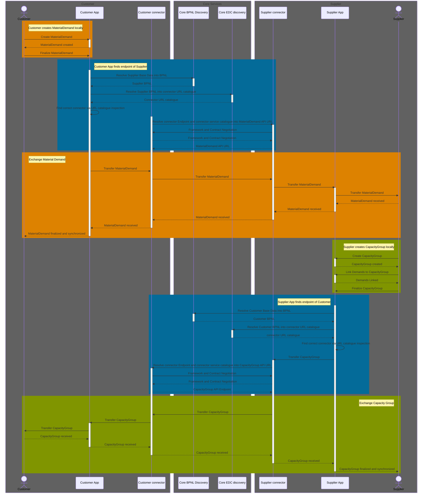

## Why​

This page is relevant for you, if one of the following cases applies:

1. You want to participate in the demand and capacity usecase as either a customer or a supplier and intend to adapt your existing custom application landscape to Catena-X DCM.
2. You want to offer business solutions to the aforementioned customers and suppliers by adapting your commercial software product for Catena-X DCM.

If none of this applies to you or you are unsure, please refer to [Operation View](../operation-view.md) first.

> Note: If you purchase commercial software from a software vendor, the vendor needs to adopt their software for you. Please refer your vendor to this page.

## Prerequisites

In order to participate in the Catena-X network an Eclipse Dataspace Connector (EDC), or a similar connector fulfilling the Dataspace Protocol, is required, as the endpoints must not be called directly but only through a Data Asset/Contract Offer.

In addition use case participants need to be boarded onto the Catena-X network.

Participants intending to act as a customer require at least one BPNL for their company as well as one BPNS for every site they intend to integrate into the Catena-X network.

Participants intending to act as a supplier require at least one BPNL for their company.

## How

If you want to adapt your custom or commercial applications to work with the Catena-X DCM usecase you will have to

1. Modify the source code of your application
2. Enable your software to offer multiple REST API endpoints in order to receive data
3. Enable your software to call multiple REST API endpoints in order to send data
4. Enable your software to communicate through an Eclipse Dataspace Connector (EDC), or a similar solution, which is to be setup separately

For details, please refer to the Catena-X DCM standard [CX-0128][StandardLibrary]. This page provides a non-normative overview only.

## Solution Overview

For the exchange of the demand and capacity information required by the process, five REST APIs are used:

- WeekBasedMaterialDemand API - used for the exchange of demand information
- WeekBasedCapacityGroup API - used for the exchange of capacity information
- RequestForUpdate API - used for requesting an update of WeekBasedMaterialDemand or WeekBasedCapacityGroup
- IdBasedComment API - used for the exchange of additional comments regarding WeekBasedMaterialDemand or WeekBasedCapacityGroup
- Asset Administration Shell (AAS) API - used when using DCM in combination with a Digital Twin Registry

All those APIs are REST-based APIs.

Implementing all endpoints is mandatory, except the AAS API endpoint, which is optional.

Note that the software solutions used as well as the business process should be enabled in order to receive WeekBasedMaterialDemand information from customers and send WeekBasedCapacityGroup information back to those customers. Also, it needs to be possible to send the own WeekBasedMaterialDemand information to the suppliers and receive their WeekBasedCapacityGroup information in return. Therefore, the software tools used need to be able to send/receive these information and the users need to be able to work with the information in the planning processes.

When implementing the API endpoints, it is important to follow the DCM standard closely in order to ensure compatibility with other solutions. This is not limited to technical aspects, but also extends to the business definition of demand and capacity.

### Architecture Constraints

| Constraint ID | Constraint |
| ------------- | ------------- |
| C-1 | Software and third party software must be compliant to the Catena-X and Eclipse Foundation Guidelines/Policies [eclipse_foundation](https://www.eclipse.org/projects/dev_process/) |
| C-2 | [Eclipse Dataspace Connector](https://github.com/eclipse-tractusx/tractusx-edc/tree/main) (EDC), or a similar solution, must be used for data transfer between different legal entities; e.g. the API endpoints listed above may only be called through a Data Asset/Contract Offer |

## Sequence Diagram

The overall interaction between partners is illustrated by the following sequence diagram:

Figure: *Core business process*

Note that the supplier does not need to immediately reply with capacity group after receiving demand information, although a timely reply is appreciated, there can be a considerable time in between instead.

Digital Twins can also be used to reference parts, but are not shown in the sequence diagram for simplicity.

## Notice

This work is licensed under the [CC-BY-4.0](https://creativecommons.org/licenses/by/4.0/legalcode)

- SPDX-License-Identifier: CC-BY-4.0
- SPDX-FileCopyrightText: 2023 BASF SE
- SPDX-FileCopyrightText: 2023 Bayerische Motoren Werke Aktiengesellschaft (BMW AG)
- SPDX-FileCopyrightText: 2023 Fraunhofer-Gesellschaft zur Förderung der angewandten Forschung e.V (Fraunhofer)
- SPDX-FileCopyrightText: 2023 Henkel AG & Co.KGaA
- SPDX-FileCopyrightText: 2023 Mercedes Benz Group AG
- SPDX-FileCopyrightText: 2023 SAP SE
- SPDX-FileCopyrightText: 2023 SupplyOn AG
- SPDX-FileCopyrightText: 2023 Volkswagen AG
- SPDX-FileCopyrightText: 2023 ZF Friedrichshafen AG
- SPDX-FileCopyrightText: 2023 Contributors to the Eclipse Foundation

[StandardLibrary]: https://catenax-ev.github.io/docs/next/standards/CX-0128-DemandandCapacityManagementDataExchange
